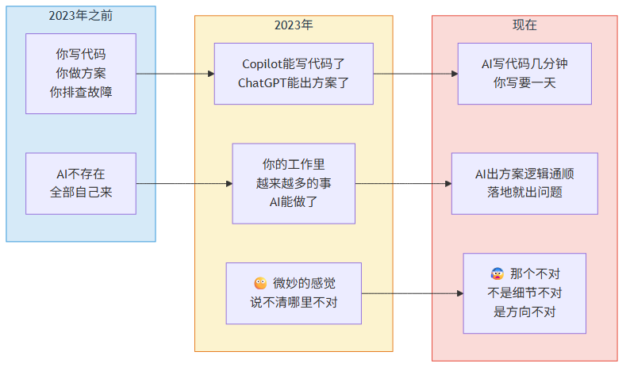
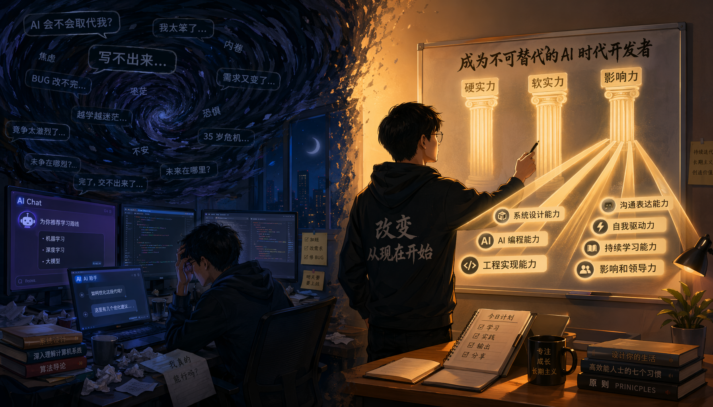

# 前言

你可能正在焦虑。

不是那种"世界末日"的焦虑，是一种更微妙的感觉——你发现自己的工作里，越来越多的事情AI能做了。写代码、写文档、做分析、出方案……以前需要你花一天的事，现在AI几分钟就搞定了。

> 图释：你的焦虑有一条时间线——2023年之前全自己来，2023年AI开始抢活，现在AI做得越来越快但方向总不对。那个"说不清哪里不对"的感觉，就是这本书要帮你说清楚的。

你试过跟AI较劲。有时候它确实比你快，但有时候它做出来的东西——你一眼看过去就觉得"不对"。不是细节不对，是方向不对。你让AI重构代码，它改了A忘了B。你让AI分析数据，它给你一堆"可能原因"但分不清哪个是根因。你让AI出方案，方案逻辑通顺但落地就出问题。

说不清哪里不对，但就是不对。

> 图释：你坐在工位上，被代码片段、文档页面和数据图表的漩涡包围。AI正在接管你的工作，越来越多的事情它能做了——但那些做出来的东西，你一眼就看出"方向不对"。这个说不清的焦虑，就是这本书要帮你说清楚的。

这本书就是来帮你把这个"说不清"说清楚的。

---

我说的是一件你可能不愿意相信的事：AI有些事注定做不好。不是"现在做不好以后会好"，而是"永远做不好"。

这不是我在安慰你。这是从AI的底层结构推导出来的结论——就像鱼的结构决定了它爬不了树，AI的结构决定了它在某些事情上永远做不到人类能做的。

你不需要相信我。你只需要看完前四章——那里有三条命门的论证。如果你觉得论证有漏洞，可以扔掉这本书。如果你觉得论证站得住脚，那后面的一切都是从这三条命门推导出来的，不是拍脑袋想出来的。

---

读完这本书，你会得到什么？

**不是"AI有多弱"的安慰剂。** 这本书不是让你看完之后舒舒服服地说"还好AI不行"然后继续做一样的事。

**是"你该往哪使劲"的方向图。** 每一条AI的命门，都指向一种你应该刻意修炼的能力。命门越明确，方向越清晰——这不是鸡汤，是逻辑推导。

具体来说，你会得到——

1. **三条命门**：从AI的底层结构推导出来的根本限制，不受时间影响——除非AI的结构变了，否则这三条命门不会过时
2. **七种不可替代的能力**：每种能力都从命门推导而来，不是观察归纳的
3. **七条补位口诀**：人和AI怎么分工——你做判断，AI做执行
4. **七套修炼工具**：从0积累的具体方法——不是口号，是模板、日志、清单
5. **一份行动计划**：从今天开始的一年修炼路线图

---

这本书写给谁？

写给3-10年经验的一线技术人员——你写了几年代码、带过几个项目、遇到过几次"AI做不了但必须有人做"的时刻。你不是新人，但也还没到"完全不怕被替代"的段位。

如果你是架构师，你的不可替代能力在"画蓝图"和"判断因果"。

如果你是产品经理，你的不可替代能力在"做取舍"和"建立信任"。

如果你是运维工程师，你的不可替代能力在"到场感受"和"追问根因"。

如果你是技术管理者，你的不可替代能力在"定方向"和"让人愿意跟你"。

不管你是哪种角色，这本书都给你一条相同的底层逻辑：**AI的边界就是你的方向。**

> **🔍 角色速查卡：3秒定位你的核心能力**
>
> | 你的角色 | 第一核心能力 | 第二核心能力 |
> |----------|-------------|-------------|
> | 架构师 | 全局规划力——你画蓝图，AI砌砖 | 因果洞察力——AI看现象，你看本质 |
> | 产品经理 | 决策担当力——AI做参谋，你做决定 | 关系构建力——AI发邮件，你去见面 |
> | 运维工程师 | 现场判断力——AI看仪表，你闻味道 | 因果洞察力——AI列原因，你追根因 |
> | 技术管理者 | 全局规划力——你定方向，AI出方案 | 关系构建力——你凝聚人，AI排日程 |
> | 数据/算法工程师 | 自知自审力——AI说答案，你说靠不靠谱 | 因果洞察力——AI找相关，你追因果 |
>
> 读法建议：先翻到你角色对应的两章边界篇（第5-11章），带着痛点读，效果最好。

---

怎么读这本书？

**四部分，可以跳着读——但前四章别跳。**

- **公理篇（1-4章）**：三条命门。这是全书的根基，跳过等于没地基
- **边界篇（5-11章）**：七件做不到的事。可以挑你最关心的两三章先读
- **修炼篇（12-18章）**：七种能力怎么练。按需取用——先练你角色的核心能力
- **终局篇（19-22章）**：行动计划。第22章是一份从今天开始的路线图

每章末尾都有"今天就能做"——如果你只想花5分钟，就看这一节。

---

最后一个问题：你可能会想，"如果AI的结构变了呢？如果下一代大模型解决了这些命门呢？"

我的回答是：**那这本书就过时了，你的修炼也白费了——但这恰恰是最不可能发生的事。**

因为这三条命门不是"这一代大模型的bug"，而是"自回归+统计学习+没有身体"这种架构的必然结果。除非AI不再是"从数据中预测下一个字"的系统，否则命门不会变。

而如果AI真的变成了完全不同的东西——那不是进化，那是换了一个物种。到了那一天，我们需要一本全新的书。

在那之前，这三条命门，七种能力，就是你该往哪使劲的方向。

**边界就是方向。你的价值从未如此确定。**
