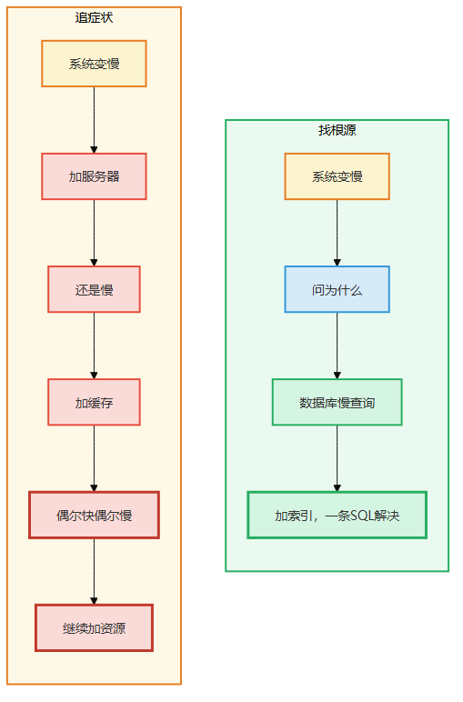
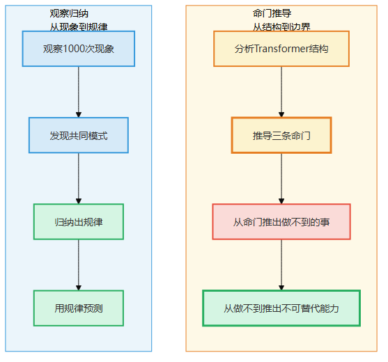
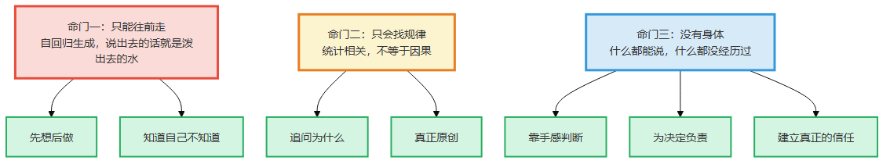
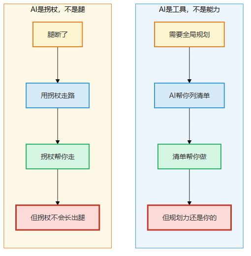
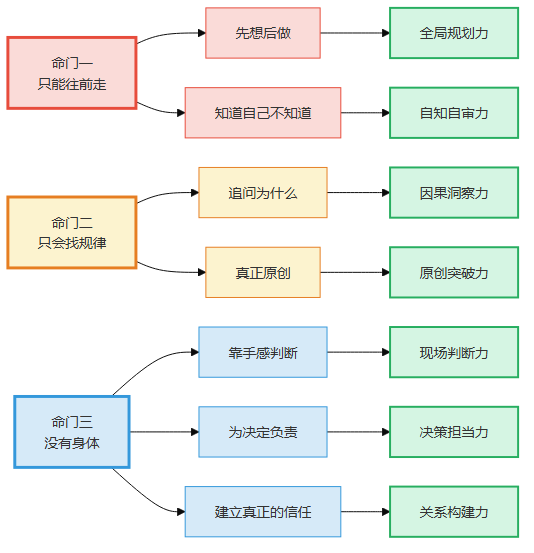
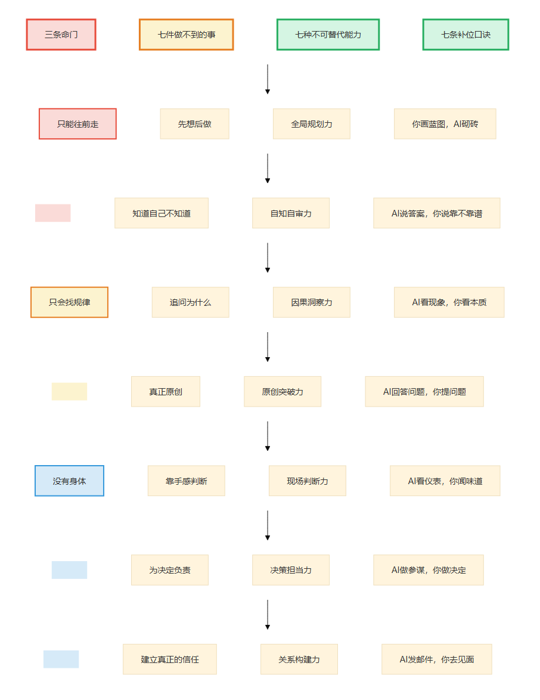

# 第1章 从命门看问题

> 📍 本章位置：全书入口——理解为什么有些事AI永远做不好

---

你正在经历一种说不清的焦虑。

你干了三五年的技术，代码写得熟了，架构也带过几个项目了。然后AI来了——Copilot能写代码，ChatGPT能出方案，Devin能自己debug。你发现自己的工作里，越来越多的事情AI能做了，而且做得越来越快。

你试过跟AI较劲，发现它确实在某些地方比你强——速度快、不犯低级错、不会累。但你也发现了一些奇怪的事：它写的代码能跑，但你一眼看过去总觉得"哪里不对"；它给的方案逻辑通顺，但真正落地的时候总出岔子；你让它改一个问题，它改了，但改完又冒出来两个新问题。

你跟同事聊，有人说"AI迟早能解决这些"，有人说"AI就是不行"。你觉得两边都不完全对，但说不清哪里不对。

**这本书就是来回答这个"说不清"的。**

我要告诉你的是：你感受到的那个"不对"，不是错觉，也不是"AI还不够强"——而是AI的底层结构决定了，有些事它就是做不了。不是现在做不了，是永远做不了。

这不是坏消息。因为那些它永远做不了的事，就是你该往哪使劲的方向。

---

## 场景：三次翻车

我认识一个叫小林的程序员，刚工作两年，前端开发。他有个特点——对AI特别乐观。每次出新的模型，他都是第一批用的人。

2024年初，他跟我说："哥，Copilot能写大部分代码了，我们前端是不是快被替代了？"

我没说话，因为我也有过同样的焦虑。

半年后他又来找我，但这次不是焦虑，是困惑："我让AI帮我写了一个表单组件，结果样式全乱了——它用了不存在的CSS属性。我又让它改，改了三遍还是不对。"

我说，你描述清楚需求再试试？

他试了。这次描述得很详细，AI输出的代码确实能用。小林很高兴，觉得自己掌握了"提示词工程"。

又过了两个月，他第三次来找我，这次是真急了："我让AI帮我重构一个组件库，它改了A组件的接口，B组件调A的地方没跟着改，整个项目编译报了47个错。"

我说，这不是提示词的问题。

他问，那是什么问题？

**是AI的问题。不是"这次没做好"，是"它注定做不好"。**

---

我不是在危言耸听。让我慢慢说。

小林三次翻车，看起来是三件不同的事：第一次是"代码质量差"，第二次是"理解需求不准确"，第三次是"改了A忘了B"。三个不同的症状，三个不同的借口——"AI还不够强""提示词不够好""上下文太长了"。

但如果你仔细看，三次翻车背后是同一个原因：**AI没法回头看**。

第一次——AI生成了不存在的CSS属性，但它没法回过头检查"我刚才写的东西对不对"。
第二次——AI写出了能跑的代码，但它没法从头审视"整体方案有没有遗漏"。
第三次——AI改了A组件，但它没法回去看"B组件是不是也受影响"。

三次翻车，同一个命门。

这就像医生看病。一个病人今天头痛、明天胃疼、后天腰酸——三个症状，三个科室，三份药方。但如果根源是颈椎压迫神经，那三份药方都是治标不治本。**不找到根源，你永远在追着症状跑。**



> 图释：左图——追症状，每个问题单独治，永远治不完；右图——找根源，三个症状同一个根因，治一次全好。

---

## 论证：两种看问题的方式

### "AI做不好"≠"AI永远做不好"——但有些事是"架构决定永远做不好"

2023年，很多人说"AI不会写代码"。2024年，Copilot能写大部分样板代码了。那些说"AI做不好"的人，被打脸了。

2023年，很多人说"AI不会画图"。2024年，Midjourney画出来的图比大多数人画得好。那些说"AI做不好"的人，又被打脸了。

所以有人得出一个结论：**AI现在做不好的事，以后都能做好。**

这个结论对不对？

**对了一半。**

AI现在做不好的事，很多以后会做好——写代码、画图、翻译，这些只会越来越强。

但有些事不是"现在做不好"，而是**"从根本上就行不了"**。就像鱼爬不了树——不是因为鱼不够努力，不是因为鱼还没进化到位，而是鱼的结构决定了它爬不了树。你再给它一百万年，它也爬不了。

区别在这里——


> 图释：鱼的结构决定了它爬不了树——不是因为不够努力，是因为鳃和鳍的结构不支持。大模型的结构同样决定了某些事它永远做不到——不是因为不够强，是因为自回归+统计学习+没有身体的结构不支持。结构决定能力，命门决定边界。

**"现在做不好"**：训练数据不够、模型不够大、技术不够成熟——这些会随时间改善。

**"从根本上就行不了"**：因为AI的底层结构决定了这件事它不可能做好。除非改结构——但改了结构它就不是现在这种AI了。

### 怎么区分这两类？

一个简单的判断方法：**看这件事是否需要"回头看""问为什么"或"身体体验"。**

- 如果只是"做得不够好"（速度、准确率、覆盖面）——大概率以后会改善
- 如果需要"回头看"（规划、统筹、检查前后一致性）——这是命门一，很难改善
- 如果需要"问为什么"（因果判断、区分碰巧和必然）——这是命门二，很难改善
- 如果需要"身体体验"（手感、责任、信任）——这是命门三，几乎不可能改善

小林的三次翻车都属于命门一——需要"回头看"。这不是训练数据能解决的，因为回头看不是"知道更多信息"，而是"能回头"。

### 这本书的逻辑：从命门出发

大多数讨论AI边界的书和文章，做法是这样的——

1. 观察AI做不好的事
2. 归纳出几类
3. 预测AI以后能不能做好

问题在于，**这种"观察+归纳"的方法本身就会过时**。2023年观察到的"AI做不好的事"，到2024年很多已经做好了。你的结论还没出版，就已经错了。

这本书不一样。我的做法是——

1. 从AI的底层结构出发，找到**它改变不了的根本限制**（命门）
2. 从命门出发，**推导**出它必然做不好的事
3. 推导出来的结论不会过时——**除非AI的结构变了**

"观察→归纳"是看症状，"命门→推导"是找病因。

看症状，你得出的是"AI现在做不好X"——明天可能就好了。
找病因，你得出的是"AI的结构决定了它不可能做好X"——除非结构变了，否则永远不会好。



> 图释：上面一行——观察归纳，结论会随时间过时；下面一行——命门推导，结论不会过时。区别在于：你是从"现在怎么样"出发，还是从"为什么是这样"出发。

### 三条命门

从大模型的底层结构出发，我推导出三条命门。后面三章会逐一展开，这里先给你一个全景——

**命门一：只能往前走**

大模型生成文字的方式是"一个字一个字往外蹦"，蹦出来就改不了了。就像走独木桥——一步一步往前走，走过就不能退。你写文章写了一半发现开头要改，你可以回去改。大模型不行——它没有退格键。

**命门二：只会找规律**

大模型本质上是一个超级"找规律"机器。它看过了人类有史以来几乎所有的文字，从中找出了无数规律。但"找到规律"和"懂原因"是完全不同的两件事。公鸡打鸣和日出高度相关，但公鸡不会导致日出——大模型能学会这个规律，但不知道为什么。

**命门三：没有身体**

大模型什么都能"说"，但什么都没"经历"过。它可以说出"烫"的定义，但它没有被烫过。"知道烫"和"被烫过"是完全不同的两件事——有些知识写在书里，有些知识长在手上。长在手上的那些，大模型永远学不会。



> 图释：三条命门的全景图——只能往前走（没有退格键）、只会找规律（不知道为什么）、没有身体（没有体验）。每条命门对应几件"做不到的事"和几种"你的能力"。

---

## "那智能体呢？"

你一定想问这个问题。

现在AI智能体可以自己规划步骤、调用工具、检查结果——这不就是在解决你说的命门吗？

**我的回答是：智能体补的是表层，不是核心。**

打个比方。一个人断了腿，你给他配一副拐杖。他能走了——但不是"能跑了"。拐杖补的是"走路"这个表层能力，不是"断腿"这个根本问题。

智能体就是大模型的拐杖。

- 命门一（只能往前走）：智能体让大模型"多试几次"——但每次试，它依然一条路走到底
- 命门二（只会找规律）：智能体给大模型"更多工具查数据"——但查到数据不等于找到原因
- 命门三（没有身体）：智能体给大模型"更多传感器"——但看到不等于体验

后面每章都会专门讨论"智能体到底改了什么、改不了什么"。第21章会做一个完整的总结。

这里你只需要记住一句话：**拐杖不能让断腿的人跑步——只能让他走得稳一点。**



> 图释：智能体就像拐杖——让大模型走得稳一点，但不能改变"断腿"的根本问题。拐杖越先进，走得越稳——但跑步仍然不可能。

---

## 这本书的逻辑链

整本书的逻辑是一条推导链——

```
命门（大模型的结构限制）
  → 做不到的事（命门必然导致的结果）
    → 你的能力（人能做到而大模型做不到的）
      → 补位口诀（人和AI怎么分工）
        → 经验阶梯（这个能力怎么从0积累）
```

每一步都是从上一步**推导**出来的，不是观察归纳的。所以——

- 只要大模型的底层结构不变，命门不会变
- 只要命门不变，做不到的事不会变
- 只要做不到的事不变，你的不可替代能力就不会变

这就是我说的"从命门看问题"——**不从"AI现在做不好什么"出发，而从"AI为什么做不好"出发**。前者会过时，后者不会。

小林后来跟我说："我以前觉得AI什么都能做，后来看它翻车又觉得它什么都不能做。现在我想明白了——它有些事注定做不好，不是因为不够强，是因为结构决定了。"

**结构决定能力，命门决定边界。**

你不需要比AI更快更准——你需要做它根本做不到的事。



> 图释：全书的推导链——命门→做不到→你的能力→补位口诀→经验阶梯。每一步从上一步推导出来，不受时间影响。底部：双层防线——第一道（命门→做不到→你的能力），第二道（智能体测试→智能体也改不了→你更加重要）。

---

## 一页纸总结

**本章核心**：看问题有两种方式——看症状（会过时）和找根源（不会过时）。AI的边界要从命门出发推导，不从现象归纳。

**三条命门**：

| 命门 | 一句话解释 | 核心限制 |
|------|----------|---------|
| 只能往前走 | 没有退格键，蹦出来的字改不了 | 无法回头、无法规划、无法推翻重来 |
| 只会找规律 | 世界最强找规律机器，但找规律不是懂原因 | 无法区分碰巧和因果，无法原创 |
| 没有身体 | 什么都能说，什么都没经历过 | 没有手感、无法负责、无法建立信任 |

**判断方法**：一件事如果需要"回头看""问为什么"或"身体体验"，大模型大概率永远做不好。

**智能体定位**：拐杖——补表层，不补核心。拐杖越先进，走得越稳，但跑步仍然不可能。

**全书逻辑**：命门→做不到→你的能力→补位口诀→经验阶梯——每一步推导而来，不过时。



> 图释：第1章一页纸总结——两种看问题的方式、三条命门、判断方法、智能体定位、全书逻辑链。

---

> **🔍 "症状还是病因"快速自检3问**
>
> 面对AI输出"不对劲"时，别急着说"提示词不好"或"AI不够强"。先问三个问题：
>
> 1. **我是在描述"怎么不对"还是在追问"为什么不对"？** ——描述症状=会过时，追问根源=不会过时
> 2. **我的结论会不会明天就过时？** ——"AI不会写CSS"是症状（明天可能会了），"AI没法回头看"是病因（自回归架构决定的）
> 3. **我有没有找到结构性的根因？** ——如果答案里出现"只需要""等它升级了"这类词，你追的还是症状
>
> 三个问题都能回答清楚=你找到了病因。说不清=你还在追症状。

**今天就能做**：找一个你最近觉得"AI做不好"的任务，问自己——它是因为"还没学会"所以做不好，还是因为它需要"回头看/问为什么/身体体验"所以永远做不好？如果是后者，恭喜你，你找到了一条AI永远跨不过的边界。
