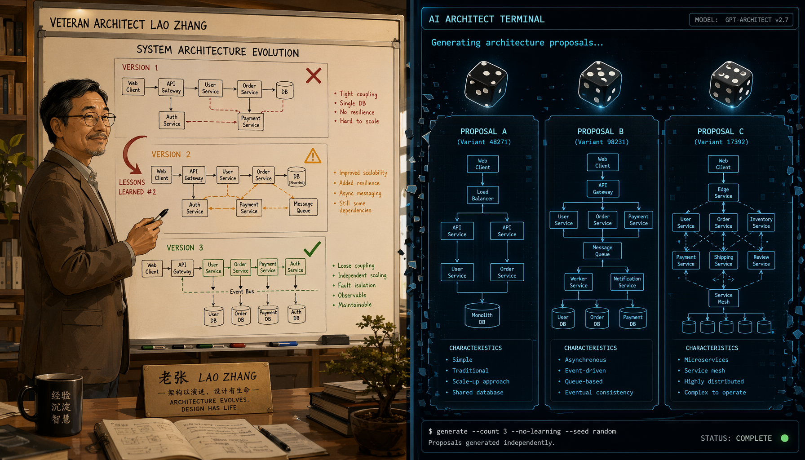
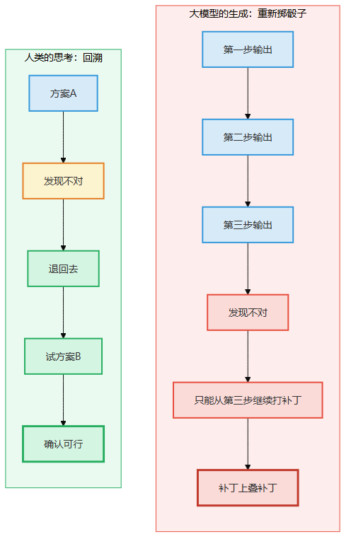
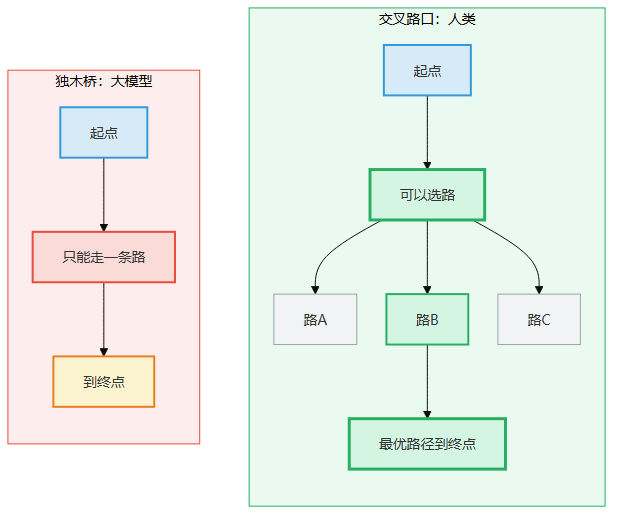
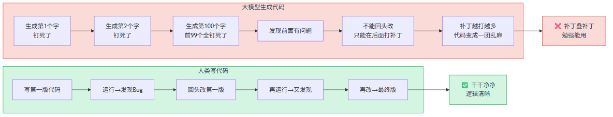
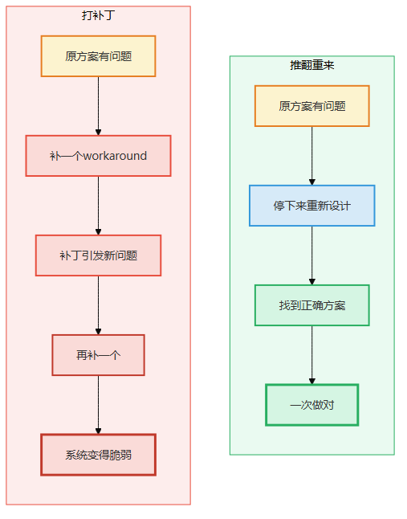
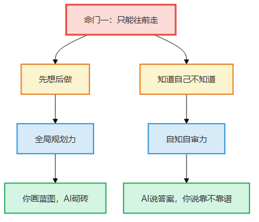
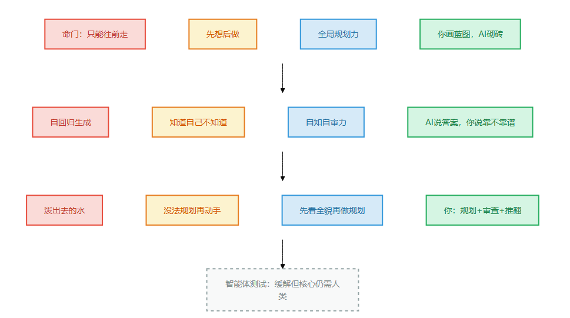

# 第2章 只能往前走

> 📍 本章位置：命门一——大模型没有退格键

---

## 场景：三版方案

老张是我认识十几年的后端架构师。他有个习惯——每次做系统设计，先在白板上画三版方案。

不是一版。不是两版。是三版。

我问他为什么。他说："第一版是本能反应，靠经验直接蹦出来的。第二版是挑第一版的毛病，改出来的。第三版是假装自己是个新手，看第二版哪里会让新人踩坑。三版画完，我大概知道哪个方向靠谱了。"

前年他们公司要做一套分布式订单系统，老张照例画了三版——

**第一版**：微服务拆成8个服务，每个服务独立数据库，用消息队列通信。画完他自己看了看，说："太碎了，一个订单要查8个库，性能肯定炸。"

**第二版**：合并成4个服务，共享一个订单数据库。画完他又看了看，说："订单库成了单点，万一挂了全完。"

**第三版**：4个服务 + 订单库主从 + 本地缓存兜底。这版他觉得可以了。然后才打开IDE开始写代码。

我听完说，这不就是"先想清楚再动手"吗？跟第5章老周写迁移方案一个道理。

老张说，对。但他强调了另一个点——**"我这三版方案，每版都是从零开始的。"**

第一版画完，他不是在第一版上修修补补，而是擦掉白板重新画。第二版画完，又是擦掉重来。**每次都是推翻，不是修改。**

这个"推翻重来"的动作，大模型做不到。

---

你可能会说，不对啊，大模型也可以重新生成啊。你跟它说"重写"，它不就重新来一遍了吗？

是，它可以重新来一遍。但它重新来的时候，**并不是"看了第一版，发现了问题，然后推翻重来"——它是"忘了第一版，又从第一个字开始重新蹦了一遍"。**

区别在哪里？

老张画第二版的时候，他**带着第一版的教训**。"太碎了，一个订单查8个库"——这个判断是他"回头看"第一版之后得出的。第二版是"我知道了问题在哪，我换个方向重新画"。

大模型重写的时候呢？它确实能生成一个不同的版本。但它不是"我发现第一个版本太碎了所以合并"——它是"我重新随机了一次，恰好这次生成了合并的版本"。它**没有从第一版中学到教训**，因为它**没有真正看过第一版**——它只是在生成第二版的时候，把第一版的文本作为输入又喂了一遍。

这就像一个运维做迁移，第一次搞砸了，你让他重来——他不是"知道上次哪里搞砸了所以这次避开"，而是"重新随机操作一遍，恰好这次没搞砸"。

> 图释：左——人类的打字机有退格键，写错了可以回头改、推翻重来、带着教训画下一版。右——AI的磁带只能往前走，每个字生成出来就钉死了，不能回头审视、不能推翻重来、只能在后面打补丁。区别不是"谁更快"，是"谁能回头"。

这不是真正的"回溯"。这是"重新掷骰子"。

> 图释：左图——人类的回溯：画第一版→发现问题→带着问题重画→越画越好。右图——大模型的重写：生成第一版→你说重写→从第一个字重新随机→跟第一版没有因果关系。

---

## 论证：为什么大模型没有退格键

### 一个字一个字蹦出来

大模型是怎么生成文字的？

你可能听过"自回归"这个词。翻译成人话就是：**一个字一个字往外蹦，蹦出来就钉死了。**

具体来说，它的工作方式是这样的——

1. 根据你给它的提示，预测第一个字应该是什么
2. 根据你的提示 + 第一个字，预测第二个字应该是什么
3. 根据你的提示 + 前两个字，预测第三个字应该是什么
4. ……一直蹦到最后

关键在哪儿？**每一个字，只依赖它前面的字。它不能回头改前面的字，也不能"先想好再写"。**

你写文章的时候是怎么写的？大多数人是这样——

1. 先想想整体要说什么
2. 写个开头
3. 写到中间发现开头不合适，回去改开头
4. 改完开头发现后面的逻辑要跟着调
5. 改来改去，最终定稿

**你有退格键。你可以回头。你可以推翻重来。**

大模型呢？它是这样——

1. 从第一个字开始，直接写
2. 写到第二个字的时候，第一个字已经定了，改不了
3. 写到第十个字的时候，前九个字全部定了，一个都改不了
4. 一路写到底，没有回头路

**它没有退格键。它走过就不能退。**

> 图释：左图——人类思考像交叉路口，可以分叉探索、发现不对就回退、选最优路径继续。右图——大模型思考像独木桥，从第一个字开始只能往前走，没有分叉，没有回退。

### "等等，CoT不是让大模型'想'了吗？"

好问题。Chain of Thought（CoT）确实让大模型"分步思考"了。它可以在回答问题之前先写出推理过程——"第一步……第二步……第三步……所以答案是……"

但CoT做的是**延长了独木桥**，不是**把独木桥变成了交叉路口**。

老张画三版方案，每版之间他会停下来，**审视上一版**，发现问题，**换个方向重新来**。这是"走一条路，发现不对，退回岔路口，换一条路"。

CoT呢？它让大模型走得更慢、更仔细——以前是一步蹦到终点，现在是"先走第一步，再走第二步，再走第三步"。但每一步走过就走过，**没有岔路口，没有回头路**。

打个比方：CoT让独木桥变长了，让你一步一步走而不是直接跳到终点。但它还是独木桥——你只能往前走，不能回头。

### 为什么"退格键"这么重要

你可能会想：不能回头就不能回头呗，有什么大不了的？

大不了。

**没有退格键，就意味着：**

- **不能先规划再执行**——没法"先在脑子里想好整体方案再写出来"，只能边做边想，写到哪算哪
- **不能发现矛盾后回头修改**——前面的字已经定了，只能在后面打补丁："其实前面说的不太对……"
- **不能推翻重来**——"重来"不是"回头看了发现问题然后换个方向"，而是"从第一个字重新随机"
- **不能做全局优化**——"全局"需要看到所有部分再调整，但每一部分一旦生成就不可变

老张画三版方案，核心动作是"回头看+推翻重来"。这两个动作，大模型一个都做不了。

它可以在后面加一句"前面的设计有不足之处"——但这就像运维在执行完命令之后说"刚才那个命令可能有问题"，问题是他不能撤回命令，只能在新命令里打补丁。

### 真实实验：只允许追加，不允许修改

你可以自己试一下——

找一段你最近写的代码或者文档。现在，试着修改它，但有一个规则：**不允许删除或修改任何已有的字，只能在后面追加新字。**

你会发现：

- 如果只是改个变量名，还好——你可以在后面加"请注意，上面的变量X应该叫Y"
- 如果要调整整体结构呢？你只能在后面追加"实际上，整个第二部分应该放在第一部分之前"
- 如果要推翻重来呢？你只能在后面写"前面说的全部作废，以下是正确版本"——但前面的内容还在那里

**这就是大模型的处境。**

它每次"纠正"自己，都是在后面打补丁。补丁越打越多，整个输出就变成了一团"原文+各种更正"——就像运维的操作日志变成了"执行A→不对，应该执行B→B也不对，再执行C→等等，A其实是对的……"

> 图释：人类写代码——发现Bug→回头改→再运行→再改→最终版干干净净。大模型生成代码——每个字钉死了→发现前面有问题→不能回头改→只能打补丁→补丁越打越多→代码变成一团乱麻。两者的差距就是"有退格键"和"没有退格键"的差距。

> 图释：左图——大模型的方式：发现错误不能删除，只能在后面追加更正，补丁越打越多。右图——人类的方式：发现错误直接擦掉重写，干干净净。

### Tree of Thoughts：外部补丁

"等等，"你可能说，"学术界不是有Tree of Thoughts（ToT）吗？它不是让大模型做'树状搜索'吗？"

这个问题我在第5章详细讨论过，这里简单再说一次——

ToT的做法是：让大模型生成多个可能的下一步，用评估器打分，选分数最高的继续。这确实让大模型有了"分叉"和"选择"——看起来像交叉路口了。

但关键在于：**这个"分叉和选择"是外循环控制的，不是大模型自己做的。** 大模型只是在被调用——它并不知道自己在做"树状搜索"。

就像你蒙上老张的眼睛让他在白板上画方案，每画一步有人告诉他"这个方向对不对"——他最终能画出好方案，但不是因为他"看到了全局"，是因为外面有人在指挥。

ToT就是那个"外面的人"。大模型本身依然没有退格键、没有回溯、没有全局视野。

**这是一种巧妙的"外部补丁"，但补丁不能改变底层结构。**

### "可是GPT有时候看起来能自我纠正啊？"

你用ChatGPT的时候，可能遇到过这种情况——它先给出了一个答案，然后自己说"等等，让我重新想一下"，接着给出了一个更好的答案。

这不是自我纠正。这是一个**恰好奏效的补丁**。

为什么这么说？当你跟大模型多轮对话的时候，它看到的是你之前的提示+它之前的回答+你现在的提示。它"纠正"自己，是因为你在提示里给了它新的信息——"你说错了"或者它自己生成的"让我重新想"文本，恰好把上下文引向了正确的方向。

但这是碰运气，不是机制。你可以试一个实验：让大模型做一道它容易犯错的数学题，然后让它"检查一下自己的答案"。大概一半的次数它会发现自己错了——但另一半的次数它会**更自信地确认自己的错误**。因为它"检查"的方式是再生成一遍——用同样的自回归机制，同样的没有退格键。

真正的自我纠正是什么？是你做完一道题，然后**换一个角度重新审视整个过程**——"我刚才用的方法有没有漏洞？假设答案错了，错可能在哪里？"这种审视需要你能**看到自己刚才的全过程**，大模型看不到——它只能看到自己生成的文字，看不到自己生成时的思考路径。

---

## 这条命门影响了什么

命门一——只能往前走——影响了所有需要"回头看"的事。

具体来说，它导致了三件大模型永远做不到的事——

| 做不到的事 | 为什么 | 对应的能力 |
|-----------|--------|-----------|
| 先想清楚再动手 | 没有方案就无法规划，无法规划就只能边做边想 | 全局规划力 |
| 知道自己不知道 | 无法回头审视自己的输出，就无法判断自己有多大把握 | 自知自审力 |

（第三件"做不到"是命门一和命门二的组合，第10章展开。）

这两件"做不到"的事，加上后面命门二和命门三推导出来的五件，构成全书的七件"做不到"。

你可能注意到了——命门一影响了两种能力，但它们有一个共同点：**都需要"回头看"。**

- 全局规划力：回头看你写的方案，发现矛盾，推翻重来
- 自知自审力：回头看你自己的输出，判断"我有多少把握"

没有退格键，这两件事都做不到。

> 图释：命门一（只能往前走）导致两件"做不到"的事——先想后做和知道自己不知道——对应全局规划力和自知自审力。两条影响线的共同点：都需要"回头看"。

---

## 一个小实验

试试"只允许追加、不允许修改"地写一段500字的文章。

规则很简单：
1. 打开一个编辑器
2. 开始写
3. 不允许用退格键、不允许删除任何字
4. 如果要修改，只能在后面追加新内容
5. 写完之后看看你的文章变成了什么样子

你会发现，你写的文章变成了"原文+各种更正和补充"——因为不允许删改，你只能在后面打补丁。

**这就是大模型每一秒都在经历的。**

然后再试一次——这次允许自由修改。写完之后对比两版——

第一版：补丁叠补丁，逻辑勉强通顺但读起来像在跟自己吵架
第二版：干干净净，逻辑清晰，一气呵成

两版的差距，就是"有退格键"和"没有退格键"的差距。

---

## 一页纸总结

**命门一：只能往前走**

大模型生成文字的方式是"一个字一个字往外蹦，蹦出来就改不了了"。它没有退格键，走过就不能退。

**核心限制**：无法回头审视、无法推翻重来、无法先规划再执行。

**影响的两种能力**：

| 做不到 | 能力 | 核心缺失 |
|--------|------|---------|
| 先想后做 | 全局规划力 | 无法写方案、无法推翻重来 |
| 知道自己不知道 | 自知自审力 | 无法审视自己的输出 |

**常见误解**：

| 误解 | 真相 |
|------|------|
| CoT让大模型"能想了" | CoT是延长了独木桥，不是加了岔路口 |
| ToT让大模型"能回溯了" | ToT是外部指挥，大模型本身依然没有退格键 |
| 大模型可以"重写" | 重写是重新掷骰子，不是带着教训推翻重来 |

**一句话**：说出去的话就是泼出去的水，敲进去的命令就是按下去的回车。大模型没有退格键，永远只能"边做边想"，做不到"先想后做"。

> 图释：第2章一页纸总结——命门一的核心、影响的两种能力、常见误解。

---

> **🔍 "AI打补丁"信号识别清单**
>
> 怎么判断AI的输出是"真思考"还是"边走边补"？看三个信号：
>
> 1. **更正词频>3** ——文中出现"其实""不过""更准确地说""换个角度看"等词超过3次，说明AI写到后面发现前面不对，在打补丁
> 2. **前后段论点矛盾** ——第2段说"建议方案A"，第5段说"方案B更优"，AI自己没发现冲突，因为没有退格键回头检查
> 3. **局部合理但全局打架** ——每一段单独看都对，合在一起逻辑不通——AI是一段一段往前蹦的，没有全局视角来协调
>
> 看到任一信号=AI在"打补丁"而非"先想后做"。这时候你的全局规划力就该出场了。

**今天就能做**：找一个你最近让AI写的长文本（文章、代码、方案），检查里面有没有"前面说了A，后面又说了跟A矛盾的话"——这就是没有退格键的痕迹。
