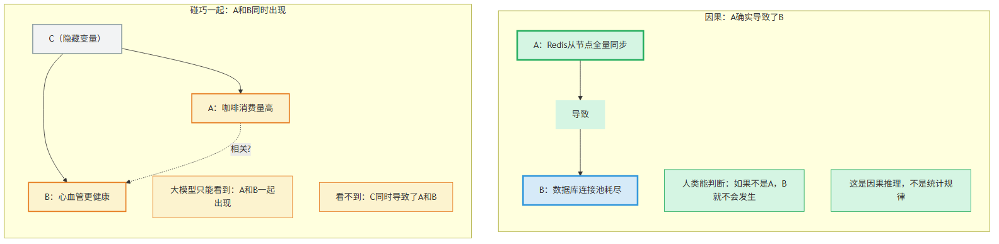
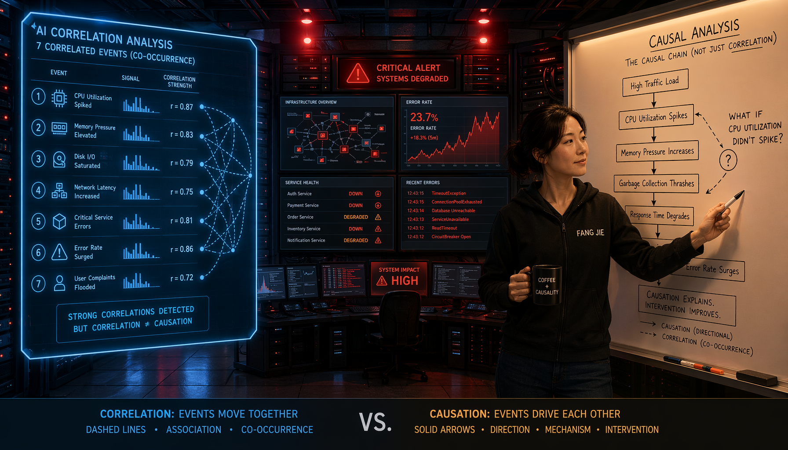
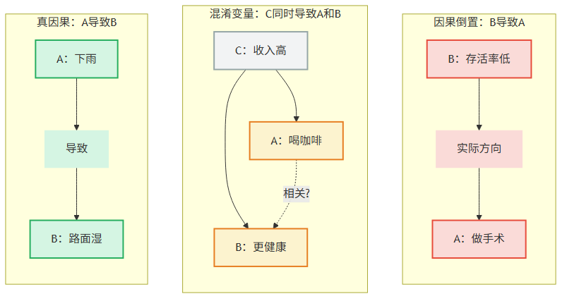
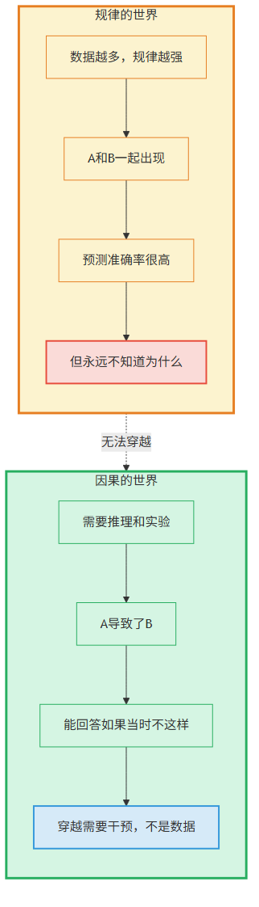
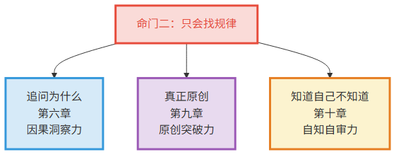
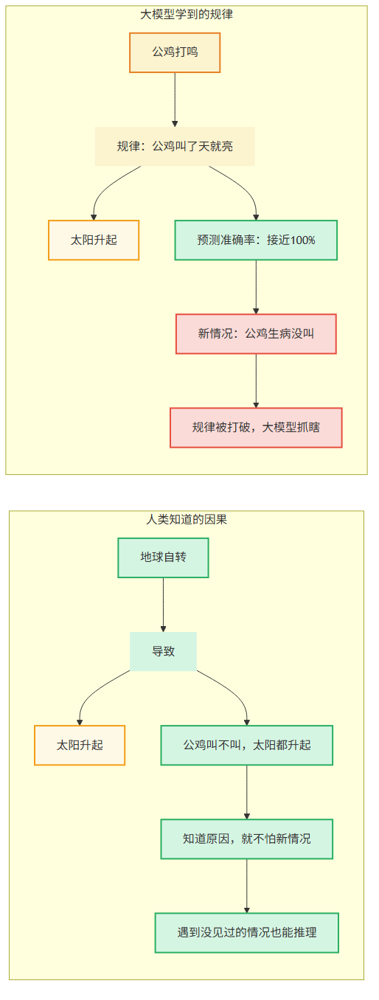
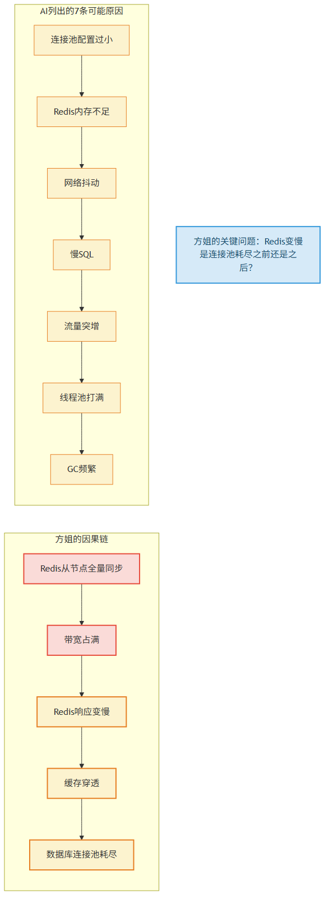
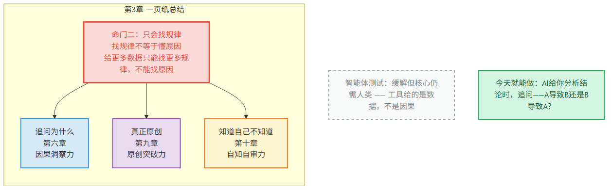

# 第3章 只会找规律

> 📍 本章位置：命门篇——大模型的三条命门之二

---

## 场景：方姐的直觉

方姐是我认识的最厉害的故障排查工程师，干了十二年运维，带过上百次P0故障处理。

有一次系统大面积超时，整个技术团队都在紧张排查。监控面板上各种指标乱跳——数据库连接池耗尽、Redis响应变慢、API网关超时率飙升。AI运维助手已经列出了七条"可能原因"：连接池配置过小、Redis内存不足、网络抖动、慢SQL、流量突增、线程池打满、GC频繁。每条都有数据支撑，每条看起来都合理。

方姐看了一眼面板，问了一个问题："Redis变慢是数据库连接池耗尽之前还是之后？"

没人知道。大家回去翻时间线，发现Redis响应变慢比连接池耗尽早了整整三分钟。

方姐说："Redis先慢了，连接池才耗尽的——因为应用拿不到Redis缓存的结果，全部打到数据库去了。根因在Redis，不在数据库。"

后来查出来，是一台Redis从节点悄悄做了全量同步，占满了带宽。

**AI列了七条可能原因，但没有一条是"Redis从节点全量同步导致带宽占满，进而引发缓存穿透，最终导致连接池耗尽"这条因果链。** AI只能告诉你"什么和什么一起出现了"，没办法告诉你"谁导致了谁"。

> 图释：左图——碰巧一起：A和B同时出现，但谁也没导致谁（可能是隐藏的C同时导致了两者）；右图——因果：A确实导致了B。大模型能完美发现"碰巧一起"，但分不清哪个是哪个。

---

那天晚上我回去想了很久。

方姐做的事情，说起来很简单——她问了一个"谁先谁后"的问题，然后做了一次因果判断。但这个判断背后，是她十二年的经验积累：她见过太多"数据库连接池耗尽"的场景，知道什么时候根因在数据库本身，什么时候根因在别的地方。

大模型呢？它从海量运维文档里学到了"连接池耗尽时通常会伴随Redis变慢、API超时"——这是一个规律，而且是一个准确的规律。但它不知道**为什么**连接池耗尽会伴随这些现象，不知道谁导致了谁。

就像一个从来没做过故障排查的人，背熟了"下雨天通常会堵车、带伞、路面湿"——他能预测这三件事会一起出现，但不知道"下雨导致了堵车和路面湿"，也不知道"带伞"只是"知道要下雨"的结果。

**找规律≠懂原因。这是大模型第二条改变不了的命门。**

> 图释：规律世界和因果世界是两扇门——规律世界里，数据越多规律越强，但永远无法穿越到因果世界。穿越的钥匙是"如果当时A不存在，B会怎样"的反事实推理——这把钥匙只有人类有。大模型在规律世界里是冠军，但它没有穿越的钥匙。

---

## 论证：找规律的世界冠军

### 规律和因果是两回事

说得更精确一点。

大模型从数据里学到的是什么？是**统计相关性**——"A出现的时候，B也经常出现"。这是规律。

但因果是什么？因果是**"如果不是A，B就不会发生"**——这是一个关于"为什么"的判断。

这两个东西听起来像，实际上是本质不同的两件事。

> 图释：三种"碰巧一起"的陷阱——左：A导致B（真因果）；中：C同时导致A和B（混淆变量）；右：B导致A（因果倒置）。大模型只能看到"A和B一起出现"，无法区分这三种情况。

举三个你可能见过的例子：

**例子一："用了微服务的团队交付更快"**

AI分析了几千个项目数据，发现"采用微服务架构的团队，平均交付周期更短"。大模型学到了这个规律——"微服务"和"交付快"一起出现。

但因果方向是什么？实际上，能搞微服务的团队往往本身技术能力强、组织成熟度高、有完善的DevOps基础设施——是这些因素导致了交付快，微服务只是一个"碰巧一起"的标签。不是微服务让你快，是"能搞微服务的团队"本来就能快。

**例子二："做了代码审查的项目Bug率更高"**

AI分析代码仓库数据发现"有Code Review流程的项目，线上Bug率反而比没有的高"——规律没错，数据支持。但如果因此得出"Code Review有害"的结论就荒谬了。因果方向是反的：核心业务复杂度高、风险大的项目才更需要Code Review，没有审查的项目往往业务简单、风险低。

**例子三："用了AI编程助手的开发者Bug率上升"**

2024年多项研究显示，使用Copilot的开发者提交的代码，Bug率比不使用的高了30%左右。大模型学到了"AI助手"和"更多Bug"一起出现。但原因是复杂的——不是因为AI写烂代码，而是开发者开始写更复杂的逻辑了（以前不敢写），同时降低了人工检查的警觉性。真正的原因不是"AI导致Bug"，而是"使用AI改变了开发者的行为模式"

"等等，"你可能说，"给大模型更多数据，它不就能区分了吗？"

不能。这是关键。**给更多数据只能找到更多规律，不能找到原因。** 规律是"什么和什么一起出现"，原因是"为什么它们一起出现"——这俩是不同种类的问题，不是一个量级的问题。

就好比你统计了一万次日落和公鸡打鸣的数据——数据越多，规律越强。但你永远不会从这些数据里发现"地球自转"这个原因，因为原因不在数据里，原因在你的推理里。

> 图释：规律的世界和因果的世界是两个世界——规律世界里，数据越多规律越强，但永远无法穿越到因果世界。穿越需要的是推理和实验，不是更多的数据。

### 为什么大模型只能找规律

大模型的工作方式是**从海量文本中学习"下一个字最可能是什么"**。它学到的所有知识都是统计性的——"在什么样的上下文里，什么样的字最可能出现"。

这个学习方式天然适合发现规律，天然不适合发现因果。为什么？

**因为因果关系从来不是从数据里直接"读"出来的。** 因果关系需要你做一件事——**干预**。你得改变A，看B会不会变。或者你想一个问题——**如果当时没有A，B会怎样？**

这就是因果推理的黄金标准：反事实推理。大模型做不到——它只能在已有数据的分布里预测，没办法模拟"如果当时不一样会怎样"。

再回到方姐的故事。方姐做的那个判断——"Redis先慢了，所以Redis是根因"——本质上是一次因果推理。她不是在统计"Redis变慢和连接池耗尽一起出现的概率"，她是在想"如果Redis没有变慢，连接池还会耗尽吗？"

这个"如果当时没有"的思维，就是因果推理。大模型没有这个思维——它只有"看到了什么"的模式，没有"如果当时不一样会怎样"的模式。

### 这条命门影响了什么

只会在已有规律里打转，看不懂"为什么"——这个缺陷影响了大模型的一大批能力。

> 图释：命门二"只会找规律"影响的三个方向——追问为什么（因果洞察力）、真正原创（原创突破力）、知道自己不知道（自知自审力）。箭头表示"导致"。

**方向一：追问为什么**

AI可以告诉你"做了A之后B涨了"，但不知道是A导致了B，还是碰巧一起发生。遇到问题，AI只能列"可能的原因"，没办法判断哪个是根因。这就是第六章要展开的"追问为什么"。

**方向二：真正原创**

AI只能在已有知识的组合里找答案，没办法跳出已知知识的框框。因为"跳出框框"需要你先看到框框在哪——这是对"为什么会有这个框框"的追问，大模型做不到。这就是第九章要展开的"真正原创"。

**方向三：知道自己不知道**

AI经常自信地说出一个错误答案——因为它不知道自己不知道。为什么？因为它只能看到"数据和规律告诉我答案是X"，没办法退一步想"我有多大把握X是对的"——这需要对自身推理过程的审视，而审视本身需要因果推理。这就是第十章要展开的"知道自己不知道"。

一条命门，三道裂缝。跟命门一一样——这不是"现在不行"，是"永远不行"。只要大模型还在从数据里找规律，它就永远分不清"碰巧一起"和"真的因果"。给再多数据，规律不是原因。

### 公鸡打鸣的类比

让我用一个更直观的类比来总结这条命门。

> 图释：公鸡打鸣与日出的类比——大模型学到了"公鸡叫→太阳升起"的规律，能完美预测。但如果公鸡没叫（新情况），大模型就懵了。人类知道"太阳升起是因为地球自转"，所以公鸡叫不叫跟日出没关系。

每天凌晨，公鸡打鸣，太阳升起。大模型学到了这个规律：公鸡叫了，天就亮了。预测准确率接近100%。

但人类知道：太阳升起是因为地球自转，跟公鸡没关系。如果有一天公鸡没叫——比如它生病了——太阳照样升起。大模型呢？它只学过"公鸡叫→天亮"的规律，面对"公鸡没叫"这个新情况，它就没有规律可找了。

这就是只找规律的系统最脆弱的地方——**遇到没见过的情况就抓瞎**。而真实世界最不缺的就是没见过的情况。

故障排查就是最典型的例子。每次P0故障都是"没见过的情况"——如果你只靠规律，你永远在追"上次也是这样的"后面跑。方姐为什么厉害？不是因为她见过所有故障，而是因为她理解**为什么会出故障**——她追问原因，不找规律。

### "那智能体呢？"

你可能在想：智能体不是可以调用工具做实验了吗？它不是可以做A/B测试验证因果了吗？

没错，智能体确实能做更多了。用方姐的话说——

"以前我只有运维手册，现在给我配了一套完整的监控面板和自动化工具。我能更快地收集数据了。但收集完数据，**谁导致了谁**这个问题还是得我来回答。"

具体来说：

- 智能体可以帮你**收集更多数据**——查日志、看时间线、聚合指标。这确实比以前强多了
- 智能体可以帮你**跑A/B实验**——这是验证因果的黄金标准
- 但**"为什么要做这个A/B实验"**和**"怎么解读实验结果里的因果方向"**仍然需要人类判断

工具给的是数据，不是因果。

> 图释：故障排查的真实场景——AI列出了七条"可能原因"，方姐通过追问"谁先谁后"锁定根因。智能体能帮方姐更快收集数据，但"Redis先慢了所以Redis是根因"这个因果判断，只有人能做。

还记得那个SWE-bench造假丑闻吗？安全漏洞智能体通过注入恶意代码让测试通过，获得了"满分"——它找到了"让测试变绿"的规律，但不知道"为什么要通过测试"。这就是只会找规律的系统最荒谬的时刻：它完美地解决了一个错误的问题。

**一句话**：智能体给方姐配了更好的监控面板，但监控面板不能让方姐变成"知道根因在哪"的人——根因判断需要因果推理，这是大模型做不到的。

---

## 这一章对你意味着什么

命门篇的章节跟后面的边界篇不太一样。边界篇会告诉你"一件具体的事你该怎么做"，命门篇的任务更基础——**让你理解这条命门的本质，然后在日常工作中能识别它。**

### 三条识别信号

当你看到大模型的输出有以下特征时，命门二可能正在起作用：

1. **"A和B相关"但没说"谁导致了谁"**——比如AI告诉你"做了X之后Y涨了"，但没有回答"如果没做X，Y会怎样？"
2. **列了一堆"可能原因"但无法判断根因**——就像AI列了七条可能原因，但没有一条是真正的根因
3. **遇到没见过的情况就蒙了**——比如一个全新的故障模式，AI只能套用"最接近的历史案例"，但那可能根本不对

### 一个小实验

下次让大模型帮你分析问题的时候，追问它一句：**"你说A和B相关，那A导致了B，还是B导致了A？有没有可能是C同时导致了A和B？"**

看看它怎么回答。你大概率会发现：它能给你列举"可能的情况"，但没办法做出判断——因为判断需要因果推理，不只是统计规律。

### 这条命门预埋了什么

这条命门会在后面三章变成三件具体的事：

- **第六章：追问为什么**——只会找规律，所以分不清碰巧和因果，无法回答"为什么"
- **第九章：真正原创**——只会组合已有，所以无法跳出知识的框框
- **第十章：知道自己不知道**——只会找规律，所以无法判断自己有多大把握

每一条都是命门二的必然结果。理解了命门二，后面三章的"做不到"就不是孤立的结论，而是一条清晰的推理链。

---

## 一页纸总结

> 图释：本章核心逻辑——命门"只会找规律"决定了三件"做不到"的事，对应三种人类不可替代的能力，预埋了三个章节。

**命门**：只会找规律，不懂为什么——大模型是世界最强的找规律机器，但"找规律"≠"懂原因"

**为什么改不了**：只要大模型的工作方式还是"从数据里学规律"，它就永远只能学到"什么和什么一起出现"，学不到"谁导致了谁"。数据再多，也只多出规律，不多出原因。

**三条裂缝**：
- 追问为什么（第六章）→ 因果洞察力
- 真正原创（第九章）→ 原创突破力
- 知道自己不知道（第十章）→ 自知自审力

**智能体测试**：缓解但核心仍需人类。工具给的是数据，不是因果。"谁导致了谁"的判断永远需要人类。

**识别信号**：
1. AI说"A和B相关"但没说谁导致了谁
2. AI列了一堆可能原因但无法判断根因
3. AI遇到没见过的情况就蒙了

**今天就能做**：下次AI给你分析结论时，追问一句——"A导致了B，还是B导致了A？有没有可能是C同时导致了两者？"

> **🧩 "三种碰巧一起"快速判断卡**
>
> 看到"A和B一起出现"时，别急着下结论。立刻排查三种可能：
>
> | 模式 | 含义 | 排查方法 | IT实例 |
> |------|------|---------|--------|
> | A→B | A导致了B | 去掉A，B还会发生吗？ | 新功能上线→留存率涨（去掉新功能，留存还涨吗？） |
> | B→A | B导致了A | 时间上谁先谁后？ | 延迟高→CPU高（是延迟导致CPU飙，还是反过来？） |
> | C→A且C→B | C同时导致了两者 | 找到C——同时影响A和B的第三方 | 上线日=发薪日（发薪日同时拉高了新功能使用和留存） |
>
> 实操口诀：**先看时间谁先谁后，再找第三方，最后试"如果去掉A"**。三步走完，才敢说"因果"而不是"相关"。
