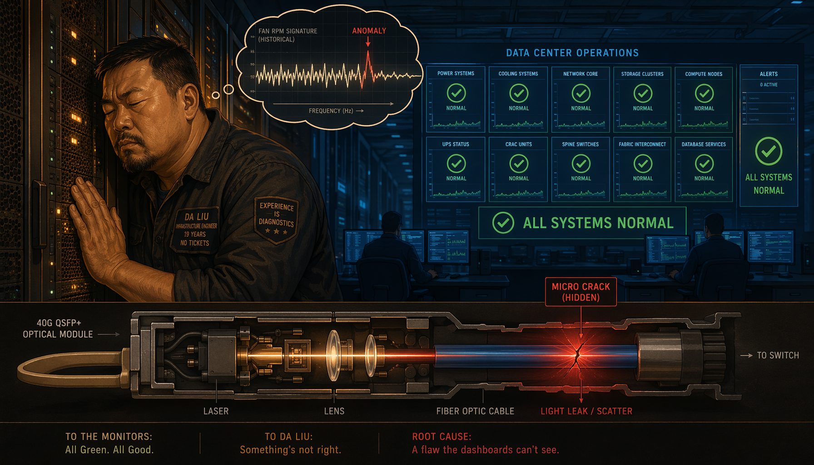
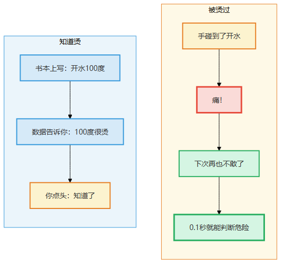
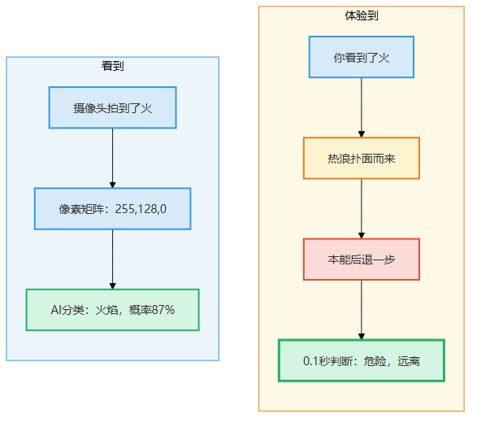
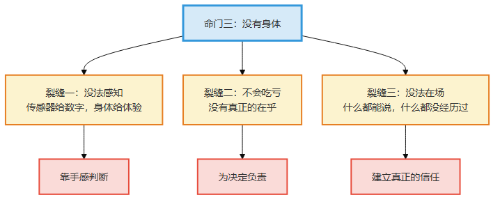
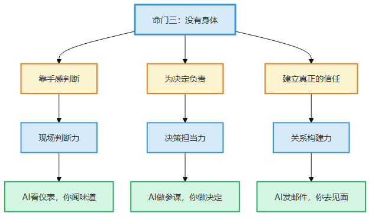
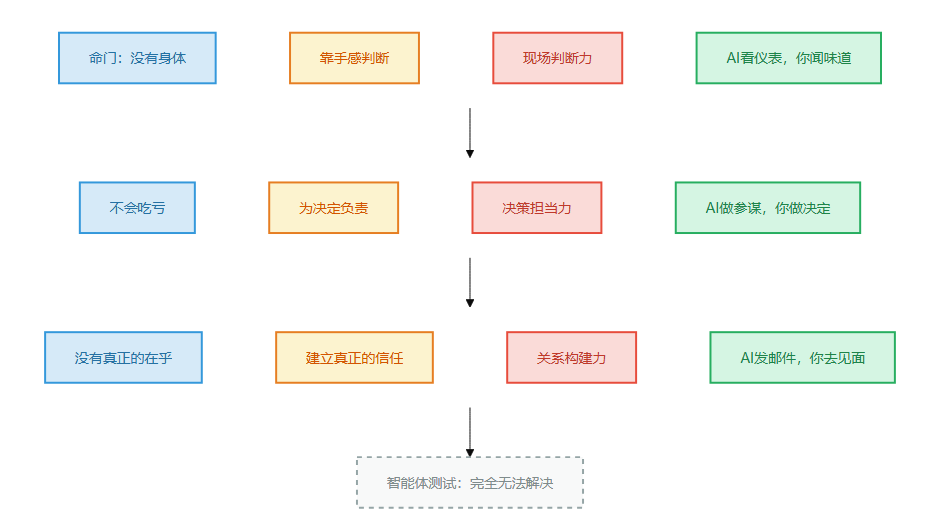

# 第4章 没有身体

> 📍 本章位置：命门三——大模型什么都能"说"，但什么都没"经历"过

---

## 场景：闭着眼听出哪台服务器不对

大刘在我们公司机房摸了十年。他的正式title是"基础设施工程师"，但我们私下叫他"机房之神"。

去年有一次，机房里一台核心交换机出了问题。监控系统显示一切正常——CPU正常、内存正常、端口正常。但业务就是偶尔丢包。

运维团队查了两小时，查不出原因。所有仪表盘都是绿色的，但业务在飘红。

大刘从工位走过来，在机房门口站了大概十秒钟。然后他走进去，走到第三排机柜旁边，指着一台交换机说："风扇声音不对。"

运维去看，风扇转速确实在正常范围内——监控不报警。但大刘说："不是转速的问题，是声音不对。正常的风扇是嗡嗡的，这台有轻微的咔嗒声，轴承可能有问题。振动大的时候网线接口会松。"

拆开一查——轴承确实磨损了，振动导致光模块接触不良，偶尔丢包。

**监控全是绿色的，大刘靠"听"出了问题。**

> 图释：左——监控面板看到的一切都是绿色的：CPU正常、内存正常、磁盘IO正常、温度正常。结论：一切正常。右——大刘站在机房里，眼睛看到灯光闪烁节奏变快，耳朵听到风扇声音中间有咔嗒，皮肤感到比昨天闷了一点——说不清哪个指标，但"不对劲"。监控看不到的，人能感觉到。

我问他怎么做到的。他说："我在这个机房待了十年，每天进去转一圈。正常的时候什么声音，我心里有数。哪天声音不一样了，不用看监控就知道。"

这不是玄学，是一万次"走进机房→听声音→记住正常是什么样的→发现不对"的压缩。

**这种"手感"，监控面板给不了，AI也给不了。**

---

你可能会说：给AI装上声音传感器不就行了？让它也"听"。

是，它可以"听到"声音。但它听到的是什么？是分贝数、是频率、是波形——是数据。大刘听到的是什么？是"这个声音不对劲"——是**体验**。

区别在这里——

AI可以测出"风扇的频率偏移了2Hz"。但"偏移2Hz意味着什么"——是轴承磨损？是灰尘太多？是电压不稳？——这需要一千次"听到了偏移→打开机器验证→确实是XX问题"的经验。这个经验不在数据里，**在大刘的肌肉记忆里**。

**"知道烫"和"被烫过"是完全不同的两件事。**

AI可以说出"烫"的定义——"温度高于皮肤耐受阈值会导致组织损伤"。它可以列出烫伤的分级、急救措施、预防方法——比任何医生都全。

但你问它"烫是什么感觉"，它说不出来。不是因为它表达能力不够，而是因为它**没有被烫过**。

被烫过的人不需要查定义——手碰到热的锅把手，0.1秒就缩回来了。这个缩手不是"先判断温度→再决定缩手"，而是**身体直接替你做了决定**。这叫"体验性知识"——它不在教科书里，它长在你的手上。

> 图释：左图——AI"知道烫"：可以背出定义、分级、急救措施，但碰到热锅不会缩手。右图——你"被烫过"：0.1秒缩手，不需要思考，身体直接替你做了决定。一个是信息，一个是体验。

---

## 论证：信息不等于体验

### 大模型的世界里只有文字

大模型训练的原料是什么？**文字。**

它看了人类写出来的所有东西——书、论文、网页、代码、对话。但人类写出来的，只是人类知道的东西的冰山一角。

大量的知识是不写出来的——

- 老司机踩刹车的力度：不是"前方100米有红灯所以要减速"，而是脚上那个"微微一收"的感觉
- 资深医生的听诊判断：不是"心音S3提示心衰"，而是"这个S3听起来不对"
- 大刘对机房声音的判断：不是"频率偏移2Hz"，而是"这个声音不对劲"

这些知识有一个共同特点：**只能意会，不能言传。** 不是当事人不想说，是说不出来——它是一种压缩在身体里的判断力，不是可以写成规则的算法。

哲学家管这叫"默会知识"（tacit knowledge）——你知道它，但你说不出你怎么知道的。

大模型能学到的，只有人类**说出来**和**写下来**的那部分。默会知识，它永远学不到——因为这部分知识从来没有出现在它的训练数据里，也**不可能**出现在训练数据里。

### 给AI装传感器能解决吗？

有人说：给AI装上摄像头、麦克风、触觉传感器，让它也有"身体"，不就行了？

我分两层来说——

**第一层：装了传感器，AI能"看到"和"听到"了。** 这确实比以前强。它可以看到画面、听到声音、感受到温度。自动驾驶不就是这么做的吗？摄像头看路、雷达测距、温度传感器检测过热。

**第二层：但"看到"不等于"体验"。**

大刘走进机房，他不是在"采集数据"——他是在"感受环境"。十年来他每天走进同一个机房，他已经内化了一种"正常是什么样的"的感觉。这种内化不是存储了数据，而是**他的身体自动在对比**——不用刻意去想"今天的声音和昨天比偏了多少分贝"，而是"哪不对劲"这个判断自己就蹦出来了。

AI装了传感器之后呢？它可以采集数据，可以跟历史数据对比，可以设置阈值报警。这些都有用。但——

- **阈值是死的，直觉是活的**。大刘不需要设定"频率偏移3Hz报警"——他凭感觉就能发现异常，而有些异常是数据上看不出来但人的感官能捕捉到的
- **"不对劲"比"超阈值"更灵敏**。大刘不是在检测某一个指标，他在感受"整体氛围"——温度、声音、气流、甚至机柜门的松紧，这些综合在一起形成了一种"正常"的模子，任何微小的偏离都能被感知到
- **经验会进化，阈值不会**。大刘的感觉会随着时间越来越准——他经历了更多"不对劲→验证→确实是问题"的循环，直觉在不断校准。阈值只能人工调整

打个比方——你给一个人装了高清摄像头和精密麦克风，但让他从出生开始就只通过这些设备来"看"世界，从来不亲自触摸、感受。他能"看到"一切，但他永远不会有"手感"。

**传感器给了AI"看"的能力，但没有给它"体验"的能力。看到画面不等于亲历现场。**

你可能会不服：现在的异常检测算法不是很厉害吗？能自动发现偏离基线的模式，不需要人工设阈值——这不就是"直觉"吗？

不一样。异常检测算法做的是**在已知特征空间里找离群点**——它只能检测"可以用已有特征描述的异常"。但真正的"手感"经常是**还没想清楚该怎么描述的异常**。

大刘能听出"声音不对"，不是因为他脑子里有个分贝阈值——是因为他每天走进机房，整个环境给他一种综合的"正常感"，任何维度的微小偏离都会触发他的警觉。这种警觉不是针对某一个指标的——温度高了一点、某个机柜门关得不紧、某台服务器风扇声音稍微不同——这些信号单独拿出来都在正常范围内，但组合在一起就是"不对劲"。

异常检测算法能做组合吗？能。但你得告诉它"组合哪些特征"。**你告诉它的那一刻，它就只能在你说出的框框里打转。** 而大刘的框框是"所有我感受到的东西"——这个框框没有边界。

这就是为什么在真实运维中，最厉害的故障发现者永远是人。不是人的计算能力比机器强——是人的感知维度比任何传感器阵列都广，而且这些维度是**自适应扩展的**——遇到新情况，人会自动增加新的感知维度，而传感器只能检测被设计来检测的东西。

> 图释：左图——AI"看到"：有传感器、有数据、有阈值，但只能检测已知模式。右图——大刘"体验到"：没有精确数据，但有"不对劲"的综合直觉，能检测未知异常。传感器能检测超阈值，但"不对劲"比"超阈值"灵敏得多。

### 一条命门，三道裂缝

命门三——没有身体——不是一个问题，是三个问题的根源。

**裂缝一：没有手感**

大刘靠听声音发现问题。外科医生说"切到这一层手感不同"。老程序员说"这段代码跑起来有股味道"——不是真的有味道，是那种"哪里不对但说不清楚"的直觉。

这些都是"手感"——来自上千次实践的压缩。大模型没有身体，就不可能有手感。

**裂缝二：无法负责**

讲一个我亲眼见过的事。

前年一家公司做AI辅助诊断系统，给医院用。有一次AI给一个患者判了"良性"，结果是恶性的。患者家属来闹，医院赔了钱，然后来找AI公司——你们的产品判错了，你们负责。

AI公司说：我们只是"辅助工具"，最终诊断是医生签的字。

医院说：医生说当时AI给了"良性"的判断，他就没有再细看。

这个锅，谁来背？

AI不能坐牢，不能赔钱，不能被吊销执照。它犯了一个错误，但**它不承受任何后果**。那个签了字的医生呢？他可能从此再也不敢轻信AI的判断——因为他**吃了亏，长了记性**。

一个人做了错误的判断，他会记住——不是因为他在笔记本上记了一行，而是因为他**经历了后果**。这种经历改变了他以后的判断方式。AI没有这种经历——它可以被"微调"来减少类似错误，但这不是"长了记性"，而是"改了参数"。

**长了记性 vs 改了参数——这是本质区别。** 长了记性的人下次遇到类似情况会犹豫、会复查、会多想一步。改了参数的模型只是"这个具体的case不会再犯"，换一个不同的场景，同样的错误模式可能再来一遍。因为它没有"怕了"——怕，得用身体去挨。

**裂缝三：无法建立真正的信任**

为什么大生意都是面对面谈的？为什么心理咨询的核心不是"技术"而是"关系"？为什么你要亲眼见过一个人才能把后背交给他？

我有个做企业级销售的朋友老杨，他签过最大的一个单子，两千多万。他跟我说："那个客户决策会上，技术方案我只讲了十五分钟。但之前半年，我飞了七趟，每次去都不是讲方案——是跟他们的人吃饭、聊天、一起扛过一次系统故障。最后一轮竞标的时候，三家方案大同小异。客户选我，不是因为我的方案最好，是因为他们信我——他们见过我凌晨三点还在帮他们查问题。"

AI可以帮你写方案、做分析、发邮件。但它没法在凌晨三点跟你一起扛——它不在场。它不能坐在你对面，看着你的眼睛说"这事我跟你一起扛"。

信任不是"我知道你靠谱"——信任是"我跟你一起经历过事"。这种"一起经历"需要两个人同时在同一个地方、同时面对同一个问题、同时承担同一个风险。

---

> 图释：命门三（没有身体）裂开三道缝——没有手感（千次实践的压缩）、无法负责（不会"吃亏"无法"长记性"）、无法建立信任（不能"在场"不能"一起经历"）。每道裂缝对应一两种"做不到的事"和一种你的能力。

## 这条命门影响了什么

命门三——没有身体——是影响最广的一条命门。它导致了三件大模型永远做不到的事——

| 做不到的事 | 为什么 | 对应的能力 |
|-----------|--------|-----------|
| 靠手感判断 | 没有体验就没有直觉，没有直觉就没有"不对劲"的感觉 | 现场判断力 |
| 为决定负责 | 不会"吃亏"就无法"长记性"，无法承担后果就无法为决定负责 | 决策担当力 |
| 建立真正的信任 | 不在场就无法"一起经历"，无法共担风险就无法建立信任 | 关系构建力 |

三件"做不到"的事有一个共同点：**都需要"身体在场"。**

- 现场判断力：身体要**在场**，才能有手感
- 决策担当力：身体要**能承受后果**，才能为决定负责
- 关系构建力：身体要**面对面**，才能建立真正的信任

没有身体，这三件事一件都做不到。

命门三还跟命门二组合出了第五件"做不到"——**真正原创**。大模型只会找规律（命门二），又没有身体去验证全新想法（命门三），所以它只能组合已有的，不能提出并验证全新的方向。

> 图释：命门三（没有身体）直接导致三件"做不到"——靠手感判断、为决定负责、建立真正的信任——对应现场判断力、决策担当力、关系构建力。加上与命门二组合导致的"真正原创"（原创突破力），命门三总共影响了四种能力。

---

## 一个小实验

试着向一个从未见过雪的人描述"踩在雪上的感觉"。

你可以告诉他雪是白色的、是冰冷的、踩上去会咯吱响——这些都是可以言传的信息。但"脚踩下去那一瞬间的松软和阻力、脚底传来的冰凉感、雪在鞋底下慢慢压实的触感"——这些是体验，你说不出，他体会不到。

然后想想你工作中那些"只可意会不可言传"的技能——

- 你怎么判断一段代码"有隐患"的？
- 你怎么判断一个项目"要延期"的？
- 你怎么判断一个同事"靠谱"的？

这些判断里，有多少是你能说清楚的，有多少是"说不出来但就是知道"的？

那些"说不出来但就是知道"的部分，就是体验性知识。**大模型永远学不到这部分。**

---

## 一页纸总结

**命门三：没有身体**

大模型什么都能"说"，但什么都没"经历"过。它可以说出"烫"的定义，但从来没有被烫过。有些知识写在书里，有些知识长在手上——长在手上的，大模型永远学不会。

**核心限制**：无法获得体验性知识，无法有"手感"，无法承受后果，无法"在场"。

**影响的四种能力**：

| 做不到 | 能力 | 核心缺失 |
|--------|------|---------|
| 靠手感判断 | 现场判断力 | 没有体验就没有直觉 |
| 为决定负责 | 决策担当力 | 不会"吃亏"就无法"长记性" |
| 建立真正的信任 | 关系构建力 | 不在场就无法"一起经历" |
| 真正原创 | 原创突破力 | 与命门二组合——无法跳出已知空间 |

**常见误解**：

| 误解 | 真相 |
|------|------|
| 给AI装传感器就有"身体"了 | 传感器只能"采集数据"，不能"体验"。看到画面不等于亲历现场 |
| AI可以学"手感" | 手感是上千次实践的压缩，不是数据。它不在训练集里，也不可能出现在训练集里 |
| AI可以"承担后果" | AI不会"吃亏"——它可以被微调来减少错误，但这不是"长了记性"，而是"改了参数" |

**一句话**：大刘闭着眼听出服务器不对——这不是玄学，是一万次"走进机房→听→记住正常→发现不对"的压缩。这种压缩不在任何数据集里，它长在大刘的手上、耳朵里、肌肉记忆中。

> 图释：第4章一页纸总结——命门三的核心、三道裂缝、影响的四种能力、常见误解。

---

**今天就能做**：列举你工作中三个"只可意会不可言传"的技能——那种"说不出来但就是知道"的判断。然后想想：这种判断力是怎么来的？是不是经历了无数次"判断→验证→校准"的循环？这个循环，AI永远走不了——因为它没有身体去验证，没有后果去校准。

> **📝 "我的默会知识清单"模板**
>
> 你比你以为的更不可替代——因为你拥有大量"说不出来但就是知道"的默会知识。用这个模板把它们挖出来：
>
> | 我"就是知道"的判断 | 这个判断来自几次验证？ | 能教给别人吗？ | 哪次验证最关键？ |
> |---------------------|----------------------|--------------|----------------|
> | 例：部署前先看磁盘余量 | 约20次线上故障排查 | 能说规则，但"什么时候该警觉"教不了 | 第3次P0事故后形成的肌肉记忆 |
> | | | | |
> | | | | |
>
> 填完你会发现：每个"教不了"的判断，都来自身体在场、后果在身的真实经历——这正是AI永远走不了的路径。
