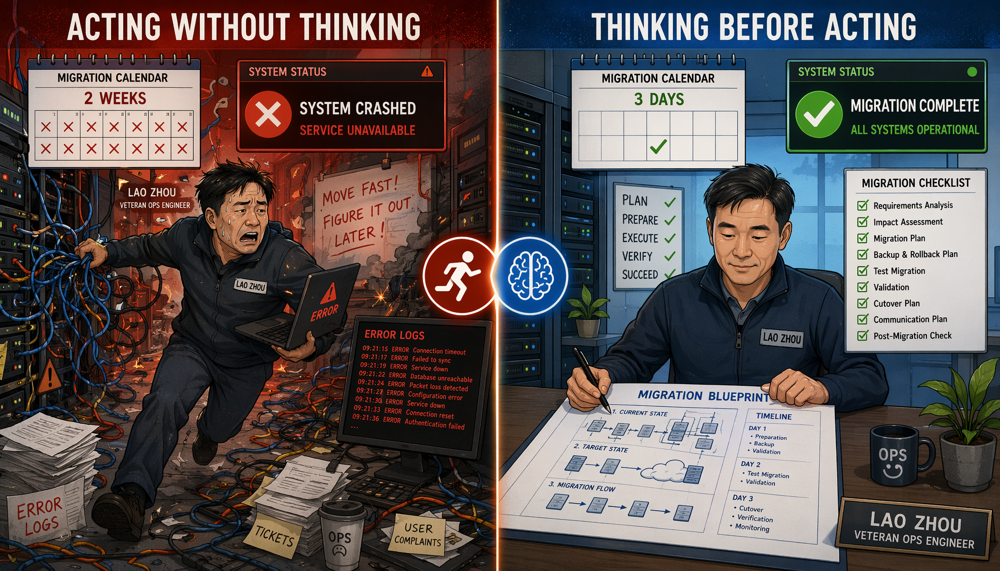
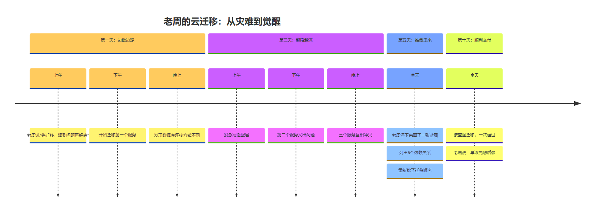
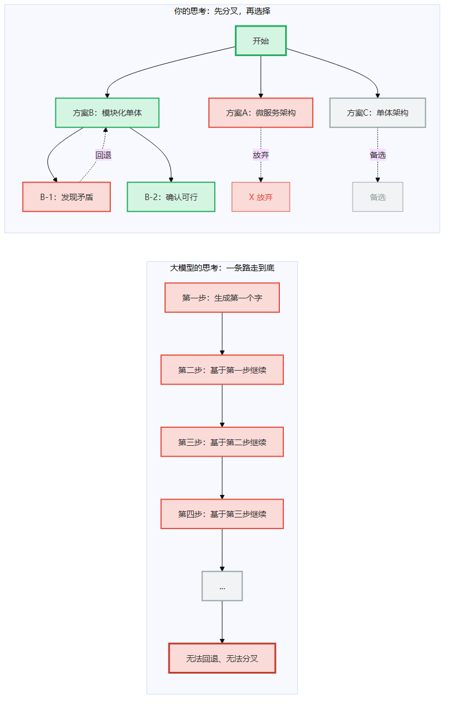
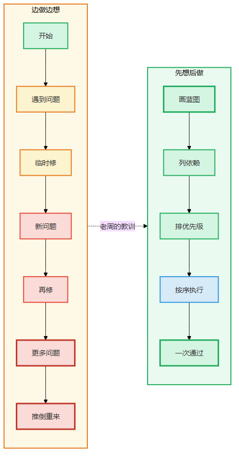
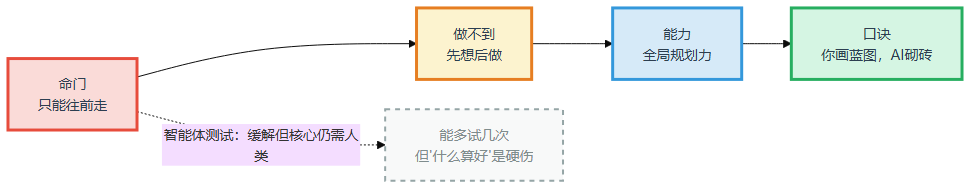
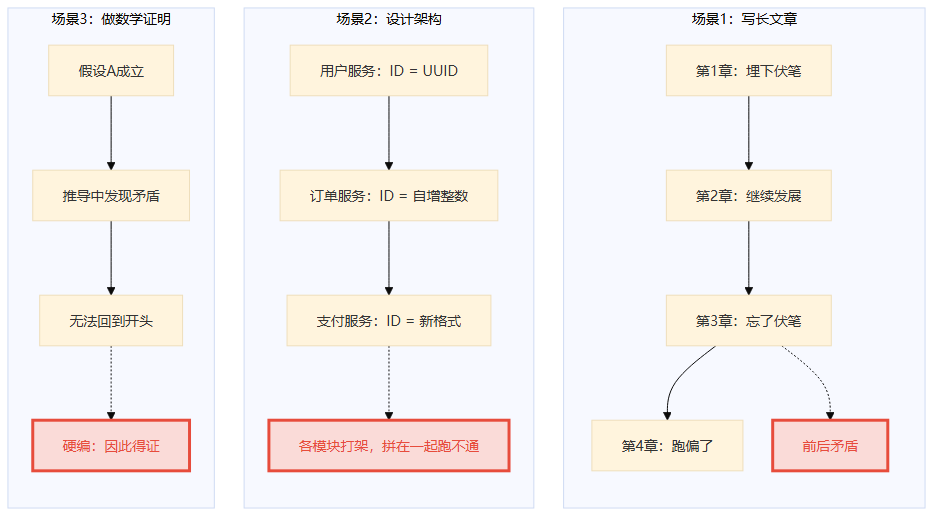
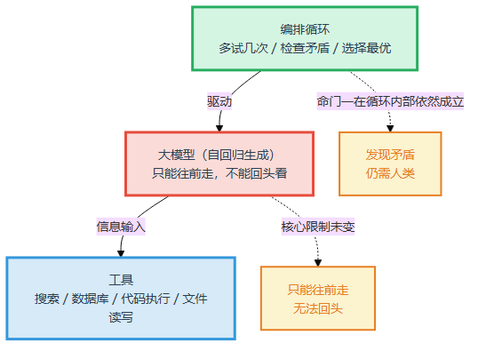
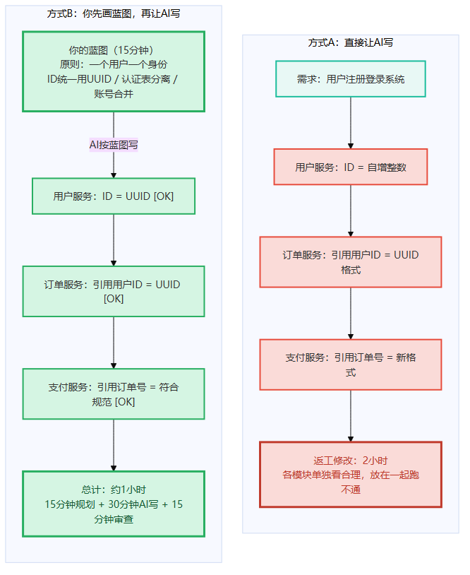
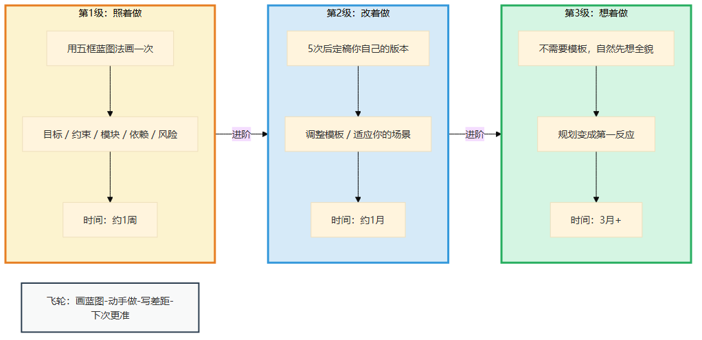
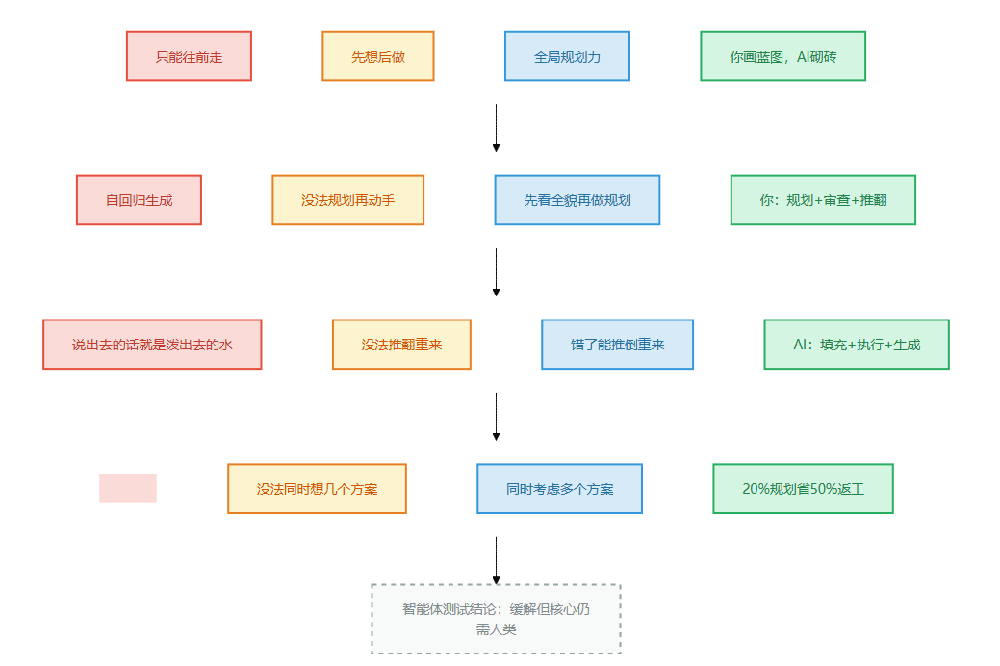

# 第5章 先想后做

> 📍 本章位置：命门一（只能往前走）→ 第一件做不到的事 → 全局规划力

---

## 场景：两次迁移

前四章我们推导了三条命门——只能往前走、只会找规律、没有身体。从这一章开始，我们进入"做不到"的世界：每一条命门会裂开几道缝，每一道缝就是一件大模型永远做不到的事。

第一件：先想后做。

我前同事老周，干了十五年运维。他跟我讲过一次迁移的事——

那年公司要把一套核心系统从自建机房迁到云上。两个团队同时做，一套订单系统，一套支付系统。两个团队人差不多，技术栈也差不多，但结果天差地别。

支付系统的团队怎么干的？拿到任务直接开干——先迁数据库，把MySQL迁到RDS。再迁应用，把Jar包扔到ECS上。迁到ECS发现数据库连接串没改，回去改配置。改完配置发现端口不对，又改安全组。改完安全组发现DNS还没切，又搞DNS。来来回回，光环境问题就踩了两周，上线还翻了一次车，回滚又花两天。

老周带的订单系统团队呢？他拿到任务之后，头三天一个命令都没敲。他就干一件事：写迁移方案。数据库用什么方式迁、应用分几批上云、每批之间怎么验证、回滚方案是什么、哪些依赖先改、哪些配置提前准备——全写在一张表上，所有坑提前想清楚。

等团队开始操作的时候，每个人拿到的不是"去迁移一下"的指令，而是"第一步停写入5分钟，第二步用DTS全量同步，第三步改应用配置指向新库，第四步验证数据一致性"的方案。操作的人不用想"这样行不行"，方案上已经想好了。

**两套系统，同样的人，同样的技术——一套提前上线，一套拖了两周还翻了车。**

差距不在敲命令的速度，在有没有方案。方案想清楚的人，一次过；边做边想的人，踩一路坑。



> 图释：左——建筑师先画好蓝图再施工，一切井然有序，每个环节按图纸执行。右——没有蓝图直接开干，墙砌歪了、管子接错了、返工再返工。差距不在干活的速度，在于动手之前有没有想清楚全局。



> 图释：老周两次迁移的完整时间线——第一次"边做边想"越陷越深，第二次"先想后做"一次通过。

---

我听完这个故事的时候，后背发凉——因为我就是那个"没写方案就开干"的人。

几年前公司让我设计一个用户系统，支持邮箱注册、手机号注册、第三方登录。我直接打开编辑器开始写。写到第三个模块，发现第二个模块的接口跟第三个对不上。回去改第二个，第一个也得跟着调。改完第一个，整体架构已经面目全非了。

那天晚上十一点，我删掉了所有代码，从头来过。这一次我没急着动手，先拿白板画了一张架构图。

我做的这两件事——**先想清楚再动手**，**发现不对就推翻重来**——大模型一件都做不到。



> 图释：左图——你的思考像一棵树，可以分叉探索、发现不对就回退、选最优路径继续；右图——大模型的思考像一条链，从第一个字开始只能往前走，没有分叉，没有回退。

---

## 论证：为什么大模型做不到

### 只能往前走 = 没有方案就开干



> 图释：左路——边做边想，问题越积越多，最终推倒重来；右路——先想后做，画蓝图、列依赖、排优先级，一次通过。

还记得第一条命门吗——**大模型只能往前走，不能回头看**。

老周写迁移方案的时候，他会反复：先写一版方案，看看哪里不对，删掉重来。数据库先迁？不行，应用还指着本地库呢。改成先迁缓存？先迁缓存也不行，缓存依赖的Key格式变了应用还没改。再换一版。这是回溯——**想一步，退一步，换个方向再想**。

大模型呢？它没有方案。它从第一个字开始，逐字逐句往外蹦，蹦出来就改不了了。就像运维拿到任务直接敲命令——敲到第五步发现第三步做错了，回不去，只能在后面打补丁。

说出去的话就是泼出去的水。写出来的字就是敲进去的命令。



> 图释：本章的核心推理链——命门"只能往前走"决定了"先想后做"做不到，对应的能力是"全局规划力"，补位口诀是"你画蓝图，AI砌砖"。

### 三个"没方案"的灾难现场



> 图释：大模型在没有全局规划的情况下，三种典型的翻车场景。

**现场一：写长文章——前后矛盾**

你让大模型写一篇5章的短篇小说。第1章它写了主角收到神秘信件，信上说"星期五来老地方"——伏笔埋得不错。但到第4章，它完全忘了"星期五"和"老地方"这回事，故事跑偏了。

这就像运维在做迁移的时候，第一步配了数据库连接串用内网IP，第五步切DNS的时候忘了这回事，还配的外网IP——前面埋的"伏笔"后面没收。

为什么？因为它没有大纲。人类写小说是先画"故事方案"——人物关系、关键伏笔什么时候收、高潮在哪里——然后再逐章填充。大模型是从第一个字"顺"下去的，它只能做到"这一段和上一段看起来连贯"，做不到"这一段和第一章的伏笔呼应"。

**现场二：设计架构——各模块打架**

你让大模型设计一个电商系统的技术架构。它先设计用户服务——用户ID用UUID。然后设计订单服务——引用用户ID，它用了自增整数。再设计支付服务——引用订单号，又是一个完全不同的编号格式。

三个模块单独看都"合理"，放在一起跑不通。就像三个运维各迁各的，一个人用内网IP，一个人用公网IP，一个人用域名——迁完发现互相访问不了。

**现场三：做数学证明——一条路走到黑**

人类做证明是"假设→推导→发现矛盾→换假设→重来"——老周管这叫"方案不行就推倒重来"。大模型呢？从第一个字开始写证明过程，走不通了也回不去——要么编一个"因此得证"糊弄过去，要么在中间打补丁。

### "Tree of Thoughts"不是解药

"等等，"你可能说，"学术界不是有Tree of Thoughts（ToT）吗？它不是让大模型做'树状搜索'吗？"

好问题。ToT的做法是：让大模型生成多个可能的下一步，用评估器打分，选分数最高的继续。但这个过程由外循环控制，大模型本身只是在被调用——它并不知道自己在做"树状搜索"。

打个比方：你蒙上运维的眼睛让他在服务器上操作，每敲一个命令外面有人告诉他是该敲是该停。他最终能完成任务，但不是因为他"看到了全局"——是因为外面有人在指挥。

ToT就是那个"外面的人"。大模型本身依然没有方案、没有回溯、没有全局视野。这是一种巧妙的"外部补丁"，但不能改变大模型本身的结构限制。

### "那智能体呢？"

这是我最常被问到的问题，也是全书必须正面回答的。

现在的AI智能体可以自己规划步骤、调用工具、检查结果、发现错误就重试——这不就是在"写方案"吗？

**智能体到底做了什么**

智能体 = 大模型 + 编排循环 + 工具

用老周的话说：大模型是运维，编排循环是值班长，工具是监控面板。

- 值班长让运维"多试几次"——先试方案A，再试方案B，比较后选一个
- 值班长让运维"检查自己"——操作完看看有没有报错，有就修补
- 监控面板让运维能看更多——查日志、看指标、跑命令

比以前强了不少，对吧？



> 图释：智能体 = 运维（大模型）+ 值班长（编排循环）+ 监控面板（工具）。但值班长不是老周——他只会喊"再检查一遍"，不会看方案。监控面板也不能让运维变成架构师。

**但值班长不是老周**

关键在这里——值班长和监控面板没有把运维变成老周。

值班长喊"再检查一遍"，运维真能查出所有问题吗？不能。查出问题本身需要看方案的能力——你得知道"这一步应该用内网IP"才能发现"配的是公网IP"。大模型检查自己的输出，就像运维检查自己敲的命令——他能发现明显的拼写错误，但发现不了架构上的自相矛盾。

监控面板呢？监控面板给的是数据，不是判断力。运维可以通过监控看到"CPU打满了"，但不能通过监控变成"知道整套系统该怎么迁"的人。

具体到"先想清楚再动手"——

智能体可以生成多个方案然后"选一个最好的"。但**什么算"最好"**？做迁移——性能优先？成本优先？稳定性优先？不同的价值取向会选出完全不同的"最好"。智能体能帮你列出选项，但"选哪个"和"为什么选这个"必须老周来定。

**一句话**：智能体给运维配了值班长和监控面板，但值班长不是老周，监控面板也不能让运维变成架构师。拐杖不能让断腿的人跑步——只能让他走得稳一点。

**反直觉：智能体越强，老周越重要**

为什么？因为智能体能让运维敲命令快10倍，但方案还是得老周来写。以前敲命令慢，方案好不好影响的是一次迁移的进度；现在敲命令快10倍，方案好不好影响的是十次迁移——**方案写得好的和写得差的，差距被放大了10倍。**

你不是被替代了，你比以前更重要了。

---

## 行动：你画蓝图，AI砌砖

### 你就是老周

补位口诀就一句话：**你画蓝图，AI砌砖**。

你不是敲命令的运维，你是老周。你的工作不是一条一条地敲命令，而是写方案、审执行、验结果。

**你负责的事（写方案）**：
- 规划"做什么"和"为什么做"——就像老周决定先迁缓存再迁数据库
- 画出整体架构图、模块关系图、数据流图——老周的迁移方案
- 确定关键规范（ID格式、通信协议、命名规则）——就像统一用内网IP段
- 审查AI的输出，看各部分之间有没有矛盾——老周上线前review
- 发现矛盾就推翻重来——老周最值钱的能力不是写方案快，是方案不行敢推倒重来

**AI负责的事（敲命令）**：
- 按照你的方案，填充每个模块的具体实现——运维按方案敲命令
- 生成代码骨架和单元测试——按规范配环境
- 根据你的规范，填充接口的具体字段——按方案配参数
- 把你的大纲展开成文章的各个章节——按步骤逐项执行

### 什么时候必须你亲自来

- **写方案的时候**：任何复杂任务的规划阶段不要交给AI。你可以让AI帮你列几种可能的方案，但最终选哪个、为什么选这个，必须你来定——就像老周写迁移方案，AI只能帮你查文档
- **发现矛盾的时候**：AI生成的各部分之间打架了，你来判断是改A还是改B，还是整体推翻重来。AI自己做不到"推翻"
- **做取舍的时候**：架构设计本质上是做权衡——性能vs成本，灵活性vs简洁性。这种权衡必须你来定——就像老周决定"稳定性优先于迁移速度"

### 真实对比：用户注册系统

**任务**：设计一个用户注册登录系统

**方式A：没方案就开干**

你把需求扔给大模型："帮我设计一个用户注册登录系统，支持邮箱注册、手机号注册、第三方登录。"

AI输出了用户表（用户ID用自增整数）、注册接口（邮箱和手机号两个独立接口）、第三方登录（微信、Google，用户表里加了微信ID和Google ID字段）、Token机制（用JWT）。

看起来面面俱到。但仔细一看：
- 一个用户同时用邮箱和手机号注册了两次，数据库里是两条记录——没有"账号合并"机制
- 微信登录和Google登录的用户没有密码字段——如果用户想改用密码登录怎么办？
- 用户ID用自增整数，但第三方登录的用户没有自增ID——ID体系冲突

就像三个运维各迁各的，每个人单独看都没问题，放在一起互相访问不了。

**方式B：先写方案，再让AI执行**

你先花15分钟写方案：
1. 核心设计原则：一个用户一个身份，不管用几种方式注册
2. 用户ID统一用UUID
3. 认证方式表和用户表分离
4. 账号合并机制：通过手机号或邮箱关联不同认证方式

然后你把方案给AI，让它按方案填充。AI输出了符合方案的设计——每个模块都在同一个框架下，没有矛盾。



> 图释：左图（方式A）——没方案就开干，各模块独立生成，ID冲突、格式不统一，返工2小时；右图（方式B）——先花15分钟写方案，AI按方案填充，总计1小时。20%的规划，省下50%的时间。

**对比结果**：
- 方式A：返工2小时
- 方式B：15分钟写方案 + 30分钟AI填充 + 15分钟审查 = 总共约1小时

**20%的方案，省了50%的时间。**

老周说的没错。

### 经验阶梯：老周不是天生的

你可能觉得"写方案"这件事需要天赋。老周跟我说，哪有什么天赋——他刚入行的时候也是照着运维手册抄，改了无数次才有了今天的"看一眼就知道问题在哪"。

规划力也是一样，它不是知道"该写方案"就有的——它是一种需要积累的能力。以下是从0到1的路径。



> 图释：规划力的三级积累阶梯——照着做（用五框蓝图法画一次）→ 改着做（5次后定稿你自己的版本）→ 想着做（不需要模板，自然先想全貌）。底部是飞轮：画蓝图→动手做→写差距→下次更准。

**第1级：照着做（1周）**

照着这个模板填——**五框蓝图法**：

```
① 目标：这件事做成什么样算好？
② 约束：哪些条件不能变？哪些资源有限？
③ 模块：拆成几个部分？每部分做什么？
④ 依赖：部分之间谁先谁后？谁依赖谁？
⑤ 风险：最可能出问题的地方是哪里？
```

练习：挑一个下周要做的任务，用这五个框画一张方案，再动手。

画完后问自己：你能不能用一句话说清楚"整体怎么运作"？如果说不清楚，方案还不够清晰——老周说，如果你不能在三句话之内给别人讲清楚这个系统怎么迁，你的方案就有问题。

**第2级：改着做（1月）**

老周跟我说，他最早也是照着公司的标准运维手册写的。后来发现有些手册不适应云上环境——自建机房那一套在云上不完全适用。他就改手册。

你也是一样。把五框蓝图法改成适合你的版本——也许你的工作需要六个框，也许只需要四个。这不是模板错了，是你开始有自己的思考了。

练习：连续5个复杂任务都用蓝图法，每次调整模板。5次后定稿你自己的版本。

**第3级：想着做（3月+）**

老周现在接到一个迁移任务，不用翻手册，脑子里自动就浮现出整体方案。这不是天赋，是写了十几年的结果。

你不需要十几年。三个月就够了——不需要任何模板，拿到复杂任务自然先想全貌。规划变成了你的第一反应——不是"我得写方案"，而是"让我先看看整体"。

检验标准：同事描述一个复杂问题，你的第一反应是"让我先画一下整体"，而不是"我来试试"。

**飞轮：写方案→做→写差距→下次更准**

方案写得准不准，只有做完才知道。老周有一个习惯——每次迁移完，他都会回到方案上，用红笔标出"实际跟方案不一样的地方"。

每次做完写一行：

```
方案里没想到的是：______
```

三个月后回头看，你的方案会越来越准——因为你在积累"什么容易漏"的经验。经验不写下来就是经历，写下来才是经验。

**三个常见坑**

- **方案太细**——方案不是详细设计，是整体骨架。老周的方案不会写到每条SQL怎么写，那是执行阶段的事。你的方案超过1页，说明你在做详细设计而不是规划
- **写完不看**——老周每次迁移完都要回头看方案，对比实际。写了方案但不对比实际结果，等于没写
- **不敢推翻**——老周最值钱的不是写方案快，是方案不行敢推倒重来。方案写错了不敢推翻，硬着头皮按错误的方案走，比没有方案还惨

---

## 一页纸总结



> 图释：本章核心逻辑的四格卡片——命门（只能往前走）→ 做不到（先想后做）→ 能力（全局规划力）→ 口诀（你画蓝图，AI砌砖）。底部标注智能体测试结论。

**智能体测试**：缓解但核心仍需人类。值班长和监控面板没有把运维变成老周——"什么算好"和"发现不了矛盾"是两个硬伤。

**经验阶梯速查**：

| 级别 | 做什么 | 检验标准 |
|------|--------|---------|
| 照着做 | 用五框蓝图法画一次 | 能一句话说清"整体怎么运作" |
| 改着做 | 5次后定稿你自己的版本 | 你的版本比五框法更贴合你 |
| 想着做 | 不需要模板，自然先想全貌 | 第一反应是"先看整体" |

**飞轮**：写方案→做→写差距→下次更准

> **🔍 "蓝图够不够"30秒自检卡**
>
> 画完方案/蓝图后，别急着动手。花30秒过三个问题：
>
> 1. **能不能一句话说清"整体怎么运作"？** ——说不清=你自己也没想明白，更不可能让团队执行对
> 2. **有没有两个步骤互相打架？** ——比如"先迁移数据库"和"先上线新接口"如果顺序反了就会出事，蓝图里必须标明依赖关系
> 3. **如果推翻重来，你能在30分钟内重画吗？** ——做不到=蓝图太复杂或你靠的是临场发挥，不是真正的规划力
>
> 三个YES=蓝图靠谱，可以动手。任一NO=回去再想。

**今天就能开始**：找一个你手头的复杂任务，花15分钟用五框蓝图法写一张方案，然后动手做，做完后写一行"方案里没想到的是______"。
