# 第6章 追问为什么

> 📍 本章位置：命门二（只会找规律）→ 第二件做不到的事 → 因果洞察力

---

## 场景：新功能上线，全公司都在庆祝

上一章我们说了老周的故事——规划力就是"先想后做"。但有时候，你想了、做了、数据也支持了，结果还是判断错了。不是因为你没规划，是因为你看到的"因果关系"是个幻觉。

小李是我认识的一个产品经理，干了八年，带过三个DAU过千万的产品。

前年她负责一个社交APP的"兴趣圈子"功能。做了三个月，终于上线了。上线两周后看数据——用户留存率从60%涨到了75%。日活涨了20%。各项核心指标全线飘绿。

公司开庆功会。运营总监说新功能激活了沉默用户。技术负责人说推荐算法匹配精准。CEO在群里发红包，说"这是今年的第一个爆款"。

小李也参加了庆功会。数据摆在那里，她没有理由不信。

但那天晚上回家之后，她脑子里一直转着一个小细节：新功能上线那天，她在APP里刷到了一条新闻——竞品"友圈"出了数据泄露事故。

"只是巧合吧，"她想。

但这个念头让她睡不着。凌晨一点，她打开电脑，把新功能上线前后两周的数据按天拆开来对比。

"等等，"她忽然说，"留存率是从哪天开始涨的？"

大家看数据——第12天。

"新功能是第几天上线的？"

"第10天。"

"竞品'友圈'的数据泄露事件是第几天爆出来的？"

她回去翻新闻——

"第11天。"

小李盯着屏幕看了很久。如果新功能真的有效，留存率应该从第10天就开始涨。但第10-11天的数据是跌的。真正开始涨是第12天——竞品出事之后。

"用户不是因为我们的功能留下来的——是因为竞品不安全，他们退而求其次选了咱们。"

**AI看了三个月的数据，告诉小李"新功能和留存率高度正相关，建议全量推广"。小李花了一个下午的时间线对比，发现真正的原因是"竞品出事"。**

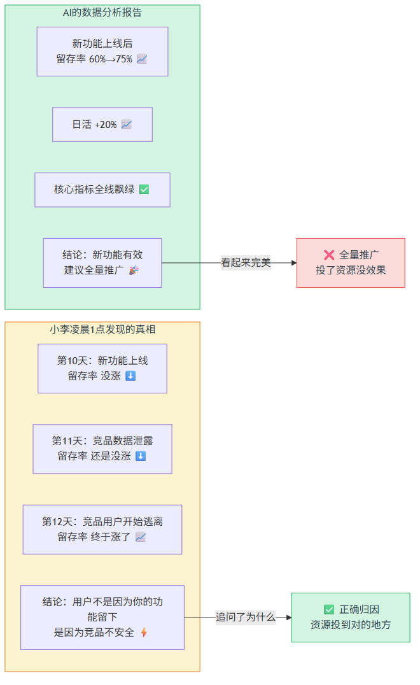

> 图释：左——AI的分析报告：留存率涨了15%，日活+20%，核心指标全线飘绿，结论"新功能有效建议全量推广"——看起来完美。右——小李凌晨1点发现的真相：第10天新功能上线，留存率没涨；第11天竞品出事，还没涨；第12天竞品用户开始逃离，留存率才涨——用户不是因为你的功能留下，是因为竞品不安全。相关不等于因果。

相关不等于因果。AI能发现"碰巧一起"，但永远分不清谁导致了谁。

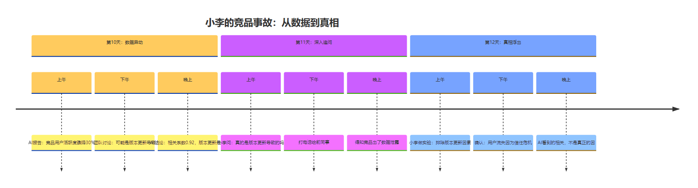

> 图释：小李从AI的"高度正相关"结论出发，通过追问为什么，一步步找到真正的因——竞品出事导致用户转移，而非新功能导致留存上涨。

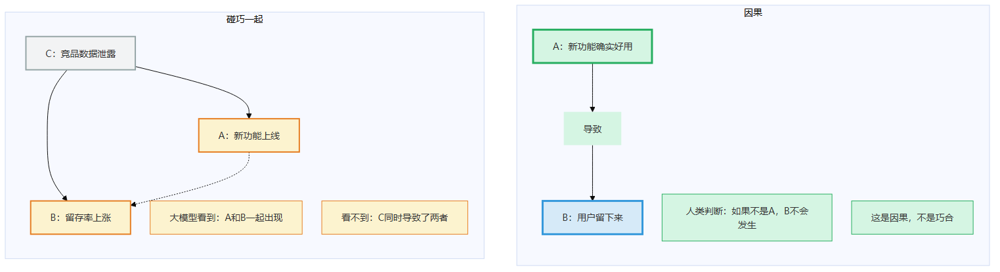

> 图释：左图——碰巧一起：新功能上线和留存率上涨同时发生，但谁也没导致谁；真正的原因是隐藏的C（竞品出事）。右图——因果：A确实导致了B，不是因为C。大模型能完美发现"左图"，但分不清哪个是哪个。

---

我听完这个故事的时候，想起了一件更离谱的事。

去年有个研究团队用大模型分析医疗数据，发现"接受手术的患者存活率比未接受手术的患者低"。模型得出结论：手术可能有害。

研究团队差点发了一篇"手术有害"的论文。幸好有个老医生看了一眼，说："不是手术有害，是病情严重的才被拉去手术。"

**相关不等于因果。而且这件事，给AI再多数据也过不去。**

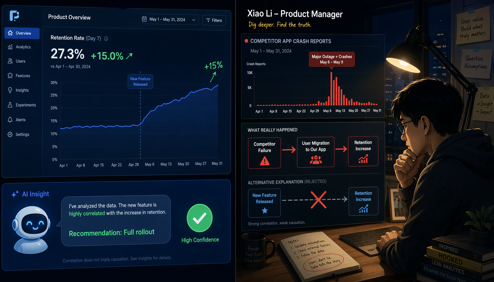

> 图释：左——公鸡打鸣和太阳升起高度相关，但公鸡不是日出的原因。右——地球自转才是日出的真正原因。AI能完美发现"公鸡打鸣时太阳就升起了"这个规律，但永远分不清哪个是原因、哪个只是碰巧一起出现。

---

## 论证：为什么大模型做不到

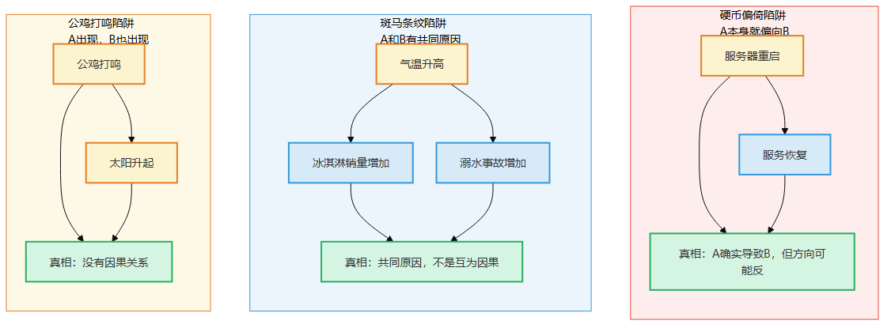

> 图释：三种"碰巧一起"的陷阱——公鸡打鸣（无因果）、斑马条纹（共同原因）、硬币偏倚（方向可能反）。大模型看到的都是"一起出现"，但三种情况的本质完全不同。

让我回到核心问题：为什么大模型分不清"一起出现"和"一个导致了另一个"？

答案在第3章已经给了——**大模型只会找规律，不会问为什么。**

但"问为什么"到底是什么能力？为什么AI做不到？

---

### 逻辑链：从命门到你的能力

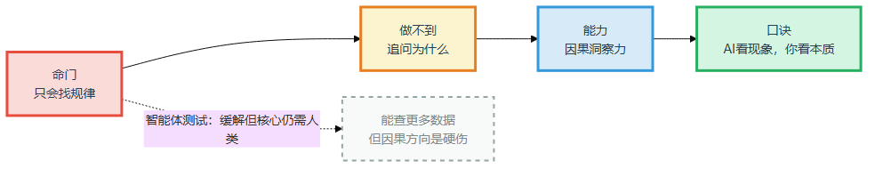

> 图释：命门二（只会找规律）→ 做不到（追问为什么）→ 你的能力（因果洞察力）→ 补位口诀（AI看现象，你看本质）。智能体测试：缓解但核心仍需人类。

---

### 从"一起出现"到"谁导致了谁"

大模型看到两个现象A和B同时出现，它能做什么？

它能算出A和B的相关性。如果A出现100次，B出现了98次，它会认为A和B"高度相关"。如果A出现100次，B只出现了5次，它会认为A和B"弱相关"。

但它能回答这个问题吗——**"如果当时A没有发生，B还会发生吗？"**

这就是因果判断的核心。不是"A和B一起出现了多少次"，而是"A是不是B发生的必要条件"。

第3章讲过一个比方：公鸡打鸣和太阳升起高度相关。大模型学会了这个规律——公鸡叫了，天就亮了。但它不知道真正的原因是地球自转。如果公鸡生病了不叫，太阳照样升起。

**相关性的世界：数据越多，规律越强。因果的世界：数据再多，如果不做实验，永远不知道原因。**

这里有三类"碰巧一起"的陷阱，每一种都足够让人栽跟头——

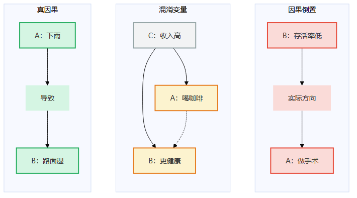

> 图释：左——真因果：A确实导致了B（下雨→路面湿）。中——混淆变量：C同时导致了A和B，A和B只是碰巧一起出现（收入高→既喝咖啡又更健康）。右——因果倒置：B其实导致了A（病情严重→做手术，而非做手术→存活率低）。大模型看不出三者的区别。

---

### "如果当时不这样"——人类独有的能力

你可能会问：那大模型就不能"假设"一下吗？我告诉它"假设竞品没有出事"，它不能推断出"留存率就不会涨"吗？

它能。但你注意到没有——**这个"假设"是你告诉它的。**

大模型不会自己问"如果当时不这样怎么办"。你给它什么假设，它就沿着什么假设推理。它不会自己想出"竞品出事"这个隐藏变量。

**因果推理的本质是"干预"——改变一个变量，看另一个变量变不变。**

人类做这件事有两种方式：

1. **做实验**：A/B测试、对照组、随机分组。改变A，看B变不变。
2. **用先验知识**："竞品出事会让用户流失到对手"——这不是数据告诉你的，是你从行业常识里知道的。

大模型的问题是：**它不做实验，也没有先验知识。** 它的"知识"是统计规律，不是因果理解。

---

### "等等，"你可能说，"那智能体呢？"

好问题。

如果智能体能调用搜索工具、查竞品动态、甚至做A/B测试，它不就也能发现"真正的原因是竞品出事"了吗？

**答案是：工具能找数据，但因果方向仍需人判断。**

智能体可以查到"友圈在第11天出了数据泄露"，这个信息确实重要。但查到之后呢？它怎么知道"竞品出事"和"留存率上升"之间是因果关系，而不是另一个"碰巧一起"？

假设智能体查到：竞品出事那天，留存率确实开始涨了。但这仍然是相关性——竞品出事那天恰好也是某个节假日呢？用户本来就比平时活跃呢？

**每个新变量都是新的"碰巧一起"陷阱。** 智能体能无限挖掘数据，但数据不会告诉你因果方向。它需要一个判断根因的人——这个人，只能是人类。

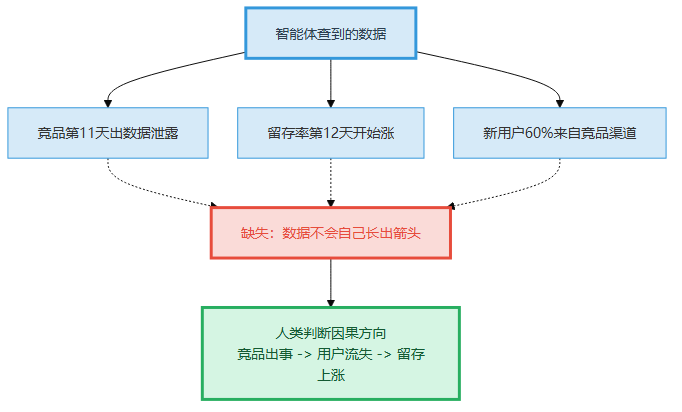

> 图释：智能体能查到"竞品出事"和"留存率上涨"两个事实，但"竞品出事→用户流失到咱们→留存率上涨"这个因果链的箭头方向，需要人类基于行业常识来判断。数据不会自己长出箭头。

---

### 公鸡打鸣的智能体测试

让我用一个更极端的例子说明。

假设你给智能体一个任务："公鸡不叫了，太阳还会升起吗？"

智能体可以搜索到"地球自转导致太阳升起"的知识。它可以回答"会"。

但注意——**这个答案是它"搜到"的，不是它"理解"的。** 如果数据库里没有"地球自转"这个条目，如果某个民间传说认为"太阳是被公鸡叫醒的"，智能体就会给出错误答案。

它没有"太阳升起不需要公鸡"的内在理解。它只是从文本中检索到了"正确的说法"。

**真正的问题不是"智能体能查到正确答案"，而是"答案不在数据库里时，它永远找不到"。**

因果洞察力的核心不是"检索正确答案"，而是"没有现成答案时，判断哪个方向是对的"。这才是人类的价值。

---

## 行动：AI看现象，你看本质

---

### 补位口诀

> **AI看现象，你看本质。**

具体分工：

| 你（人类） | AI |
|-----------|-----|
| 判断"A是否导致了B" | 列出"A和B同时出现的证据" |
| 追问"如果当时不这样" | 生成"可能的假设列表" |
| 验证因果方向（做实验/查时间线） | 计算相关性系数、做回归分析 |
| 基于行业常识排除干扰项 | 检索相关文献和数据 |

**关键决策点：当AI告诉你"A和B高度相关"时，不要停。问第三个问题："如果当时A没有发生，B还会发生吗？"**

---

### 方式A vs 方式B

**方式A：让AI分析"新功能和留存率的关系"**

AI输出：
- "新功能上线与留存率上涨相关系数0.87"
- "建议全量推广"
- "预测全量推广后留存率可达80%"

你信了这个结论，全量推广。三个月后竞品修复了安全问题，留存率跌回58%。你花了三个月资源做了一个"竞品出事时的临时替代方案"，而不是真正留住用户的价值。

**方式B：你先问三个"为什么"，再让AI验证**

你的三层追问：

**第一层：新功能真的好吗？**
- 看数据：留存率确实涨了
- 但问：是从哪天开始涨的？——第12天，不是第10天（上线日）
- AI验证：计算第10-11天和第12天后的留存率变化——发现第10-11天留存率还跌了0.3%

**第二层：有没有其他变量？**
- 你的假设：竞品可能出事了
- AI验证：搜索竞品动态——发现第11天确实出了数据泄露
- 再追问：竞品出事是不是唯一变量？——有没有其他同时发生的事？
- AI验证：列出同期所有可能影响留存的事件（节假日、推送、活动）

**第三层：排除其他变量后，谁是根因？**
- 你的判断：竞品出事→用户流失到咱们→留存率上涨
- AI验证：按"是否来自竞品"分群看留存——发现新注册用户中60%来自竞品渠道

结论：留存率上涨的真正原因是竞品事故，不是新功能。新功能只是"刚好在那里"。

**两种方式的对比：**

| | 方式A（让AI自己分析） | 方式B（你追问+AI验证） |
|---|----------------------|------------------------|
| 时间 | 10分钟 | 1小时 |
| 结论 | "新功能好，推广" | "根因在竞品，新功能效果待验证" |
| 风险 | 三个月后掉回58% | 避免了一次错误决策 |
| 关键差异 | AI做了判断 | 你做了判断，AI做了验证 |

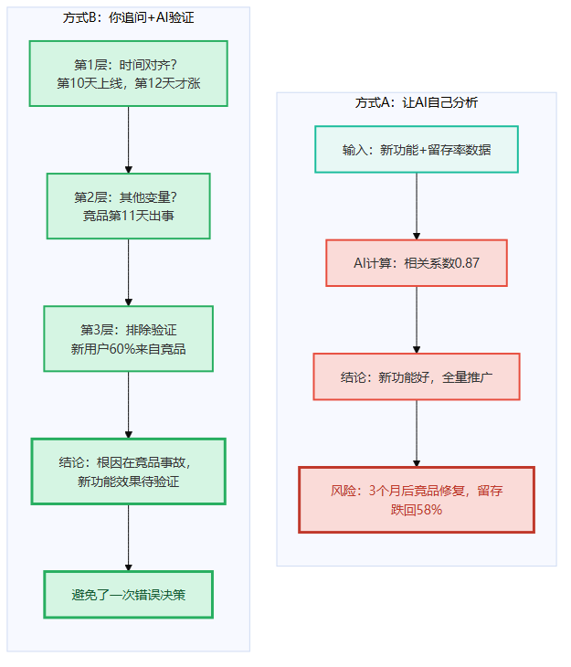

> 图释：方式A——AI列相关数据→做回归→得出"新功能导致留存率上涨"的结论→你直接采纳。方式B——你先问三层为什么→AI帮你验证每个假设→你判断根因→再决定要不要推广。

---

### 经验阶梯：三层为什么追问法

怎么练出"一眼看穿因果"的能力？

**第1级：照着做（1-2周）**

拿到AI的分析结论时，强制追问三层"为什么"：

- 第一层：**这个现象是从什么时候开始的？** 如果原因A发生在第10天，但效果B是从第12天开始的，中间那两天发生了什么？
- 第二层：**有没有同时发生的其他事？** 列出所有可能变量，不要只盯着最明显的那个。
- 第三层：**如果排除其他变量，剩下的解释还成立吗？** 这是"如果当时不这样"的实战版。

**工具：三层为什么追问法模板**

```
现象：___________
第一层（时间对齐）：
  原因A发生时间：____
  效果B出现时间：____
  差距：____ → 说明什么？____

第二层（变量排查）：
  同时发生的事：1.____ 2.____ 3.____
  哪个最可能？____

第三层（排除验证）：
  如果排除其他变量，根因是否成立？____
  需要验证的方式：____
```

**第2级：改着做（1-3月）**

经过5-10次实战后，你会形成自己的"因果雷达"。

- 看到"使用新功能的用户留存更高"，你的第一反应不再是"功能好"，而是"这些用户是不是本来就更容易留下来？"
- 看到"代码提交量越大，Bug越多"，你会想"是因为写得多所以Bug多，还是因为项目紧所以写得多、Bug也多？"

**关键转折点：当"相关≠因果"成为你的本能反应，而不是需要提醒自己的规则。**

**第3级：想着做（3月+）**

到了这个阶段，你不需要模板了。看到一个数据，30秒内就能指出"这里可能是因果倒置"或"这里可能有隐藏变量"。

**飞轮：追问→验证→写发现→下次更快**

每次追问后，花5分钟写一条"因果发现"："今天我发现XX和YY的相关性可能是ZZ导致的。验证方式是____。"

三个月后，你会积累一本"因果陷阱日志"——比任何AI给你的分析都更有价值，因为它是你亲手验证过的。

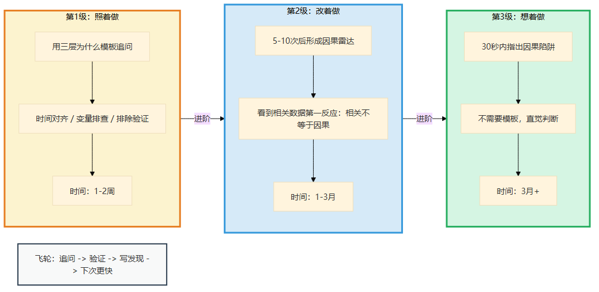

> 图释：第1级照着做（用模板问三层为什么）→ 第2级改着做（形成因果雷达，5-10次后定型）→ 第3级想着做（30秒内指出因果陷阱）→ 飞轮：追问→验证→写发现→下次更快。

---

### 常见坑

**坑1：停在第一层**

你问了"这个现象是什么时候开始的"，发现时间对不上，但你没继续追问第二层。结果漏掉了真正的根因。

**坑2：不验证**

你猜到了"可能是竞品出事"，但你没去验证。"猜测"不等于"判断"——判断必须经过验证。

**坑3：漏掉互为因果**

有时候A导致B，B又反过来强化A。比如"用户越多→内容越多→用户更多"。这种互为因果的循环，单问"谁导致了谁"不够，需要看"哪个是启动点"。

---

## 这一章对你意味着什么

如果你只记住一句话：**AI告诉你"A和B一起出现了"，你要问的是"A导致了B，还是B导致了A，还是C同时导致了A和B"。**

AI不会自动问这个问题。你必须亲自问。

---

## 一页纸总结

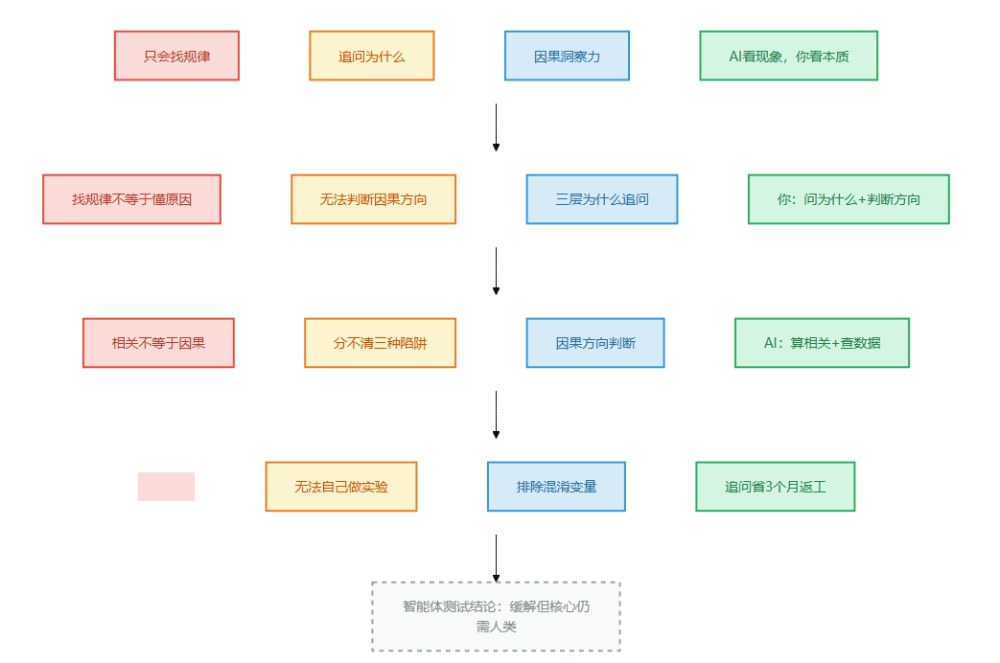

> 图释：命门二（只会找规律）→ 追问为什么（做不到）→ 因果洞察力（你的能力）→ "AI看现象，你看本质"（补位口诀）。智能体测试结论：缓解但核心仍需人类——工具能查数据，但因果方向需人判断。

### 四格卡片

| 命门 | 做不到 | 能力 | 口诀 |
|------|--------|------|------|
| 只会找规律 | 追问为什么 | 因果洞察力 | AI看现象，你看本质 |

### 智能体测试

- 智能体能查到"竞品出事"的事实，但"竞品出事→留存率上涨"的因果方向需要人类判断。
- 数据不会自己长出箭头。箭头是人类的判断。

### 今天就能开始

下次AI给你一个"A和B高度相关"的结论时，问这三个问题：
1. 时间对得上吗？
2. 有没有其他同时发生的事？
3. 如果排除其他变量，这个解释还成立吗？

---

> **🧩 "因果方向"四步排查法**
>
> 看到"因为A所以B"时，别照单全收。四步走完才敢说"因果"：
>
> 1. **时间对齐** ——A先于B吗？上线新功能（A）→留存率涨（B），时间对得上吗？有没有可能留存率在新功能之前就开始涨了？
> 2. **变量排查** ——还有没有同时发生的C？新功能上线那天，竞品是不是也出了故障？
> 3. **反事实** ——如果A没有发生，B还会发生吗？如果没上新功能，留存率还会涨吗？（这就是方姐问的"Redis先慢还是连接池先耗尽"）
> 4. **找反例** ——有没有A发生了但B没变的案例？有没有上了类似功能但留存没涨的历史？
>
> 走完四步还能站住的，才是因果，不是碰巧。

**下一章预告：靠手感判断——为什么大模型永远"听"不出机房里的异响？**
