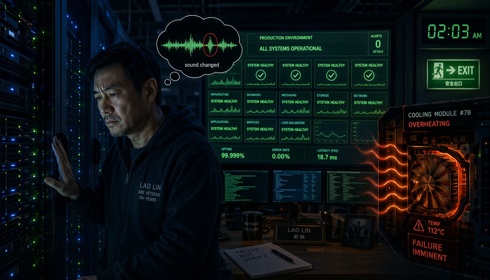
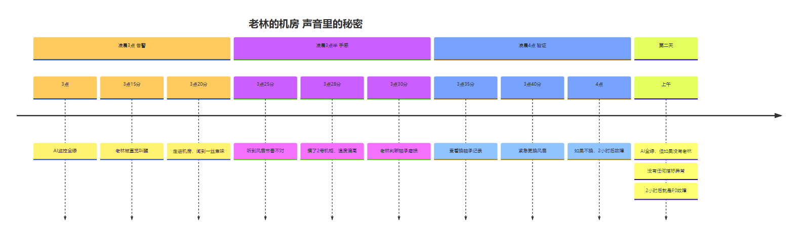
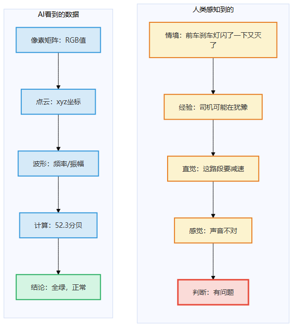
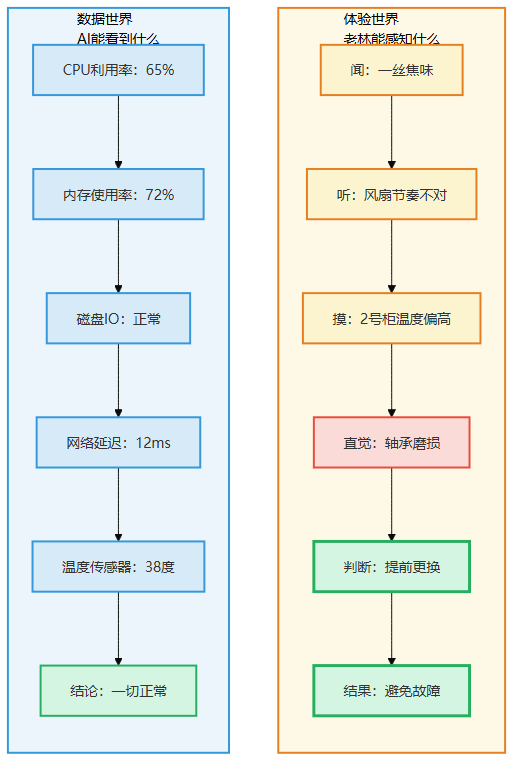
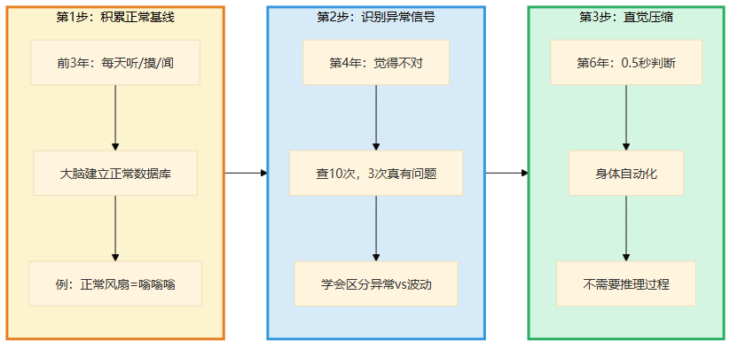
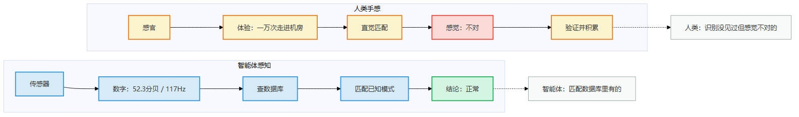
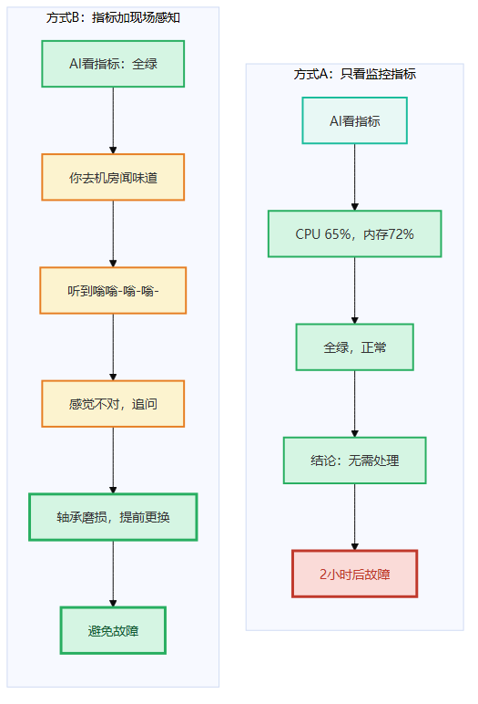
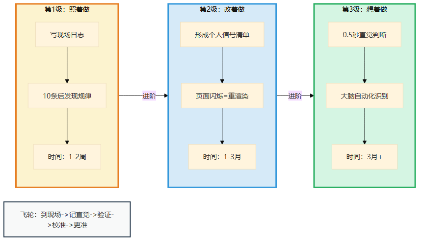
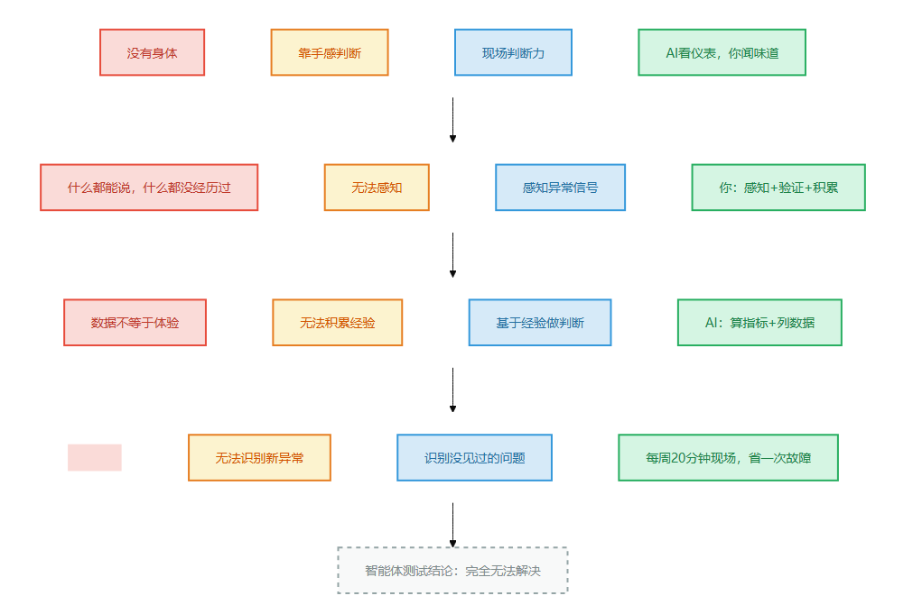

# 第7章 靠手感判断

> 📍 本章位置：命门三（没有身体）→ 第三件做不到的事 → 现场判断力

---

## 场景：那台服务器的味道不对

上一章我们跟着小李追问了一个"为什么"——相关不等于因果，数据能骗人。但还有一种情况比"数据骗人"更棘手：数据没骗人，数据就是正常，但你的直觉告诉你"不对劲"。

还记得第4章大刘的故事吗？他闭着眼听出服务器不对。那是命门三的第一道裂缝——没有手感。这一章我们进入裂缝的深处：为什么监控面板全绿的时候，人还是能发现问题？这种"手感"到底是什么？

老林在我们公司干了十二年运维。不是SRE，不是DevOps工程师——是"机房运维"。用他自己的话说，"每天闻着服务器味的人"。

前年双十一前一天晚上，监控系统一切正常。CPU使用率65%，内存占用72%，磁盘IO在正常范围。全绿的。

凌晨两点，老林在值班室醒了。不是被警报吵醒的——监控没响。他是被一种感觉叫醒的。

"不对劲。"他说。

值班室的电脑显示一切正常。老林走出值班室，穿过走廊，走进机房。

机房里几百台服务器嗡嗡作响。温度传感器显示23.5度，在正常范围内。没有警报。

老林走到第三排机柜前，站了半分钟。然后他转头对值班的小张说："去准备冷风机，把功率调到最大。"

小张一愣："监控显示温度正常啊。"

"不是温度。"老林说，"是声音不对。"

小张竖起耳朵——对他来说，机房里所有服务器声音都一样，嗡嗡嗡。

老林说："第三排的风扇转速没变，但声音变闷了。以前嗡嗡嗡的，现在嗡嗡——嗡——嗡——。中间有间隔。"

二十分钟后，那排机柜的散热系统故障了。如果老林没发现，再过两小时，那排服务器温度飙升到警戒线以上，触发自动关机——双十一当天的核心交易链路全部中断。

**老林不是靠监控发现问题的——他是靠"闻"出来的——不是闻气味，是"闻"声音。**



> 图释：凌晨3点——监控面板全绿，CPU正常、内存正常、磁盘IO正常，没有任何告警。但老林走进机房，站了半分钟，听到风扇声音变闷了——从嗡嗡嗡变成嗡-嗡-嗡，中间有间隔。20分钟后散热系统故障，如果没发现，2小时后P0事故——双十一核心链路中断。面板说没问题，手感说有问题。



> 图释：老林凌晨3点被直觉叫醒的完整时间线——AI监控全绿，但老林通过闻焦味、听风扇节奏、摸机柜温度，提前发现并避免了P0故障。

---

我听完这个故事的时候，想起了一件事。

前年我自己带一个项目，做用户系统重构。一切按计划推进——代码走查、单元测试、集成测试，全部通过。上线那天，我打开浏览器，登录了新系统。

页面加载了。我输入密码，点登录。又弹回登录页。

旁边的小李说："可能是密码错了，再试一次。"

我试了一次。还是弹回。

我盯着屏幕看了五秒钟。然后说："不是密码的问题。是浏览器自动填充了新密码，旧密码缓存还在。这会导致会话状态异常。"

小李去查日志，果然——会话状态确实有问题。不是代码bug，是浏览器行为导致的边缘情况。

但关键问题是：我凭什么在五秒钟内判断出问题不是密码，而是会话状态？

我没有看日志。我没有查代码。我就是"感觉"到了。

这种"感觉"，不是玄学。是几百次上线、几十次回滚、无数次"这个页面感觉不对"之后的压缩。

**大模型永远听不出"嗡嗡——嗡——嗡——"和"嗡嗡嗡"的区别。**

---

## 论证：为什么大模型做不到

---

### "手感"不是知识，是体验

第4章讲过"知道烫"和"被烫过"的区别。第7章要深入一个更具体的问题：**"手感"是怎么来的？**

大模型能背下机房的温度范围、CPU正常阈值、风扇转速标准。它可以告诉你"CPU温度超过85度是警戒线"。

但它永远说不出"嗡嗡——嗡——嗡——"意味着什么。

为什么？

因为"嗡嗡——嗡——嗡——"不是数据。它不是分贝数，不是频率，不是波形。**它是"正常的嗡嗡嗡和现在的嗡嗡——嗡——嗡——不一样"这个判断。**

这个判断需要两个东西，大模型都没有：

1. **"正常是什么样的"的体验**——你听过一万次正常的风扇声，"正常"刻在你的耳朵里了。
2. **"现在的不一样"的感知**——你不需要分析频率偏移了多少，你的身体已经告诉你"不对"。

大模型没有耳朵，没有身体，没有"一万次走进机房"的体验。它的"知识"是文字——"风扇正常转速为XXXX RPM"——文字和体验之间隔着一条永远跨不过的河。

---

### 自动驾驶的长尾困境

"等等，"你可能说，"自动驾驶也能'感知'路况啊。它有摄像头、有雷达、有激光雷达，它能看到人类看不到的东西。"

对。但它看到的是什么？

是**数据**。是像素矩阵、是点云、是距离读数。

人类司机看到的是什么？

是**情境**。是"前面那辆车刹车灯闪了一下又灭了，司机在犹豫"——这个判断不是基于"刹车灯亮度变化"的数据分析，而是基于"我开车的时候也有过这种犹豫"的**共情**。

是"前面路边站着一群穿校服的孩子，我要减速"——这个判断不是基于"检测到行人"的目标识别，而是基于"我知道小孩子会突然冲出来"的**经验**。

自动驾驶最头疼的"长尾场景"是什么？不是"识别不了行人"——行人很好识别。是"这个场景我从来没见过，我不知道该怎么办"。

比如：一辆卡车翻倒在高速公路上，货物撒了一地——不是常见的货物，是五颜六色的塑料球，滚得到处都是。

人类司机会怎么做？减速、观察、判断哪些球会滚到车道上、选择绕行路线。这个过程不超过三秒钟。

自动驾驶会怎么做？先分析——这是什么东西？塑料球？没见过。它们的运动轨迹是什么？不确定。然后它就僵住了。

**不是因为算法不够好，是因为它没见过。**

见过，不是"数据库里有塑料球的照片"。见过，是"小时候在游乐场玩过海洋球，知道它们会怎么滚"。

大模型没有"小时候"，没有"游乐场"，没有"玩过"。



> 图释：左图——AI看到的数据：像素矩阵、点云、频率波形。右图——人类感知到的：情境、经验、直觉。数据可以被计算，但"这个感觉不对"需要体验。



> 图释：左边——AI的数据世界：CPU 65%、内存72%、温度38度，一切正常。右边——老林的体验世界：闻到焦味、听到风扇节奏不对、摸到温度偏高，结论是轴承磨损。两条路径得出完全不同的判断。

---

### "手感"是怎么炼成的

老林的"听风扇"不是天生的。是十二年、几千次值班、无数次"听到不对→查→果然有问题"的循环压缩出来的。

这个过程可以拆解成三步：

**第一步：积累正常基线**

前三年，老林每天去机房转一圈。他听风扇、摸服务器、闻空气。但他不知道自己为什么要这么做——他只是"多看看"。

慢慢地，他的大脑建立了一个"正常数据库"：正常的时候，风扇是这种嗡嗡声；正常的时候，服务器面板是这种温度；正常的时候，空气里有这种味道。

**第二步：识别异常信号**

第四年开始，他能听出"有点不一样"了。但这时候他还说不出哪里不一样——他只是"觉得不对"。

他去查，十次有三次确实有异常（虽然监控还没报警）。另外七次是正常的波动。他慢慢学会了区分"真的不对"和"正常的波动"。

**第三步：直觉压缩**

第六年以后，他不需要"先觉得不对再验证"了——他的身体已经替他做了判断。听到声音，0.5秒就知道有问题。这个0.5秒不是推理过程，是**模式匹配的自动化**。

这和AlphaGo的直觉有点像——但区别在于，AlphaGo的直觉来自"下了一百万盘棋"的数据训练。老林的直觉来自"一万次走进机房"的身体体验。

**数据训练的直觉 = 统计模式匹配。**
**身体体验的直觉 = 经验压缩 + 感知自动化。**

大模型可以模拟前者，永远无法获得后者。



> 图释：积累正常基线（前3年：每天听、摸、闻）→ 识别异常信号（第4年：十次有三次真有问题）→ 直觉压缩（第6年：0.5秒判断，身体自动化）。大模型能模仿第三步的"输出"，但没有前两步的"身体体验"。

---

### "那智能体呢？"

智能体能装传感器。它能"听"到风扇声——分贝、频率、波形，比老林精确一千倍。

但它听到的不是"声音"。它听到的是**数字**。

分贝：52.3 → 52.7 → 52.5 → 52.8
频率：120Hz → 118Hz → 121Hz → 117Hz

智能体能识别"频率偏移了3Hz"。但"3Hz偏移意味着什么"？

轴承磨损？灰尘积累？电压不稳？安装松动？

**这个判断，需要"一万次走进机房验证"的经验。** 智能体没有走进过机房。它只是在数据库里检索"频率偏移3Hz对应什么故障"。

但如果这个故障模式从来没被记录过呢？如果"频率偏移3Hz + 声音变闷"这个组合模式不在数据库里呢？

智能体就看不出来了。

老林不一样。他不需要查数据库——他的身体已经替他做了判断。

**智能体的"感知"是数据驱动的。人类的"手感"是经验驱动的。**

数据驱动的感知：识别数据库里有的模式。
经验驱动的感知：识别"似曾相识"的感觉——即使从来没有被命名过。



> 图释：智能体传感器→数字→查数据库→匹配已知模式→输出结论。人类感官→体验→直觉匹配→"感觉不对"→验证→积累。智能体能匹配数据库里有的，人类能识别"从来没见过但感觉不对"的。

---

## 行动：AI看仪表，你闻味道

---

### 补位口诀

> **AI看仪表，你闻味道。**

具体分工：

| 你（人类） | AI |
|-----------|-----|
| 感知"这个页面感觉不对" | 分析页面加载时间、DOM树结构 |
| 判断"这段代码有味道" | 检查代码规范、复杂度指标 |
| 在会议中察觉"对方犹豫了" | 转录会议文字、提取关键词 |
| 凭直觉选择"先查这里" | 列出所有可能的故障点按概率排序 |

**关键决策点：当AI告诉你"所有指标正常"但你"感觉不对"时，相信你的感觉。**

---

### 方式A vs 方式B

**方式A：只看监控指标**

监控显示：CPU 65%，内存72%，磁盘IO正常。没有警报。

AI结论："系统健康，无需处理。"

你信了。两小时后，散热系统故障，服务器关机，双十一中断。

**方式B：指标 + 现场感知**

监控显示一切正常。但你每周去机房一次——不是为了修什么，就是"转转"。

这一次你走进机房，站在第三排机柜前。你听到了"嗡嗡——嗡——嗡——"。

监控没说有问题。但你的感觉说："不对。"

你查了风扇日志——没有异常。你查了温度——正常。你查了所有指标——全绿。

但你没有走。你蹲下来，把耳朵凑近服务器。你听了一分钟。

然后你打电话给供应商："第三排的风扇，轴承是不是该换了？"

供应商查了一下："这批风扇的设计寿命是六年，你们正好用了六年零三个月。"

**两种方式的区别：方式A=指标正常=一切正常。方式B=指标正常+感觉不对=可能有问题。**

方式B让你避免了一次故障，但方式B的成本是：你每周花二十分钟去机房"转转"。

这二十分钟，AI永远花不了——因为AI没法"转转"。



> 图释：方式A——AI看指标→全绿→结论：正常。方式B——AI看指标→全绿→但你到现场"闻味道"→感觉不对→追问→发现轴承磨损→避免故障。

---

### 经验阶梯：现场日志法

怎么练出"一听就知道有问题"的直觉？

**第1级：照着做（1-2周）**

每次你"感觉不对"的时候，强制自己记录一条"现场日志"：

```
日期：___________
场景：___________（机房/线上环境/会议室/...）
感觉：___________（声音不对/页面卡/对方语气变了/...）
验证结果：___________（确实有问题 / 正常波动 / 不确定）
如果错了，原因：___________
```

**关键动作：写下来。**

直觉最大的敌人是"懒"——你觉得"反正也不确定，算了"。写下来逼你验证。

写10条之后，你会开始发现规律："原来我'觉得不对'的时候，60%确实有问题。"

**第2级：改着做（1-3月）**

20条之后，你会形成自己的"信号清单"。

- 线上环境：页面加载后"闪烁了一下"→可能是DOM重渲染
- 代码走查：看到全局变量→可能是并发问题
- 会议中：对方说"技术上没问题"但停顿了两秒→可能有隐藏风险

这些信号不需要科学依据——它们是**你的个人经验压缩**。只要验证命中率够高，就是有效的直觉。

**关键转折点：当"感觉不对"从"模糊的担心"变成"具体的信号"时。**

**第3级：想着做（3月+）**

100条之后，你不需要模板了。

你走进机房，0.5秒就知道"不对"。你打开代码，扫一眼就知道"这里有味道"。你开会，听第一句话就知道"这个人有顾虑"。

这个直觉不是"猜"——是大脑自动化的模式识别。你意识不到过程，但结果就在那里。

**飞轮：到现场→记直觉→验证→校准→下次更准**

每次验证，不管对错，都花两分钟写一条记录。三个月后，你会有一本"我的个人信号手册"——比任何AI给你的诊断都更准，因为它是你的手感。



> 图释：第1级照着做（写现场日志，10条发现规律）→ 第2级改着做（形成个人信号清单）→ 第3级想着做（0.5秒直觉判断）→ 飞轮：到现场→记直觉→验证→校准→更准。

---

### 常见坑

**坑1：把"感觉"当"事实"**

你说"我感觉不对"，但不验证。结果十次有九次是错的。直觉不靠谱，验证过的直觉才靠谱——这就是"手感"和"猜测"的区别。

**坑2：只记对的，不记错的**

你感觉对了的时候很高兴，写下来。感觉错了的时候不好意思，不写。这样你的"信号手册"全是成功案例，命中率虚高。

**坑3：不去现场**

远程办公很方便，但"手感"只能到现场练。你不去机房，永远听不到风扇声。你不去用户现场，永远不知道"他们其实不会用那个按钮"。

---

## 这一章对你意味着什么

如果你只记住一句话：**当AI告诉你"一切正常"但你"感觉不对"时，相信你的感觉——然后去验证。**

AI没有"感觉"。你有。

---

## 一页纸总结



> 图释：命门三（没有身体）→ 靠手感判断（做不到）→ 现场判断力（你的能力）→ "AI看仪表，你闻味道"（补位口诀）。智能体测试结论：完全无法解决——传感器给的是数字，不是体验。

### 四格卡片

| 命门 | 做不到 | 能力 | 口诀 |
|------|--------|------|------|
| 没有身体 | 靠手感判断 | 现场判断力 | AI看仪表，你闻味道 |

### 智能体测试

- 智能体能装传感器，但它"感知"到的是数字，不是体验。
- "频率偏移3Hz"是数据，"声音不对"是体验。数据能被计算，体验只能被经历。

### 今天就能开始

下次你"感觉不对"的时候——不要忽略它。花两分钟写下来，然后验证。对或错，都是你的数据。

> **📝 "我的信号清单"模板**
>
> "手感"太抽象？把它拆解成具体信号。基于你的现场日志，填这张表：
>
> | 我判断对了的时候 | 共同信号是什么？ | 我判断错了的时候 | 归因偏差是什么？ | 我最准的感知通道 |
> |-----------------|----------------|-----------------|-----------------|----------------|
> | 例：提前发现数据库慢查询 | IO延迟曲线有微妙翘头 | 例：误判为网络抖动 | 只看了监控没听声音 | 听觉（风扇/磁盘声） |
> | | | | | |
> | | | | | |
>
> 填完你会发现：手感不是玄学——是"特定信号→特定判断"的压缩。把信号说清楚了，手感就能校准了。

---

**下一章预告：为决定负责——为什么AI永远不可能替你坐牢？**
