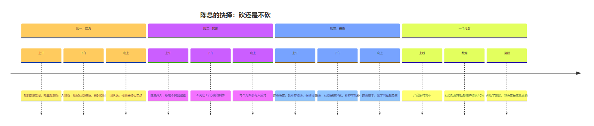
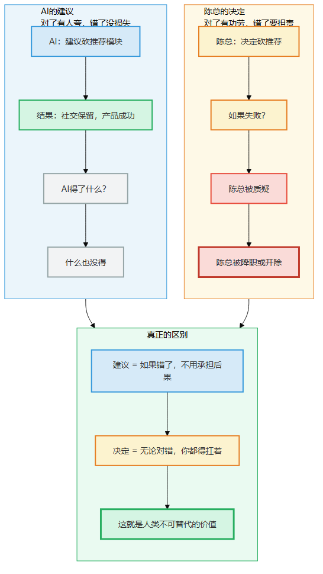
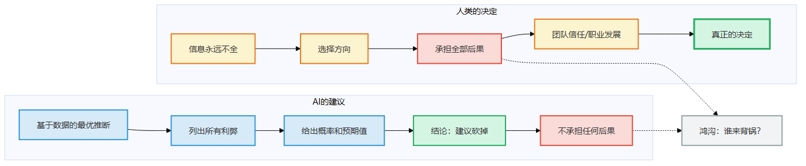
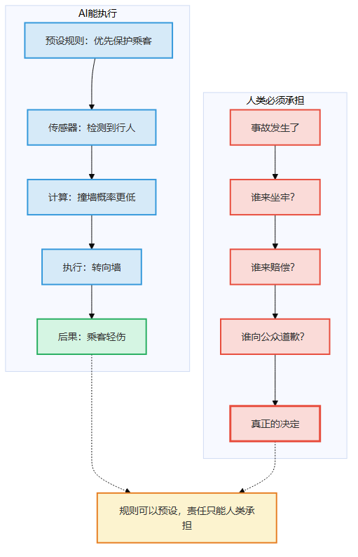
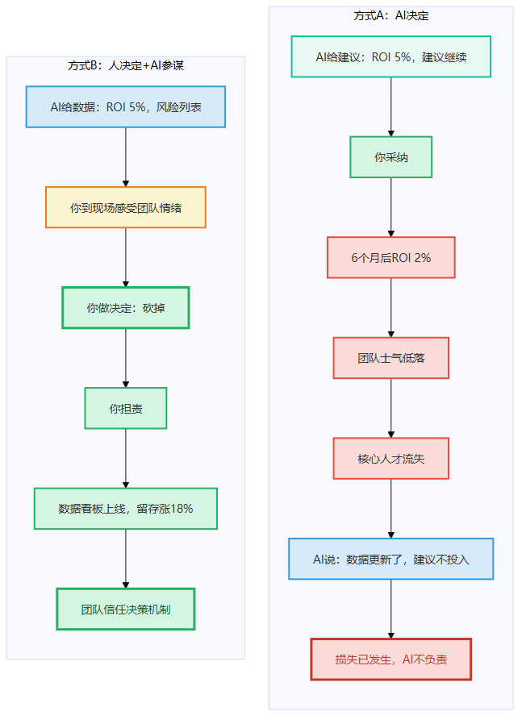
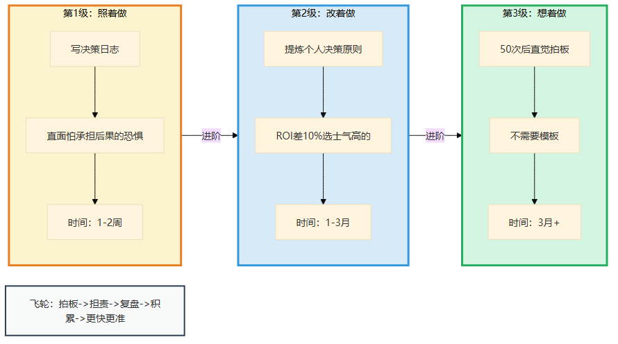
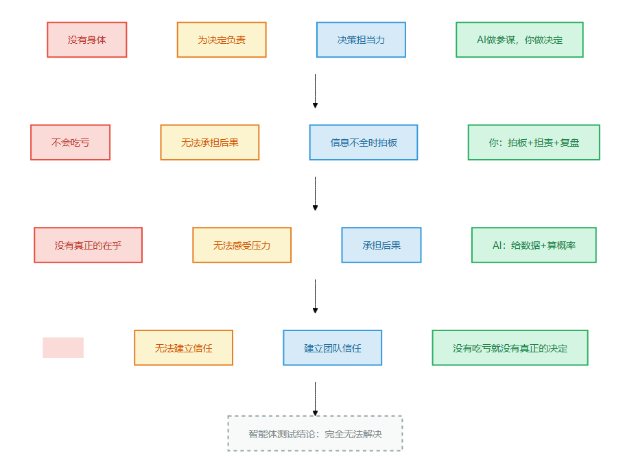

# 第8章 为决定负责

> 📍 本章位置：命门三（没有身体）→ 第四件做不到的事 → 决策担当力

---

## 场景：砍还是不砍？

上一章老林靠手感提前发现了问题——但发现问题和解决问题是两码事。有时候，你不仅需要"闻到不对"，还需要在信息不完整的情况下拍板做决定，并且为这个决定承担后果。

第4章我们讲过命门三的第二道裂缝——"无法负责"。AI判错了不会被吊销执照，也不会因为"吃了亏"而"长记性"。这一章我们看一个真实的决策现场：当你手上的数据指向"再投一点就能好"，你的直觉告诉你"方向错了"——你砍还是不砍？

陈总是一家SaaS公司的技术VP，管着两百人的研发团队。他跟我讲过一件事——

前年，他们公司做了一个新功能：智能文档助手。用户上传文档，AI自动提取摘要、生成目录、推荐相关文档。做了八个月，上线了。

上线三个月后看数据——日活不到5%。用户点了进去，停留不到十秒就退出来。

产品团队出了一份报告：这个功能的问题在于"用户教育成本太高"——用户不知道有这个功能，也不知道怎么用。建议再投入三个月做用户引导和教程。

运营团队出了一份报告：问题出在"推荐算法不够精准"——用户上传文档后，推荐的文档相关性只有30%。建议再投入六个月优化推荐模型。

技术团队出了一份报告：问题出在"性能"——文档解析速度太慢，用户体验差。建议重构底层架构，预计需要四个月。

三个团队，三个方案，都说是"再投一点就能好"。

陈总把三份报告放在桌上，看了整整两天。然后他把技术负责人、产品负责人、运营负责人叫到会议室，说了一句话：

"这个方向错了。我们砍掉它。"

会议室炸了。

产品负责人说："用户教育确实没做好，再给我们三个月——"

陈总说："不是教育的问题。是这个功能本身不值得做。"

运营负责人说："推荐确实不准，但六个月后可以——"

陈总说："不是推荐的问题。是用户根本不想在你们的SaaS里做文档管理。他们有Notion，有飞书，有Confluence。我们做的这个智能文档助手，既不是最好的文档工具，也不是用户最需要的。"

技术负责人没说话。

陈总说："砍掉。资源投到核心功能——数据看板。"

后来？数据看板上线后，用户留存率涨了18%。智能文档助手如果继续投下去，按照陈总的估算，最多日活到15%，但投入产出比根本打不平。

**AI可以分析三份报告里的每一个数据点，但它做不了"砍掉"这个决定。**



> 图释：陈总从接到三份报告、听取AI建议、到最终拍板"砍掉智能文档助手"的完整时间线。AI给出了建议，但决定和后果都是陈总承担的。

---

你可能会问：为什么AI做不了？它不是可以算ROI、做A/B测试、预测用户行为吗？

对。但"砍掉"这个决定，不是算出来的。

**算出来的叫"建议"，拍板的叫"决定"。建议可以撤回，决定只能扛着。**


> 图释：AI说"砍掉"——基于数据分析，ROI是-15%，输出建议。对了有人夸AI聪明，错了AI不担责、不会被开除、不会失眠——重量轻如鸿毛，只是建议。陈总说"砍掉"——三个团队都反对，没人支持，拍板砍。对了有功劳，错了团队士气受挫、投资人质疑、深夜怀疑自己——重量重如泰山，必须扛着。

陈总说了"砍掉"之后，如果三个月后发现判断错了——团队士气受挫、投资人质疑、公司战略被打乱。这些后果，AI不扛。

**AI永远吃不了亏。你让它说"砍掉"，它不会因此少拿年终奖、不会被质疑能力、不会在深夜怀疑自己的判断。**

**没有吃亏，就没有真正的决定。**

---

## 论证：为什么大模型做不到

---

### "建议"和"决定"的区别



> 图释：AI的建议——对了有人夸，错了没损失；陈总的决定——对了有功劳，错了要担责。真正的区别：建议不用承担后果，决定无论对错都得扛着。这就是人类不可替代的价值。

让我把这个区别说得更清楚。

AI可以做的事情：
- 分析三份报告的数据，算出"继续投入"的预期ROI是-15%
- 列出"砍掉"可能导致的5个风险和对应的概率
- 对比竞品的功能矩阵，给出"差异化不足"的结论

AI不能做的事情：
- **为"砍掉"的后果负责**
- **在信息不全的时候说"就这么定了"**
- **在团队反对的时候说"听我的"**

**建议是基于现有信息的"最优推断"。决定是"在信息永远不全的情况下，选择一个方向并承担后果"。**

这两者的差距，不是"信息够不够"的差距。是"谁来背锅"的差距。

---

### AI为什么永远吃不了亏

大模型的本质是一个"只输出不承受"的系统。它生成建议，但永远不会体验到建议的后果。

你问它"应不应该砍掉这个功能"，它可以说"应该"，也可以同时说"不应该"——取决于你怎么问。它不会因此失眠，不会因此被质疑，不会因此职业生涯受挫。

**"吃亏"是身体性的。** 手心出汗、心跳加速、胃在收紧——这些不是"信息处理"，是"这个决定真的影响我"的身体信号。

AI没有身体，所以它永远吃不了亏。没有吃亏，就没有真正在乎。没有真正在乎，就不可能做出真正的决定。

这就像——一个医生可以用AI诊断出"癌症概率90%"，但"要不要告诉病人"这个决定，永远需要人类来做。

因为AI不需要面对病人崩溃的表情，不需要承受"说错了怎么办"的压力，不需要扛起"我改变了一个家庭的命运"这个重量。



> 图释：左图——AI的建议：基于数据的最优推断，不承担后果。右图——人类的决定：在信息不全时选择方向，承担全部后果。两者之间的鸿沟不是信息量，而是"谁来背锅"。

---

### 自动驾驶的道德困境

"等等，"你可能说，"自动驾驶不是要做道德决策吗？比如'撞向行人还是撞向墙'？这不就是AI在做决定吗？"

这是个好问题。答案是：**AI做的不是"决定"，是"预设规则"。**

自动驾驶的"道德算法"——比如"优先保护乘客"或"优先保护行人"——是人类工程师在实验室里预设的。AI只是在执行这个规则。

真正的"决定"发生在什么时候？

是**事故发生后，谁来承担责任**。是汽车厂商？是软件供应商？还是车主？

这个"责任归属"的决定，永远需要人类来做。AI不可能上法庭、不可能赔钱、不可能道歉。

**所有"AI做道德决策"的场景，本质上都是"人类预设规则，AI执行规则"——真正困难的部分永远留给人类。**



> 图释：AI能执行"优先保护乘客"的规则，但"事故发生后谁来坐牢"这个决定，AI做不了。规则可以预设，责任只能人类承担。

---

### "公平"不是数学题

再举一个更贴近现实的例子。

你是一家技术公司的技术负责人，手下有两个高级工程师——小王和老李——都在竞争同一个晋升名额。

小王工作三年，代码能力极强，但沟通能力一般。老李工作八年，技术扎实，带团队有经验。但老李去年休了六个月陪产假。

AI可以分析出：
- 小王的代码提交频率比老李高30%
- 老李的代码review通过率高15%
- 小王负责的模块故障率更低
- 老李带的新人留存率更高

但它回答不了这个问题：**"老李休陪产假这件事，应不应该影响晋升决策？"**

这不是数据能回答的。这是关于"公平"的判断。

如果你认为"陪产假是权利，不应该影响晋升"——你在做一个价值判断。
如果你认为"休了半年假，确实影响了产出"——你也在做一个价值判断。

**AI可以告诉你"两种选择各有什么利弊"，但它不能替你选。** 因为选完之后，你要面对老李失望的眼神，要承受"晋升决策不公"的质疑，要承担"如果老李因此离职"的后果。

AI不承担这些。所以它做不了真正的决定。

---

### "那智能体呢？"

智能体能做什么？它能列出更全面的利弊分析，它能模拟更多场景，它能给出一个"基于期望效用最大化"的建议。

但核心问题没变：**建议再完美，做决定的依然是人。**

智能体可以告诉你"砍掉智能文档助手，预期ROI是-15%；继续投入，预期ROI是5%。"

但"5%的ROI值不值得冒着团队士气受挫的风险"——这个判断，智能体做不了。

为什么？因为"团队士气受挫"不是一个可以量化的变量。它只能被**感受**。

陈总在会议室里感受到的"老李眼神里的失望"、"小王听到结果时的沉默"、"整个团队对管理层决策的信任度"——这些都不是数据，是**现场的情境感知**。

智能体没有在现场。它感受不到。

**智能体能优化"已知变量"，但真正的决策往往卡在"未知变量"上——而未知变量只能靠人在现场感受。**

---

## 行动：AI做参谋，你做决定

---

### 补位口诀

> **AI做参谋，你做决定。**

具体分工：

| 你（人类） | AI |
|-----------|-----|
| 拍板"砍还是不砍" | 分析ROI、列出风险 |
| 承担"砍错了"的后果 | 预测"砍错了"的概率 |
| 在信息不全时说"就这么定了" | 在信息不全时说"需要更多数据" |
| 感受团队士气、信任度 | 计算代码提交频率、故障率 |

**关键决策点：当AI说"数据不足，无法判断"时，就是你必须出马的时候。**

---

### 方式A vs 方式B

**方式A：让AI替你做决定**

场景：AI分析了两份报告，说"建议继续投入智能文档助手，预期ROI 5%"

你采纳了。六个月后，ROI只有2%，团队士气低落，核心人才流失。

AI说："数据更新后重新计算，新的建议是不继续投入。"

但损失已经发生了。AI不会为你的损失负责。

**方式B：AI做参谋，你做决定**

AI分析了两份报告，给出数据："继续投入预期ROI 5%，砍掉预期损失是八个月投入的沉没成本。"

你看了数据，然后走进了团队——不是看报告，是**看人的表情**。你感受到了"老李说'再给我们一次机会'时的语气"、"小王听到'砍掉'时松了一口气的微表情"、"整个会议室里的空气是压抑还是如释重负"。

你回到办公室，做了决定："砍掉。资源转投数据看板。"

三个月后，数据看板上线，留存率涨18%。团队虽然失望，但看到了新方向，士气回升。

**两种方式的对比：**

| | 方式A（AI决定） | 方式B（人决定+AI参谋） |
|---|----------------|------------------------|
| 决定依据 | 数据模型 | 数据+现场感知+直觉 |
| 责任归属 | 模糊（"AI说的"） | 明确（"我做的"） |
| 团队信任 | 低（"听算法的"） | 高（"领导担责"） |
| 结果 | 失败后可甩锅给AI | 失败后需自己承担 |
| 长期影响 | 团队不信任决策机制 | 团队知道"有人会拍板" |



> 图释：方式A——AI给数据→AI做建议→你采纳→AI不担责→失败没处说理。方式B——AI给数据→你到现场感受→你做决定→你担责→团队知道"有人会拍板"。

---

### 经验阶梯：决策日志

怎么练出"信息不全也敢拍板"的担当力？

**第1级：照着做（1-2周）**

每次做重要决定时，强制写一条"决策日志"：

```
日期：___________
决定：___________（砍掉/继续/选A/选B）
当时信息完整度：____%（诚实评估）
反对意见：___________
我选择这个方向的原因是：___________
如果错了，最坏结果：___________
我能承受最坏结果吗：是/否
```

**关键动作：写下来。**

写10条之后，你会发现一个规律——**大多数"不敢拍板"不是因为信息不够，而是因为"怕承担后果"**。写出来逼你面对这个恐惧。

**第2级：改着做（1-3月）**

10条之后，你会开始提炼自己的"决策原则"。

比如：
- "当两个选项的ROI差距不到10%时，选团队士气更高的"
- "当团队80%的人都反对时，除非我有极强的数据支撑，否则不硬推"
- "做决定的截止时间比信息完整度更重要——到了时间就拍板"

这些原则不是书里学来的，是**你自己拍板-验证-复盘**之后长出来的。

**关键转折点：当"决策原则"从"别人的建议"变成"自己的信条"时。**

**第3级：想着做（3月+）**

50条之后，你不需要模板了。

你走进会议室，听大家吵完，心里已经有数了。不是"算出来的"——是"感觉出来的"。但这个"感觉"不是猜，是你50次拍板经验的压缩。

**飞轮：拍板→担责→复盘→原则积累→下次更快更准**

每次决定后，不管对错，都花10分钟复盘："我当时的判断依据是什么？如果重来，我会不会做得不一样？"三个月后，你会有一本"我的决策手册"——比任何MBA案例都更有价值。



> 图释：第1级照着做（写决策日志，直面"怕承担后果"的恐惧）→ 第2级改着做（提炼个人决策原则）→ 第3级想着做（50次后直觉拍板）→ 飞轮：拍板→担责→复盘→积累→更快更准。

---

### 常见坑

**坑1：不记原因**

你做了决定，但没记下来"为什么"。三个月后结果出来了——对了不知道对在哪，错了不知道错在哪。没有积累。

**坑2：事后合理化**

结果好了，你往自己脸上贴金——"我当时就看出趋势了"。结果差了，你归咎于"数据不够"——从不承认自己判断有误。

**坑3：不敢拍板**

信息永远不够。等"足够"的时候，机会早没了。决策力的核心不是"在完美信息下做最优选择"，是"在不完美信息下选一个方向并承担后果"。

---

## 这一章对你意味着什么

如果你只记住一句话：**AI可以给你建议，但只有你能说"就这么定了"——并承担后果。**

**没有吃亏，就没有真正的决定。**

---

## 一页纸总结



> 图释：命门三（没有身体）→ 为决定负责（做不到）→ 决策担当力（你的能力）→ "AI做参谋，你做决定"（补位口诀）。智能体测试结论：完全无法解决——AI没有"吃亏"的能力，没有身体就没有真正的在乎。

### 四格卡片

| 命门 | 做不到 | 能力 | 口诀 |
|------|--------|------|------|
| 没有身体 | 为决定负责 | 决策担当力 | AI做参谋，你做决定 |

### 智能体测试

- 智能体能给出最优建议，但"谁来背锅"永远需要人类。
- 没有吃亏，就没有真正的决定。

### 今天就能开始

下次面临"砍还是不砍"、"选A还是选B"的困境时，不要问"哪个选择更好"——问"哪个选择的后果我能承受"。然后写下来。

> **🧩 "决策归属判断框架"——什么决定能委托AI，什么不能**
>
> 面对一个需要拍板的事，3个问题快速判断该不该你亲自来：
>
> 1. **这个决定如果错了，谁承受后果？** ——如果是"人"承受，就不能委托。AI不会被开除、不会被客户骂、不会在半夜被叫醒
> 2. **信息不全，是"数据不够"还是"需要价值判断"？** ——数据不够→让AI帮你补；价值判断→必须你来（比如"砍掉还是加码"是价值判断，不是数据分析）
> 3. **团队成员对这个决定有情绪吗？** ——有情绪=这不仅仅是技术决策。砍项目、换方向、选A还是B——任何一个都会有人不服，只有人能安抚人
>
> 任一答案是"人"=你做核心，AI做参谋。三个都是"数据"=AI可以做主力，你审校。

---

**下一章预告：真正原创——为什么AI能写出"像"爱因斯坦的论文，但永远不可能提出相对论？**
