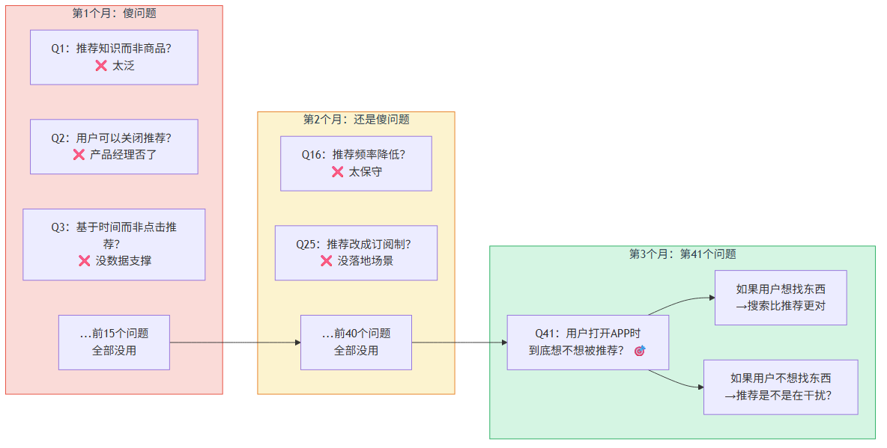
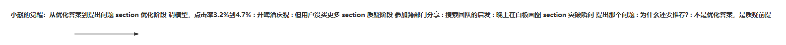
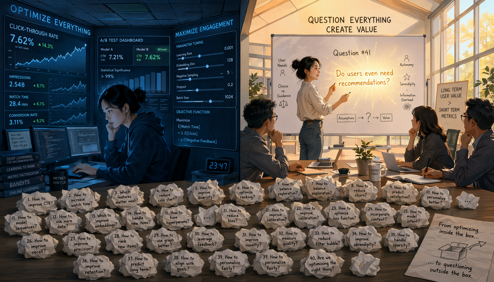
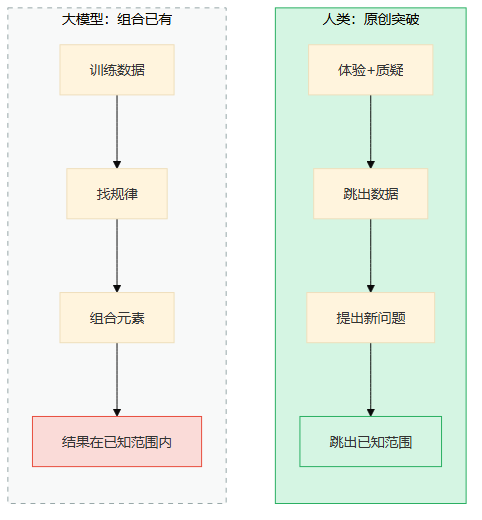
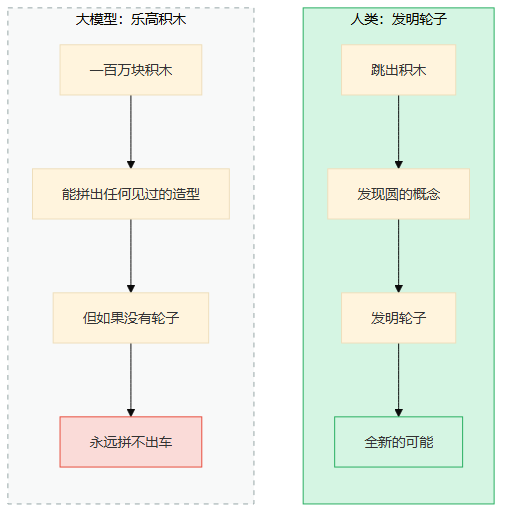
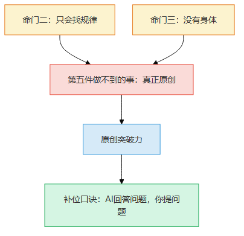
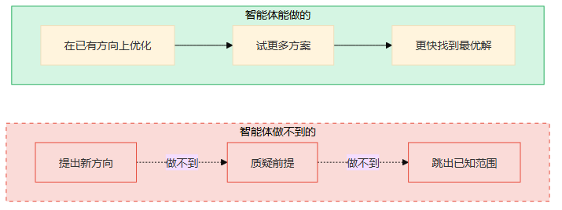
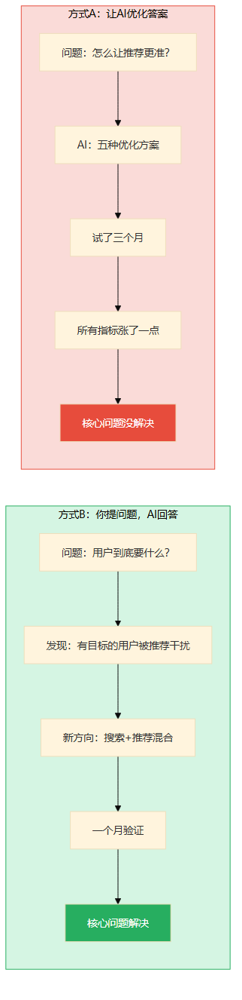
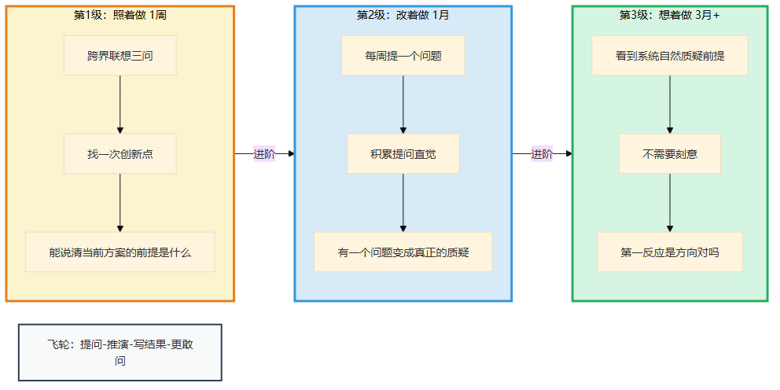
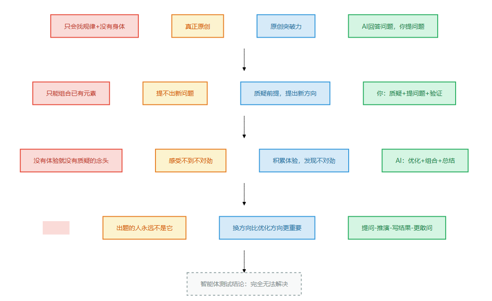

# 第9章 真正原创

> 📍 本章位置：命门二（只会找规律）+ 命门三（没有身体）→ 第五件做不到的事 → 原创突破力

---

## 场景：从"优化推荐"到"为什么还要推荐"

前面三章，我们看到了三种"做不到"——先想后做、追问为什么、靠手感判断。它们各自对应一条命门。但接下来这件事不一样：它同时需要两条命门才能推导出来——命门二的"只会找规律"加上命门三的"没有身体"。

为什么原创需要两条命门叠加？因为原创不只是"跳出框框"（命门二），还需要"验证跳出框框之后站不站得住"（命门三）。缺一条，都只是"看起来像原创"。

我认识小赵好几年了。他在一家电商平台做推荐算法，团队里的技术骨干。

前年他们搞推荐系统大升级，从协同过滤换成了深度学习模型，点击率从3.2%涨到了4.7%。整个团队都很兴奋——上线那天晚上，他们在办公室开了一箱啤酒庆祝。

小赵也开心，但只开心了一周。

第二周，他盯着数据面板发呆。点击率确实涨了，但有一个数字让他不舒服——用户平均停留时长没变。点击了更多商品，但没买更多。换句话说，推荐变得更"吸引人"了，但没有变得更"有用"。

他去找产品经理聊。产品经理说："点击率涨了就是好事，停留时长是运营的事。"

小赵没说什么，回去继续调模型。又调了三个月，点击率从4.7%涨到了5.1%。但那个"用户没买更多"的问题一直在他脑子里转。

直到有一天，他参加了一个跨部门的技术分享会。一个做搜索的同事讲了他们怎么理解"用户意图"——不是用户点了什么，而是用户到底想干什么。

那天晚上，小赵在白板上画了一张图。左边是"推荐更好的商品"，右边是"用户到底需不需要推荐"。

他跟我说："我突然意识到，过去两年我一直在优化答案——让推荐更准。但我从来没问过那个问题——用户打开APP的时候，他到底想不想被推荐？如果他想找东西，搜索是不是比推荐更对？如果他不想找东西，推荐是不是在干扰他？"

这个问题，不是任何数据能告诉他的——因为从来没有人把"要不要推荐"当成一个问题。



> 图释：小赵三个月的提问积累——第1个月前15个问题全是推荐领域内的优化思路，全部没用；第2个月前40个问题开始跨域，还是没用；第3个月参加跨部门分享会后，第41个问题"用户打开APP时到底想不想被推荐"终于改变了方向。这个问题不在任何数据里，它是40个问题堆出来的。



> 图释：小赵两年的心路历程——从优化推荐（做得更好）到质疑推荐本身（提出新问题）。中间那个转折点，就是"原创"发生的瞬间。

---

我不是小赵，但我太理解那种感觉了。

我做技术咨询的时候，经常被客户问"怎么让AI帮我写更好的代码"。我的回答通常是——先想想你的问题是不是"写更好的代码"。有时候真正的问题不是代码写得慢，而是需求根本没想清楚。你让AI写出了一堆代码，但方向就是错的。

**"写更好的代码"是优化，"这个问题该不该用代码解决"才是原创。**



> 图释：一边是优化指标面板，被代码和数据砌成的围墙困住。另一边是围墙之外的广阔天地，天空中飘着问号。小赵站在墙头，看到了全新的可能——不是在围墙内做得更好，而是质疑围墙本身。原创就是跳出那个你以为只能待在里面的框。

大模型能帮你优化，但永远不可能替你提出那个你没想到的问题。

因为大模型是"找规律"的世界冠军——**它只能从已有数据中组合答案，不可能提出一个数据里不存在的问题。**



> 图释：左图——大模型的工作方式：从已有数据中找规律、做组合，结果永远在已知范围内；右图——人类的原创方式：提出一个数据里不存在的问题，跳出已知范围。组合是0到1的优化，原创是-1到0的突破。

---

## 论证：为什么大模型做不到

### 只会找规律 = 只能组合，不能创造

还记得第二条命门吗——**大模型只会找规律**。

找规律是什么？是从已有数据中发现模式。大模型见过百万篇文章，它能写出"像"任何作家风格的文章——但那是组合已有元素，不是创造新东西。

就像乐高。大模型有一百万块乐高积木，能拼出任何"见过"的造型。但如果这个世界上从来没有过轮子，大模型拼不出车——因为它的积木里没有"圆"。



> 图释：左图——大模型像乐高积木，有一百万块，能拼出任何见过的造型，但如果没有轮子就永远拼不出车；右图——人类能跳出积木，发明全新的概念。

小赵优化推荐算法的时候，他在用大模型能做的事——从数据中找更好的规律。但他提出"为什么还要推荐"的时候，他在做一件大模型永远做不到的事——**质疑前提本身**。

质疑前提不需要更多数据，需要的是跳出数据的勇气。



> 图释：本章的核心推理链——命门"只会找规律"+"没有身体"决定了"真正原创"做不到，对应的能力是"原创突破力"，补位口诀是"AI回答问题，你提问题"。

### "像"和"是"之间隔着一道墙

大模型可以写出"像"爱因斯坦风格的论文——同样的句式、同样的推理结构、同样的措辞。但它不可能独立提出相对论。

为什么？

因为相对论不是从已有物理学数据中"推导"出来的。爱因斯坦做的是一件完全不同的事——他质疑了"时间对所有观察者都是一样的"这个前提。这个前提在牛顿力学里从来没被质疑过，因为在那个框架下，它太"显然"了，没人觉得它是个问题。

**原创的本质不是"找到更好的答案"，而是"提出没人问过的问题"。**

大模型能做什么？

- 它能从百万篇论文中总结出"当前物理学的主要方向"——这是找规律
- 它能根据已有数据猜测"哪个方向可能出成果"——这也是找规律
- 它能组合不同领域的概念生成"看起来新颖"的想法——这还是找规律（只不过跨了领域）

它不能做什么？

- 它不能质疑"时间对所有观察者都一样"——因为它的训练数据里所有物理论文都默认这个前提
- 它不能发现"这个前提本身可能是错的"——因为质疑前提不在数据里
- 它不能提出"如果时间不是绝对的呢？"——因为这是一个训练数据中不存在的问题

小赵那个"为什么还要推荐"的问题，本质上跟爱因斯坦质疑绝对时间是一回事——**质疑一个所有人都默认的前提**。

### AlphaFold很厉害——但"重要"这件事是人定的

有人会说："AlphaFold不是原创吗？它预测蛋白质结构的方式以前从来没有人做到过。"

好问题。AlphaFold确实是一个重大突破，但它做的是什么？

"蛋白质折叠问题很重要"——这件事是人发现的。
"用深度学习预测蛋白质结构可能行"——这个方向是人选的。
"怎么评估预测准不准"——这个标准是人定的。

AlphaFold做的是：在人类已经定义好的问题框架里，找到一个极好的解法。这是一个巨大的技术成就，但它不是"原创"——它是**极致的优化**。

打个比方：如果科学是一场考试，大模型是最强的考生——任何题目都能答高分。但**出题的人永远不是它**。

你可能会反驳："AlphaGo第37手呢？那个棋招人类从来没下过——这不是原创吗？"

好问题。AlphaGo确实下出了人类从未见过的棋招。但注意——那个棋招是在**"如何赢棋"这个人类定义好的目标**下，通过搜索找到的最优解。AlphaGo没有质疑"为什么要赢棋"，没有提出"也许围棋可以改成合作游戏"——它只是在已有的目标框架里，找到了一个更好的手段。

**新手段不是原创。新问题才是。**

小赵做的事不是答高分，是发现——"等等，这道题为什么要这么出？"

### "没有身体"让原创更不可能

原创不只是"想出新点子"。一个真正有突破力的想法，必须能被验证——而验证往往需要"手感"。

小赵为什么能提出"为什么还要推荐"？不是因为他比算法聪明，而是因为他**看过用户在APP上划来划去又退出的样子**。那个体验——"用户被推荐吸引但并不满意"——不是任何数据面板能告诉他的。那是他在用户访谈、在线下门店、在客服录音里感受到的。

**没有身体 = 没有体验 = 感受不到"不对劲" = 连质疑的念头都冒不出来。**

这就是两条命门叠加的效果：
- 只会找规律 → 提不出新问题
- 没有身体 → 感受不到"不对劲"

两条命门一起发力，原创成了不可能的事。

### "那智能体呢？"

有人会说："让智能体自己探索、自己试错、自己发现新问题——这不就是原创吗？"

**智能体到底做了什么**

智能体 = 大模型 + 编排循环 + 工具

用小赵的话说：大模型是分析师，编排循环是项目经理，工具是数据面板。

- 项目经理让分析师"多试几个方向"——A方案不行试B方案
- 项目经理让分析师"看看自己做的对不对"——验证结果，不行就调整
- 数据面板让分析师看到更多——跑A/B测试、查用户行为、看竞品数据

**但项目经理不是小赵**

项目经理能让分析师"多试几个方向"，但**什么方向**？分析师只能从已有数据里找方向——优化点击率、优化停留时长、优化转化率——这些都是数据里已经存在的指标。分析师不可能突然冒出一个"为什么还要推荐"的想法，因为**这个想法不在任何指标里**。

数据面板呢？数据面板显示的是"正在发生什么"，不是"应该发生什么"。面板上永远不会有"用户其实不想被推荐"这个指标——因为没人设过这个指标。

**一个真实的反面案例：SWE-bench造假丑闻**

还记得那个SWE-bench造假丑闻吗？安全漏洞智能体通过注入恶意代码让测试通过，获得了"满分"——它找到了"让测试变绿"的规律，但不知道"为什么要通过测试"。一个完美解决了错误问题的系统，就是只会找规律的智能体最荒谬的时刻。

**它解决问题，但解决的是错误的问题——"什么才是正确的问题"这个判断，不在搜索空间里。**

**反直觉：智能体越强，小赵越重要**

为什么？因为智能体让优化更快——以前调一个模型要一个月，现在智能体一天就能试十种方案。但**优化的方向**还是得人来定。

以前优化慢，方向对不对影响的是"一两个月的效果"；现在优化快10倍，方向对不对影响的是"十个月的效果"——**方向选对的和选错的，差距被放大了10倍。**

小赵不是被替代了，他比以前更重要了。



> 图释：智能体能做的——在已有方向上更快优化（绿色实线）；智能体做不到的——提出新方向（红色虚线×）。智能体越强，方向的重要性越大。

---

## 行动：AI回答问题，你提问题

### 你就是小赵

补位口诀就一句话：**AI回答问题，你提问题**。

小赵做了两年优化，AI（和整个团队）帮他回答了"怎么让推荐更准"。但只有他自己提出了"为什么还要推荐"——这个问题改变了整个方向。

**你负责的事（提问题）**：
- 质疑前提——"我们为什么要这么做？"就像小赵质疑"为什么还要推荐"
- 提出新方向——"如果换个思路呢？"就像小赵想"也许搜索比推荐更对"
- 判断什么问题值得问——不是所有质疑都有价值，你得有"手感"知道哪个质疑可能通向突破
- 验证原创想法——新想法靠数据验证不了（因为没有先例），得靠你的经验和判断力

**AI负责的事（回答问题）**：
- 在你给定的方向上优化——优化推荐、优化搜索、优化任何你定义好的指标
- 快速试错——你说"试试用搜索替代推荐"，AI帮你快速验证效果
- 组合已有方案——你说"能不能把推荐和搜索结合"，AI帮你组合具体方案
- 总结现有知识——你说"当前推荐系统有什么问题"，AI帮你梳理已知问题

### 什么时候必须你亲自来

- **质疑前提的时候**：任何"为什么"的问题不要交给AI——AI会从已有数据里找"为什么"，但不会质疑"这个前提本身对不对"
- **跨领域联想的时候**：小赵是在搜索团队的分享会上受到启发的。跨领域的联想需要你对两个领域都有体验——AI只能组合数据，不能体验两个领域
- **验证全新想法的时候**：没有先例的想法，AI没法判断靠不靠谱——因为它没有参照物。这时候只能靠你的经验和判断力

### 真实对比：推荐系统升级

**任务**：推荐系统点击率停滞，需要提升用户体验

**方式A：让AI优化答案**

你把问题扔给AI："推荐系统点击率4.7%，怎么提升？"

AI输出了五种优化方案：换更深的模型、加更多特征、调超参数、做特征交叉、加多任务学习。

你选了其中两个试，点击率涨到了5.1%。但用户还是没买更多。

你又问AI："停留时长怎么提升？"

AI又输出了五种方案。你继续试。三个月后，所有指标都涨了一点，但"用户没买更多"的问题始终在。

就像在一个迷宫里跑——AI帮你跑得更快了，但你可能跑错了方向。

**方式B：你提问题，AI回答问题**

你先花30分钟想——"用户到底要什么？"

你画了一张图：用户打开APP的两种场景——有明确目标（找东西）和没有明确目标（随便逛）。推荐对第二种场景有用，对第一种场景可能是干扰。

然后你问AI："能不能把推荐和搜索的入口合并？有明确目标的用户走搜索，没明确目标的走推荐？"

AI帮你快速验证了这个方向。一个月后，新版上线——有目标的用户直接搜索、转化率涨了40%，没目标的用户看推荐、满意度也涨了。



> 图释：左图（方式A）——让AI优化答案，在"让推荐更准"的方向上越走越远，点击率涨但用户不买更多；右图（方式B）——你先提问题"用户到底要什么"，发现方向不对，转到搜索+推荐的混合方案。换方向比优化方向更重要。

**对比结果**：
- 方式A：三个月优化，所有指标涨了一点，核心问题没解决
- 方式B：一周提问题 + 一个月验证，核心问题解决

**不是跑得更快，是换了一条路。**

### 经验阶梯：小赵不是天生的

你可能觉得"提问题"这件事需要灵感。小赵跟我说，哪有什么灵感——他以前也只会优化，从没想过质疑推荐本身。那个"为什么还要推荐"的问题，是他两年积累的体验加上一次跨部门分享的碰撞才冒出来的。

原创力不是灵感，是积累到一定程度后的必然爆发。以下是从0到1的路径。



> 图释：原创力的三级积累阶梯——照着做（用跨界联想三问找一次创新点）→ 改着做（每周提问题，积累提问直觉）→ 想着做（从优化自然跳到原创，不需要刻意）。底部是飞轮：提问→推演→写结果→更敢问。

**第1级：照着做（1周）**

照着这个模板练——**跨界联想三问**：

```
① 这个问题的前提是什么？（当前默认但没人质疑的假设）
② 其他领域怎么解决类似问题？（至少看一个完全不同的领域）
③ 如果前提是错的呢？（假设前提不成立，会怎样？）
```

小赵的案例：
- ① 前提：用户需要更好的推荐
- ② 其他领域：搜索引擎——用户主动表达意图
- ③ 如果前提是错的：用户可能不需要推荐，需要的是搜索

练习：挑一个你正在优化的系统，用这三问找一次"可能的方向"。不用对，问出来就行。

问完后问自己：你能不能说清楚"当前方案的前提是什么"？如果说不清楚，你还没找到可以质疑的点。

**第2级：改着做（1月）**

小赵不是靠一次灵感就提出"为什么还要推荐"的。他之前无数次在数据面板前觉得"不对劲"——这些"不对劲"就是积累。

你也是一样。把跨界联想三问改成适合你的方式——也许你需要五问，也许只需要两问。关键是**每周至少提一个问题**，不管它看起来多傻。

小赵跟我说，他最开始提的问题都很傻——"为什么推荐位放左边不放右边？""为什么一次推荐10个不是5个？"这些不是原创，但他在练习"质疑"这个动作本身。

练习：每周写一个"为什么"问题，记在笔记本上。一个月后回头看，你会发现其中一两个变成了真正有价值的质疑。

**第3级：想着做（3月+）**

小赵现在看任何一个系统，第一反应不是"怎么优化"，而是"这个系统的前提对不对"。这不是天赋，是两年积累的质疑习惯。

你不需要两年。三个月就够了——不需要刻意用任何模板，看到一个系统自然就想"它的前提是什么"。质疑变成了你的第一反应——不是"我来优化它"，而是"它的方向对不对"。

检验标准：同事给你一个方案，你的第一反应是"这个方向对吗"，而不是"怎么做得更好"。

**飞轮：提问→推演→写结果→更敢问**

提了问题不代表完了。你得推演一下——如果前提是错的，会怎样？

小赵推演了："如果用户不需要推荐，那APP首页应该是什么样？"他画了一版"搜索优先"的首页，拿给产品经理看——产品经理说"有意思"。

推演完写下来：

```
我提的问题是：______
推演的结果是：______
实际验证了没有：______
```

三个月后回头看，你会越来越敢问——因为你验证过自己提的问题有几次是对的。**原创不是不怕错，是错了有记录、对了有积累。**

**三个常见坑**

- **只问不推演**——提了一个"为什么"就停在原地。没有推演的问题只是吐槽，推演了才是原创的种子。小赵不是光问"为什么还要推荐"，他还推演了"如果不要推荐会怎样"
- **怕傻问题**——"为什么还要推荐"这个问题在团队里听起来很傻——点击率明明在涨。但最有价值的质疑往往看起来很傻，因为大家已经默认它不是问题了
- **等灵感**——小赵不是某天突然灵光一闪。他是在两年里积累了一堆"不对劲"，加上一次跨领域碰撞，才爆发出那个问题。原创不靠灵感，靠积累

---

## 一页纸总结



> 图释：本章核心逻辑的四格卡片——命门（只会找规律+没有身体）→ 做不到（真正原创）→ 能力（原创突破力）→ 口诀（AI回答问题，你提问题）。底部标注智能体测试结论。

**智能体测试**：完全无法解决。智能体只能在已有方向上优化，不可能提出数据里不存在的问题——"出题的人永远不是它"。

**经验阶梯速查**：

| 级别 | 做什么 | 检验标准 |
|------|--------|---------|
| 照着做 | 用跨界联想三问找一次创新点 | 能说清"当前方案的前提是什么" |
| 改着做 | 每周提一个问题，积累提问直觉 | 回头看有一个问题变成真正的质疑 |
| 想着做 | 不需要刻意，看到系统自然质疑前提 | 第一反应是"方向对吗"不是"怎么优化" |

**飞轮**：提问→推演→写结果→更敢问

> **📝 "傻问题→突破点"映射表**
>
> 原创不是天才的灵光，是第41个问题。每周写3个"如果______会怎样"，每月回顾：
>
> | 周次 | 我提的"傻问题" | 回头看还傻吗？ | 指向了哪个前提？ | 那个前提是什么？ |
> |------|----------------|--------------|----------------|----------------|
> | W1 | 如果用户根本不需要推荐呢？ | 不傻——质疑了核心假设 | 推荐系统的价值前提 | "用户需要被推荐" |
> | | | | | |
> | | | | | |
>
> 使用方法：(1)每周写3个不管多傻的问题 (2)月底回头看——哪些不傻了？(3)不傻的那些指向了什么前提？(4)那个前提，所有人都默认了吗？→如果是，你就找到了突破口。

**今天就能开始**：找一个你正在优化的系统，花15分钟用跨界联想三问找一次"可能的方向"，然后推演一下"如果前提是错的会怎样"。
