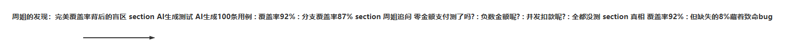
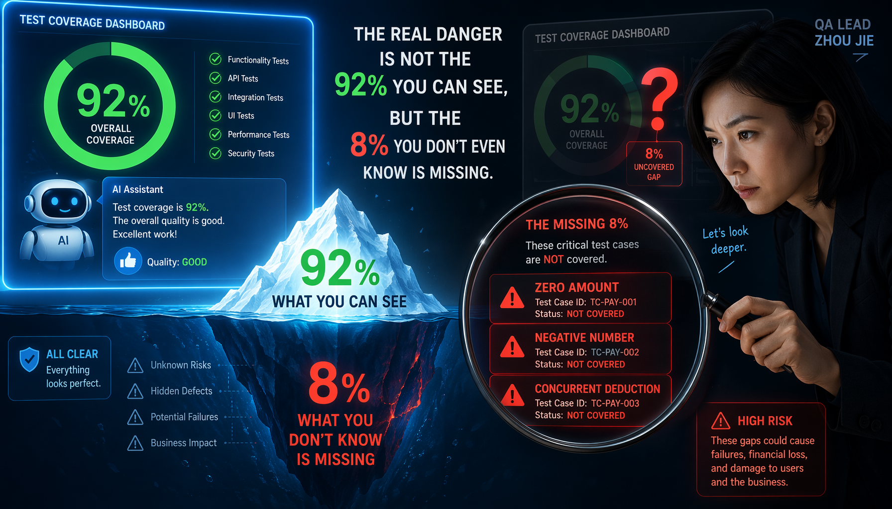
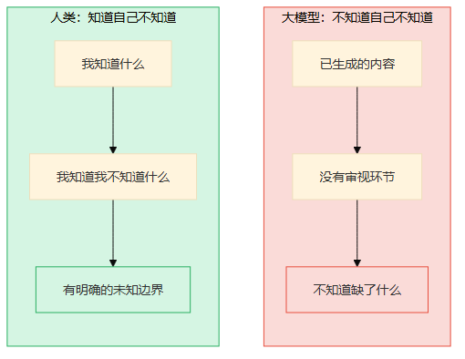
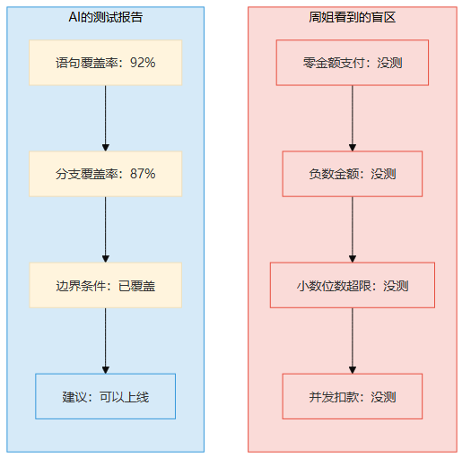
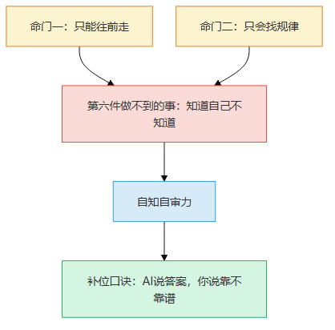
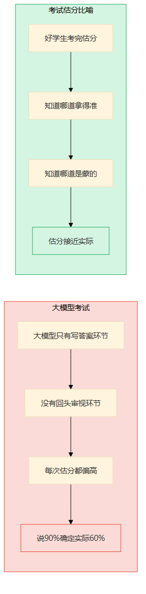
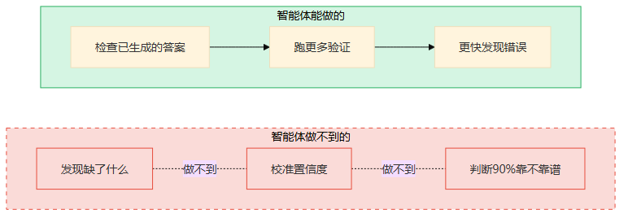
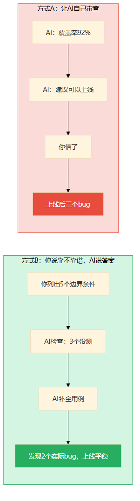
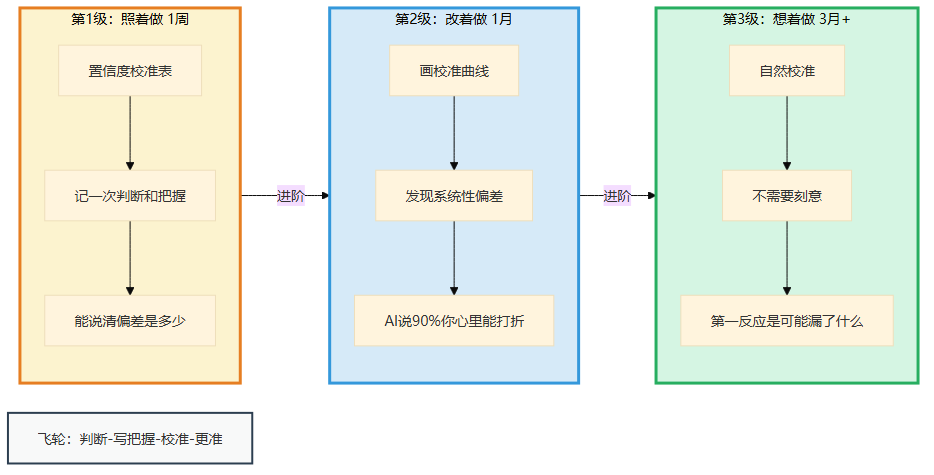
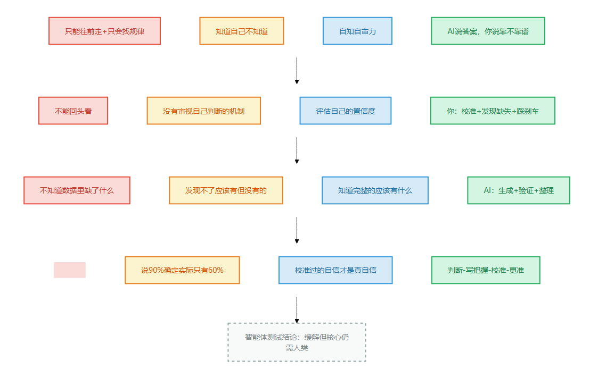

# 第10章 知道自己不知道

> 📍 本章位置：命门一（只能往前走）+ 命门二（只会找规律）→ 第六件做不到的事 → 自知自审力

---

## 场景：看起来完美的测试报告

上一章我们说到原创需要两条命门叠加。这一章又是另一组叠加——命门一（只能往前走）+ 命门二（只会找规律）。

你可能还记得第2章老张画三版方案的故事。老张之所以需要画三版，不只是因为"要规划"——更是因为他需要"回头看第一版，审视自己做得对不对"。回头看+审视自己的输出，这就是"自知"。命门一让你没法回头，命门二让你只能看到规律看不到盲区——两条命门叠加，就产生了"不知道自己不知道"这个最危险的缺陷。

周姐在一家金融科技公司做QA负责人，干了十二年测试。她手下管着二十多个测试工程师，负责公司所有产品的质量把关。

去年，公司开始用AI辅助生成测试用例。AI确实快——以前写一个模块的测试用例要两天，AI十分钟就生成一百条。覆盖率报告也很漂亮：语句覆盖率92%，分支覆盖率87%。

整个QA团队都很高兴。但周姐皱了一下眉头。

她把AI生成的测试报告翻了一遍，然后问了一个问题："支付金额为零的情况，测了吗？"

AI生成的用例里有"正常金额支付"、"大额支付"、"小额支付"——就是没有"零金额"。训练数据里支付金额都是正数，AI没见过零金额的支付——它根本不知道"零金额"是必须测的边界。

周姐接着问："负数呢？小数位数超限呢？并发扣款呢？"

AI一条都没生成。但在覆盖率报告上，这些缺失完全看不出来——92%的覆盖率看起来很完美。

**92%的覆盖率不是"几乎全覆盖"，是"有8%我们完全不知道缺了什么"。**

周姐跟我说了一句话："AI最大的问题不是答错——是答错了还特别自信。它说92%覆盖率的时候，真的相信覆盖了92%。它不知道那8%里可能藏着一个致命的bug。"



> 图释：周姐发现AI测试报告的时间线——AI自信地给出92%覆盖率，周姐凭经验追问边界条件，发现关键盲区。覆盖率数字看起来完美，但缺失的8%可能藏着一颗定时炸弹。

---

我不是QA，但我太熟悉那种感觉了。

我做技术咨询的时候，经常用AI帮我做技术选型调研。AI给出一份报告——"A方案性能最优，B方案生态最好，C方案成本最低"——看着特别专业，引用了五篇论文，对比了三个指标。

我信了。按A方案落地，上线后出了问题——AI没提到A方案在特定并发模式下有已知的内存泄漏。不是AI故意隐瞒，是它真的不知道。它读过的论文里没提这件事，训练数据里没有这个案例，所以它"自信地"给出了一个不完整的报告。

**AI不知道自己不知道——这是比"答错"更危险的事。** 答错你能发现，不知道自己答错你连发现的机会都没有。



> 图释：水面上——92%覆盖率，一切看起来完美。水面下——支付金额为零、负数金额、小数超限、并发扣款等关键边界条件完全缺失，像一座巨大的冰山，你完全看不到。覆盖率数字越高，你越危险——因为你越不知道自己缺了什么。

为什么大模型做不到"知道自己不知道"？因为两条命门的叠加——

- **只能往前走**：生成答案的时候不能回头看"我刚才说的靠谱吗？"——没有回头审视的能力
- **只会找规律**：不知道训练数据里缺了什么——你不可能从规律中发现"规律之外的东西"



> 图释：左图——人类的认知：知道自己知道什么，也知道自己不知道什么，有明确的"未知边界"；右图——大模型的认知：只有"已生成的内容"，没有"我对这些内容有多大把握"的概念。不知道自己不知道，比答错更危险。

---

## 论证：为什么大模型做不到

### 只能往前走 = 没有回头审视的机制

还记得第一条命门吗——**大模型只能往前走**。

它生成答案的过程像走独木桥——一步一步往前，走过就不能退。这意味着什么？生成了一段话之后，不能回头想"这段话靠谱吗？我有多大把握？"

人类不一样。我说"这个方案有80%的把握"的时候，我做了一件事——**审视自己的判断**。我回顾了已有的信息，评估了不确定的部分，然后给出了一个置信度。

大模型说"这个方案有90%的把握"的时候，它做了什么？**它只是从训练数据中学到——类似的问题，答案通常标注了"高置信度"。** 它不是在审视自己的判断，它是在输出一个"看起来像高置信度"的回答。

就像一个学生考试，考完能自己估分——他知道哪道题拿得准，哪道题是蒙的。大模型呢？它没有"考完回头看"的环节，它只有一个"写答案"的环节。

周姐说："我审测试报告的时候，第一件事不是看它写了什么，是看它没写什么。大模型做不到这件事——它只能看到自己生成的内容，看不到自己没生成的内容。"



> 图释：左图——AI的测试报告，覆盖率92%看起来完美；右图——周姐凭经验看到的盲区：零金额、负数、小数超限、并发扣款全都没测。AI只能展示它生成了什么，看不到它没生成什么。

### 只会找规律 = 不知道数据里缺了什么

第二条命门——**大模型只会找规律**。

找规律是什么？是从已有数据中发现模式。但"知道自己不知道"需要什么？需要发现数据里**缺了什么**——而缺的东西不在数据里，你不可能从数据中发现它不存在。

周姐问"零金额支付测了吗"——这个问题不是从测试数据中"推导"出来的。它是周姐的经验告诉她：支付系统一定会遇到零金额的情况，不管数据里有没有。这种"经验告诉我应该有什么"的判断，是找规律做不到的。

打比方——

你让一个人列举"这个房间里的东西"，他能列出来：桌子、椅子、电脑、杯子。但如果你问他"这个房间里缺了什么？"——他得先知道这个房间"应该有什么"。如果这是一个办公室，缺了文件柜；如果这是一个卧室，缺了床。**判断"缺了什么"需要你知道"应该有什么"——这靠经验，不靠数据。**

大模型只能列"房间里的东西"，它永远说不出"缺了什么"——因为它不知道这个房间"应该有什么"。



> 图释：本章的核心推理链——命门"只能往前走"+"只会找规律"决定了"知道自己不知道"做不到，对应的能力是"自知自审力"，补位口诀是"AI说答案，你说靠不靠谱"。

### 它说"90%确定"，你信不信？

有人做过实验——让大模型回答问题，同时让它给自己打分"你有多确定？"

结果是：大模型说"90%确定"的时候，实际正确率只有60%左右。说"99%确定"的时候，实际正确率也不到80%。

这不是大模型在撒谎——它真觉得自己90%确定。问题出在哪？

**大模型的"置信度"是从训练数据中学来的**——类似问题的答案看起来很"确定"，它就输出"90%确定"。但"看起来确定"和"真的确定"是两回事。

这就像一个没怎么考过试的学生——每次估分都偏高，不是因为他自大，是因为他不知道自己不知道。他看过标准答案之后觉得"这个我也会"，但自己写的时候就是写不对。

**大模型就是那个"每次估分都偏高"的学生。**



> 图释：左图——好学生考完估分，知道哪道拿得准、哪道是蒙的，估分接近实际；右图——大模型只有"写答案"环节，没有"回头看"环节，每次估分都偏高，说90%确定实际只有60%。

周姐对此有一个精辟的说法："AI的自信就像化妆——表面光鲜，但卸了妆就不是那个样子。问题是AI自己看不到自己卸了妆的样子。"

### "那智能体呢？"

有人会说："让智能体自己检查自己的答案、自己做A/B测试、自己验证——这不就知道自己靠不靠谱了吗？"

**智能体确实能做一些"检查"**

智能体 = 大模型 + 编排循环 + 工具

用周姐的话说：大模型是分析师，编排循环是项目经理，工具是测试面板。

- 项目经理让分析师"检查一下自己的答案"——跑一遍单元测试、查一下覆盖率
- 项目经理让分析师"试试不同的方案"——A方案不行试B方案
- 测试面板让分析师看到更多——实际运行结果、性能数据、错误日志

**但项目经理不是周姐**

项目经理能让分析师"检查答案"，但**检查什么**？分析师只能检查它已经生成的答案——覆盖了的那92%。它不可能检查"我没有生成什么"——因为"没生成的东西"不在它的视野里。

测试面板呢？面板显示的是"已运行的测试结果"，不是"应该运行但没运行的测试"。面板上永远不会有"零金额支付没测"这个提示——因为没人设过这个测试用例。

**核心问题没变：智能体能检查"答得对不对"，但不能发现"缺了什么"。**

一个细思极恐的类比——你让一个人闭着眼走过一个房间，他走过去了，你说"走得很好"。但你怎么知道他没踩到什么？你不知道——因为你只检查了"他走过去了"，没检查"他踩过了什么"。

智能体的自检就是这样——它只能检查"我回答了什么"，不能发现"我没回答什么"。而最危险的bug，永远藏在"没回答"的那部分里。

但智能体确实有一个好处——它能让"检查"变得更便宜。以前跑一轮回归测试要半天，智能体十分钟就能跑完。这意味着你可以更频繁地验证。

所以——智能体让验证变快了，但**"验证什么"这个方向还是得你来定**。你决定要不要加那个零金额的测试用例，你决定AI给的90%置信度要不要打折。

**智能体帮你跑得更快，但你看路看得更准。**



> 图释：智能体能做的——检查已生成的答案、跑更多验证（绿色实线）；智能体做不到的——发现"缺了什么"、校准置信度（红色虚线×）。智能体让验证更快，但"验证什么"还是你来定。

---

## 行动：AI说答案，你说靠不靠谱

### 你就是周姐

补位口诀就一句话：**AI说答案，你说靠不靠谱**。

周姐审测试报告的时候，不是在验证AI写了什么——她是在想AI没写什么。这个能力不是AI能替代的，因为它需要经验：你得知道测试报告里"应该有什么"，才能发现"缺了什么"。

**你负责的事（说靠不靠谱）**：
- 评估AI给出的置信度——它说90%确定，你要判断这90%靠不靠谱
- 发现AI没提到的方面——就像周姐发现零金额测试用例缺失
- 校准你的判断——你对AI的信任度也要校准，不能全信也不能全不信
- 在关键决策时踩刹车——AI说"没问题"的时候，你需要问"真的没问题吗？"

**AI负责的事（说答案）**：
- 快速生成初始答案——测试用例、调研报告、技术方案
- 在你指定的方向上验证——你说"测零金额"，AI帮你跑
- 提供结构化的输出——让"靠不靠谱"有具体的东西可以评判
- 整理已知信息——把散落的信息组织成可审查的形式

### 什么时候必须你亲自来

- **评估置信度的时候**：AI说"90%确定"——这个90%靠不靠谱，只有你能判断。你需要结合你的经验、你的领域知识来校准
- **发现缺失的时候**：AI给出的报告里缺了什么——这需要你知道"完整的报告应该有什么"，这是经验，不是数据
- **关键决策前踩刹车的时候**：当AI说"可以上线了"，你需要问"你确定吗？有没有你没考虑到的？"——这个质疑的能力是AI没有的

### 真实对比：上线前的最后审查

**任务**：一个支付系统上线前的测试审查

**方式A：让AI自己审查**

你把测试报告扔给AI："这个测试覆盖充分吗？"

AI输出："语句覆盖率92%，分支覆盖率87%，边界条件已覆盖，建议可以上线。"

你信了。上线后，零金额支付导致系统报错，小数位数超限导致金额计算错误，并发扣款导致余额为负——全是AI没想到的边界条件。

**方式B：你说靠不靠谱，AI说答案**

你先花30分钟想——"支付系统最容易出问题的是什么？"

你列了一张清单：零金额、负数金额、小数精度、并发扣款、网络超时重试。这些是你十二年经验告诉你的"必须测的东西"。

然后你问AI："这些边界条件的测试用例有没有？"

AI帮你快速检查——零金额没有，负数金额没有，并发扣款只有1条。你让AI补上这些用例，跑一遍，发现了两个实际bug。

上线前最后一次审查，你问AI："还有什么可能漏的？"AI想了想，列了五个方面。你看了看，其中两个你没想到但确实有价值，三个你已经考虑过了。

**你不是全知全能，但你和AI一起比任何一方单独都靠谱。**



> 图释：左图（方式A）——让AI自己审查，覆盖率92%看起来完美，但关键边界条件全漏了；右图（方式B）——你先列出"必须测什么"，让AI检查和补全，发现两个实际bug。说靠不靠谱比生成答案更重要。

**对比结果**：
- 方式A：覆盖率92%，上线后三个bug
- 方式B：你提5个边界条件 + AI补2个 + 发现2个实际bug，上线平稳

**不是覆盖率更高，是知道哪里可能漏。**

### 经验阶梯：周姐不是天生的

你可能觉得"判断靠不靠谱"需要很多年经验。周姐跟我说，她刚入行的时候也信覆盖率报告——直到有一次，99%覆盖率的模块上线后崩了，因为一个谁都没想过的时区转换bug。

从那以后，她再也不看覆盖率数字了——她看的是"这个系统最容易出问题的地方是什么"。

自知力不是天赋，是积累到一定程度后的必然。以下是从0到1的路径。



> 图释：自知力的三级积累阶梯——照着做（用置信度校准表记一次判断）→ 改着做（画校准曲线，积累校准直觉）→ 想着做（不需要刻意，自然校准）。底部是飞轮：判断→写把握→校准→更准。

**第1级：照着做（1周）**

照着这个模板练——**置信度校准表**：

```
我做的判断：______
我的把握（1-10分）：______
实际结果：______
偏差：______
```

周姐的案例：
- 判断：AI生成的测试报告覆盖充分
- 把握：7分
- 实际：漏了3个边界条件
- 偏差：高估了3分

练习：挑一个你最近让AI做的事，用校准表记录你的判断和实际结果。一周后回头看，你会发现自己系统性地高估还是低估AI的可靠性。

问完后问自己：你的"把握"和"实际结果"差了多少？如果差了3分以上，说明你对AI的校准还不够准。

**第2级：改着做（1月）**

用了一周校准表之后，你会发现自己有一些"系统性偏差"——比如总是高估AI在边界条件上的表现，或者总是低估AI在格式化任务上的可靠性。

把这些偏差记录下来，画一条**校准曲线**：横轴是你给的把握分数，纵轴是实际正确率。理想情况下，这条线应该是对角线（你说8分把握，实际正确率80%）。但大概率，你的线会偏——这就是你需要校准的地方。

练习：一个月后，你会对自己的校准有更准确的感知。当AI说"90%确定"的时候，你心里会自动打折——"它说90%，实际大概70%"。

**第3级：想着做（3月+）**

周姐现在看任何AI输出，第一反应不是"它说了什么"，而是"它可能漏了什么"。这不是刻意练习的结果，是无数次"信了AI然后被打脸"后的积累。

你不需要被打脸那么多次。三个月的校准练习就够了——每次看到AI输出，自然就想"它有多大把握？我信几分？有没有它没提到的？"

检验标准：同事把AI的分析报告给你看，你的第一反应是"它可能漏了什么"，而不是"这个报告做得真好"。

**飞轮：判断→写把握→校准→更准**

判断了不写下来就等于没判断。你得把"我有多大把握"写下来，然后跟实际结果对比。

周姐的方法很简单——每个判断旁边写一个数字。上线前她说"7分把握"，上线后她回头看，是7分还是4分。三个月后，她的7分就是真正的7分——不偏高也不偏低。

```
我的判断：______
我的把握：____分
实际结果：______
校准：偏高了/偏低了/差不多
```

**原创不是不怕错，是错了有记录、对了有积累。**

**三个常见坑**

- **太模糊**——"感觉不太靠谱"不是校准。"大概7分把握"才是。校准需要具体的数字，不然没法回头看自己准不准
- **不跟踪结果**——写了自己"7分把握"但从来不回头看"实际几分"。校准表只有前后对比才有价值，光记不看等于白记
- **事后改数字**——结果出来了，发现自己写的"5分把握"实际是9分，就偷偷把5改成8。这叫"事后诸葛亮"，不是校准。校准的价值在于记录你做判断那一刻的真实把握

---

## 一页纸总结



> 图释：本章核心逻辑的四格卡片——命门（只能往前走+只会找规律）→ 做不到（知道自己不知道）→ 能力（自知自审力）→ 口诀（AI说答案，你说靠不靠谱）。底部标注智能体测试结论。

**智能体测试**：缓解但核心仍需人类。智能体让验证更快更便宜，但"验证什么"和"置信度靠不靠谱"仍需人类判断。

**经验阶梯速查**：

| 级别 | 做什么 | 检验标准 |
|------|--------|---------|
| 照着做 | 用置信度校准表记一次判断 | 能说清"我的把握和实际差了多少" |
| 改着做 | 画校准曲线，发现系统性偏差 | AI说90%时你心里能自动打折 |
| 想着做 | 不需要刻意，自然校准 | 第一反应是"可能漏了什么"不是"做得真好" |

**飞轮**：判断→写把握→校准→更准

> **🔍 "AI输出靠谱度"三问**
>
> 面对AI给你的分析/方案/代码，别直接用。先花1分钟过三个问题：
>
> 1. **它说X%确定——它的训练数据有没有覆盖这个场景？** ——新系统、小众领域、公司内部工具=大概率没覆盖，AI是在"猜"不是在"知"
> 2. **它没提到什么——我凭经验觉得"应该有但没看到"的是什么？** ——周姐看到"92%覆盖率"时，直觉告诉她"8%没覆盖的可能更危险"——AI不会主动告诉你它不知道什么
> 3. **如果我是错的，最可能错在哪？** ——把AI的结论当"假说"而非"答案"，主动找反面证据。如果找不到反面证据，才算站得住
>
> 三问走完还能站住的AI输出，才值得信任——但信任的程度取决于你校准的精度，不取决于AI的自信。

**今天就能开始**：找一个你最近让AI做的事，花5分钟用置信度校准表记下你的判断和把握分数，一周后对比实际结果。
