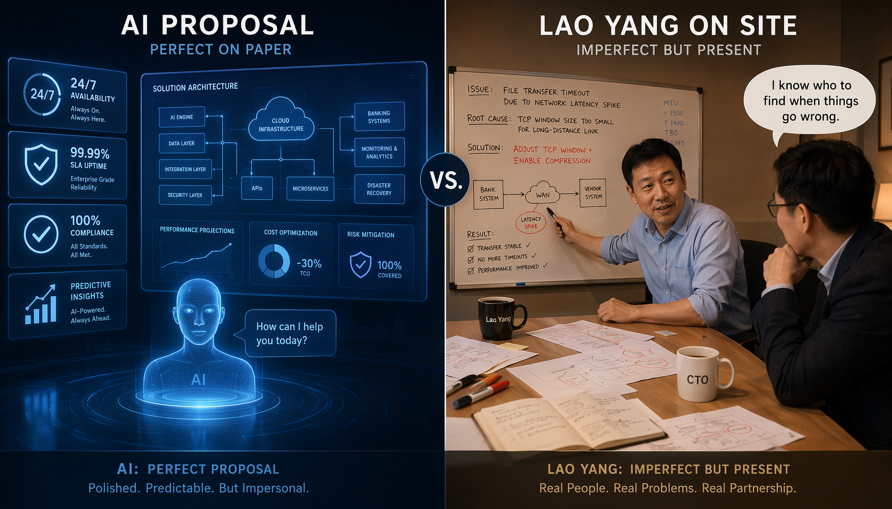
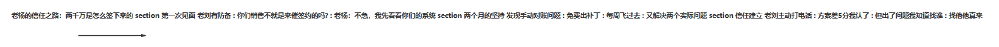
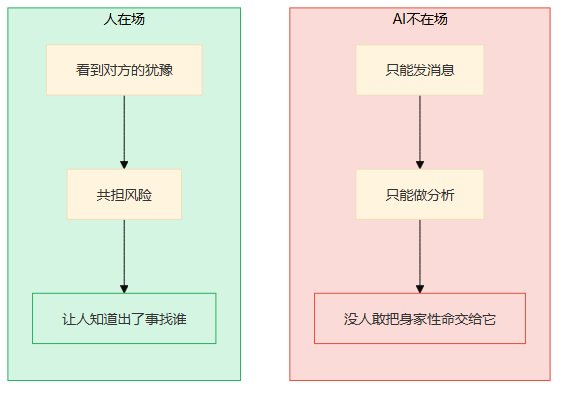
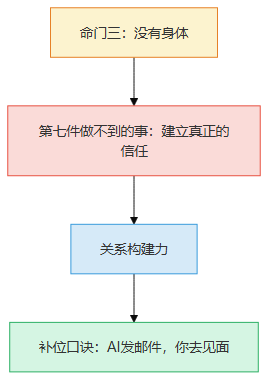
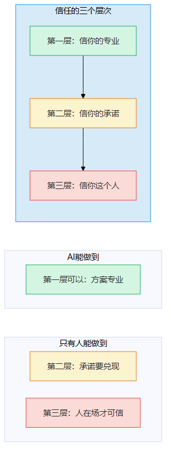
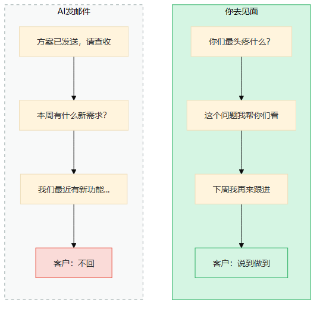
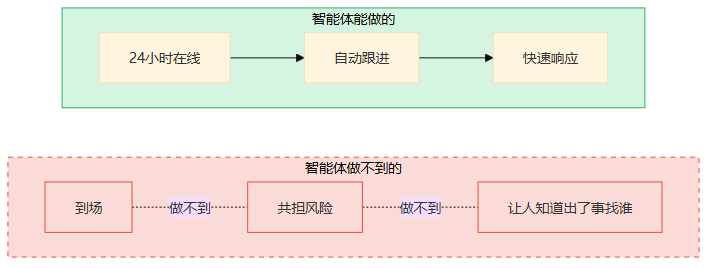
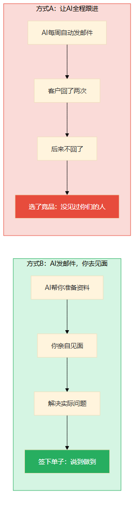
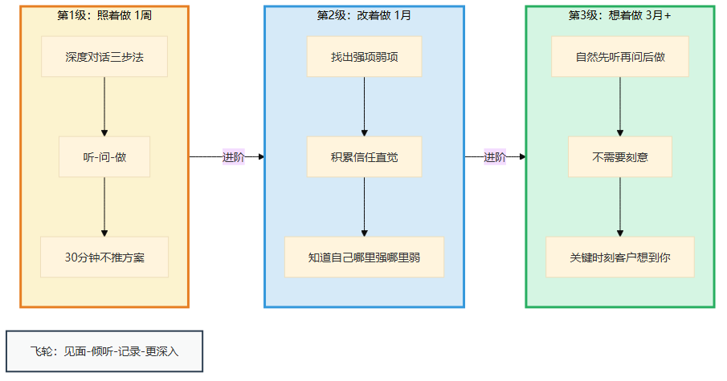
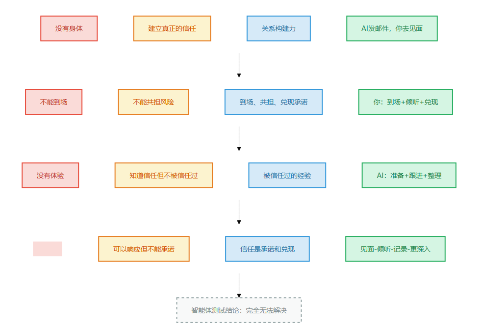

# 第11章 建立真正的信任

> 📍 本章位置：命门三（没有身体）→ 第七件做不到的事 → 关系构建力

---

## 场景：两千万的合同是怎么签下来的

边界篇走到最后一站。前面六章我们看到了六件"做不到"的事——先想后做、追问为什么、靠手感判断、为决定负责、真正原创、知道自己不知道。这六件事要么是单条命门的结果，要么是两条命门的叠加。

但最后这件事不一样。它不需要命门叠加——仅凭命门三"没有身体"这一条就够了。而且它是七件"做不到"里最"软"的一件——你很难用数据证明"信任值多少钱"，但每一个做过生意的人都知道：信任是唯一不能用方案替代的东西。

还记得第4章那第三道裂缝吗——"无法建立真正的信任"。老杨的故事我们在那一章已经提前剧透了一部分。现在，让我们看完整的故事。

老杨在一家云服务公司做大客户销售，干了十年。他跟我讲过一笔单子——

那年他们竞标一个银行的核心系统上云项目，标的额两千万。竞争对手是行业老大，品牌、技术、案例全比他们强。老杨的团队投了标书，技术方案打了90分，竞品打了95分。

按常规逻辑，这单没戏了。

但老杨没放弃。他做了一件事——每个星期飞到客户那边的城市，不是为了开会，就是坐在客户技术负责人旁边，看他们日常怎么用系统，听他们抱怨什么，帮他们看一些小问题。

第一次去，客户的技术负责人老刘还有点防备——"你们销售不就是来催签约的吗？"

老杨说："不急，我先看看你们的系统怎么跑的。"

他真看了。看了两天，他发现老刘团队每周五晚上要手动跑一次对账脚本，因为系统的一个小bug导致数据对不上。老杨回去让技术团队出了一个临时补丁，没收费，发给了老刘。

老刘当时没说什么，但第二周主动给老杨打了电话："你们那个补丁，能不能再优化一下？"

就这样，老杨每周去一次，有时候带技术去，有时候自己去。两个月里，他帮老刘解决了三个实际问题——都是小问题，但每一个都是老刘团队真正头疼的事。

到了最后决策的时候，老刘跟采购说了句话："我选老杨的团队。方案差5分我认了，但出了问题我知道找谁，找他他真来。"

**两千万的单子，不是靠方案签的，是靠信任签的。**



> 图释：左——屏幕上的邮件和电话，效率很高但温度为零。右——面对面的握手，光和热在两个人之间传递。两千万的单子不是靠方案赢的，是靠"出了问题我知道找谁，找他他真来"赢的。信任不能发送，只能到场。



> 图释：老杨两个月建立信任的时间线——不是靠方案，是靠每次到场、解决实际问题、让人知道"出了事找谁"。最后一句话"找他他真来"，就是信任的重量。

---

我不是销售，但我太理解老杨做的事了。

我做技术咨询的时候，有一家客户特别难搞——CTO换了三任，每次换人项目就推倒重来。三家咨询公司做过，没一家做出成果。

我去的时候，他们的技术负责人跟我说："你先别出方案，先看看我们之前踩过的坑。"

我看了三天文档，跟每个团队聊了一遍，然后跟技术负责人说："你们的问题不是技术方案不行，是每个方案都没人坚持执行完。"

他说："对，但你怎么保证你不会跟之前一样跑掉？"

我说："我每个星期来一次，风雨无阻。你不需要信我的方案，你只需要知道——有问题我就在。"

半年后，这个项目落地了。不是我的方案多牛，是客户知道——这个人说到做到，出了问题他会来。

**"出了问题找谁"——这就是信任。不是信你的方案，是信你这个人。**

AI能写出比老杨更好的方案，能24小时在线回复——但它永远做不到"出了问题我就在"。为什么？因为它没有身体。它不能到场，不能共担风险，不能让人在关键时刻知道"找谁"。



> 图释：左图——人在场：能看到对方的犹豫、能共担风险、能让人知道"出了事找谁"；右图——AI不在场：只能发消息、写方案、回答问题，但没有人敢把身家性命交给一个"随时可能断线"的存在。

---

## 论证：为什么大模型做不到

### 没有身体 = 不能到场 = 不能共担风险

还记得第三条命门吗——**大模型没有身体**。

没有身体意味着什么？它不能"到场"。它不能坐在你旁边看你加班，不能在系统崩了的时候跟你一起熬夜，不能在你犹豫的时候拍拍你的肩膀说"没事，我在"。

信任的核心不是"你说的对"，是"出了问题你会在"。

老杨做了什么？他每个星期飞过去，坐在老刘旁边。这件事的信息量是零——他没在那些场合传递任何新信息。但他做了一件信息传递做不到的事——让老刘知道：这个人靠得住。

心理学里有个概念叫"风险共担"——你愿意跟我一起承担风险，我才信你。这不是逻辑推理能解决的，是身体的承诺。

AI能做风险分析——"方案A的风险是X%，方案B的风险是Y%"。但它不能说"如果出了问题，我来负责"——因为它没有"我"可以去负责。

### "知道"和"经历过"是两回事

大模型可以"知道"什么是信任——它能写一篇关于信任的论文，引经据典，逻辑严密。

但"知道信任是什么"和"被信任过"是两回事。

老杨为什么知道每周飞一次比发十封邮件有用？不是从书上学来的——是他自己被客户信任过，也被客户不信任过。那些"被拒绝"、"被怀疑"、"被放鸽子"的经历，教会了他什么时候该到场，什么时候该退后。

**信任不是知识，是体验。而体验需要身体。**

这就像游泳——你可以读一百本关于游泳的书，但不下水，你永远不会游。信任也一样——你可以读一百本关于沟通的书，但不到场，你永远建不起真正的信任。



> 图释：本章的核心推理链——命门"没有身体"决定了"建立真正的信任"做不到，对应的能力是"关系构建力"，补位口诀是"AI发邮件，你去见面"。

### 心理咨询的核心是"关系"不是"技术"

有人做过一个大规模的心理学研究——比较不同流派的心理咨询效果。结果发现：影响咨询效果的最重要的因素，不是咨询师用了什么技术，而是咨询师和来访者之间的"关系质量"。

换句话说——来访者信不信你，比你用什么方法更重要。

大模型可以模仿心理咨询师的对话方式，甚至可能比一些新手咨询师更"专业"——知识更全面、反应更快、不会疲惫。但来访者信不信它？

答案是不信。因为来访者知道——大模型不会因为他的痛苦而痛苦，不会因为他的进步而开心，不会在任何时候"到场"。大模型的每一个回应都是算法的输出，不是一个人的关心。

**没有身体的关心，不是关心。没有风险共担的承诺，不是承诺。**


> 图释：信任分三层——第一层信你的专业（AI可以做到：方案专业），第二层信你的承诺（只有人能做到：承诺要兑现），第三层信你这个人（只有人能做到：人在场才可信）。AI只能到第一层，后两层必须你亲自来。

### 为什么大生意都是面对面谈的？

你有没有想过一个反常的现象——越是大的合同、越是重要的决策，越需要面对面谈？

如果信息传递就够了，发邮件不就行了？写方案不就行了？为什么还要飞过去？

为什么还要飞过去？因为面对面的时候，你传递的不只是信息——你传递的是"我在"。你愿意花十个小时飞过去，这件事本身就说明你是认真的，你愿意投入时间和精力，出了问题你会来。

**到场是最大的诚意。而AI永远不能到场。**



> 图释：左图——AI发邮件：方案已发送、有新需求吗、有新功能……客户不回；右图——你去见面：你们最头疼什么、这个问题我帮你们看、下周我再来——客户说"说到做到"。信息传递 vs 信任传递，效果天差地别。

老杨那个补丁，技术上不复杂——任何一个工程师都能写。但老杨亲自带过去，当面交给老刘。这件事的意义远大于补丁本身——它传递的是："我在看着你的问题，我在帮你解决。"

### "那智能体呢？"

有人会说："让智能体24小时在线、随时响应、主动关怀——这不就是'在场'吗？"

**智能体确实能"在线"**

智能体 = 大模型 + 编排循环 + 工具

用老杨的话说：大模型是助理，编排循环是日程管理，工具是通信渠道。

- 助理可以24小时在线——你发消息它秒回
- 日程管理可以定期跟进——每周自动发一封邮件问候
- 通信渠道可以随时联系——电话、邮件、即时消息

**但助理不是老杨**

助理秒回消息，但客户知道——这不是一个人在回，是一个系统在回。系统不会因为他的问题而焦虑，不会因为他的信任而感动，不会在任何时候说"我飞过去看你"。

定期发邮件问候？老刘一天收到几十封这样的邮件——都是销售自动化系统发的。每一封他都不看。但老杨每周亲自飞过去——他不可能不看。

**关键区别：智能体能"响应"，但不能"承诺"。**

响应是被动的——你问我答。承诺是主动的——我说"出了问题我来"，然后我真的来了。

老杨签下那个两千万的单子，不是靠方案更便宜或更好——是靠承诺"出了问题我就在"，然后用两个月的行动兑现了。

**智能体不能承诺，因为承诺需要身体去兑现。**

想想看——你生病住院的时候，你希望谁来？一个24小时在线的健康助手，还是一个放下手头的事赶到医院的朋友？健康助手能告诉你"你的指标正常"，朋友坐在旁边什么都没说，但你就是安心了。

**安心不是信息，安心是"有人在"。智能体能给你信息，给不了你安心。**



> 图释：智能体能做的——24小时在线、自动跟进、快速响应（绿色实线）；智能体做不到的——到场、共担风险、让人知道"出了事找谁"（红色虚线×）。智能体可以响应，但不能承诺。

---

## 行动：AI发邮件，你去见面

### 你就是老杨

补位口诀就一句话：**AI发邮件，你去见面**。

老杨不是不写邮件——他写，但关键的事他一定当面说。AI帮他写了方案、整理了数据、回复了日常问题——但"我每个星期飞过去"这件事，AI做不了。

**你负责的事（去见面）**：
- 关键时刻到场——客户犹豫的时候、项目出问题的时候、需要做决策的时候
- 共担风险——让客户知道"出了事我负责"，不是写在合同里，是让你的行动说出来
- 建立个人信任——不是信你的公司、你的方案，是信你这个人
- 在场感——有些问题只有面对面才能感受到：对方的犹豫、担忧、期望

**AI负责的事（发邮件）**：
- 日常跟进——定期发送进度报告、项目更新
- 方案整理——帮你写方案、做对比、整理数据
- 信息检索——快速查找客户信息、行业动态、竞品分析
- 预约安排——帮你安排见面时间、准备会议资料

### 什么时候必须你亲自来

- **关键决策前**：客户要做重大决策的时候，你必须到场。不是因为你有什么新信息要传递，而是因为你的到场本身就是信息——"我重视这个决定"
- **出问题的时候**：系统崩溃、项目延期、需求变更——出问题的时候你必须出现。不是发一封"我们正在处理"的邮件，是让对方知道"有人在处理，就是我现在站在这里"
- **建立关系初期**：第一次见面、第一次深度沟通——这些必须亲自来。AI帮你做了背景调研、整理了资料，但"第一次见面"不能替

### 真实对比：大客户跟进

**任务**：跟进一个犹豫不决的大客户

**方式A：让AI全程跟进**

你把客户信息给AI："帮我跟进这个客户。"

AI每周自动发一封邮件——"您好，想了解一下您对方案的看法"、"本周有什么新的需求吗"、"我们最近有一个新功能……"

客户回了两次，后来就不回了。三个月后，客户选了竞品。

你去问原因，客户说："你们方案不差，但我没见过你们的人。出了问题我找谁？找AI吗？"

**方式B：AI发邮件，你去见面**

你让AI帮你准备——客户背景调研、方案对比、行业动态。但你亲自去见面。

第一次见面，你不谈方案——你问："你们现在最头疼的是什么？"

客户说了一个问题。你回去让AI帮你整理解决方案，然后第二次见面你带了解决方案，当面给客户看。

客户开始信任你——不是因为你的方案比别人好，是因为"这个人说到做到"。

第三次见面，客户主动问："如果选你们，出了问题怎么办？"

你说："我每个星期来一次。有问题你直接找我。"

客户选了你。



> 图释：左图（方式A）——AI全程跟进，每周自动发邮件，客户不回，选了竞品；右图（方式B）——AI帮你准备，你亲自见面，解决实际问题，建立信任，签下单子。发邮件是信息传递，到场是信任传递。

**对比结果**：
- 方式A：三个月AI跟进，客户不回，选了竞品
- 方式B：三次见面 + AI辅助准备，客户选了你

**不是信息更多，是信任更重。**

### 经验阶梯：老杨不是天生的

你可能觉得"建立信任"需要外向的性格、天生的亲和力。老杨跟我说，他其实是个内向的人——第一次见客户的时候手心出汗，说话都紧张。

信任力不是天赋，是一次次到场、一次次兑现承诺后的积累。以下是从0到1的路径。



> 图释：信任力的三级积累阶梯——照着做（用深度对话三步法做一次沟通）→ 改着做（找出你的强项弱项，积累信任直觉）→ 想着做（不需要刻意，关键时刻自然被想起）。底部是飞轮：见面→倾听→记录→更深入。

**第1级：照着做（1周）**

照着这个模板练——**深度对话三步法**：

```
第一步：听——对方最在意什么？（不评价，先听）
第二步：问——你最头疼的是什么？（问出真问题）
第三步：做——我能帮什么？（做了再说，别光承诺）
```

老杨的案例：
- 听：老刘每周五晚上手动对账
- 问：为什么不能自动化？——"bug没人修"
- 做：回去让技术出了补丁，免费给

练习：找一个你正在跟进的客户或同事，用三步法做一次深度沟通。重点不是结果，是你能不能在30分钟内不谈方案、不推产品，只听和问。

问完后问自己：你知道对方最头疼的事了吗？如果不知道，你还没听到位。

**第2级：改着做（1月）**

用了一周三步法之后，你会发现自己有一些"信任盲点"——比如你总是先说方案再听问题，或者你总在"承诺"但很少"兑现"。

把这些盲点记录下来。然后找出你的**强项和弱项**——也许你很擅长倾听但不擅长兑现，也许你擅长解决问题但不擅长到场。

练习：一个月后，你会有一个"信任能力画像"——你知道自己哪里强、哪里弱。弱的补上，强的继续用。

**第3级：想着做（3月+）**

老杨现在见任何客户，不需要刻意用三步法——他自然就知道什么时候该听、什么时候该问、什么时候该做。这不是技巧，是十年积累的"信任直觉"。

你不需要十年。三个月的刻意练习就够了——每次见客户之前，你不需要想"我要用三步法"，你自然就会先听、再问、最后做。

检验标准：关键时刻，客户第一个想到的是你——不是你的公司、不是你的方案，是你这个人。

**飞轮：见面→倾听→记录→更深入**

每次见面后，记下三件事：

```
对方最在意什么：______
我承诺了什么：______
下次见面要兑现什么：______
```

老杨每次飞回去都在笔记本上写这三行。下次见面的时候，第一件事就是兑现上次承诺的——"上次您说的那个bug，补丁来了。"这种"说到做到"的积累，才是信任的飞轮。

**三个常见坑**

- **只想自己说**——见面了就开始讲方案、讲产品、讲优势。对方还没说完你就接话。信任不是你说得多，是你听得深。老杨前两次见老刘，80%的时间在听
- **不见面**——觉得发邮件、打电话也能建立关系。信息能传递，信任不能。发100封邮件不如见1次面
- **太功利**——每次见面都是"我们什么时候签约？"老杨从来不催。他做的事情比催签约有用一百倍——让老刘知道"这个人不是为了签约来的，是为了帮我解决问题来的"。签约是信任的自然结果，不是催出来的

---

## 一页纸总结



> 图释：本章核心逻辑的四格卡片——命门（没有身体）→ 做不到（建立真正的信任）→ 能力（关系构建力）→ 口诀（AI发邮件，你去见面）。底部标注智能体测试结论。

**智能体测试**：完全无法解决。智能体可以在线、可以响应，但不能到场、不能共担风险、不能承诺"出了问题我就在"。信任需要身体去兑现。

**经验阶梯速查**：

| 级别 | 做什么 | 检验标准 |
|------|--------|---------|
| 照着做 | 用深度对话三步法做一次沟通 | 30分钟内不推方案，只听和问 |
| 改着做 | 找出信任强项弱项，积累直觉 | 知道自己哪里强哪里弱 |
| 想着做 | 不需要刻意，自然先听再问后做 | 关键时刻客户第一个想到你 |

**飞轮**：见面→倾听→记录→更深入

> **🧩 "信任温度计"——评估你的关系在哪一层**
>
> 不是所有"信任"都一样。评估你跟一个关键人物（客户/领导/同事）的关系在哪个层级：
>
> | 层级 | 信号 | 你做到了什么 | 还缺什么 |
> |------|------|------------|---------|
> | 1级：信你的专业 | "方案OK" | 证明过能力 | 没有深度承诺 |
> | 2级：信你的承诺 | "说到做到" | 兑现过承诺 | 关键时刻没验证过 |
> | 3级：信你这个人 | "出了问题我找你" | 在场、扛过事、交付过意外 | — |
>
> 多数技术人的客户关系卡在1级。从1级升2级=兑现承诺（不是方案更好，是说到做到）。从2级升3级=关键时刻在场（不是邮件更多，是面对面解决问题）。
>
> 实操：今天列出3个关键关系，标层级。1级的→找机会兑现一个小承诺。2级的→找机会到场解决一次问题。

**今天就能开始**：找一个你正在跟进的人，花30分钟用深度对话三步法做一次沟通——只听、只问、不做任何推销。然后记下对方最在意的事和你能帮什么。
