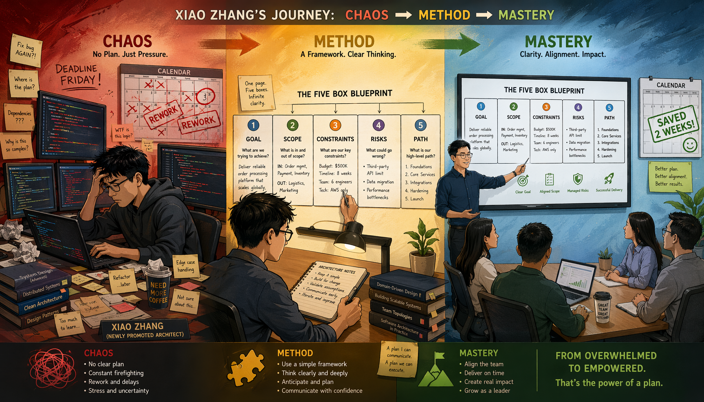
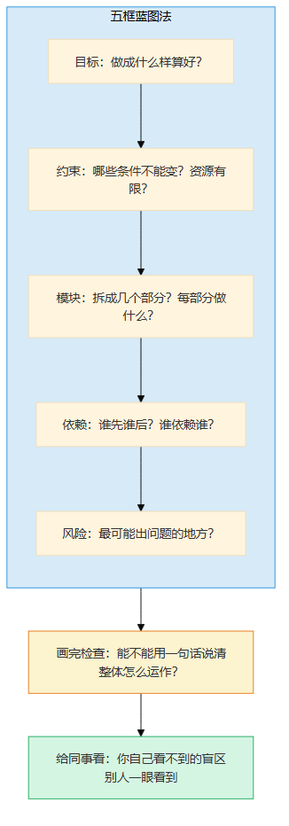
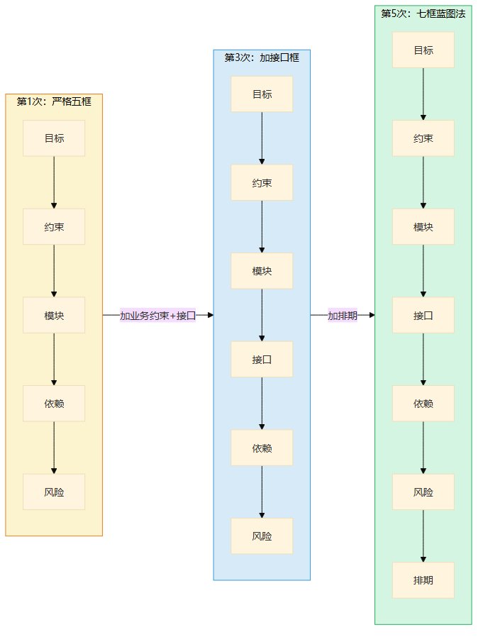
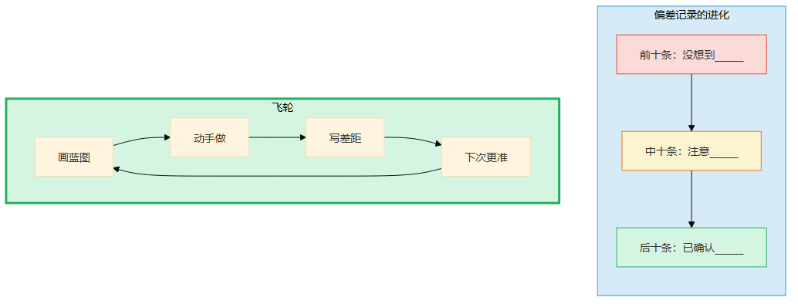
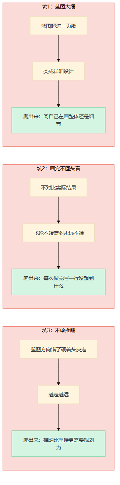
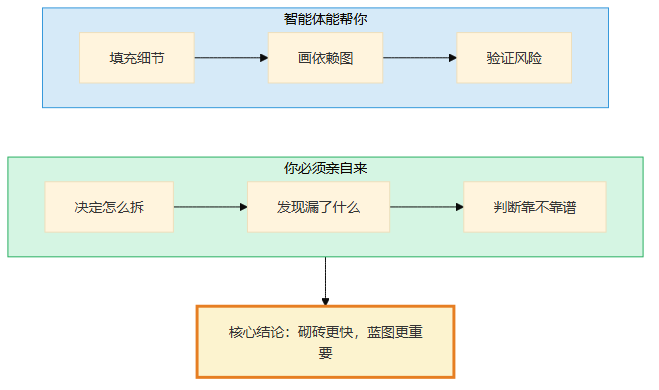
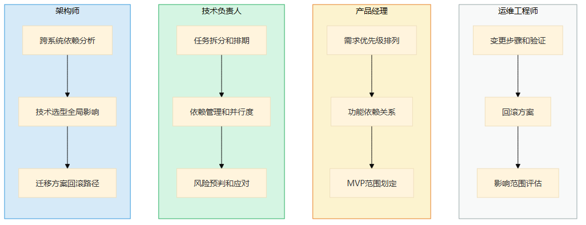

# 第12章 规划力的深潜

> 📍 修炼篇第一章：全局规划力怎么从0长出来

---

**你可能正在想：** "我知道要'先想后做'，但我真的画不出来蓝图——画了也不知道画得对不对。"

这一章就是来回答这个问题的。规划力不是"知道该规划"，是一种需要积累的能力——从画不出到画得出，从画得出到画得准，中间的每一步都有具体的方法。

---

## 一个你认识的人

小张是我认识的人里，规划力变化最大的。

三年前他刚升架构师的时候，我问他："你觉得架构师最重要的能力是什么？"

他想了想说："技术深度。"

我让他负责一个微服务拆分项目。他拿到需求，直接打开IDE开始写代码——先写用户服务，再写订单服务，再写支付服务。写到第三周的时候，他发现用户服务的ID格式跟订单服务不兼容。回过头改用户服务，支付服务的接口又对不上了。改了一周，整体架构已经面目全非。

他跑来找我："我是不是不适合做架构师？"

我说："不是你不适合，是你没有规划就动手了。"

那天晚上，他留下来加班——不是写代码，是在白板上画了一张图。他第一次用了五框蓝图法：目标、约束、模块、依赖、风险。画完之后他看着白板说："如果一开始就画这张图，我至少能省两周。"

三年后的今天，小张带三十人的团队做系统重构。他的团队做任何项目，第一件事不是写代码——是围在白板前画蓝图。团队里的人跟我说："小张的蓝图画完，后面执行基本不会出大问题。"

**从"上来就写代码"到"团队离不开他的蓝图"——这就是规划力从0到1的过程。**



> 图释：建筑师的桌上铺开一张五框蓝图——目标、约束、模块、依赖、风险，五个框用箭头连接成清晰的结构。旁边站着一个小人拿着笔，准备规划。这就是规划力的起点：不是天赋，是方法。五框蓝图法让你在写代码之前，就看到全貌。


> 图释：小张三年规划力进化时间线——从直接写代码（三周返工）到第一次画蓝图（省两周）到团队离不开他的蓝图。关键转折：不是天赋，是方法+积累。

---

## 经验深潜

### 照着做：第一次画蓝图

小张那天晚上画的蓝图，严格来说画得很烂。

五框里，"目标"写了一句话——"拆成微服务"；"约束"空着；"模块"列了四个服务名，但没写每个服务干什么；"依赖"画了三条线，但方向有两个是反的；"风险"写了一个——"可能延期"。

但就是这张很烂的蓝图，让他看到了一个问题：用户服务和订单服务之间有循环依赖。他之前写了三周代码都没发现这个循环依赖——因为代码层面你看不到整体，但蓝图上一眼就能看到。

**第一次画蓝图不需要画得好，需要画出来。**

他的五框蓝图法长这样：

```
① 目标：这件事做成什么样算好？
② 约束：哪些条件不能变？哪些资源有限？
③ 模块：拆成几个部分？每部分做什么？
④ 依赖：部分之间谁先谁后？谁依赖谁？
⑤ 风险：最可能出问题的地方是哪里？
```

画完之后他做了一件事——拿着蓝图去找同事，说："你帮我看一下，这个蓝图有没有什么我漏了的？"

同事一眼就指出了两个问题：第一，"约束"里应该加上"数据库不能停机迁移"；第二，"风险"里"可能延期"太笼统，应该写"订单服务依赖的用户ID格式还没定，会导致接口不兼容"。

**蓝图画完一定要给别人看——你自己看不到的盲区，别人一眼就能看到。**



> 图释：五框蓝图法的五个框——目标、约束、模块、依赖、风险。每个框的关键问题。画完蓝图后，你能用一句话说清楚"整体怎么运作"。

### 改着做：从别人的模板到自己的方法

小张用了五次五框蓝图法之后，开始改它。

第二次用的时候，他发现"约束"框里总是漏东西——他习惯性地只写技术约束，不写业务约束。于是他在"约束"框里加了一个子框："业务约束：用户不能接受什么？"

第三次用的时候，他发现"模块"框不够——他需要知道每个模块的"接口长什么样"，而不仅仅是"每个模块做什么"。于是他在"模块"框后面加了一个"接口"框。

第四次用的时候，他发现五框法没有覆盖"时间线"——哪些先做，哪些后做，哪些可以并行。于是他加了一个"排期"框。

第五次的时候，他定稿了自己的版本——七框蓝图法：目标、约束、模块、接口、依赖、风险、排期。

**不是五框法不对，是五框法是他的起点，不是他的天花板。**

小张跟我说："五框法教会我'先想全貌再动手'这个习惯。但真正适合我的方法，是我改了五次之后的那张图。别人的模板是梯子，不是终点。"



> 图释：小张的蓝图法进化过程——第一次严格五框，第二次加业务约束，第三次加接口框，第四次加排期框，第五次定稿七框蓝图法。模板是起点，不是天花板。

### 想着做：不需要蓝图的规划

小张现在的状态很有意思——他画蓝图越来越快，但他越来越"不画"蓝图了。

不是他不规划了，是规划变成了他的第一反应。同事跟他说"我们要做一个新功能"，他脑子里已经自动展开了：目标是什么、约束有哪些、模块怎么拆、依赖是什么、风险在哪里。他不需要坐在白板前一笔一划地画——他站起来说几句话，全貌就已经在所有人的脑子里了。

有一次我问他："你还需要画蓝图吗？"

他说："简单的不用了——脑子里五秒钟就画完了。复杂的还是得画——因为需要让所有人看到同一个全貌。蓝图不只是给我画的，是给团队画的。"

**规划力内化的信号：你不再"刻意规划"，规划变成了你的本能。同事描述一个复杂问题，你的第一反应是"让我先画一下整体"，而不是"我来试试"。**

### 飞轮怎么运转

小张的飞轮是这样的：

每次项目做完，他都会写一行——"蓝图里没想到的是______"。

第一次写："没想到数据库迁移需要停机窗口。"
第二次写："没想到用户ID格式跟老系统不兼容。"
第三次写："没想到支付接口有调用频率限制。"

三次之后，他的蓝图里多了一个框——"与现有系统的兼容性"。这个框不是五框法教的，是他自己的教训长出来的。

**飞轮的本质：经验不写下来就是经历，写下来才是经验。**

小张现在有一个文档，叫"蓝图偏差记录"——每次做完项目，记一行。他跟我看了这个文档：前十条都是"没想到______"，后十条变成了"注意______"，最近十条变成了"已确认______"。

从"没想到"到"注意"到"已确认"——这就是飞轮转起来的样子。



> 图释：规划力的飞轮——画蓝图→动手做→写差距（蓝图里没想到的是______）→下次蓝图更准。偏差记录从"没想到"到"注意"到"已确认"，就是飞轮转起来的标志。

### 关键转折点

**从照着做到改着做**：小张第一次发现五框法不够用——"约束"框里没地方写业务约束。不是模板错了，是他开始有自己的思考了。这时候就该改模板了。

**从改着做到想着做**：小张第一次在别人还在讨论细节的时候，他已经画出了全貌图。周围人说"你怎么想得这么清楚"——这就是规划力内化的信号。

### 一个没练出来的故事

我认识另一个架构师老何，也试过五框蓝图法。他画了十次，每次都画得很标准——五个框填得齐齐整整。但他的蓝图从来不灵。

为什么？因为他画完蓝图就不管了。他从来没有写过"蓝图里没想到的是______"。蓝图画完，他直接开工，做完了也不回头看。

我跟他说："你得写偏差记录。"

他说："太忙了，下个项目再说。"

下一个项目，蓝图还是一样不准。因为他画蓝图是一个动作，回头看是另一个动作——他只做了第一个。

后来小张跟他聊了一次。小张说："你以为蓝图是画完了就完了？蓝图是画完了才开始——做完了回头看，才发现蓝图哪里画偏了，下次才能画更准。你不回头看，画一百次也是一样的水平。"

老何后来开始写偏差记录了。但他说了一个让我印象很深的话："我以前以为规划力是'画得准'，现在才知道规划力是'画偏了能发现'。能发现自己的蓝图偏了，比画一张完美蓝图重要一百倍。"

**规划力不是天赋，是画偏了→发现了→校准了→再画这个循环转出来的。不转这个循环，方法再好也没用。**

---

## 常见坑

### 坑1：蓝图太细

我见过一个工程师，画蓝图画了三天。每个模块的接口定义、每个数据库表的字段、每个API的参数——全写在蓝图里。

这叫详细设计，不叫蓝图。

蓝图是整体骨架，不是每根骨头的X光片。蓝图超过一页纸，你大概率在做详细设计。详细设计不是不重要，但那是第二步——蓝图是"这个系统长什么样"，详细设计是"每一行代码怎么写"。

蓝图超过一页的时候，问自己一个问题："我现在画的是整体还是细节？"如果是细节，停下来，回到全貌。

**AI可以帮你做详细设计——你给蓝图，AI填充细节。但蓝图得你来画。**

### 坑2：画完不回头看

蓝图画了但不对比实际结果，等于没画。

飞轮的关键是"回头看"。每次做完写一行："蓝图里没想到的是______"——不写这一行，你的蓝图永远不会变准。

小张的前三个项目，蓝图偏差很大。但他每次都写，第四个项目的蓝图就明显准了很多。如果他不写呢？第四个项目的蓝图还是跟第一个一样——因为他的经验没有被校准。

### 坑3：不敢推翻

蓝图画错了不敢推翻，硬着头皮按错误的蓝图走——这是最常见的坑。

推翻蓝图不是失败，是规划力最重要的部分。小张第二次画蓝图的时候，画了一半发现方向不对——他选了微服务架构，但画着画着发现这个系统的核心问题是数据一致性，微服务反而让问题更难。他推翻了整个蓝图，重新画了一张"模块化单体"的蓝图。

**推翻比坚持更需要规划力——因为推翻意味着你看到了"全局不对"，而不只是"局部不对"。**



> 图释：规划力的三个常见坑——蓝图太细（变成详细设计）、画完不回头看（飞轮不转）、不敢推翻（按错误方向走到底）。每个坑的后果和爬出来方法。

---

## 智能体时代的升级

规划力在智能体时代，不是不重要了，是**更重要了**。

为什么？

因为智能体让"砌砖"变快了——以前写一个模块的代码要一周，智能体一天就能写完。但"砌砖"变快意味着什么？意味着蓝图好不好，影响被放大了。

以前蓝图有个小偏差，砌砖慢，你有时间在执行中发现和修正。现在智能体一天就砌完了——蓝图有个方向性错误，一天之后你已经走得很远了。

**砌砖更快，蓝图更重要。**

智能体能帮你做什么？

- 你画蓝图，智能体帮你填充细节——你说"用户服务需要注册和登录"，智能体帮你写API定义和接口文档
- 你定义模块，智能体帮你画依赖图——你说"用户服务、订单服务、支付服务"，智能体帮你检查有没有循环依赖
- 你标注风险，智能体帮你验证——你说"数据库迁移可能有停机风险"，智能体帮你查迁移方案

智能体不能帮你做什么？

- **决定"这个系统应该怎么拆"**——这是蓝图的核心，需要你对业务和技术的全局理解
- **发现"蓝图里漏了什么"**——智能体只能检查你写了什么，不能发现你没写什么
- **判断"这个蓝图靠不靠谱"**——蓝图的质量需要经验来校准，这不是数据能告诉你的



> 图释：智能体时代规划力的变化——砌砖更快（蓝色实线），但蓝图更重要（绿色加粗）。AI帮你填充细节和验证，但"怎么拆"、"漏了什么"、"靠不靠谱"仍需你判断。

---

## 岗位映射

不同角色积累规划力的重点不同：

**架构师**：全局规划力是核心能力。你的蓝图不只是给自己看的——是给整个团队看的。积累重点：跨系统的依赖分析、技术选型的全局影响、迁移方案的回滚路径

**技术负责人**：规划力影响团队效率。一个好的蓝图让团队少返工50%。积累重点：任务拆分和排期、依赖管理和并行度、风险预判和应对方案

**产品经理**：规划力帮你把模糊的需求变成可执行的方案。积累重点：需求优先级排列、功能依赖关系、MVP范围划定

**运维工程师**：规划力让变更更安全。一个好的迁移方案让系统不宕机。积累重点：变更步骤和验证点、回滚方案、影响范围评估



> 图释：规划力在不同岗位的积累重点——架构师（跨系统依赖）、技术负责人（任务拆分排期）、产品经理（需求优先级）、运维工程师（变更安全）。

---

## 今天就能开始

拿出一个你下周要做的任务——不用很大，一个中等复杂度的就行。

花15分钟用五框蓝图法画一张蓝图：目标、约束、模块、依赖、风险。

画完问自己：我能不能用一句话说清楚"整体怎么运作"？

如果能——你的蓝图画对了。

如果不能——回去看看哪个框空着或者太笼统，填上。

> **🔍 "返工预警"诊断3问——你的任务是不是在"边做边想"？**
>
> 做到一半发现"不对劲"时，别急着改代码。先诊断——你到底是"规划不够"还是"执行出了偏差"：
>
> 1. **做到现在，你改了几次方向？** ——改1-2次=正常校准；改3次以上=一开始就没想清楚
> 2. **你是在"修"还是在"加"？** ——修=按蓝图微调，正常；加=蓝图里没有的东西越做越多，说明规划漏了模块
> 3. **队友问"我们要做什么"，你能一句话回答吗？** ——能=你有蓝图；不能=你在"边做边想"
>
> 任一红色信号=停下来花15分钟画蓝图，比继续"边做边改"省3倍时间。

**这15分钟，能省你一整天的返工。**
