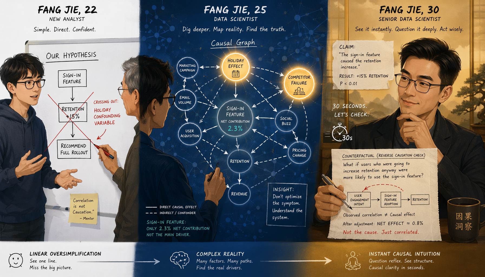
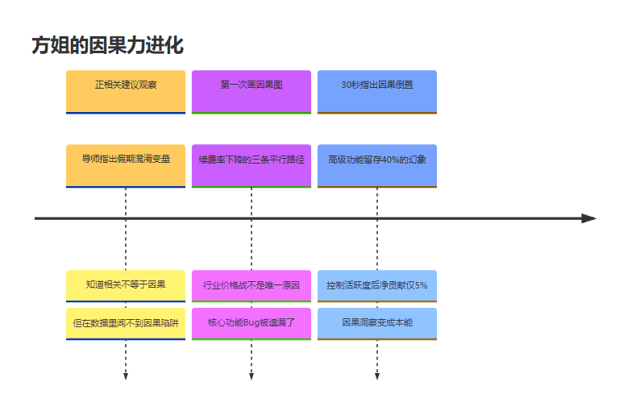
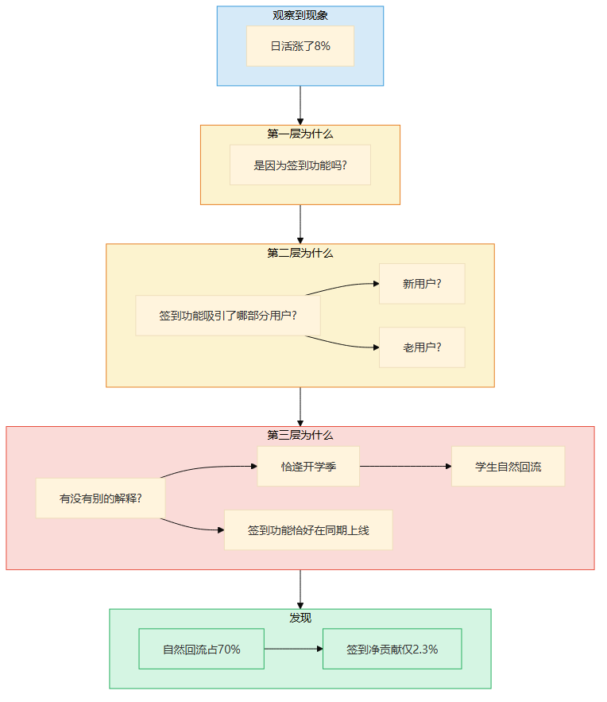
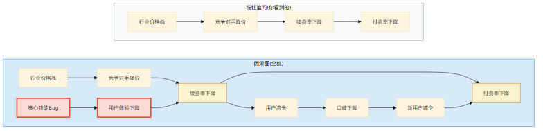
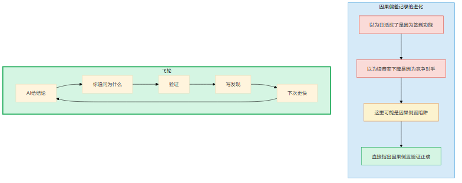
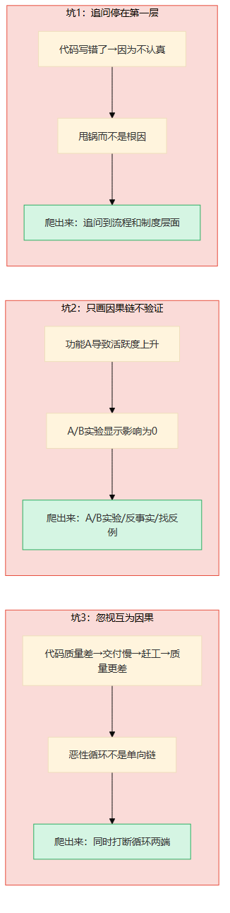
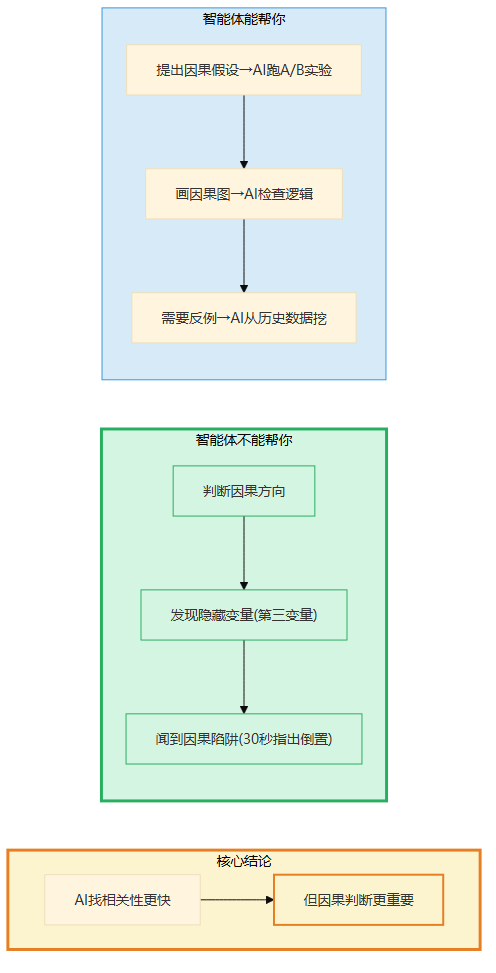
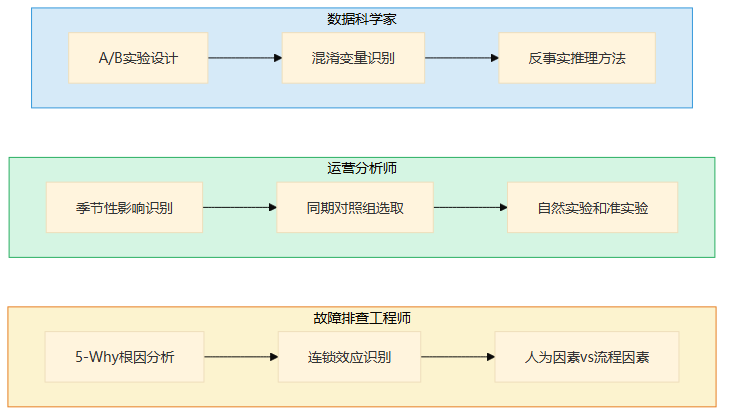

# 第13章 因果力的深潜

> 📍 修炼篇第二章：因果洞察力怎么从0长出来

---

**你可能正在想：** "我知道'相关不等于因果'，但我怎么才能在实际工作中一眼看出因果陷阱？每次都被AI的数据分析说服了。"

这一章回答这个问题。因果力不是"记住'相关≠因果'这句话"，是在数据里闻到陷阱的能力——从被说服到能质疑，中间需要大量"我以为X实际Y"的校准。

---

## 一个你认识的人

你在第6章认识了方姐——那个在P0故障排查中一针见血追问"谁先谁后"的运维工程师。但方姐也不是一开始就能做到的。她修炼因果力的过程，比你可能想的更曲折——中间有过一次"以为追到了因果，其实是混淆变量"的惨痛教训。

方姐是我认识的数据科学家里，最让人服气的。

不是因为她模型写得好——模型写得好的人多了。是因为她能在一堆数据里看出"这个结论可能是反的"。

三年前，方姐刚从统计系毕业加入公司。她的第一份工作是用数据验证运营团队的结论。运营团队说："上线了新推荐算法，用户停留时长涨了15%，说明算法有效。"

方姐在报告里写："新推荐算法与用户停留时长呈正相关，建议继续观察。"

她的导师看了一眼，问她："你有没有想过，假期导致停留时长上涨，而算法上线恰好在假期前？"

方姐愣了。

导师说："相关性不等于因果性——统计学第一课。但知道这句话和能在数据里闻到因果陷阱，中间隔了至少三年实战。"

三年后的今天，方姐在周会上只用了30秒就指出一个因果倒置——"不是'高活跃用户更愿意付费'，是'已经付费的用户因为沉没成本更活跃'。如果你按这个结论去拉活，效果会很差。"数据验证，她对了。

**从"正相关，建议观察"到"30秒指出因果倒置"——这就是因果力从0长出来的过程。**



> 图释：一道向下的阶梯，越走越深。第一层"为什么"——看到表面的规律。第二层"为什么的为什么"——发现隐藏的混淆变量。第三层"根因"——真正的因果链。拿着手电筒往下走的人，就是追问者。AI站在第一层就停了，因为它只会找规律不会问为什么。



> 图释：方姐三年因果力进化时间线——从正相关建议观察（被导师指出假期混淆变量）到第一次画出因果图（发现A和B不是因果关系）到30秒指出因果倒置。关键转折：不是天赋，是追问+验证+积累。

---

## 经验深潜

### 照着做：第一次追问三层为什么

方姐被导师点醒之后，开始了她的"追问练习"。

她用的模板叫**三层为什么追问法**：

```
观察到现象X
→ 为什么？因为Y（第一层）
→ 为什么Y？因为Z（第二层）
→ 为什么Z？因为______（第三层）
→ 到第三层，你通常会发现跟第一层的直觉完全不同
```

头几天，她的追问特别机械。

运营说："用户流失率上升了。"方姐追问："为什么？"运营说："因为产品体验变差了。"方姐又追问："为什么体验变差了？"运营说："因为新版上线了Bug。"

三层了。但方姐自己知道——这不是因果洞察，这是在替别人做采访。她只是在往下挖，没有在判断"这个因果链本身对不对"。

转机出现在第五天。

产品经理说："我们上线了签到功能，日活涨了8%，说明签到功能有效。"

方姐追问了三层：

- 第一层：日活涨了是因为签到功能吗？
- 第二层：签到功能吸引了哪部分用户？是新用户还是老用户？
- 第三层：是不是恰逢开学季，学生用户自然回流，而签到功能只是恰好在同期上线？

她去查了数据——果然，同期自然回流的用户占日活增长的70%。签到功能的净贡献只有2.3%，远低于预期。

**第一次追问到第三层，她发现第一层的直觉完全是错的。**

方姐那天跟我说："以前我觉得'为什么'是往下挖，现在我觉得'为什么'是往旁边看——你追问的不是更深层的原因，而是'有没有别的解释'。"



> 图释：三层为什么追问法——观察现象→第一层为什么→第二层为什么→第三层为什么。到第三层往往发现直觉是错的。追问的关键不是"更深层"，而是"有没有别的解释"。

### 改着做：从追问到画因果图

方姐用了一周的三层追问法，发现了一个问题：追问是线性的，但真实的因果关系不是线性的。

她给我举了一个例子："用户付费率下降了。我追问了三层，得到：付费率下降→因为续费率下降→因为竞争对手降价→因为行业进入价格战。看起来很有道理。但我拿着这条链去给业务方看，业务方说：不对，续费率下降还有一个原因——我们的核心功能出了Bug，用户在续费前刚好遇到了。"

一条链变成了一个网。方姐开始画因果图。

她的画法很简单：

```
A → B → C（A导致B，B导致C）
A ← D（D也影响A，这是你一开始没看到的）
B ↔ E（B和E互为因果，不是单向的）
```

她把那个续费率的例子重新画了一遍：

```
行业价格战 → 竞争对手降价 → 续费率下降 → 付费率下降
核心功能Bug → 用户体验下降 → 续费率下降
续费率下降 → 用户流失 → 口碑下降 → 新用户减少 → 付费率下降
```

画完之后，她盯着图看了半天，说了一句话："我之前漏了最关键的一条——核心功能Bug也导致了续费率下降。这条链跟竞争对手降价是平行的，不是串行的。如果我只看'行业价格战'这条线，我的结论就是'我们也得降价'——但降价解决不了Bug的问题。"

**因果图画出来，你才能看到全貌。追问是探照灯，因果图是地图。**

但方姐也不是每次都能画对的。

有一次她画了一张因果图——"部署频率高的团队线上故障更少"——她的结论是"频繁部署促进了小批量发布，降低了故障风险"。她甚至画了一条漂亮的因果链：部署频率高→变更量小→故障风险低→线上故障少。

结果三个月后复盘，另一个团队做了对照实验：控制了"团队成熟度"这个变量之后，部署频率对故障率的影响从显著变成了不显著。真正的原因是——成熟的团队既部署频繁又故障少，这两件事都是"团队成熟"的结果，不是因果关系。

**方姐的因果图画对了箭头，但漏了一个隐藏的根因——C同时导致了A和B。** 她从那以后在因果图上加了一条规则：每画完一张图，最后问一句"有没有一个我还没画出来的C，同时导致了这里的两个节点？"

这个失败比她的成功更有价值。它教会她一件事：因果图只是你当前理解的快照，不是真相。你的图可能永远不完整，但"我知道它可能不完整"这个意识本身，就是因果洞察力的一部分。

方姐后来每次分析问题都画因果图。画了七八次之后，她有了自己的方法——她给每条箭头加一个"强度"：粗线是强因果，细线是弱因果，虚线是可能的因果。这样一眼就能看出"最关键的那条链是什么"。



> 图释：从线性追问到因果图的升级——续费率下降的完整因果网络：行业价格战、核心Bug、口碑下降三条平行路径。追问是探照灯，因果图是地图。每条箭头加"强度"——粗线强因果，细线弱因果，虚线可能因果。

### 想着做：闻到因果陷阱

方姐现在的状态很有意思——她不再刻意画因果图，但看到任何结论，脑子里会自动展开因果推理。

有一次产品评审会上，数据分析师展示了一个结论："使用高级功能的用户留存率比不使用的高40%，所以我们建议引导用户使用高级功能来提升留存。"

方姐几乎脱口而出："这个可能是因果倒置——不是'使用高级功能导致留存高'，是'本来就留存意愿强的用户更愿意探索高级功能'。你应该比较的是：同样留存意愿的用户，使用高级功能和不使用的留存差异，而不是直接比两组用户。"

全场安静了两秒。分析师回去重新跑数据——果然，控制了用户活跃度之后，高级功能对留存的净贡献只有5%，远不如40%那么惊人。

**30秒内指出因果倒置——这是因果洞察力内化的信号。**

方姐跟我说她怎么做到的："不是我聪明，是我见过太多这种陷阱了。'用了X的人Y更好'和'X导致Y更好'，这两件事在数据上看起来一模一样。但你只要问一个问题：'如果反过来呢？是不是Y更好的人更愿意用X？'——这个反问，就是因果洞察力的核心。"

### 飞轮怎么运转

方姐的飞轮是这样的：

每次AI或者同事给了一个结论，她追问为什么，然后验证——用实验、用数据、用反例。

验证完之后，她写一行："我以为的原因是X，实际原因是Y。"

第一次写："以为日活涨了是因为签到功能，实际是因为开学季自然回流。"
第二次写："以为续费率下降是因为竞争对手降价，实际是因为核心功能Bug。"
第三次写："以为高级功能提升留存40%，实际净贡献只有5%，因果倒置。"

三次之后，她形成了一个本能：看到任何"因为A所以B"的结论，第一反应就是"有没有可能B导致A？或者C同时导致了A和B？"

**飞轮的本质：每一次"我以为X，实际Y"的记录，都在校准你下一层追问的方向。**

方姐现在有一个文档叫"因果偏差记录"——前几条都是"以为______，实际______"，后面变成了"这里可能是______陷阱"，最近的变成了"直接指出______倒置，验证正确"。

从"以为"到"可能"到"直接指出"——这就是飞轮转起来的样子。



> 图释：因果力的飞轮——AI给结论→你追问为什么→验证（实验/数据/反例）→写下"我以为X实际Y"→下次追问更快。偏差记录从"以为"到"可能"到"直接指出"，就是飞轮转起来的标志。

### 关键转折点

**从照着做到改着做**：方姐第一次画因果图时发现"原来A和B不是因果关系，是C同时导致了A和B"——这个"啊哈时刻"让她上瘾，她开始到处找因果陷阱。追问是线性的，因果图让你看到网状的全貌。

**从改着做到想着做**：方姐第一次在会议中说出"我觉得这个结论可能是因果倒置"——然后被数据验证她说对了。这种正反馈让因果洞察变成她的本能。30秒指出因果倒置，不是天赋，是几十次"我以为X实际Y"之后的压缩。

---

## 常见坑

### 坑1：追问停在第一层

"为什么出Bug？因为代码写错了。"

这不是因果洞察，这是甩锅。

方姐见过最极端的例子：一个故障复盘会上，有人写了根因是"开发人员疏忽"。追问第二层："为什么疏忽？"答："因为不认真。"追问第三层："为什么在这个模块不认真？"——没人答上来了。

方姐自己追问下去："这个模块的代码评审覆盖率是多少？"答：0%。"为什么没有代码评审？"答："因为这个模块是紧急需求，跳过了评审流程。"

**到了第三层，根因不是"不认真"，而是"紧急需求跳过评审流程"——这是一个流程问题，不是态度问题。**

第一层追问只给你表面原因，第三层才给你可行动的根因。方姐的经验是：如果追问到第三层还是"态度不好""不够认真"这类词，说明你没追到位——再往下，一定是流程、制度或者激励的问题。

### 坑2：只画因果链不验证

因果图画得再漂亮，不验证就是猜想。

方姐见过一个产品经理，画了一张特别漂亮的因果图："功能A导致用户活跃度上升→活跃度上升导致付费率上升→付费率上升导致收入增加"。逻辑自洽，因果链清晰，老板很满意。

但方姐问了一个问题："你有没有做A/B实验验证功能A对活跃度的影响？"

没有。

后来做了A/B实验——功能A对活跃度的影响是0。原来活跃度上升是同期市场活动的效果，跟功能A完全无关。

**验证方法：A/B实验、反事实推理、找反例。**

- A/B实验：控制其他变量，只改A，看B会不会变
- 反事实推理：如果A没有发生，B还会不会发生？
- 找反例：有没有A发生了但B没变的案例？

方姐的经验是：因果图画完，至少用其中一种方法验证最关键的那条链。不验证的因果图，跟不画一样。

### 坑3：忽视互为因果

现实世界中大量"A和B互为因果"的情况，但因果图里最容易漏掉双向箭头。

方姐举了一个例子：团队说"代码质量差导致交付慢"。听起来很合理。但方姐追问："交付慢会不会也导致代码质量差？"

答案是：会的。因为交付慢→项目压力增大→赶工→走捷径→代码质量更差→交付更慢。

**这是一个恶性循环，不是一条单向链。** 如果你只看到"代码质量差导致交付慢"，你的解决方案就是"提升代码质量"——但提升代码质量需要时间，交付压力更大，走捷径更多，代码质量反而更差。

正确的解法是同时打断循环的两端——比如：短期内增加人力缓解交付压力，同时引入代码评审提升质量。双向解法，不是单向解法。



> 图释：因果力的三个常见坑——追问停在第一层（甩锅而不是根因）、只画因果链不验证（猜想不是洞察）、忽视互为因果（漏掉恶性循环）。每个坑的后果和爬出来方法。

---

## 智能体时代的升级

因果力在智能体时代，不是不重要了，是**更重要了**。

为什么？

因为智能体列相关性比人类快100倍。你给它一堆数据，它一秒钟就能告诉你"A和B的相关系数是0.87"。但相关系数0.87不能告诉你A导致B、B导致A、还是C同时导致A和B。

智能体越擅长找相关性，因果判断就越重要——相关性结论太容易拿了，大家随手就把高相关性当因果用。方姐的工作从"自己找相关性"变成了"帮团队纠正错误归因"——需求量反而更大了。

**AI看现象更快，判断因果方向仍需人类。**

智能体能帮你做什么？

- 你提出因果假设，智能体帮你跑A/B实验——你说"功能A可能影响活跃度"，智能体帮你设计实验、收集数据、计算效果量
- 你画因果图，智能体帮你检查逻辑——你说"A导致B导致C"，智能体帮你检查有没有遗漏的变量
- 你需要反例，智能体帮你找——你说"有没有A发生但B没变的案例"，智能体帮你从历史数据里挖

智能体不能帮你做什么？

- **判断因果方向**——"A和B相关"和"A导致B"的区别，需要你对业务的理解，不是数据能告诉你的
- **发现隐藏变量**——C同时导致A和B，这种"第三变量"需要你对场景的熟悉，AI只能检查你列出的变量
- **闻到因果陷阱**——"30秒指出因果倒置"这种能力，是几十次"我以为X实际Y"校准出来的直觉，不是算法能替代的



> 图释：智能体时代因果力的变化——AI找相关性更快（蓝色实线），但因果判断更重要（绿色加粗）。AI帮你跑实验、检查逻辑、找反例，但判断因果方向、发现隐藏变量、闻到因果陷阱仍需人类。

---

## 岗位映射

不同角色积累因果力的重点不同：

**数据科学家**：因果力是核心能力。你的分析结论直接影响业务决策，因果倒置的代价可能是整个战略方向错。积累重点：A/B实验设计、混淆变量识别、反事实推理方法

**运营分析师**：运营数据里最容易出"虚假因果"——"做了A之后指标涨了"几乎永远不能直接说"因为A所以涨了"。积累重点：季节性和周期性影响识别、同期对照组选取、自然实验和准实验方法

**故障排查工程师**：排查故障就是在找根因——"表象→直接原因→根因"本身就是三层追问。积累重点：根因分析方法论（5-Why、鱼骨图）、系统故障的连锁效应识别、人为因素和流程因素的区分



> 图释：因果力在不同岗位的积累重点——数据科学家（A/B实验/混淆变量）、运营分析师（季节性/对照组）、故障排查工程师（根因分析/连锁效应）。

---

## 今天就能开始

拿出一个你最近接受的结论——"因为A所以B"，可以是周报里的、会议上的、新闻里看到的。

花5分钟用三层为什么追问法追问三层：

- 第一层：为什么A导致B？
- 第二层：还有没有别的原因也能导致B？
- 第三层：有没有可能B也影响了A？或者C同时影响了A和B？

追问到第三层，问自己：第一层的直觉哪里错了？

如果你能说出来——恭喜，你刚刚完成了第一次因果洞察。

**如果说不出来——没关系。把这个结论和你追问到的东西写下来。一周之后回头看，你的直觉在变准。**

> **🧩 "因果vs相关"实战速查卡——6种常见假因果**
>
> 别被"因为A所以B"忽悠了。6种最常见的假因果，一查一个准：
>
> | 假因果类型 | 特征 | IT实战例子 | 怎么拆穿 |
> |-----------|------|-----------|---------|
> | 倒置因果 | A和B相关，但其实是B→A | "上线后性能变差"→其实是流量涨了才上的线 | 查时间顺序 |
> | 共同原因 | C同时导致A和B | "新功能上线时bug也多了"→其实是赶工期同时导致了代码质量下降 | 找第三方C |
> | 偶然巧合 | A和B碰巧一起出现 | "每次你值班系统就正常"→样本太小 | 扩大样本量 |
> | 选择偏差 | 只看了成功/失败的样本 | "用了新框架的项目都成功了"→失败的项目你根本不知道 | 找全量数据 |
> | 修删变量 | 控制了C之后A和B不再相关 | "高薪→绩效好"→控制了经验后相关性消失 | 控制变量重算 |
> | 混淆因子 | A→B但中间隔了C | "代码评审→质量好"→其实是评审推动了更认真的开发习惯 | 拆中间步骤 |
>
> 口诀：**看到因果先怀疑，时间顺序查一遍，找找第三方，扩大样本看**。
