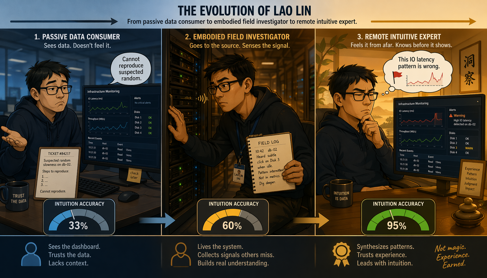
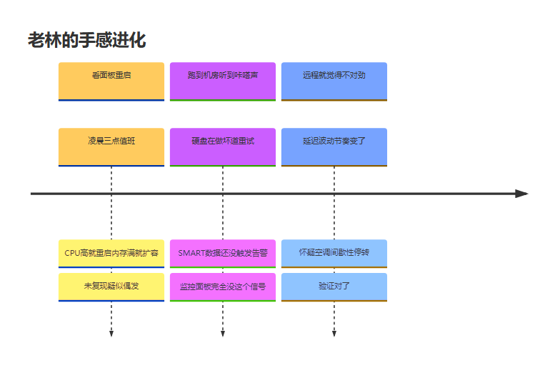
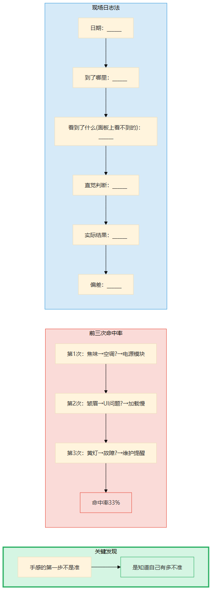
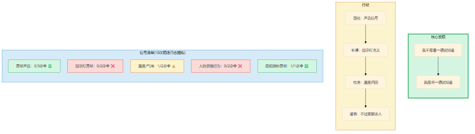
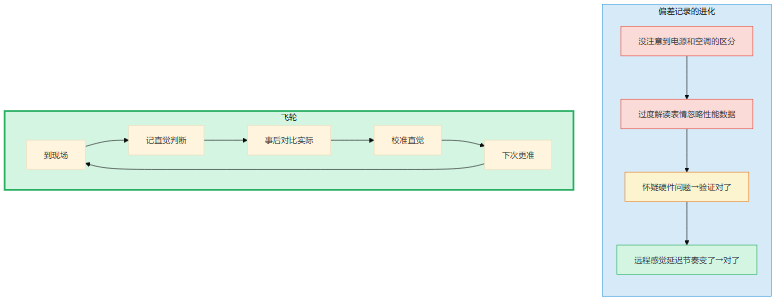
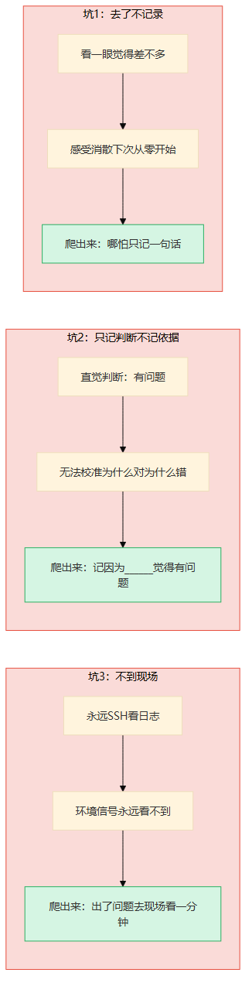
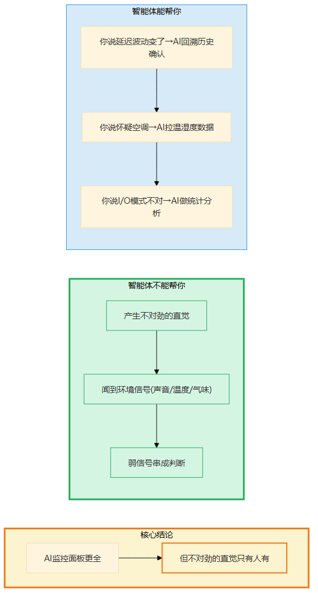
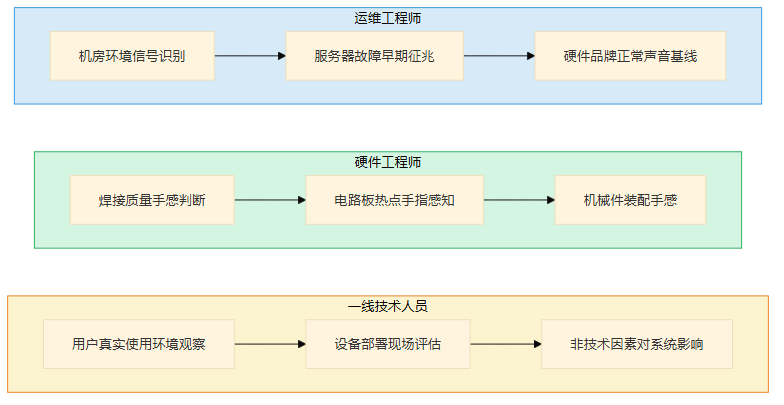

# 第14章 手感的深潜

> 📍 修炼篇第三章：现场判断力怎么从0长出来

---

**你可能正在想：** "手感是天赋吧？我怎么可能练出那种'看一眼就知道'的感觉？"

不是天赋。老林前三次现场判断的命中率只有33%。手感是一种可以从0积累的能力——但你必须到场，必须记录，必须校准。不到场就没有素材，不记录就不知道自己准不准，不校准就永远停在33%。

---

## 一个你认识的人

上一章方姐的因果力，靠的是"追问"——脑子里的功夫。这一章说的"手感"，是另一回事：它不靠追问，靠"在场"。你在第7章认识了老林——凌晨两点被直觉叫醒的机房运维。但老林也不是天生有"嗅觉"的。他修炼手感的过程里，有一次"以为听到了问题，结果白跑一趟"的尴尬经历——但正是那次尴尬，让他找到了手感真正的来源。

老林是我认识的运维工程师里，最让我服气的。

不是因为他技术最强——Kubernetes集群搭建比他快的人有的是。是因为他有一种"不对劲"的嗅觉。

五年前，老林刚进公司，就是个普通的值班工程师。凌晨三点接到告警，看监控面板，CPU高了重启，内存满了扩容，磁盘满了清日志。每次都解决，但每次都是事后补救。

有一次，线上服务间歇性超时。监控面板上CPU、内存、网络全部正常。老林按流程排查了一圈——日志没有Error，链路追踪没有异常，数据库慢查询也没有。他写了报告："未复现，疑似偶发。"

第二天又超时了。还是监控一切正常。

第三天，老林实在坐不住了，凌晨跑到机房。

他站在服务器旁边，听到了一种细微的"咔嗒"声——每隔大约30秒响一次。凑近一听，是一块硬盘在做坏道重试。SMART数据还没触发告警阈值，但磁盘已经不健康了。I/O偶尔卡顿，依赖磁盘的服务间歇性超时。

**监控面板上完全没有这个信号。但老林站在机房里，听到了。**

他跟我说："那一刻我才明白，监控面板看到的是'已经出问题了'，声音告诉你的是'快要出问题了'。"

五年后的今天，老林远程看数据面板，偶尔会说一句"我觉得不太对劲"。同事们不信，但每次验证下来，他基本都对。

**从"看面板重启"到"远程就觉得不对劲"——这就是手感从0长出来的过程。**



> 图释：一只手伸向成千上万颗发光的小点，每颗点代表一次"走进机房→听声音→记住正常是什么样的→发现不对"的经验。随着触摸的点越多，图案越清晰、越明亮——这就是手感：一万次体验压缩成一次直觉。不是天赋，是积累。



> 图释：老林五年手感进化时间线——从看面板重启（写"未复现疑似偶发"）到跑到机房听到硬盘咔嗒声（监控面板完全没这个信号）到远程看数据就觉得不对劲（基本都对）。关键转折：不是天赋，是到现场+记录+校准。

---

## 经验深潜

### 照着做：第一次写现场日志

老林那次机房之行之后，他的导师让他做一件事——**现场日志法**。

模板长这样：

```
日期：______
到了哪里：______
看到了什么（数据面板上看不到的）：______
直觉判断：______
实际结果：______
偏差：______
```

老林一开始觉得这东西很蠢。"我都已经找到问题了，为什么还要写什么日志？"

导师说："你找到问题是因为运气——你碰巧站在了服务器旁边。如果你没碰巧呢？你需要的是让运气变成可重复的能力。记录就是做这件事。"

老林半信半疑地开始记。

第一次：去了机房，闻到一股焦味——是空调故障导致温度过高。直觉判断：空调坏了。实际结果：确实是空调故障，但焦味来自过载的电源模块，不是空调本身。偏差：判断对了方向，但具体原因错了。

第二次：去用户现场，看到用户操作界面的时候皱了一下眉头。直觉判断：UI不够直观。实际结果：用户皱眉是因为页面加载慢，不是因为UI设计。偏差：归因错了——不是设计问题，是性能问题。

第三次：去工厂车间，看到一台机器的指示灯闪了一下黄光。直觉判断：机器可能有问题。实际结果：黄光是正常的维护提醒，不是故障。偏差：误判——对设备状态不熟悉。

**前三次，他的直觉命中率只有33%。**

但老林发现了一件事：如果不记下来，他根本不知道自己33%的命中率——他会以为自己"基本上都对"。

**手感的第一步不是"准"，是"知道自己有多不准"。**



> 图释：现场日志法的五个字段——日期、到了哪里、看到了什么（面板上看不到的）、直觉判断、实际结果、偏差。前三次命中率33%，但记录让你知道自己有多不准。手感的第一步不是"准"，是"知道自己有多不准"。

### 改着做：提炼信号清单

老林连续记了10次现场日志之后，做了一件事——回顾。

他把10条记录摊在桌上，找共同点：判断对了的时候，有什么共同特征？判断错了的时候，有什么共同特征？

他发现了一个规律：

**判断对了的三次，都是因为注意到了"声音"**——硬盘的咔嗒声、风扇的异响、服务器蜂鸣器的间歇性报警。他的"嗅觉"其实是"听觉"。

**判断错了的七次，有五次是因为对设备状态不熟悉**——把正常的指示灯当成故障，把季节性变化当成异常，把用户习惯当成问题。

他提炼出了自己的**信号清单**：

| 信号类型 | 我判断对了吗 | 说明 |
|---------|------------|------|
| 异常声音 | 3/3 | 声音是我最准的信号 |
| 指示灯异常 | 0/2 | 我对灯号不够熟悉，需要补课 |
| 温度/气味 | 1/2 | 焦味判断对方向但归因错 |
| 人的表情/行为 | 0/2 | 容易过度解读 |
| 数据面板上的微妙异常 | 1/1 | 偶尔能感觉到 |

**信号清单让你知道自己"闻到什么味道"的时候最准。**

老林跟我说："原来我以为自己'看一眼就知道'，其实我不是'看'，我是'听'。如果我不回顾这10条记录，我永远不知道自己的手感到底是什么。"

从那以后，老林去现场的时候，会特别关注声音信号——不是因为别的信号不重要，而是因为他知道这是自己判断最准的通道。同时他也在补课：指示灯的含义、设备正常的温度范围、用户常见的操作模式。

**手感不是一种笼统的"感觉"，是可以被分解和校准的。**



> 图释：从10次现场日志提炼信号清单——声音3/3最准、指示灯0/2不熟悉、温度气味1/2方向对归因错、人表情0/2过度解读、面板异常1/1偶发。手感不是笼统的"感觉"，是可以被分解和校准的。

### 想着做：远程就觉得不对劲

老林现在的状态很有意思——他越来越少去现场，但"不对劲"的嗅觉反而更准了。

不是他不去现场了，是他的手感从"必须在现场"进化到了"数据面板上的异常模式也能触发"。

有一次，我跟他一起值夜班。凌晨两点，监控面板上一片绿色——CPU、内存、网络、磁盘全部正常。但老林盯着面板看了30秒，说："我觉得不太对劲。"

我问："哪里不对？"

他说："说不清。就是……你看这个网络延迟的曲线，虽然都在正常范围内，但波动的节奏变了。以前是平稳的小波动，现在变成了有节奏的锯齿形。这种模式我见过——上次机房空调故障之前也是这样的。"

他打电话让值班同事去机房看一眼——果然，空调的压缩机在间歇性停转，机房温度在缓慢上升。虽然还没触发温度告警，但服务器已经开始做轻微的降频保护，网络延迟的波动模式就变了。

**远程看数据面板就觉得"不对劲"——然后到现场验证确实有问题。**

老林跟我说："我现在去现场的次数少了，但每次去都是'验证'而不是'发现'——数据面板上的模式已经让我有预判了，去现场是为了确认。"

**手感内化的信号：你说"我觉得有问题"，同事信任你的判断而不是问"数据呢？"**

### 飞轮怎么运转

老林的飞轮是这样的：

到现场 → 记录直觉判断 → 事后对比实际 → 校准直觉 → 下次直觉更准。

每次校准写一行："我以为没问题但出了问题，因为没注意到______"或者"我以为有问题但实际没问题，因为我误判了______"。

前几条：
- "以为空调故障导致焦味，实际是电源模块过载——没注意到电源和空调的区分"
- "以为用户皱眉是UI问题，实际是加载慢——过度解读了表情，忽略性能数据"
- "以为黄灯是故障，实际是维护提醒——对设备状态不熟悉"

中间几条：
- "网络延迟波动模式变了，怀疑硬件问题——验证对了"
- "用户反馈页面卡顿，怀疑数据库——实际是CDN配置变更"

最近的几条：
- "远程看延迟曲线节奏变了，怀疑空调——验证对了"
- "感觉I/O模式不对，怀疑某块磁盘——SMART数据还正常，但I/O延迟确实高了"

从"没注意到"到"怀疑"到"远程感觉"——这就是飞轮转起来的样子。

**直觉不是天赋，是被校准过的模式识别。老工程师"看一眼就知道"的能力，就是几千次校准后的压缩。**



> 图释：手感的飞轮——到现场→记直觉判断→事后对比实际→校准直觉→下次更准。偏差记录从"没注意到______"到"怀疑______"到"远程感觉______"，就是飞轮转起来的标志。直觉不是天赋，是被校准过的模式识别。

### 关键转折点

**从照着做到改着做**：老林第一次回顾10条现场日志，发现"我判断对的时候都是因为注意到了声音"——他开始知道自己的"嗅觉"到底是什么。不是笼统的"感觉"，是可以被分解的信号。

**从改着做到想着做**：老林第一次远程看数据面板就觉得"不对劲"——然后到现场验证确实有问题。他的"嗅觉"已经从"必须在现场"进化到"数据面板上的异常模式也能触发"。

---

## 常见坑

### 坑1：去了现场不记录

这是最常见的坑。去了现场，看了一眼，觉得"嗯，是这样"，然后就走了。过两天同样的问题又出来了，你还是从头开始排查。

老林见过一个同事，每次出问题都跑去机房看，看了好几次都"觉得差不多"，但从来说不清"差不多是哪样"。结果同一台服务器出了三次问题，每次排查的起点都不一样——因为他从来没有把第一次的经验沉淀下来。

**感受不记录就会消散，下次从零开始。**

老林的经验是：去了现场，哪怕只看了一分钟，也要记一句话。一句话都行——"声音正常，温度偏高，闻到一点焦味"。下次来的时候，你至少有一个对比的基线。

### 坑2：只记判断不记依据

"我觉得有问题。"

这句话写在现场日志里等于没写。问题是：你为什么觉得有问题？你注意到了什么？

老林早年间也犯过这个错。他写了"直觉判断：有问题"，但没有写"因为听到了间歇性的咔嗒声"。第二天回头看的时候，他完全想不起来自己当时是怎么判断的——只剩下"我觉得有问题"这个空壳。

**"我觉得有问题"不够，要记"因为______觉得有问题"。**

判断是对是错，取决于依据。不记依据，你就无法校准——你不知道自己是对了还是错了，更不知道为什么对为什么错。

### 坑3：不到现场

最常见也最致命。

老林跟我说："现在很多年轻工程师，出了问题第一反应是SSH上去看日志——永远不去现场。日志能告诉你'发生了什么'，但不会告诉你'环境的温度、声音、气味、人的状态'。这些是日志永远记不下来的。"

他举了个例子：有一次，一台服务器反复OOM。远程排查了两天——调JVM参数、分析heap dump、优化GC策略——都没用。老林去了现场，发现那台服务器放在空调出风口正下方，机房冷风直吹导致磁盘性能下降，swap频繁触发，进而导致OOM。调了空调出风口方向，问题就解决了。

**这个根因，日志里看不到，传感器里也看不到。**

老林说："远程排查像看X光片，到现场像做全身体检。X光能看到骨头有没有断，全身体检能告诉你生活方式哪里出了问题。"



> 图释：手感的三个常见坑——去了不记录（感受消散下次从零开始）、只记判断不记依据（无法校准为什么对为什么错）、不到现场（日志永远看不到环境信号）。每个坑的后果和爬出来方法。

---

## 智能体时代的升级

手感在智能体时代，不是不重要了，是**更重要了**。

为什么？

因为智能体的监控面板比你全100倍——CPU、内存、网络、磁盘、链路追踪、日志聚合，所有数据一目了然。但"不对劲"的直觉只有人有。

智能体的监控越全，"面板上没有但你能感觉到"的东西就越值钱——面板上看得到的问题，智能体都比人快；剩下的，就是那些传感器覆盖不到的信号：环境的声音、温度、气味，设备的微妙状态，人的表情和反应。

**AI监控面板更全，但"不对劲"的直觉只有人有。**

智能体能帮你做什么？

- 你说"延迟波动模式变了"，智能体帮你回溯历史曲线确认——"过去7天的波动模式确实跟今天不同"
- 你说"怀疑空调问题"，智能体帮你拉出温湿度传感器数据——"机房A区温度比正常高2度"
- 你说"这个I/O模式不对"，智能体帮你做统计分析——"I/O延迟的第99百分位比过去30天高了40%"

智能体不能帮你做什么？

- **产生"不对劲"的直觉**——老林盯着面板30秒就觉得不对，这种"微妙异常模式识别"是几千次校准的结果，不是算法能从面板上算出来的
- **闻到环境信号**——声音、温度、气味、人的状态，这些是传感器网络没有覆盖的
- **把微弱的信号连成判断**——"延迟波动+空调历史+I/O模式"三条弱信号串成"空调在间歇性停转"的判断，需要经验，不是数据



> 图释：智能体时代手感的变化——AI监控面板更全（蓝色实线），但"不对劲"的直觉更重要（绿色加粗）。AI帮你回溯确认、拉传感器数据、做统计分析，但产生直觉、闻到环境信号、弱信号串成判断仍需人类。

---

## 岗位映射

不同角色积累手感的重点不同：

**运维工程师**：手感是核心竞争力。监控面板能看到"已出问题"，手感能让你"提前感觉到"。积累重点：机房环境信号识别（声音/温度/气味）、服务器故障的早期征兆模式、不同硬件品牌的"正常声音"基线

**硬件工程师**：手感直接决定调试效率。示波器上的波形、焊点的颜色、电路板的温度分布——这些是仪器数据的补充，不是替代。积累重点：焊接质量的手感判断、电路板热点的手指感知、机械件的装配手感

**一线技术人员**：无论是驻场开发还是技术支持，到现场跟远程完全是两种能力。积累重点：用户真实使用环境的观察、设备部署环境的现场评估、非技术因素对系统的影响（如电源不稳定、网络抖动）



> 图释：手感在不同岗位的积累重点——运维工程师（环境信号/早期征兆/声音基线）、硬件工程师（焊接手感/热点感知/装配手感）、一线技术人员（用户环境/现场评估/非技术因素）。

---

## 今天就能开始

下次你遇到一个"监控一切正常但就是不对"的问题——别急着关掉面板。

做一件事：去现场。

不用带什么设备，就人去。站在那里看一分钟，听一分钟，闻一分钟。

然后拿出手机，打开备忘录，写一句话："我看到了/听到了/闻到了______，我的直觉判断是______。"

事后回来看：你的直觉对了吗？

**如果你对了——记住这个信号，它是你的手感来源。**
**如果你错了——也记住，它是你需要校准的地方。**

手感不是天赋。是被校准过的模式识别。你现在校准，三年后你就是那个"看一眼就知道"的人。

> **📝 "手感→可传授"转化模板**
>
> 手感最怕"只在一个人脑子里"。用这个模板把你的手感从"不可传授"变成"可传授"：
>
> | 步骤 | 问自己 | 输出 |
> |------|--------|------|
> | 1. 信号 | "我判断对了的时候，共同特征是什么？" | 列出3-5个具体信号（不是"感觉不对"，而是"IO延迟曲线翘头"） |
> | 2. 规律 | "这些信号对应什么判断？" | 信号→判断的映射（翘头→即将慢查询） |
> | 3. 条件 | "什么情况下这个规律会失效？" | 失效条件（如果读多写少，翘头可能正常） |
> | 4. 传授 | "我能教新人用这个规律吗？" | 写成检查清单，新人能照着做 |
>
> 完成第4步=你的手感从"默会知识"变成了"显性知识"。教不出去的部分=真正的手感核心，你比AI不可替代的地方。
