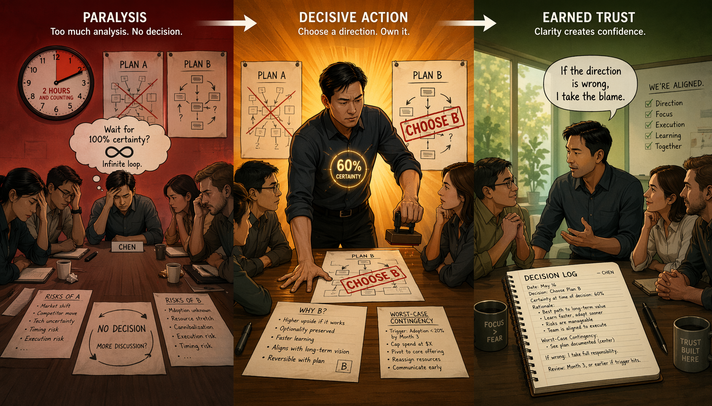
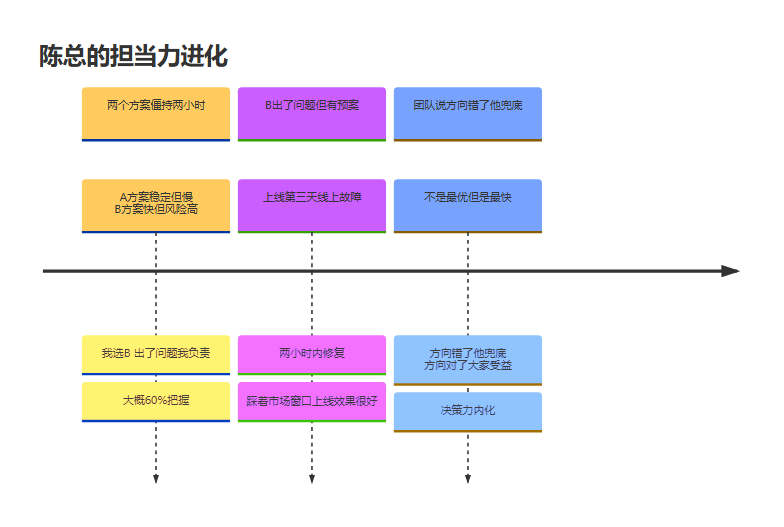
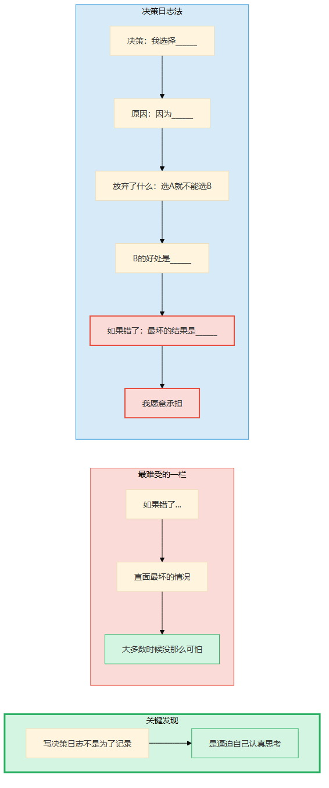
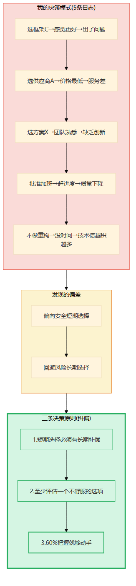
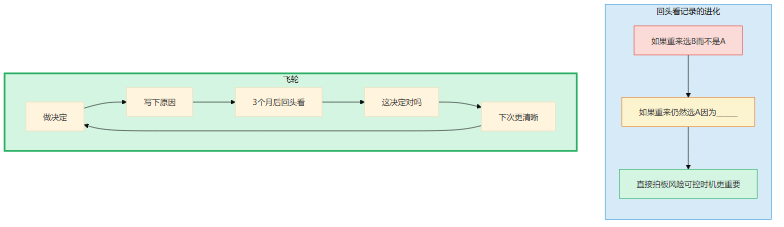
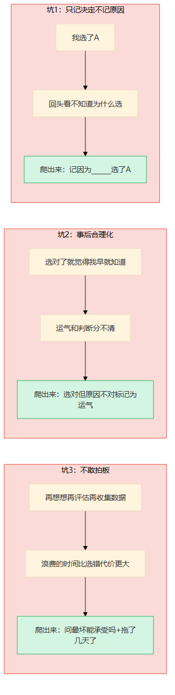
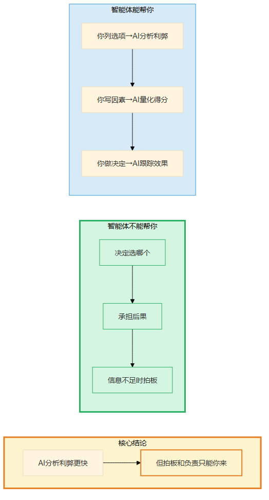
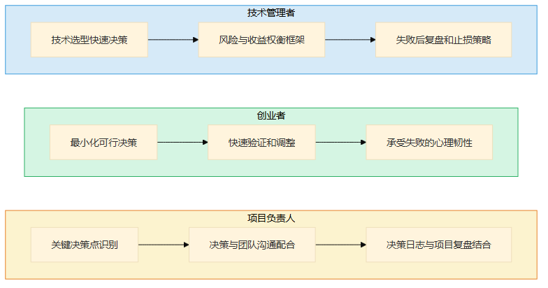

# 第15章 担当力的深潜

> 📍 修炼篇第四章：决策担当力怎么从0长出来

---

**你可能正在想：** "拍板这种事，敢就行了吧？多拍几次就熟练了。"

不是敢就行。陈总60%把握就拍板，不是因为他胆大，是因为他写了决策日志、提炼了决策原则、知道最坏情况是什么。没有这些，那叫冲动，不叫担当。担当力是"在不确定中选择，选完了不纠结"——这个"不纠结"才是最难的。

---

## 一个你认识的人

你在第8章认识了陈总——那个在三个团队都说"再投一点就能好"的时候拍板"砍掉"的技术VP。但"砍"是一个具体的决定，它发生在某个瞬间。担当力真正的修炼，不是"敢拍板"那一瞬间，是拍板之前和之后的漫长过程——你凭什么敢拍？拍完之后怎么校准？这比"敢"难得多。

陈总是我认识的技术管理者里，拍板最快的。

不是因为他冲动——冲动的人拍板快但后果惨。是因为他能在信息不足的情况下做决定，而且团队愿意跟他。

四年前，陈总还是技术总监的时候，有一次项目评审会上，两个方案僵持不下。A方案稳定但交付慢，B方案快但技术风险高。两个团队各执一词，吵了两个小时没结果。

陈总最后说："选B。"

有人问："万一出了问题呢？"

陈总说："出了问题我负责。"

散会后，我问陈总："你有多大把握选B？"

他想了想说："大概60%。"

"60%你就拍板了？"

他说："等100%就太晚了。60%够动手了，剩下的边做边调。选A虽然稳，但交付晚了市场窗口就没了——那个代价比B出问题更大。"

**那次B方案确实出了问题——上线后第三天出了一个线上故障。但陈总早有预案，两小时内修复了。项目最终踩着市场窗口上线，效果很好。**

陈总跟我说："如果你等到100%才做决定，你不是在做决策，你是在等答案。决策的本质是在不确定中选择。"

四年后，陈总升到VP。他的团队有个说法："跟着陈总干活，方向可能不是最优的，但方向一定是最快的。方向错了他兜底，方向对了大家受益。"

**从"再想想"到"60%就动手"——这就是担当力从0长出来的过程。**



> 图释：一个人站在悬崖边，面前是分叉的路——一条通向雾中，一条通向光明。手里拿着笔记本和笔，背上背着降落伞包（预案）。60%的把握不是冲动，是有准备地做决定。不是敢就行，是"在不确定中选择，选完了不纠结"。



> 图释：陈总四年担当力进化时间线——从两个方案僵持两小时（选B，60%把握）到B出了问题但有预案两小时修复到团队说"方向错了他兜底"。关键转折：不是勇气，是决策日志+回头看+越来越清晰的决策原则。

---

## 经验深潜

### 照着做：第一次写决策日志

陈总最开始写决策日志，是因为一次惨痛的教训。

那还是他做技术经理的时候，他做了一个技术选型的决定——选了框架C而不是框架D。半年后，框架C出了严重的性能问题，项目被迫迁移到框架D。

老板问他："你当时为什么选C？"

陈总想了半天，说不清楚。他只记得"当时觉得C更好"，但为什么更好、考虑了什么、放弃了什么——全想不起来了。

**你不写下来的决定，回头看时等于没做过。**

那次之后，他开始写决策日志。模板很简单：

```
日期：______
决策：我选择______
原因：因为______
放弃了什么：选A就不能选B，B的好处是______
如果错了：最坏的结果是______，我愿意承担
```

第一次写的时候，他觉得特别别扭——"我做个决定还要写这么多字？"

但他还是写了。写完之后他发现一件事：当他写"放弃了什么"的时候，他才真正意识到自己放弃了什么。他之前选C的时候，脑子里根本没有认真想过D的好处——他只是在"感觉C更好"的情绪下做了决定。

**写决策日志不是为了记录，是为了逼迫自己在做决定的那一刻认真思考。**

陈总跟我说："写决策日志最难受的是'如果错了'那一栏。填那一栏的时候，你不得不直面最坏的情况——'如果选错了，最坏是什么？我能承受吗？'大多数时候，最坏的情况没你想的那么可怕。但你不写下来，你就不知道。"

他写到第三条的时候差点放弃——"太烦了，每个决定都要写五行字，而且写得特别虚——'原因：感觉更好'，这算什么原因？"

他没删是因为第四条——要不要提前上线的决定。他写完"如果错了：线上出P0故障"，突然意识到：他之前的'再想想'不是信息不够，是他不想面对"出P0故障"这个最坏情况。一旦写下来，最坏也没那么可怕——P0故障他有预案，两小时内能修复。

**从第四条开始，他再也没想过放弃决策日志。**



> 图释：决策日志法的五个字段——决策、原因、放弃了什么、如果错了。写决策日志不是为了记录，是为了逼迫自己在做决定的那一刻认真思考。最难受的是"如果错了"那一栏——直面最坏的情况。

### 改着做：提炼决策原则

陈总连续写了5条决策日志之后，做了一件事——回头看。

他问自己三个问题：

1. 我做决策的模式是什么？太保守还是太冒险？
2. 我有没有反复犯同一种错误？
3. 我做对了的决定有什么共同点？

5条日志摊开来看，他发现了一个模式：

| 决策 | 原因 | 结果 | 倾向 |
|------|------|------|------|
| 选框架C | 感觉更好 | 出了性能问题 | 太凭感觉 |
| 选供应商A | 价格最低 | 服务差 | 太看价格 |
| 选方案X | 团队熟悉 | 缺乏创新 | 太求稳 |
| 批准加班 | 赶进度 | 质量下降 | 太急 |
| 不做重构 | 没时间 | 技术债越积越多 | 太短视 |

**他的模式是：偏向"安全、短期"的选择，回避"有风险、长期"的选择。**

这让他很不安。他觉得自己是个"谨慎"的人，但回头看，谨慎的另一面是"不敢冒险"。技术债越积越多，就是因为每次都在"没时间"和"技术债"之间选了前者。

他提炼了三条决策原则：

1. **短期选择必须有长期补偿**——如果选了"赶进度"，必须同时安排"还技术债"的时间
2. **至少评估一个"不舒服"的选项**——如果所有选项都很舒服，说明你回避了该冒的险
3. **60%把握就够动手**——等100%是逃避决策，不是谨慎决策

**决策原则不是教条，是你对自己模式的纠偏。**

陈总跟我说："每个人都有决策偏差——有人太保守，有人太冲动，有人容易后悔。你不回头看，你根本不知道自己的偏差是什么。决策原则就是用来对抗你自己的偏差的。"



> 图释：从5条决策日志提炼决策模式——偏向安全短期选择、回避风险长期选择。三条纠偏原则：短期选择必须有长期补偿、至少评估一个不舒服的选项、60%把握就够动手。决策原则不是教条，是对抗自己偏差的工具。

### 想着做：信息不足也敢拍板

陈总现在的状态是——面对不确定不慌。

不是因为他总有完美信息，而是因为他在不确定中做决定已经成了习惯。

有一次，公司要决定是否进入一个新市场。数据不全——市场规模只有粗略估算，竞争对手的策略不明，团队能力也有缺口。管理层讨论了两轮，还是悬着。

陈总在第三轮会上说："进入。"

有人问："数据呢？"

他说："数据永远不会全。我们现在知道的已经够了——市场规模够大、我们有差异化优势、就算完全失败，亏损在公司可承受范围内。等到数据100%全，要么市场已经被占了，要么时机已经过了。"

他又补了一句："而且我写了决策日志——我选择进入，因为我判断长期收益大于短期风险，放弃了'再观察半年'的稳妥选项，如果错了最坏是亏2000万，公司承受得起。三个月后回头看，我会知道这个决定对不对。"

**从"等更多信息再决定"到"信息够了就定，错了就认"——这是担当力内化的信号。**

陈总跟我说："我不是不害怕选错。我是选错了之后不纠结——因为我写了原因，回头看的时候我知道自己当时为什么这么选。即使选错了，我也能从中学到东西，而不是后悔。"

### 飞轮怎么运转

陈总的飞轮是这样的：

做决定 → 写下原因 → 3个月后回头看 → 这决定对了吗？如果重来会怎么选？ → 下次决策更清晰。

每次回头看写一行："如果重来我仍然会选A，因为______"或者"如果重来我选B，因为我当时没考虑到______"。

前几条：
- "如果重来仍然选框架C以外的方案——不是C的问题，是我选型时没评估性能"
- "如果重来选供应商B而不是A——最低价的代价是服务差，这个坑我不会再踩"
- "如果重来仍然选方案X——团队不熟悉的方案风险更大，虽然缺乏创新但稳定交付更重要"

中间几条：
- "如果重来仍然选进入新市场——虽然数据不全但方向对了"
- "如果重来会更早做重构——技术债的复利比我想的可怕"

最近的几条：
- "如果重来仍然选B方案——60%把握足够，问题出在预案不够细"
- "直接拍板进入新市场——风险可控，时机比完美更重要"

从"如果重来选B"到"如果重来仍然选A"到"直接拍板"——这就是飞轮转起来的样子。

**决策力不是"总是选对"，而是"选完不纠结"。**



> 图释：担当力的飞轮——做决定→写下原因→3个月后回头看→这决定对吗→下次更清晰。偏差记录从"如果重来选B"到"如果重来仍然选A"到"直接拍板"，就是飞轮转起来的标志。决策力不是总是选对，而是选完不纠结。

### 关键转折点

**从照着做到改着做**：陈总第一次回头看5条决策日志，发现自己偏向"安全短期"的选择——他开始知道自己是什么样的人。决策原则不是凭空来的，是对抗自己偏差的工具。

**从改着做到想着做**：陈总第一次在信息不足的情况下做了决定，结果还行——他发现"60%的把握就可以动手了，等100%就太晚了"。从那一刻起，"再想想"不再是他面对不确定的默认反应。

---

## 常见坑

### 坑1：只记决定不记原因

"我选了A。"

这句话写在决策日志里等于没写。问题是：你为什么选A？

陈总见过一个产品经理，做了一个重要的功能优先级决定——先做功能X，功能Y延后。两个月后功能X数据不好，老板问他："你当时为什么优先做X？"

他答不上来。

他记得自己"选了X"，但不记得为什么选。没有原因的决策记录，跟没有记录一样——你回头看时完全不知道自己当时是怎么想的。

**"我选了A"不够，要记"因为______选了A"。**

原因比结论重要。因为结论可能对可能错，但原因能让你学到东西。如果你选对了但原因错了，你没学到东西；如果你选错了但原因是对的，你只是运气不好，下次还能相信自己的判断。

### 坑2：事后合理化

选对了就觉得"我早就知道"，选错了就找借口——这是人性，但这是决策力最大的敌人。

陈总有一次选了一个技术方案，上线后效果很好。他第一反应是："我就知道这个方案行。"

但翻出决策日志一看——他当时写的原因是"团队熟悉，交付风险低"，而效果好的原因是"这个方案恰好适合那个场景的性能特征"。他当时根本没考虑性能——选对了，但原因跟实际不匹配。

**选对了不代表你判断对了，可能只是运气好。**

陈总跟我说："诚实面对自己的判断偏差，比选对更重要。如果你选对了但事后才发现原因不对，你应该标记这个决策为'运气'而不是'判断'。运气不可重复，判断可以。"

### 坑3：不敢拍板

这是最隐蔽也最致命的坑。

"再想想""再评估一下""再收集一些数据"——这些话听起来很谨慎，但很多时候不是谨慎，是逃避。

陈总见过一个技术总监，做一个技术选型花了三个月——评估了五个框架，做了三个POC，请了两轮外部咨询，结果项目上线晚了半年，市场窗口没了。

**在"再想想"中浪费的时间，比选错的代价更大。**

陈总的经验是：如果你已经花了两周还没做决定，大概率不是信息不够，而是你不敢承担选错的后果。这时候问自己两个问题：

1. 最坏的情况是什么？我能承受吗？——大多数时候，没你想的那么可怕
2. 不做决定的代价是什么？——延迟决策本身就有成本，你算了吗？



> 图释：担当力的三个常见坑——只记决定不记原因（回头看不知道为什么选）、事后合理化（选对了但原因是运气）、不敢拍板（再想想中浪费的时间比选错代价更大）。每个坑的后果和爬出来方法。

---

## 智能体时代的升级

担当力在智能体时代，不是不重要了，是**更重要了**。

为什么？

因为智能体帮你分析利弊比以前快100倍——以前做一个技术选型需要两周的调研，现在智能体一天就能给你一份完整的对比报告。但分析完之后，谁来拍板？

答案是：你。

智能体越擅长分析，"拍板"和"负责"就越稀缺——因为分析不再是瓶颈，做决定才是。当所有人都能用AI做出差不多的分析时，谁敢拍板、谁敢负责，谁就不可替代。

**AI能帮你分析利弊，但"拍板"和"负责"只能你来。**

智能体能帮你做什么？

- 你列出选项，智能体帮你分析利弊——"选A的好处是______，风险是______；选B的好处是______，风险是______"
- 你写出决策因素，智能体帮你量化——"按你的权重计算，A的综合得分是78，B是72"
- 你做了决定，智能体帮你跟踪——"这个决定的效果如何？KPI达标了吗？需要调整吗？"

智能体不能帮你做什么？

- **决定"选哪个"**——分析是客观的，选择是主观的。同样的数据，不同的人可以做出不同的选择——这取决于你的判断和价值观
- **承担后果**——智能体帮你分析了，但后果是你和你的团队承担的。AI不能替你负责
- **在信息不足时拍板**——"60%把握就动手"这个判断，需要你对自己和团队的信心，也需要你对"最坏情况"的承受力评估



> 图释：智能体时代担当力的变化——AI分析利弊更快（蓝色实线），但拍板和负责更重要（绿色加粗）。AI帮你分析选项、量化得分、跟踪效果，但决定选哪个、承担后果、信息不足时拍板仍需人类。

---

## 岗位映射

不同角色积累担当力的重点不同：

**技术管理者**：担当力是核心能力。你做的技术决策影响整个团队，不敢拍板等于让团队在原地等。积累重点：技术选型的快速决策方法、风险与收益的权衡框架、失败后的复盘和止损策略

**创业者**：担当力是生存能力。你每天都在信息不足的情况下做决定——不拍板公司就死了。积累重点：最小化可行决策（不追求最优，追求够用）、快速验证和调整、承受失败的心理韧性

**项目负责人**：担当力影响项目成败。项目中的决策点比你想的多——范围变更、人员调整、技术方案、发布策略。每个决策都在"做决定"和"再等等"之间。积累重点：项目关键决策点的识别、决策与团队沟通的配合、决策日志与项目复盘的结合



> 图释：担当力在不同岗位的积累重点——技术管理者（快速决策/风险权衡/止损策略）、创业者（最小化可行决策/快速验证/承受失败）、项目负责人（关键决策点/沟通配合/复盘结合）。

---

## 今天就能开始

拿出一个你正在纠结的决定——不用很大，一个你拖了几天还没定的就行。

花10分钟用决策日志写下来：

- 决策：我选择______
- 原因：因为______
- 放弃了什么：______
- 如果错了：最坏的结果是______，我愿意承担

写完问自己两个问题：

1. 最坏的情况我能承受吗？——如果能，就定下来
2. 我已经纠结几天了？——拖得越久，不决定的代价越大

**大多数时候，你会发现最坏的情况没你想的那么可怕。你缺的不是信息，是写下"我愿意承担"这五个字的勇气。**

写下来，就是担当力开始生长的地方。

> **🧩 "决定疲劳"自救清单——为什么你越拖越不敢定**
>
> 拖延决策不是因为信息不够，而是心理在抵抗。5种最常见的"决定疲劳"和对应的解法：
>
> | 疲劳类型 | 你在想什么 | 解法 |
> |---------|-----------|------|
> | 完美主义 | "再等等，也许有更好的选项" | 设截止时间——到点就定，不完美也比不定强 |
> | 后果恐惧 | "万一错了怎么办" | 写下最坏结果——90%没那么可怕 |
> | 信息焦虑 | "我还没看够数据" | 列出你已有的信息——够做80%把握的判断就够了 |
> | 人群压力 | "他们会不会觉得我选错了" | 决策日志写理由——别人看到你的逻辑会更信任你 |
> | 惯性拖延 | "明天再说" | 2分钟法则——能不能2分钟内定？能就立刻定 |
>
> 实操：下次纠结时，先判断自己是哪种疲劳，然后用对应解法。多数决定，2分钟能搞定。
