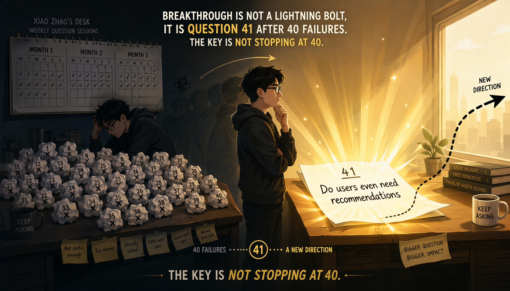
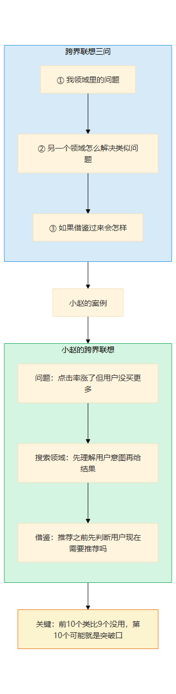

# 第16章 突破力的深潜

> 📍 修炼篇第五章：原创突破力怎么从0长出来

---

**你可能正在想：** "原创靠的是灵感吧？我从来就不是那种'灵光一现'的人。"

原创不靠灵感。小赵提出"为什么还要推荐"之前，前40个问题一个都没用。原创是大量提问后的涌现——关键是你在第40个问题之后没有停下来。突破力练的不是"灵光一现"，是"不断提问直到涌现"的习惯。

---

## 一个你认识的人

你在第9章认识了小赵——那个从"优化推荐"到"为什么还要推荐"的推荐算法工程师。但那个"为什么还要推荐"不是灵光一现——在那之前，他已经连续三个月每周给自己留一个小时，只提问题。他有一个文档叫"傻问题清单"，前两个月写了四十多个问题，一个都没用。

"如果推荐系统不推荐商品，推荐知识呢？"——太泛了，没有落地场景。
"如果用户可以关闭推荐呢？"——产品经理说"那不就白做了吗"，对话到此结束。
"如果推荐不是基于点击而是基于时间呢？"——他自己推演了半小时，发现没有数据支撑，放弃了。

第三个月的第二个星期二，他去听了一个跨部门分享会。做搜索的同事讲了"用户意图"的概念。晚上回家，他打开"傻问题清单"，在最底下加了一条：

"用户打开APP的时候，到底想不想被推荐？"

这一次，他没有马上否定自己。他花了一个晚上推演：如果用户想找东西，搜索比推荐更对；如果用户不想找东西，推荐是不是在干扰他？

**这个问题，不在任何数据里。它是四十多个"傻问题"堆出来的第41个。**

小赵跟我说："我不是天才，我只是在第40个问题之后，没有停下来。"



> 图释：一座由问号石块堆成的山——底下40个灰色的问号看起来全没用，但在山顶，第41个问号发出金色的光。原创不是灵光一现，是40个"傻问题"堆出来的涌现。关键不是灵感，是在第40个问题之后没有停下来。


> 图释：小赵三个月的提问积累——前40个"傻问题"看起来都没有用，但第41个问题改变了整个方向。原创不是灵光一现，是大量提问后的涌现。

---

## 经验深潜

### 照着做：第一次跨界联想

小赵第一次用"跨界联想三问"是在团队的技术分享会上。

那次分享会讲的是搜索引擎的架构。小赵一边听一边在本子上写：

```
我领域里的问题：推荐系统点击率涨了，但用户没买更多
另一个领域怎么解决类似问题：搜索——先理解意图，再给结果
如果借鉴过来会怎样：推荐之前先判断"用户现在需要推荐吗"
```

写完之后他愣了一下。这个想法他之前从来没有过——不是因为他没想到，而是因为他之前从来没有跨出过"推荐算法"这个领域去看问题。

那天晚上他回到家，把跨界联想三问的模板贴在了工位上：

```
我领域里的一个问题：______
另一个领域怎么解决类似问题：______
如果借鉴过来会怎样：______
```

然后他开始找类比。他翻了一本讲城市规划的书——里面提到"人行道的宽度不是设计出来的，是走出来的"。他想：推荐算法是不是也在"替用户走路"？如果让用户自己走出一条路呢？

他又看了一篇讲免疫系统的研究——免疫不是"杀死所有外来物"，而是"识别什么该杀什么不该杀"。他想：推荐是不是在"推送所有可能的商品"？如果先判断"该不该推"呢？

**跨界联想的核心不是"找到正确答案"，是"打开你从来没想过的门"。前十个类比可能有九个没用，但第十个可能就是突破口。**



> 图释：跨界联想三问法——①我领域的问题 ②另一个领域怎么解 ③如果借鉴过来会怎样。小赵从搜索领域借鉴"用户意图"的概念，打开了"用户到底需不需要推荐"这个新问题。

### 改着做：从照模板问到每周提问题

用了几次跨界联想三问之后，小赵发现了一个问题——模板只能帮他在"碰到难题"的时候想，但他不碰难题的时候就不想。

他决定做一个实验：每周一小时"提问题时间"。不解答，只提问。

第一次提问题时间，他坐在工位上，定了闹钟60分钟。前15分钟，脑子里一片空白——"我怎么一个问题都想不出来？"

他强迫自己写。写了10个"如果______会怎样"的问题：

1. 如果推荐系统不按用户画像推，按时间推呢？
2. 如果用户可以自己选择推荐策略呢？
3. 如果推荐理由是可见的呢——"因为你上周买了X，所以我们推荐Y"？
4. 如果推荐没有反馈机制——不追踪用户点了什么？
5. 如果推荐系统只在用户停留超过5秒后才触发？
6. 如果推荐的商品不按销量排序，按退货率排序呢？
7. 如果用户能一次看到"推荐系统以为的你的画像"？
8. 如果两个用户互相能看到对方的推荐？
9. 如果推荐的依据不是"相似用户买了什么"，而是"跟你完全不同的用户买了什么"？
10. 如果推荐系统有一个"不要推荐"按钮？

写完之后他回头看了看——大部分确实很傻。但他发现第3条和第10条有点意思。

第3条——推荐理由可见。他推演了一下：如果用户能看到"因为你买了X所以我们推荐Y"，用户可能会觉得被操控，但也可能觉得被理解。这个方向值得探索。

第10条——"不要推荐"按钮。他推演了更深：如果有"不要推荐"按钮，那用户按了之后应该看到什么？空白页？搜索框？这不就是从"推荐"跳到"搜索"吗？

**10个问题里，2个有点意思。20%的命中率，比等灵感高了不知道多少倍。**

从那以后，小赵每周一小时雷打不动。一个月后，他的"傻问题清单"上有了40多个问题。其中大部分确实没用，但有3个被他认真推演了：

- 推荐理由可见→后来做成了"推荐解释"功能，用户满意度涨了12%
- "不要推荐"按钮→引出了"推荐开关"功能，上线后7%的用户关了推荐，但留存率反而比没关的高
- "完全不同的用户买了什么"→后来做成了"惊喜推荐"频道，成了产品差异化的亮点

**每周一小时提问题，比等灵感有效100倍。灵感来的时候你得准备好。**


> 图释：小赵从照模板提问到建立"每周提问题时间"的进化——第一次60分钟写出10个问题，20%命中率；一个月后积累40+问题，3个被认真推演并落地。原创不是灵感，是频率。

### 想着做：从优化到看到全新可能

三个月后，小赵的状态变了。

不是他提问更勤奋了——而是他看任何问题都会自动想"有没有完全不同的解法"。这种思维不再需要刻意启动，它变成了他的默认模式。

有一次产品评审会，大家讨论怎么优化推荐位。有人提议加更多推荐位，有人提议换算法，有人提议做A/B测试——所有人都在"优化推荐"这个框架里讨论。

小赵说了一句："我们有没有想过，有些用户根本不需要推荐？"

会议室安静了三秒。然后产品经理说："这个问题我从没想过。"

小赵没有得意。因为他知道这个"从没想过"的问题，是他问了40多个"傻问题"之后才浮现出来的。它不是天才的灵感，是积累后的涌现。

**从"优化现有方案"到"看到全新的可能性"——这是突破力内化的信号。**

你判断自己是不是到了这一级，看一个信号就够了：你提出的想法，团队的第一反应是"这能行吗？"而不是"这个我们试过了"。

"这个我们试过了"说明你在优化。"这能行吗？"说明你在突破。

### 飞轮怎么运转

小赵的飞轮是这样的：

每次提出一个新想法，不管成败，他都写一行：

"我提了一个问题______，推演结果是______"

第一次写："我提了'推荐理由可见'的问题，推演结果：用户满意度涨12%。"
第二次写："我提了'完全不同的用户买了什么'的问题，推演结果：惊喜推荐频道上线，成为差异化亮点。"
第三次写："我提了'推荐系统主动学习用户拒绝'的问题，推演结果：技术实现太复杂，暂时搁置。"

**10个问题里有1个有价值的，就是很高的命中率。**

小赵跟我说："我不怕9个问题没用。我怕的是第10个问题来的时候，我没准备好。"

飞轮的转速取决于一个关键动作——写下来。不写下来的问题就像没提过一样，你下次还得从零开始。写下来之后，回头看你会发现：有些问题当时觉得傻，三个月后变成了最好的问题。


> 图释：突破力的飞轮——观察现象→提一个"如果反过来呢"的问题→推演→写下结果（不管成败）→下次提问更大胆。飞轮的关键是"写下来"——不写下来的问题就像没提过。

### 关键转折点

**从照着做到改着做**：小赵第一次用跨界类比解决了自己领域的问题——"原来搜索领域的'用户意图'概念可以用在推荐上"——他发现所有领域都是他的素材库。从此以后他看任何文章、听任何分享，都会想"这能不能用在我的领域"。

**从改着做到想着做**：小赵第一次提出的想法被团队否决——"推荐开关有什么用？用户关了推荐我们怎么赚钱？"——但他坚持推演并最终验证它是对的（关了推荐的用户留存反而更高）。他开始信任自己"提问题"的能力，而不是只信任已有答案。


> 图释：突破力的经验阶梯——第1级照着做（跨界联想三问）→ 第2级改着做（每周提问题时间）→ 第3级想着做（自动找全新解法）。两个关键转折：第一次跨界类比解决本领域问题、坚持推演并验证对了。

---

## 常见坑

### 坑1：只提问不推演

我见过一个产品经理，脑子特别灵活。开会的时候总能提出"如果______会怎样"的问题，每次都让全组人眼前一亮。

但他从来不推演。

"如果推荐不是基于用户画像，而是基于天气呢？"——大家觉得有意思，然后呢？没有然后了。他提完问题就去提下一个，从不在脑子里走一遍"如果真的这样做，会发生什么"。

三个月后，他的"好问题"在团队眼里变成了"又一个不落地的想法"。大家开始不听他说话了——不是因为他的问题不好，是因为他的问题从来没有下文。

**提了好问题但不推演，等于没提。** 推演不一定要实现，但要在脑子里走一遍：如果这样做，第一步是什么？最可能的障碍是什么？如果最乐观的情况发生，结果是什么？最悲观的情况呢？

推演10分钟，你就能判断这个问题值不值得深追。

### 坑2：害怕"傻问题"

小赵的"傻问题清单"上，前40个问题他一个都没跟别人提。为什么？因为他怕被笑。

"如果推荐系统不推荐商品，推荐知识呢？"——他觉得这问题太蠢了，推荐系统当然推荐商品，推荐知识是什么鬼？

但第41个问题——"用户到底想不想被推荐"——回头看，前40个问题里的每一个，都是通向第41个问题的台阶。如果你在第5个问题的时候就因为"太蠢了"而停下来，你永远走不到第41个。

**如果你觉得一个问题"太蠢了不好意思问"，这恰恰是最该追问的。** 因为"太蠢"往往意味着"这个前提从来没被质疑过"——而从未被质疑的前提，就是原创突破的入口。

小赵后来跟我说："我最大的发现不是那个问题，是我发现自己因为害怕傻问题而差点错过它。"

### 坑3：等灵感

这是最常见的坑，也是最隐蔽的。

很多人以为原创是"灵光一现"——坐在咖啡馆里，看着窗外，突然脑子里蹦出一个天才的想法。然后苦苦等待那个时刻。

小赵的故事告诉你：灵感不是等来的，是攒出来的。他的第41个问题不是"灵感"，是前40个问题的副产品。如果他不每周花一小时提问题，那个问题永远不会出现。

**每周固定1小时"提问题时间"比等灵感有效100倍。灵感需要一个"准备好的人"——准备的方式就是大量提问。**

我见过最有创造力的人，没有一个是"等灵感"的。他们全是"强迫自己提问"的。


> 图释：突破力的三个常见坑——只提问不推演（好问题变成空谈）、害怕傻问题（在第5个问题就停下）、等灵感（永远等不到）。每个坑的信号和爬出来方法。

---

## 智能体时代的升级

原创突破力在智能体时代，变得**更有价值了**。

为什么？

因为智能体让"组合已有方案"变得更快了。以前你想把A领域的方法用到B领域，你得自己去学A领域、自己翻译、自己尝试。现在你跟智能体说"搜索A领域解决X问题的方法"，它十秒钟就给你列出来了。

"组合已有方案"变快了，但"提新问题"——完全没有变。

智能体可以帮你：
- 跨领域搜索类比——你说"帮我找生物领域里类似'免疫系统'的概念"，它给你十个
- 推演新想法——你说"如果推荐系统有'不要推荐'按钮会怎样"，它帮你列利弊
- 快速验证——你说"推演一下这个方案的技术可行性"，它帮你跑通逻辑

但智能体不能帮你：
- **决定"什么问题值得问"**——它只能回答你问的问题，不能告诉你"你应该问另一个问题"
- **提出"数据里不存在的问题"**——它的全部知识来自已有数据，它不可能提出一个训练数据里没有的概念
- **判断"这个问题是不是真的好问题"**——它可以用逻辑评估一个问题的合理性，但不能评估一个问题的"突破性"——因为突破性意味着跳出已有框架，而这恰恰是它的盲区

小赵的"用户到底想不想被推荐"这个问题，智能体提不出来。不是因为智能体不够聪明，是因为在它见过的所有数据里，"推荐"就是一个正向功能——没有人质疑过"需不需要推荐"。

**智能体越强，"提新问题"的能力越稀缺。因为智能体会让所有"组合已有方案"的事变得同质化——你用AI组合，别人也用AI组合，结果都差不多。但"提新问题"是唯一的差异化来源。**


> 图释：智能体时代的突破力——AI组合已有方案更快（蓝色实线上升），但"提新问题"完全无法解决（红色虚线不动）。AI越强，"提新问题"越稀缺，原创突破力越有价值。

---

## 岗位映射

不同角色积累突破力的重点不同：

**研究员**：突破力是核心能力。你的价值不是"跑通实验"，是"提出一个没人想过的研究问题"。积累重点：跨领域阅读、方法论借鉴、质疑已有范式的勇气

**产品创新**：突破力决定产品差异化的天花板。积累重点：用户需求的反向思考、"为什么不"提问法、从边界场景找灵感

**技术创业者**：突破力是生存能力——你做的事必须跟现有方案有本质不同。积累重点：行业跨界类比、重新定义问题、快速推演和验证


> 图释：突破力在不同岗位的积累重点——研究员（跨领域阅读+质疑范式）、产品创新（反向思考+边界场景）、技术创业者（跨界类比+重新定义问题）。

---

## 今天就能开始

打开一个空文档，在顶部写一行："我的傻问题清单"。

然后设一个15分钟的闹钟。在这15分钟里，针对你正在做的项目，写出尽可能多的"如果______会怎样"的问题。

不要判断，不要删，不要追求"有用"——写下来就行。

闹钟响了之后，回头看一遍。找到那个让你觉得"这太蠢了不好意思问"的问题——

**那个问题，可能就是你的第41个。**

> **🔍 "优化vs突破"快速判断——你在改进还是在质疑？**
>
> 做一件事之前，花10秒判断你在哪个模式——决定了你的天花板：
>
> | 维度 | 优化模式 | 突破模式 |
> |------|---------|---------|
> | 你在问什么 | "怎么做得更好？" | "为什么这样做？" |
> | 前提 | 当前的方向是对的 | 当前的方向可能不对 |
> | 天花板 | 当前方向的极限 | 重新定义问题 |
> | 典型问题 | "推荐算法怎么提点击率？" | "用户到底需不需要推荐？" |
> | AI能帮忙吗 | 能——优化是AI的强项 | 不能——质疑前提需要人 |
>
> 实操口诀：**每周至少做一次"突破模式"——不问"怎么更好"，只问"为什么要这样做"**。这是突破力的最小练习单位。
