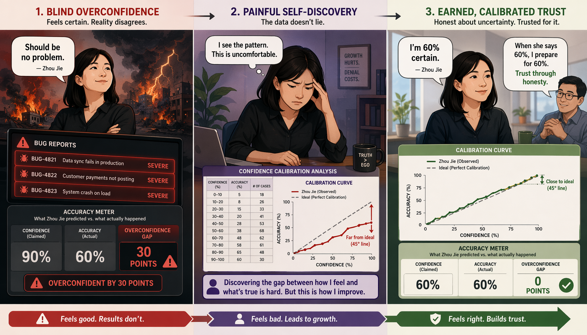
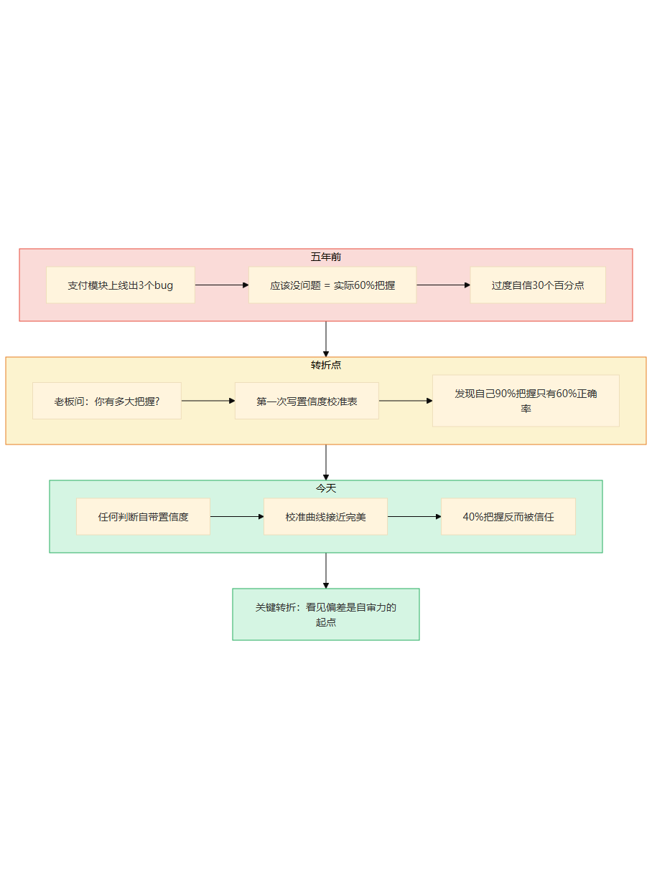
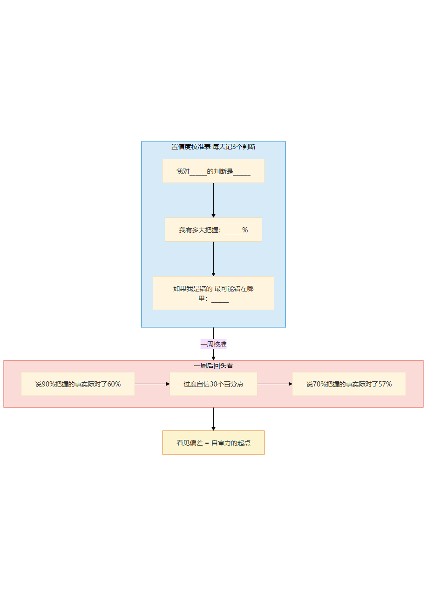
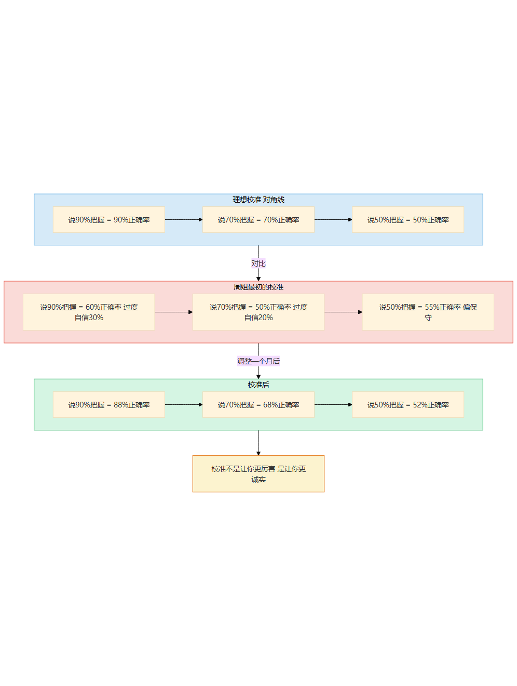
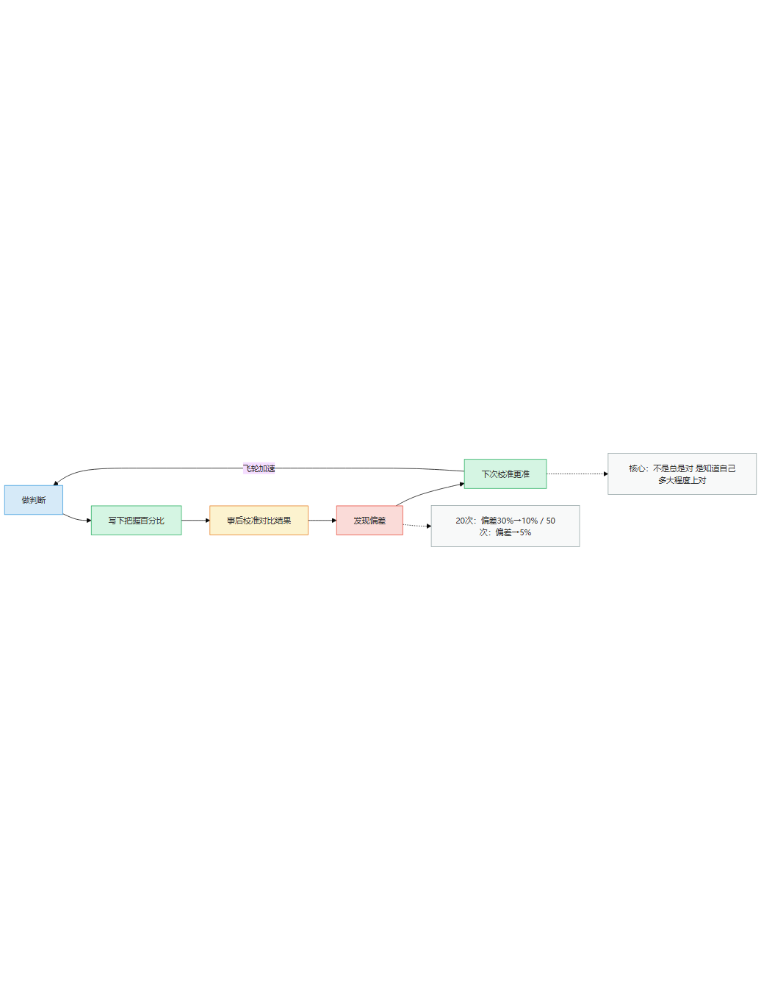
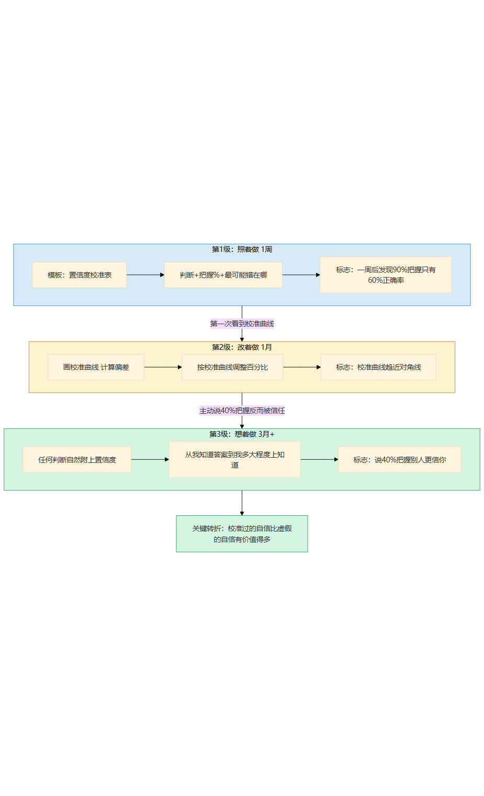
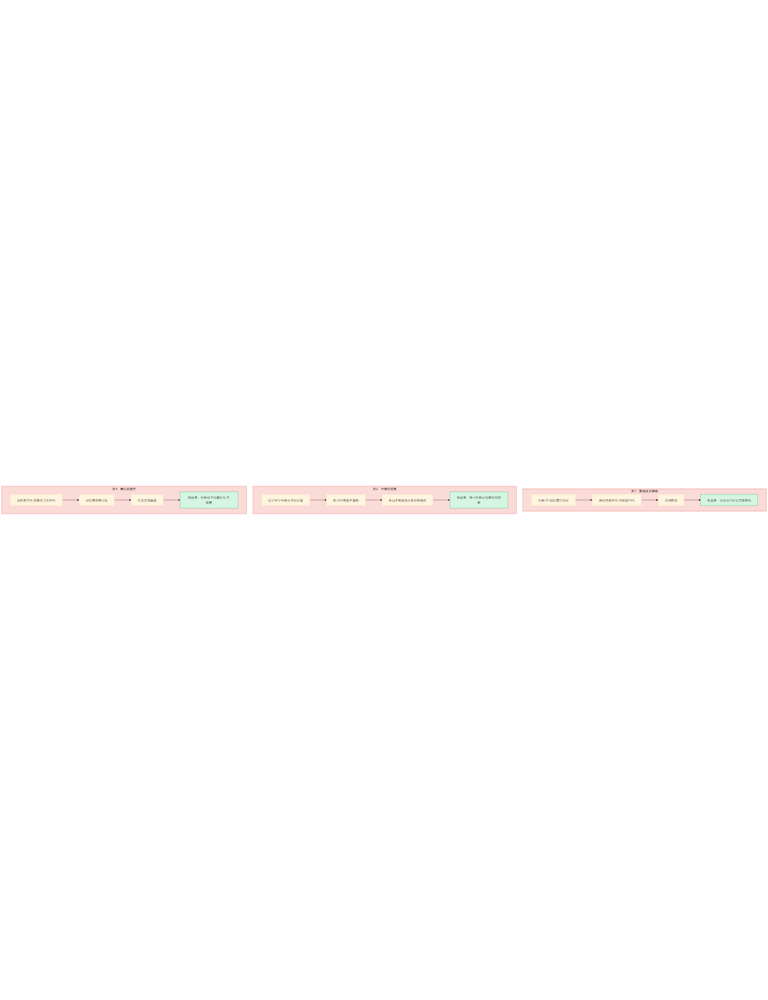
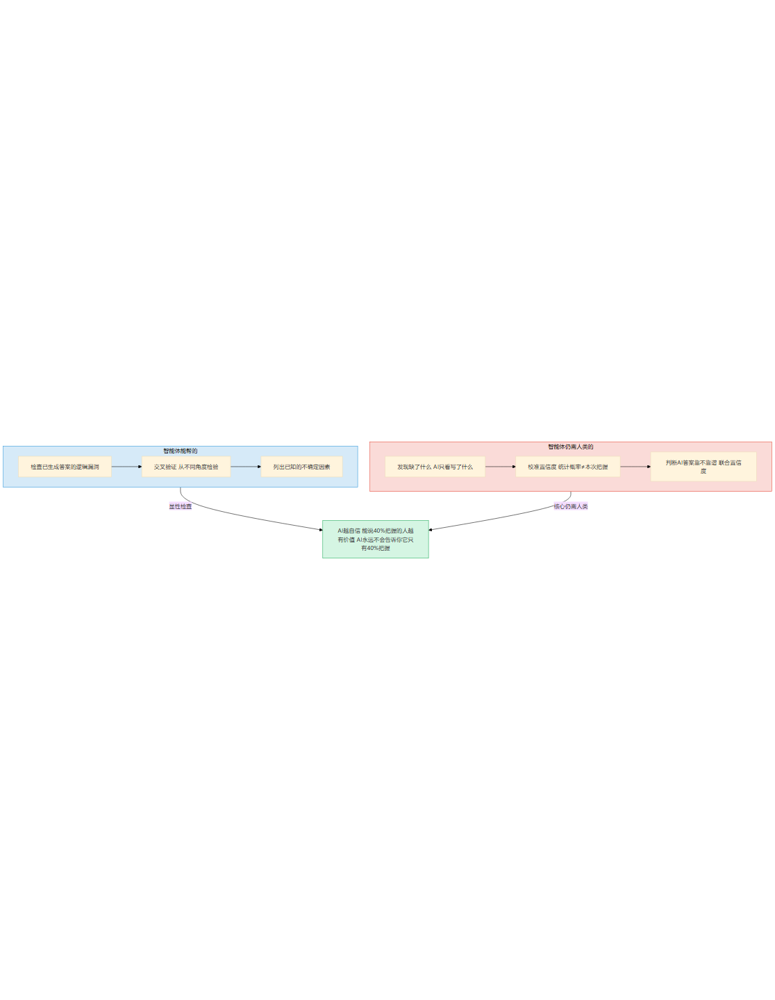
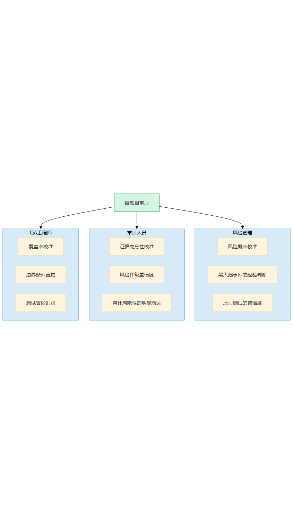

# 第17章 自审力的深潜

> 📍 修炼篇第六章：自知自审力怎么从0长出来

---

**你可能正在想：** "我怎么知道AI说得靠不靠谱？我自己对AI的判断经常不准——有时候太信，有时候不信。"

这恰恰是自审力的起点——你已经知道自己"判断不准"了。自知力不是"总是判断对"，是"知道自己有多大把握，而且这个把握跟实际差不多"。

---

## 一个你认识的人

你在第10章认识了周姐——那个发现"92%覆盖率背后有8%完全不知道缺了什么"的QA负责人。但她也不是一开始就能发现"缺了什么"的——她曾经也信过覆盖率数字，直到99%覆盖率的模块线上崩了。从"信数字"到"信校准过的直觉"，中间是一次又一次"估分偏高"的打脸。

五年前，周姐刚升QA负责人。那次上线了一个支付模块，上线前她跟团队说："这个模块我们测过了，应该没问题。"

上线当天，出了三个bug。最严重的一个：支付金额为零的时候，系统直接崩溃了。

事后复盘，老板问她："你说'应该没问题'的时候，有多大把握？"

周姐愣了一下。她没想过这个问题——她觉得"测过了"就等于"没问题"。

老板说了一句话让她记到现在："你说的'应该没问题'，是90%的把握还是50%的把握？如果是90%，出了三个bug说明你对自己判断力的判断是错的。如果是50%，你为什么不早说？"

那天晚上，周姐打开一个空文档，在顶部写了一行："我对______的判断是______，我有______%的把握。"

她给自己当天的判断打了个分——"支付模块应该没问题"——她回想了一下，当时心里其实有点虚，因为零金额的测试她没跑过。如果让她诚实打分，大概是60%。

**60%的把握，她说了"应该没问题"。这就是偏差——自信和实际能力之间，隔着一个她看不见的距离。**

五年后的今天，周姐做任何判断都会带一个数字——"这个我80%把握"、"那个我只有30%"。而她80%的时候，实际正确率大约78%。她的校准曲线接近完美。

团队里的人跟我说："周姐说'我有40%把握'的时候，你反而更信她——因为你知道她说的40%真的是40%。"

**从"应该没问题"到"40%把握反而被信任"——这就是自审力从0到1的过程。**



> 图释：左——偏差巨大：箭散落在靶子各处，说"应该没问题"时实际只有60%把握。右——精准校准：所有箭密集地扎在靶心周围，说"40%把握"时实际正确率约38%。校准不是"判断更准"，是"说的把握和实际能力之间没有偏差"。



> 图释：周姐五年自审力进化——从"应该没问题"（实际60%把握却当100%说）到第一次写置信度校准表，到校准曲线接近完美，到"40%把握反而被信任"。关键是看见自己的偏差。

---

## 经验深潜

### 照着做：第一次写置信度

周姐那天晚上写的置信度校准表，长这样：

```
我对"支付模块应该没问题"的判断是"没问题"
我有60%把握
如果我是错的，最可能错在哪里：零金额没测
```

写完之后她自己吃了一惊——60%。她之前跟团队说"应该没问题"的时候，心里真觉得没问题。但强迫自己写一个具体数字的时候，她发现自己其实没那么确定。

**置信度校准表的魔力在于：它逼你把模糊的"应该没问题"变成一个具体数字。一旦变成数字，你就没法骗自己了。**

从那天起，她每天做3个判断，都写下来：

```
我对______的判断是______
我有多大把握：______%
如果我是错的，最可能错在哪里：______
```

第一周她记了21个判断。一周后回头看，她说"90%把握"的5件事，实际对了3件——60%的正确率。她说"70%把握"的7件事，实际对了4件——57%的正确率。

**她以为自己90%把握的时候，其实只有60%。她过度自信了30个百分点。**

周姐跟我说："看到那个数字，比发现bug还难受。发现bug是别人出错，看到自己90%把握只有60%正确率，是我对自己判断力的判断出了错。"



> 图释：置信度校准表——每天3个判断，写下判断、把握百分比和最可能错在哪里。一周后回头看：说90%把握的事实际只有60%正确率——过度自信30个百分点。看见偏差，是自审力的起点。

### 改着做：校准曲线

记录了30个判断之后，周姐画了一张图——横轴是她说的把握程度，纵轴是实际正确率。

理想状态下，这张图应该是一条对角线——你说90%把握的时候，实际正确率就是90%。但周姐的图不是对角线，是一条在上方拱起的曲线——她在所有区间都过度自信，尤其是高置信区间。

她说90%把握的时候，实际正确率只有60%。
她说70%把握的时候，实际正确率只有50%。
她说50%把握的时候，实际正确率反而是55%——这个区间她反而偏保守。

这就是她的校准曲线——一张她对自己判断力的"X光片"。

**校准曲线不是羞辱你的，是帮你看清自己的。你不需要做到"总是正确"，你需要做到"知道自己多大程度上正确"。**

看到曲线之后，周姐开始调整。她的规则很简单：每次做判断的时候，先按直觉给一个数字，然后根据校准曲线往下调——如果直觉说90%，实际应该打7折，那就说65%。

一个月之后，她的校准曲线开始趋近对角线。不是因为她判断更准了，而是因为她说出的数字更诚实了。

**校准不是让你更厉害，是让你更诚实。诚实的自信，比虚假的自信有价值得多。**



> 图释：周姐的校准曲线——蓝色虚线是理想对角线（说X%把握实际正确率X%），红色曲线是她最初的校准（高置信区间过度自信30%），绿色曲线是校准后（趋近对角线）。校准不是让你更厉害，是让你更诚实。

### 想着做：校准过的自信

半年之后，周姐的状态变了。

她不再需要刻意识整数字——任何判断自然附上置信度和最可能错的地方。这不是刻意的习惯，变成了她的思维方式。

有一次技术评审会，一个工程师展示了新系统的性能测试报告，说"这个系统可以支撑10万QPS"。

周姐听了之后说："性能测试的环境跟生产环境差多少？如果差30%以上，那10万QPS我只有40%把握。"

工程师愣了一下——因为从来没有人这样评估他的测试结果。他回去查了一下，发现测试环境的服务器配置比生产环境好了将近40%。

周姐的40%把握不是瞎猜——是她校准过的经验告诉她：测试环境和生产环境的差异通常在30%-50%之间，而性能测试很少考虑这个差异。

**校准过的自信和盲目的自信，听起来很像，但本质完全不同。盲目的自信说"肯定没问题"，校准过的自信说"我40%把握——如果测试环境和生产环境差异超过30%，这个数字还要再降"。**

### 飞轮怎么运转

周姐的飞轮是这样的：

每次做判断后，她都写一行："我说______%把握，实际______，偏差原因是______"

第一次写："我说90%把握，实际60%正确，偏差原因：我忽略了自己没测过的边界。"
第二次写："我说70%把握，实际50%正确，偏差原因：我只看了测试数据，没看数据怎么来的。"
第三次写："我说50%把握，实际55%正确，偏差原因：低估了自己对常见问题的经验。"

**20次之后，她的偏差从30个百分点缩小到10个百分点。50次之后，缩小到5个百分点。**

周姐跟我说："我不追求100%正确——那不可能。我追求的是'我说80%就是80%'。这样别人听了我的判断，知道该怎么决策。"

**自知之明不是"谦虚"，是被校准过的自信。**



> 图释：自审力的飞轮——做判断→写下把握→事后校准→发现偏差→下次校准更准。偏差从30%→10%→5%，飞轮越转越准。核心不是"总是对"，是"知道自己多大程度上对"。

### 关键转折点

**从照着做到改着做**：周姐第一次看到自己的校准曲线——"我说90%把握的时候只有60%正确率？"——这种"我对自己判断力的判断是错的"的发现，是自知自审力真正的起点。你不可能校准一个你不知道有偏差的东西。

**从改着做到想着做**：周姐第一次主动说"这个我只有40%把握"而别人对她的诚实表示信任——她发现"承认不确定"反而增加了可信度。从此以后她不再害怕说低置信度的数字——因为校准过的40%，比虚高的90%有价值得多。



> 图释：自审力的经验阶梯——第1级照着做（置信度校准表）→ 第2级改着做（画校准曲线调整偏差）→ 第3级想着做（任何判断自然附上置信度）。两个关键转折：第一次看到校准曲线、主动说40%把握反而被信任。

---

## 常见坑

### 坑1：置信度只写"高/中/低"

我见过一个团队，学周姐做校准，但他们用的不是百分比，而是"高/中/低"。

一个月后，他们回头看——"高"把握的判断对了多少？"大概70%吧"。"中"呢？"差不多一半"。"低"呢？"不太确定"。

**没法校准。**

"高"对一个人可能是90%，对另一个人可能是70%。没有具体数字，你永远不知道自己的偏差有多大。置信度必须写百分比——不是因为百分比更精确，是因为百分比可以校准，"高/中/低"没法校准。

就像体检——"你有点高血压"和"你血压145/95"，后者才能跟踪和干预。

### 坑2：只记录判断不跟踪结果

我见过一个技术负责人，写了三个月的置信度校准表，记了60多个判断。但他从来不跟踪结果——那个"80%把握"的判断到底对了吗？不知道。

没有结果的判断无法校准。就像你射了60支箭，但不看靶——你永远不知道自己的准头有没有进步。

**校准的关键不是记判断，是回头看。** 每个判断必须跟踪到最终结果，然后对比：我说X%，实际是Y%？偏差在哪？

周姐的前20个判断，每个都跟踪了结果。有些结果一周后就知道，有些要等一个月。但她都会回来看一眼，写一行偏差。

### 坑3：事后调整数字

这是最隐蔽的坑，也是最难克服的。

判断的时候说70%把握，结果对了，事后回忆的时候变成了"我当时其实90%把握"——因为你现在知道了结果，你的记忆被结果污染了。

心理学叫"后见之明偏误"——事后你总觉得自己"早就知道了"。

**唯一的解法：判断当下就写下来，用墨水，不能擦。** 周姐用的是一个纸质笔记本——每次做判断，当场写数字，不能用铅笔，不能涂改。

她跟我说："我知道自己会骗自己。所以我不给自己骗自己的机会。"



> 图释：自审力的三个常见坑——置信度太模糊（高/中/低没法校准）、不跟踪结果（射了箭不看靶）、事后改数字（记忆被结果污染）。每个坑的信号和爬出来方法。

---

## 智能体时代的升级

自知自审力在智能体时代，变得**更关键了**。

为什么？

因为智能体给你的答案越来越像"正确的"。它自信地给出一个分析、一个方案、一段代码——语气笃定，引用充分，逻辑严密。你很容易被它的自信说服。

但周姐在第10章已经告诉我们：AI最大的问题不是答错，是答错了还特别自信。它说92%覆盖率的时候，真的相信覆盖了92%。

**AI不会校准自己——它不知道自己多大程度上正确。但你可以。**

智能体能帮你做什么？

- 检查已生成的答案——你说"帮我检查这个方案有没有逻辑漏洞"，它能找到大部分显性错误
- 交叉验证——你说"用另一个方法验证这个结论"，它能帮你从不同角度检验
- 列出已知的不确定因素——你说"这个方案有哪些不确定的地方"，它能列出清单

但智能体不能帮你做什么？

- **发现"缺了什么"**——AI只能检查你写了什么，不能发现你没写什么。周姐发现"零金额没测"，不是因为检查了测试用例，是因为她的经验告诉她"支付系统一定会遇到零金额"——这种"应该有什么但没看到"的判断，AI做不到
- **校准置信度**——AI可以说"根据数据，这个结论的概率是X%"，但这个概率是统计概率，不是对"这次具体判断"的置信度。统计概率是"过去类似情况的成功率"，置信度是"我对这次判断有多大把握"——两者完全不同
- **判断"这个AI的答案靠不靠谱"**——这正是自审力最核心的应用：你不仅校准自己的判断，还校准AI给你的答案。你说"AI给的这个方案我70%把握"，这是人类+AI的联合置信度——AI帮你覆盖了显性部分，但隐性的盲区仍需你判断

**在AI越来越自信的时代，能说"我只有40%把握"的人，比AI更有价值——因为AI永远不会告诉你"我对这个答案只有40%把握"。**



> 图释：智能体时代的自审力——AI帮你检查显性错误和交叉验证（蓝色），但"发现缺了什么"、"校准置信度"、"判断AI靠不靠谱"仍需人类（红色）。AI越自信，能说"40%把握"的人越有价值。

---

## 岗位映射

不同角色积累自审力的重点不同：

**QA工程师**：自审力是核心能力。你不仅测系统的bug，还要测自己测试的完整性。积累重点：覆盖率校准、边界条件直觉、测试盲区识别

**审计人员**：自审力是职业要求。审计报告的可信度取决于你对不确定性的诚实表达。积累重点：证据充分性校准、风险评级置信度、审计局限性的明确表达

**风险管理**：自审力是生存能力——低估风险比高估风险更危险。积累重点：风险概率校准、黑天鹅事件的经验判断、压力测试的置信度



> 图释：自审力在不同岗位的积累重点——QA工程师（覆盖率校准+边界直觉）、审计人员（证据充分性+风险置信度）、风险管理（概率校准+黑天鹅判断）。

---

## 今天就能开始

打开一个空文档，在顶部写三行：

```
我对______的判断是______
我有多大把握：______%（写一个具体数字，不能写高/中/低）
如果我是错的，最可能错在哪里：______
```

然后挑你今天做的一个判断——任何一个都行，技术选型、bug判断、项目排期——按模板写下来。

写完之后，做一个测试：看看你写的百分比，和你心里"真正"觉得的数字，差多少？

**如果你写90%但心里觉得只有70%——那个30%的差距，就是你自审力要补的地方。**

> **📝 "校准曲线"画法——2周内看见你的偏差模式**
>
> 置信度校准不是一次性的事，是持续过程。2周就能画出你的个人校准曲线：
>
> | 步骤 | 做什么 | 时间 |
> |------|--------|------|
> | Day 1 | 每次做判断时写"我X%把握" | 5秒/次 |
> | Day 3-7 | 回看3天前的判断，对比实际结果 | 10分钟 |
> | Day 8 | 画散点图：横轴=你说的把握%，纵轴=实际准确率 | 15分钟 |
> | Day 14 | 画第二次，看偏差是否缩小 | 15分钟 |
>
> 偏差常见模式：
> - **全线偏高**（说的比实际准）= 过度自信，需要强制打折
> - **低把握时准、高把握时不准** = 高估了自己的信息量
> - **全线偏低**（说的比实际差）= 低估自己，可以更果断
>
> 画完曲线=你拥有了"我知道我哪里不准"的元认知——这是AI永远做不到的。
