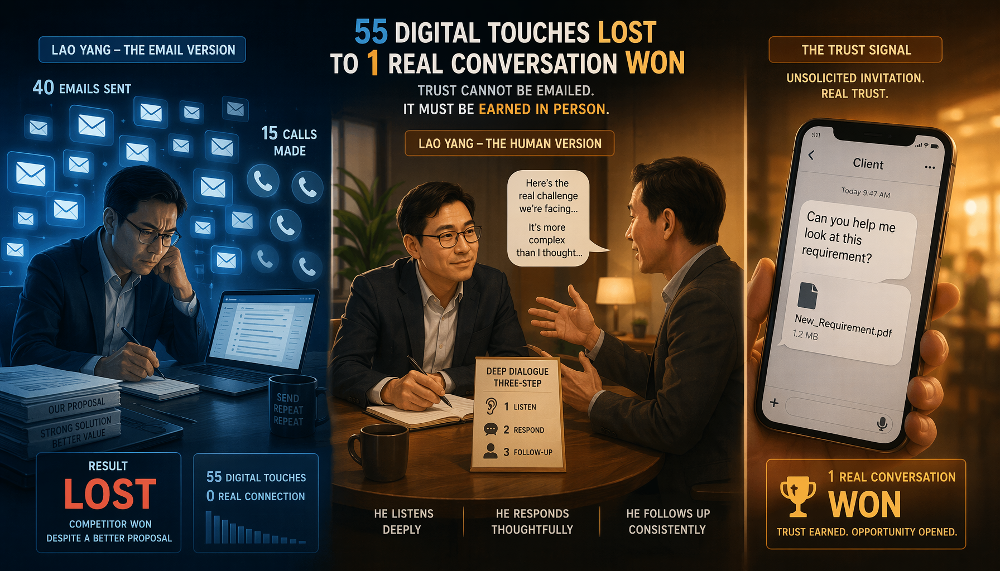
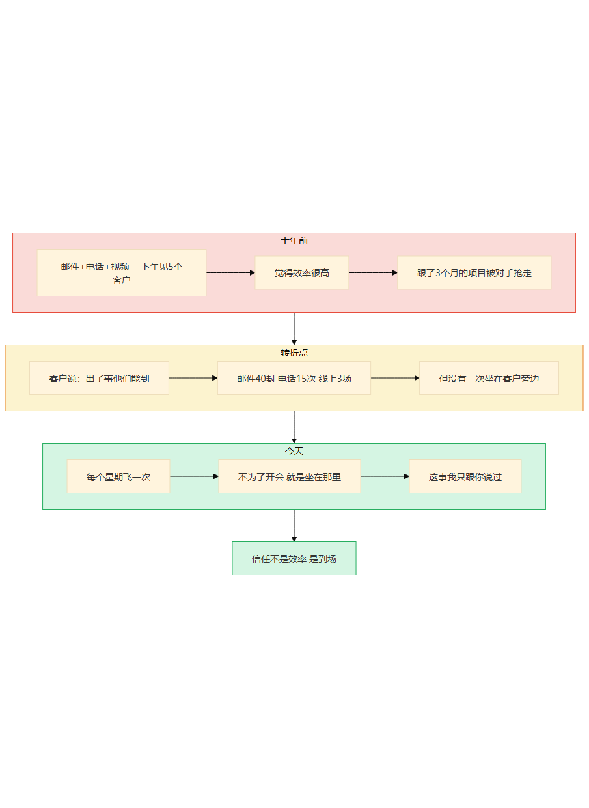
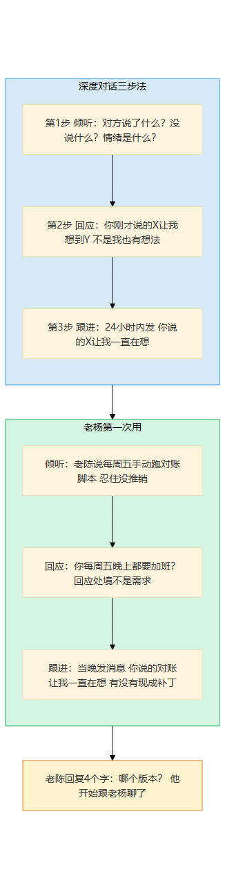
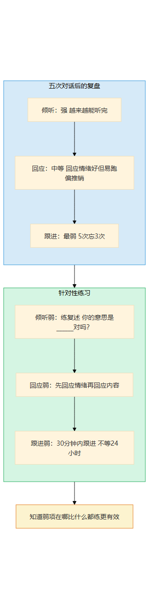

# 第18章 信任力的深潜

> 📍 修炼篇第七章：关系构建力怎么从0长出来

---

**你可能正在想：** "建立信任，不就是多见面多聊天吗？这有什么好练的？"

如果你真的只是"多见面多聊天"，你可能只是在浪费彼此时间。信任不是"我出现了"，是"我出现了而且做了你真正需要的事"。

---

## 一个你认识的人

你在第11章认识了老杨——那个靠"出了问题找谁，找他他真来"签下两千万单子的大客户销售。但老杨的信任力不是天生的——十年前他也是"发邮件型"选手，直到输给了一个"方案不如他但人到了"的竞争对手。修炼信任力最特别的地方在于：它不能靠"练"，只能靠"做"——每次到场都是一次修炼，没有捷径。

十年前老杨刚做大客户的时候，跟大多数销售一样——邮件、电话、视频会议。他觉得效率很高：一个下午可以"见"五个客户，发二十封邮件，安排三场线上演示。

直到有一次，他跟了三个月的一个项目，在最后一刻被竞争对手抢走了。

他打电话给客户的技术负责人，问："我们方案比他们好，价格也不差，为什么没选我们？"

对方沉默了几秒，说了一句："方案是你们的好。但他们的人上周来了一趟，帮我们解决了一个小问题。我们觉得，出了事他们能到。"

**"出了事他们能到"——这句话像一根刺，扎在老杨心里扎了很久。**

他回想自己这三个月做了什么：发了40封邮件，打了15个电话，做了3场线上演示。他没有一次坐在客户旁边，没有一次看到他们的系统怎么跑，没有一次在他们加班的时候出现过。

他的方案比对手好，但客户选了对手——因为客户信的不是方案，是人。

那天晚上，老杨在笔记本上写了一行："去见人。"

从那以后，他做了一件在销售团队看来很傻的事——每个星期飞一次客户的办公室，不是为了开会，就是坐在那里。

**十年后的今天，老杨的客户跟他说："老杨，这事我只跟你说过。"——这就是关系构建力从0到1的过程。**



> 图释：一座长桥连接两栋建筑。左边是发光的电脑屏幕，代表高效的数字沟通。右边是一扇透着暖光的门，代表真实的物理到场。一个人正从屏幕走向那扇门——信任不能发送，只能走到。



> 图释：老杨十年信任力进化——从邮件电话（高效但没信任）到被对手抢走（方案好但人没到），到第一次飞过去（发现到场比方案重要），到"这事我只跟你说过"。信任不是效率，是到场。

---

## 经验深潜

### 照着做：第一次深度对话

老杨第一次用"深度对话三步法"是在他决定改变之后的第一周。

那个方法很简单：

```
第1步：倾听——对方说了什么？没说什么？情绪是什么？
第2步：回应——"你刚才说的______让我想到______"（不是"我也有一个想法"）
第3步：跟进——对话后24小时内发一条"你说的______让我一直在想"
```

他飞到一个新客户的城市，约了对方的技术负责人老陈吃午饭。

饭桌上，老陈说了很多——系统怎么难用，老板怎么催，团队怎么累。老杨按照三步法，第一步只听——他发现自己平时有个习惯，别人说一半他就想插嘴说"我们有个方案可以解决"。这次他忍住了。

第二步是回应。老陈说"每周五晚上要手动跑对账脚本"的时候，老杨没有说"我们的方案能自动对账"——他说的是："你每周五晚上都要加班？那你周末的时间不就全搭进去了？"

老陈愣了一下——因为之前见过的销售，听到"对账脚本"就会立刻推销自动化方案。老杨回应的是他的处境，不是他的需求。

第三步是跟进。当天晚上，老杨发了一条消息："你说的每周五对账的事让我一直在想——你们的系统是哪个版本？我回去帮你看看有没有现成的补丁。"

**老陈的回复只有四个字："哪个版本？"——他开始跟老杨聊了。**

这就是深度对话三步法的魔力：它不是话术，是让你真的在听对方说话——不是在等对方说完你好开始推销。



> 图释：深度对话三步法——①倾听（对方说了什么/没说什么/情绪是什么）→ ②回应（你刚才说的X让我想到Y，不是"我也有想法"）→ ③跟进（24小时内发"你说的X让我一直在想"）。老杨第一次用，老陈从防备到主动聊天。

### 改着做：找出强项弱项

老杨用了五次深度对话三步法之后，做了一个复盘。

他发现自己在三步里的表现很不均匀：

- **倾听**：越来越好了。以前他忍不住插嘴，现在他能听完。但有时候听完之后脑子里一片空白——"他说了那么多，我到底该回应什么？"
- **回应**：时好时坏。回应对方情绪的时候效果很好（"你每周五加班？"），但回应内容的时候容易跑偏（"我们的方案能解决这个问题"——又变成了推销）。
- **跟进**：最弱。五次对话里有三次忘了跟进。记得跟进的两次，效果都很好。

他开始有意识地练弱项：

- 倾听弱的时候练"复述"——"你的意思是______对吗？"
- 回应弱的时候练"先回应情绪再回应内容"——先说"这确实很烦"，再说"这让我想到一个类似的情况"。
- 跟进弱的时候练"对话后30分钟内就跟进"——不等24小时，30分钟内就发消息。

五次之后，他发现了自己的模式：他在倾听环节最强，回应中等，跟进最弱。这是很多销售的共同特征——能听，但听完之后要么急着推销，要么忘了跟进。

**知道自己的弱项在哪，比什么都练更有效。**

老杨跟我说："深度对话三步法教会我'先听后说'这个习惯。但真正适合我的节奏，是听了之后30分钟内就跟进——因为我的问题不是不会回应，是容易忘。"



> 图释：老杨在深度对话三步法中的强项弱项分析——倾听强（越来越能听完）、回应中等（回应情绪好但易跑偏推销）、跟进最弱（5次忘3次）。针对性练习：复述/先情绪后内容/30分钟内跟进。

### 想着做：关键时刻被想起

一年之后，老杨的状态变了。

他不再需要刻意三步法了——对话自然深入。见面的第一件事不是寒暄，是"最近怎么样"。对方的回答不再只是"还行"，而是真的在说"最近挺难的"。

有一天，老杨接到一个电话。是一个他认识了两年的客户，声音有点急："老杨，我们系统出问题了，能不能今天来看一下？"

老杨当天下午就飞过去了。

到那里之后，客户跟他说了一句话："这事我只跟你说过。"

老杨愣了一下。那个"只"字很重——意味着客户不是在找供应商，是在找一个人。这个人不是因为方案最好，而是因为出了问题他知道找谁，找了他他真来。

**从"我在练习深度对话"到"我就是这样的沟通方式"——这就是关系构建力内化的信号。**

你判断自己是不是到了这一级，看一个信号就够了：有人在关键时刻（做决定、求助、坦白）第一个想到你。

不是因为他们觉得你最有用，是因为他们觉得你最靠得住。

### 飞轮怎么运转

老杨的飞轮是这样的：

每次见完客户，他都会写一行："他/她最关心的是______，下次可以聊______"

第一次写："老陈最关心的是每周五的对账问题，下次可以聊我们有没有补丁。"
第二次写："老陈最关心的是团队加班太多，下次可以问问他们团队的排班。"
第三次写："老陈最关心的是老板催进度但资源不够，下次可以聊聊怎么帮他跟老板沟通。"

**三次见面，老杨从"对账问题"聊到了"怎么帮他跟老板沟通"——对话一层一层深入，是因为他每次都记住了对方最关心什么。**

这些记录不是"社交技巧"，是真正关心对方的证据。你记得他关心什么，下次见面你提起来，他就知道你不是在走流程——你是真的在听。

老杨现在有一个笔记本，里面记了上百个客户的信息——不是联系人和商机，是"这个人关心什么"。

他跟我说："销售最大的误区是把客户当商机。客户不是商机，是人。你把人记住了，商机自然来。"


> 图释：信任力的飞轮——见面→倾听+回应→写下"这个人关心什么"→下次见面时提到→信任加深。老杨三次见面从"对账问题"到"怎么帮他和老板沟通"，对话一层层深入，因为每次都记住了对方最关心什么。

### 关键转折点

**从照着做到改着做**：老杨第一次有人在他面前说"这事我只跟你说过"——他意识到深度倾听创造了安全空间。对方不是在分享信息，是在分享信任。这种信任不是技巧换来的，是真正在听换来的。

**从改着做到想着做**：老杨第一次在危机时刻有人第一个打电话给他——不是找供应商，是找一个人。信任从"聊得来"升级为"关键时刻靠得住"。


> 图释：信任力的经验阶梯——第1级照着做（深度对话三步法）→ 第2级改着做（复盘强项弱项并针对性练习）→ 第3级想着做（对话自然深入）。两个关键转折：有人说"这事我只跟你说过"、危机时刻有人第一个打电话给你。

---

## 常见坑

### 坑1：对话中只想自己要说的

我见过一个销售，跟客户见面的时候，客户说了三分钟，他就等了三分钟——等客户说完好开始讲他的方案。

他以为自己在"倾听"，其实他只是在"等"。

真正的倾听是什么？是对方说到"最近加班多"的时候，你脑子里想的是"他一定很累"，而不是"我们可以推荐一个自动化方案"。

区别在哪？前者是关心人，后者是关心商机。对方感觉得到。

老杨的规则是：每次对话的前10分钟，不谈业务。只问"最近怎么样"、"团队还好吗"、"有什么头疼的事"。10分钟之后，如果对方主动提到业务需求，再聊。如果对方不提，就不提。

**"不急着推销"比"推销得好"更能建立信任。**

### 坑2：不见面

这是最常见也最致命的坑。

视频会议比邮件好，面对面比视频好。能见面就见面。

我见过一个团队，所有客户沟通都是视频会议。他们觉得效率很高——一天可以"见"八个客户。但他们的客户留存率只有60%。

后来他们开始每月飞一次去见重要客户。飞行时间加起来每周要多花一天，但客户留存率从60%涨到了85%。

**面对面传递的信息量是视频会议的10倍——你能看到对方的犹豫、能感受到他的压力、能在走廊里听到他随口说的一句话。这些信息在视频会议里全部丢失。**

AI可以帮你写邮件、安排会议、整理客户信息——但它不能坐在客户旁边，不能在对方犹豫的时候递一杯水，不能在走廊里听到那句"其实我真正担心的是______"。

### 坑3：太功利

"我跟你聊是为了______"——对方感觉得到。

偶尔"没有目的"地聊，效果反而最好。老杨有时候飞过去，真的什么都不聊——就是坐在客户旁边，看看他们怎么工作，偶尔帮个小忙。

有一次他飞过去，客户问他："你这次来有什么事？"

老杨说："没事，就是过来看看。"

客户笑了——他从来没见过一个销售"没事就是来看看"。

**那次"没事"的见面，老杨无意中听到了一个信息——客户在考虑换供应商，因为现有的供应商出了两次故障都没到现场。这个信息，十个线上会议都听不到。**


> 图释：信任力的三个常见坑——只想自己要说的（在等不是在听）、不见面（视频会议丢失90%信息）、太功利（对方感觉得到）。每个坑的信号和爬出来方法。

---

## 智能体时代的升级

关系构建力在智能体时代，变得**更稀缺了**。

为什么？

因为智能体让"在线响应"变得零成本了——客户发一条消息，AI秒回。客户问一个问题，AI立刻给答案。这在十年前是不可想象的效率。

但"在线响应"和"到场"之间隔着一道墙。

智能体能帮你做什么？

- 24小时在线响应客户问题——客户发消息，AI立刻回复
- 整理客户信息和历史记录——你见完客户，AI帮你整理笔记
- 安排见面和跟进——AI提醒你"这个客户两周没联系了"
- 分析客户需求——AI根据对话记录判断客户可能的需求

但智能体不能帮你做什么？

- **到场**——坐在客户旁边，看他们怎么工作，在对方犹豫的时候递一杯水。这些物理的在场，AI永远做不到
- **共担风险**——"出了问题我就在"不是一个信息，是一个承诺。承诺需要一个人去兑现。AI可以说"系统有容错机制"，但不能说"出了事我来负责"
- **让人在关键时刻想起你**——"这事我只跟你说过"不是因为你的方案最好，是因为你这个人让他觉得安全。安全感的建立需要时间和到场，不是信息交互能替代的

老杨跟我说了一句话："AI让我省了很多时间——邮件不用自己写了，信息不用自己回了，日程不用自己排了。但省下来的时间干嘛用？飞过去，坐在客户旁边。"

**AI帮你省时间，是为了让你把省下来的时间花在人身上。**


> 图释：智能体时代的信任力——AI帮你在线响应、整理信息、安排跟进（蓝色），但到场、共担风险、关键时刻被想起仍需人类（红色）。AI帮你省时间，是为了让你把省下来的时间花在人身上。

---

## 岗位映射

不同角色积累信任力的重点不同：

**销售**：信任力是核心能力。客户选你不是因为方案，是因为出了事知道找谁。积累重点：定期到场、深度倾听、客户关心点的长期跟踪

**咨询顾问**：信任力是项目能否推进的关键。客户不信任你，再好的方案也落不了地。积累重点：没有目的的沟通、帮客户解决小问题、在危机时刻第一个到

**项目经理**：信任力决定团队愿不愿意跟你。积累重点：一对一深度沟通、记住团队成员的关切、在项目困难时站在团队前面

**团队管理者**：信任力是团队效率的基础。积累重点：定期1对1、创造安全空间、言行一致


> 图释：信任力在不同岗位的积累重点——销售（定期到场+深度倾听）、咨询顾问（无目的沟通+解决小问题）、项目经理（1对1+记住关切）、团队管理者（定期1对1+言行一致）。

---

## 今天就能开始

打开你的通讯录，找一个人——同事、客户、朋友，任何你觉得"好久没聊了"的人。

给他发一条消息，只有一句话：

"最近怎么样？"

不要加"我有个事想跟你聊"，不要加"我们有个新方案"，不要加任何目的。

就是三个字——最近怎么样。

如果对方回复了，你就按深度对话三步法走一遍：倾听、回应、24小时内跟进。

**第一次不需要做得多好，只需要做一次。信任不是一次建立的，但从这一次开始。**

> **🧩 "信任账户"存取对照表——你的每一步是在存还是在取？**
>
> 信任像银行账户，每一步操作都在存或取。搞清楚哪些动作在存、哪些在取：
>
> | 存（+） | 取（-） |
> |---------|---------|
> | 说到做到，哪怕是很小的承诺 | 答应了但没做到，"我忘了" |
> | 关键时刻到场，哪怕只是陪一下 | 关键时刻消失，"那个会议我冲突了" |
> | 主动分享坏消息，不藏着 | 出了问题先瞒着，被发现了才说 |
> | 记住对方说过的重要事项 | 每次见面都要重新介绍自己 |
> | 无目的的沟通——"最近怎么样" | 只在有事的时候才联系 |
> | 面对面解决过一次问题 | 只发邮件/消息，从不见面 |
>
> 实操：今天回顾一下上周你对3个关键人物的互动——存了几笔？取了几笔？存的>取的=信任在增长。取的>存的=你该主动存一笔了。
