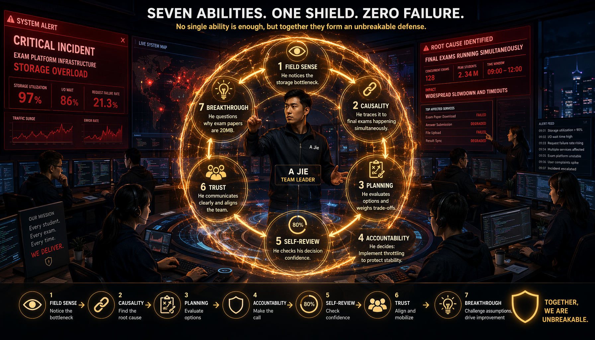
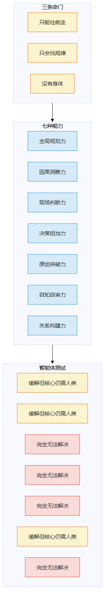
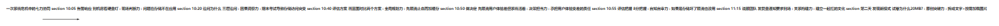
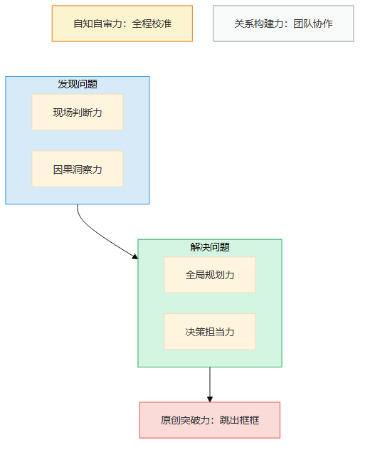
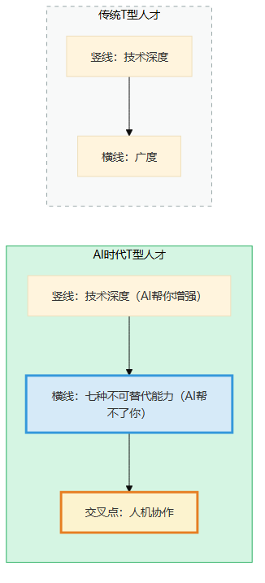

# 第19章 七力协同

> 📍 行动计划篇第一章：七种能力怎么一起用

---

前18章把七种能力一条一条拆开了——每种能力对应一条命门、一件做不到的事、一套修炼工具。但真实世界不会一次只用一种能力。

你可能已经在想了："我是不是得七种都练到满分才行？"不用。这一章看一个真实的人——不是故事，是事故——怎么在同一个事件里同时用到七种能力。看完你就知道：有些能力是你的核心，有些能力不拖后腿就行。

> 图释：七块不同颜色的拼图拼成一个完整的人——规划力（蓝）、因果洞察力（黄）、现场判断力（绿）、决策担当力（橙）、原创突破力（紫）、自知自审力（青）、关系构建力（红）。缺了任何一块，人就不完整。但不需要每块都满分，拼在一起才是关键。

> 图释：七种能力的全景图——三种命门在上，七种能力在中，智能体测试结论在下。红色=完全无法解决，黄色=缓解但核心仍需人类。

---

## 一次系统危机

2023年冬天，一个在线教育平台在期末考试期间崩了。我认识他们的技术负责人阿杰——那天晚上他经历的，就是七种能力同时上场的过程。

### 晚上10:05 告警响了

监控面板一片红——API响应时间从200ms飙到8秒，错误率从0.1%涨到30%。

阿杰做的第一件事，不是看日志——是**到机房**。

有人问他："远程不行吗？"

他说："远程看到的是数字。我需要感受到这台机器的状态。"

到了机房，他注意到一件事——存储服务器的硬盘灯在疯狂闪烁，但应用服务器的灯很正常。这意味着问题不在应用层，在存储层。

**现场判断力**：远程面板显示"API响应慢"，但到现场他发现真正的问题是存储瓶颈。面板上的"8秒"是症状，"存储灯闪"才是信号。还记得第7章老林靠听风扇发现问题吗？阿杰做的是同一件事——到场，看面板看不到的东西。

### 晚上10:20 追问为什么

存储为什么慢？阿杰开始追问——

第一层为什么：存储慢是因为磁盘IO满了。
第二层为什么：磁盘IO满是因为有大量随机读。
第三层为什么：大量随机读是因为……期末考试刚开考，所有学生同时打开试卷，而试卷是存在对象存储里的，每个试卷20MB。

**因果洞察力**：不是存储性能不够，是"期末考试同时开考"这个业务事件导致了存储访问模式突变。AI只能列出"磁盘IO满"，不能告诉你是"期末考试"导致的。这跟第6章小李发现"留存率涨不是新功能的功劳，是竞品出事"一个逻辑——你追问的不是更深层，而是"有没有别的解释"。

### 晚上10:40 评估修复方案

阿杰面前有两个选择——

方案A：加缓存。把热门试卷缓存到内存里，减少磁盘读取。预计30分钟上线。
方案B：限流。限制同时打开试卷的人数，让用户排队。预计10分钟上线。

他花了两分钟画了一张蓝图——

缓存方案的依赖：需要改应用代码（15分钟）+ 部署（10分钟）+ 验证（5分钟）。风险：如果缓存命中率低，问题没解决还浪费了30分钟。
限流方案的依赖：改Nginx配置（5分钟）+ 验证（5分钟）。风险：用户体验差，但系统至少不崩。

**全局规划力**：不是"哪个方案更好"，而是"在当前约束下（10分钟内必须止血），哪个方案更可靠"。蓝图画出来，答案就清楚了——先限流止血，再加缓存治本。还记得老周怎么做的吗？先画蓝图再动手。阿杰在10分钟内画了一张蓝图——时间紧，但蓝图再粗糙也比没有强。

### 晚上10:50 做出决定

"先限流，再加缓存。"

有人说："限流用户体验太差了。"

阿杰说："崩了用户体验更差。我先保证系统活着，再优化体验。"

**决策担当力**：限流不是最优解，但它是"10分钟内最可靠的止血方案"。做了这个决定，阿杰就要承担"用户体验变差"的责任。这跟第8章陈总砍掉智能文档助手一个道理——不是选最好的方案，是在约束下选最靠谱的，然后为后果负责。

### 晚上10:55 评估把握

"你有多大把握限流能止血？"

阿杰说："8分。磁盘IO满是因为随机读，限流减少并发，随机读就会减少。但如果是存储本身坏了，限流也没用。"

**自知自审力**：8分不是10分。他知道自己不确定的部分——"如果是存储本身坏了"。这个8分让他保持警惕：限流上了之后，如果IO没降，他得立刻换方向。还记得第10章周姐说"92%覆盖率"的时候吗？周姐知道那8%不知道缺了什么。阿杰知道那2分缺了什么——这就是校准过的自信。

### 晚上11:15 说服团队

限流上线了。IO从100%降到60%。系统活了。

但阿杰没停下——他给整个技术团队发了一条消息："今晚的事，明天上午10点我们复盘。我需要每个人到场，不到场的我找你聊。"

第二天复盘会上，阿杰不是在追究责任——他是在建立一种文化："出了问题，我们一起面对。"

**关系构建力**：复盘会不是邮件能搞定的。到场、面对面、一起分析——这是在建立"下次出了问题我们还能一起扛"的信任。

### 第二天上午 复盘中发现新模式

复盘的时候，一个工程师说了一句："试卷20MB是不是太大了？"

阿杰愣了一下。试卷为什么是20MB？因为里面嵌了大量高清图片。但学生打开试卷的时候，其实只需要看文字——图片可以按需加载。

"如果把试卷拆成文字+图片，先加载文字，图片按需加载呢？"

这个想法不在任何应急预案里。这是"跳出框框"——从"怎么让存储扛住20MB的并发"跳到"为什么试卷是20MB"。

**原创突破力**：从优化存储容量，到质疑"为什么试卷这么重"。这个质疑改变了后面的架构方向——试卷从20MB变成了2MB的文字+按需加载的图片。这跟第9章小赵质疑"为什么还要推荐"一个逻辑——从优化答案，到质疑问题本身。

---

> 图释：系统危机的完整时间线——七种能力在同一个事件中依次登场。现场判断力发现问题在存储，因果洞察力定位到"期末考试"，全局规划力评估两个方案，决策担当力选择先止血，自知自审力给了8分把握，关系构建力通过复盘建立信任，原创突破力质疑"为什么试卷20MB"。

---

## 七种能力怎么协同

阿杰那天晚上的经历，可以画成一张协同图——

> 图释：七种能力的协同关系——现场判断力和因果洞察力是"发现问题"的双引擎，全局规划力和决策担当力是"解决问题"的双核心，自知自审力是全程的校准器，关系构建力是团队协作的基础，原创突破力是从"解决问题"跳到"消灭问题"的跳跃点。

**发现问题时**：现场判断力（感受到不对劲）+ 因果洞察力（追问为什么）

**解决问题时**：全局规划力（想清楚全貌）+ 决策担当力（做出选择并负责）

**全程校准**：自知自审力（评估把握，避免盲目自信）

**团队协作**：关系构建力（让人愿意跟你一起扛）

**跳出框框**：原创突破力（从"优化"跳到"质疑前提"）

七种能力不是孤立的——它们是互相增强的。你的因果洞察力越强，你的全局规划力画出的蓝图就越准；你的自知自审力越强，你的决策担当力就越敢拍板；你的关系构建力越强，你的原创突破力越容易落地。

但还有一个更重要的规律——**七种能力有分工，不是平均用力**：

- **自知自审力是底座**：没有它，你不知道自己哪不行，其他能力练了也白练
- **2-3种核心能力是长板**：根据你的角色重点练——架构师练规划力，运维练手感，管理者练担当力
- **其他能力不拖后腿**：你不需要是原创突破力的高手，但你至少要能意识到"这个问题可能需要跳出框框"

你不需要七种都满分。你需要的是：自知自审力打底，2-3种核心能力够长，其他能力至少及格。

---

## 新型"T型人才"

传统的T型人才：竖线=技术深度，横线=广度。

AI时代的T型人才：竖线=技术深度（AI帮你增强），横线=七种不可替代能力（AI帮不了你），交叉点=人机协作。

> 图释：AI时代的T型人才——竖线（技术深度）AI可以帮你增强，横线（七种不可替代能力）AI帮不了你，交叉点是人机协作。你的核心竞争力不再是竖线有多长，而是横线有多宽。

**竖线**：你的技术深度。AI可以帮你写代码、做分析、生成方案——竖线"看起来"不重要了。但竖线是你理解问题的基础，没有竖线，你连"这个蓝图靠不靠谱"都判断不了。

**横线**：七种不可替代能力。AI帮不了你画蓝图、追问因果、到现场、做决定、提新问题、校准把握、建立信任。横线是你真正的护城河。

**交叉点**：人机协作。你用横线做判断，AI用竖线做执行。不是你vs AI，是你+AI vs 问题。

---

## 你不需要七种都满分

看到这里，你可能会想："七种能力都要练？那我得活到两百岁。"

不需要。上一节已经说了核心逻辑：自知自审力打底，2-3种核心能力够长，其他能力至少及格。

具体来说——

| 角色 | 核心能力（重点练） | 辅助能力（不拖后腿） |
|------|-------------------|---------------------|
| 架构师/技术负责人 | 全局规划力 + 因果洞察力 | 自知自审力、决策担当力 |
| 运维/SRE | 现场判断力 + 因果洞察力 | 自知自审力、全局规划力 |
| 产品经理 | 决策担当力 + 因果洞察力 | 关系构建力、自知自审力 |
| 研究员/数据科学家 | 因果洞察力 + 原创突破力 | 自知自审力 |
| 销售/客户成功 | 关系构建力 + 决策担当力 | 因果洞察力、现场判断力 |

**自知自审力是所有角色的底座**——不知道自己不知道，其他能力都白练。

下一章，我们讲你+AI怎么配合。再下一章，正面回应最大的质疑——"智能体能解决吗？"。最后一章，给你一个从今天开始的行动计划。

---

## 今天就能做

回想你最近遇到的一个复杂问题——不管是技术问题还是工作问题。

试着用七种能力的视角重新看一遍：

- 你到场了吗？（现场判断力）
- 你追问为什么了吗？（因果洞察力）
- 你先想清楚全貌了吗？（全局规划力）
- 你做了选择并负责了吗？（决策担当力）
- 你评估自己有多大把握了吗？（自知自审力）
- 你说服了需要配合的人吗？（关系构建力）
- 你有没有质疑前提？（原创突破力）

**不需要七种都做到，但看看你缺了哪一种——那就是你下一步要练的方向。**

> **🔍 "七力缺口"快速诊断——你的最近一次危机缺了哪一环？**
>
> 回想你最近经历的一次线上故障/项目危机/客户投诉，按顺序过7个问题：
>
> | 序号 | 问题 | 对应能力 | 你的答案（写下来） |
> |------|------|---------|-------------------|
> | 1 | 你第一时间"感觉不对"了吗？ | 现场判断力 | |
> | 2 | 你追问了"到底为什么"吗？ | 因果洞察力 | |
> | 3 | 你先想清了"全局怎么救"吗？ | 全局规划力 | |
> | 4 | 你拍了板并说"出了事我兜"吗？ | 决策担当力 | |
> | 5 | 你说清了"我有多大把握"吗？ | 自知自审力 | |
> | 6 | 你让关键人配合了吗？ | 关系构建力 | |
> | 7 | 你质疑了"这个问题的前提对吗"？ | 原创突破力 | |
>
> 空白的那个格子=你的缺口。下次危机前，先练那个。
