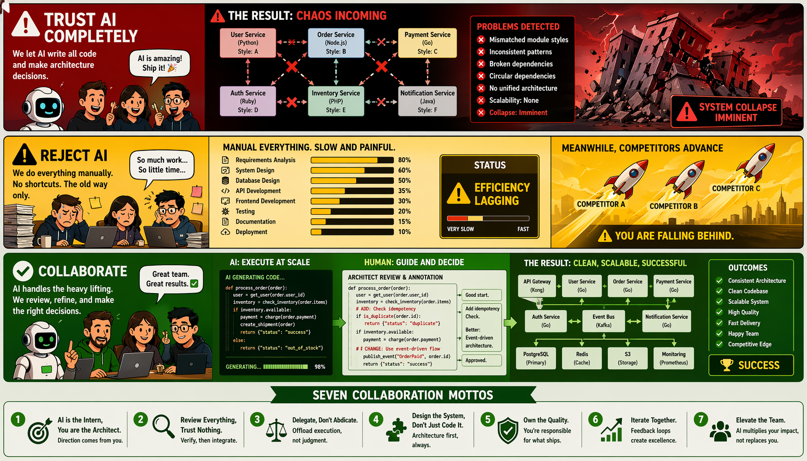
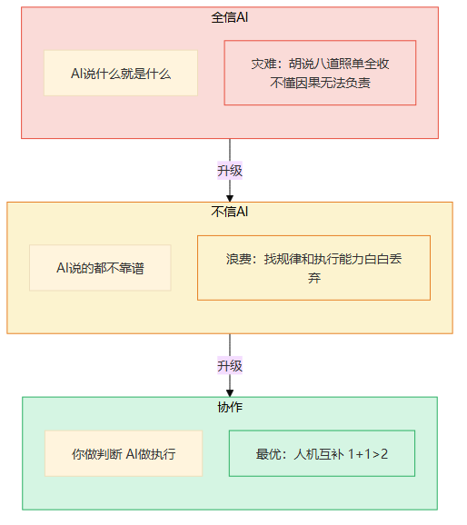
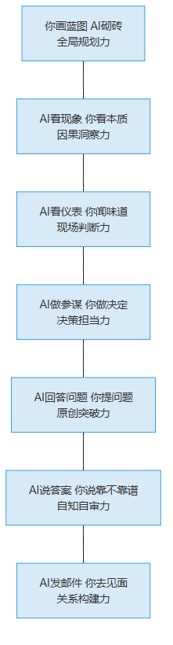
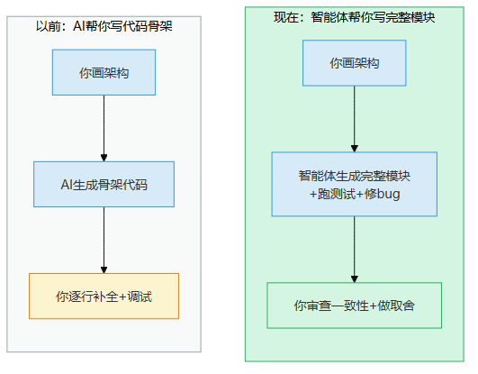
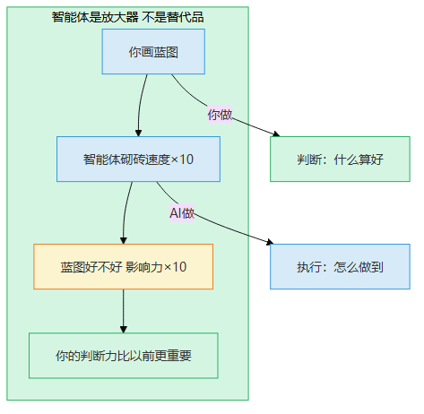
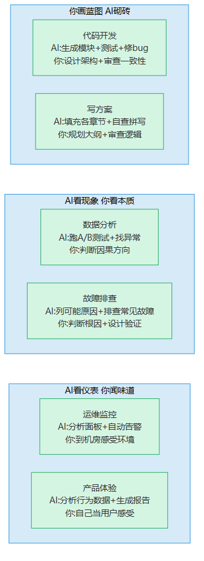
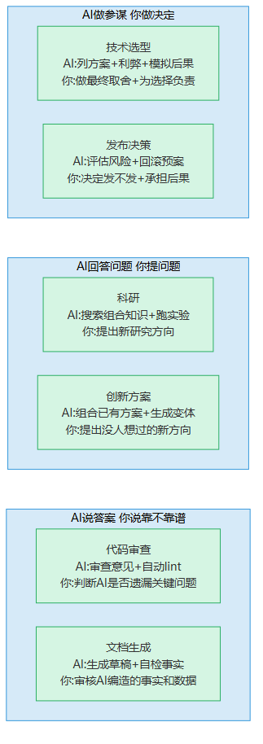
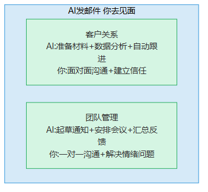
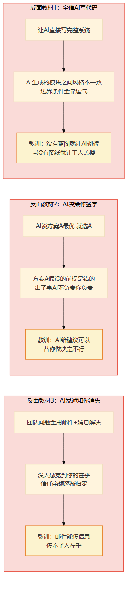
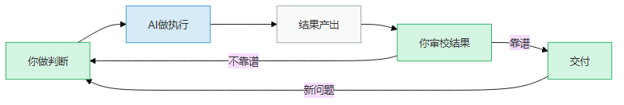

# 第20章 人机协作

> 📍 行动计划篇第二章：不是你vs AI，是你+AI vs 问题

---

前面18章，一条一条拆解了七种不可替代的能力。但真实世界不会一次只用一种能力——你每天的工作是七种能力混在一起用的。更重要的问题是：你跟AI到底怎么分工？

有人说"AI什么都能做"，有人说"AI什么都不行"。两种都错。这一章不看理论，看翻车现场——然后从翻车里总结正确的协作姿势。

> 图释：人和机器人并肩站立，面对同一座大山（问题）。人手持指南针（判断方向），机器人背着装满工具和数据的背包（执行能力）。不是你vs AI，是你+AI vs 问题。你做判断，AI做执行——这是正确的协作姿势。

---

## 一个真实的翻车现场

2024年初，某互联网公司的一个开发团队决定"全面拥抱AI"。

他们做了什么？让AI写代码，让AI做架构决策，让AI写文档，让AI做代码审查——能交给AI的都交给AI。团队leader的理由很充分："AI比我们快，比我们全面，而且不犯低级错误。"

三个月后，系统出了大问题。

AI写的模块之间风格完全不统一——一个模块用REST，另一个用gRPC；一个模块的错误码是数字，另一个是字符串。更致命的是，AI推荐的"最优架构"基于一个前提——所有服务都在同一机房——但这家公司是多云部署。AI不知道这个前提，团队也没人检查这个前提。

事故复盘的时候，那个team leader说了一句话："我以为AI比我更懂。"

**他错在哪？不是用了AI，是把AI当成了替代品。**

AI确实快，确实全面，确实不犯低级错误——但AI不懂你的业务上下文，不会为结果负责，更不会在关键节点上"觉得不对劲"。这三种东西，恰恰是人类最不可替代的部分。

---

## 三种态度

面对AI，技术人员大致有三种态度——

> 图释：面对AI的三种态度——全信AI（灾难）、不信AI（浪费）、协作（最优）。从红色到黄色到绿色，逐步升级。

### 态度一：全信AI → 灾难

"AI说的就是对的。"

这种人把AI当权威。AI给的方案照单全收，AI生成的代码直接上线，AI推荐的架构不做审查。

后果是什么？开头的那个团队就是典型——AI说方案A最优，你选方案A，结果方案A的前提是错的。AI不会告诉你"我的前提是X"——因为AI自己也不知道它隐含了什么前提。

更危险的是，AI会**自信地胡说八道**——编造不存在的API，虚构不存在的论文，凭空捏造数据。你不检查，它就一路错下去。

全信AI的本质是**放弃了判断力**——而判断力恰恰是你最不可替代的能力。

### 态度二：不信AI → 浪费

"AI说的都不靠谱，还不如我自己来。"

这种人把AI当玩具。偶尔用用，但核心工作全自己扛。他们的理由也很充分："AI写的代码我得逐行检查，还不如我自己写。"

这话对不对？对，但不完全对——

逐行检查AI的代码确实比自己写慢——**如果你只用AI写整段代码的话**。但如果你让AI写骨架，你做架构审查呢？如果你让AI跑测试用例，你设计测试策略呢？如果你让AI搜索文献，你判断研究方向的因果链呢？

不信AI的本质是**浪费了AI的执行能力**——AI找规律和执行的能力确实很强，你不用，就是浪费。

### 态度三：协作 → 最优

"你做判断，AI做执行。"

协作不是"一半一半"。协作是**你做AI做不了的事，AI做你不擅长的事**。

AI擅长什么？找规律、执行重复任务、处理大量信息、生成多种选项。

AI做不了什么？理解业务上下文、做价值判断、为结果负责、到现场感受、建立信任关系、提出没人想过的问题。

协作就是——你画蓝图，AI砌砖；AI看现象，你看本质；AI看仪表，你闻味道；AI做参谋，你做决定；AI回答问题，你提问题；AI说答案，你说靠不靠谱；AI发邮件，你去见面。

这七句话，就是下一节要讲的七条协作口诀。

---

## 七条协作口诀

上一章我们讲了七种能力怎么协同。这一章的核心问题是：**七种能力在协作中怎么分工？**

答案是七条口诀——每条口诀对应一种能力，说清楚"你做什么，AI做什么"——

> 图释：七条协作口诀——七种能力在人机协作中的分工。左边是你做的，右边是AI做的，中间的箭头是协作方向。

### 1. 你画蓝图，AI砌砖

**全局规划力的协作口诀。**

你负责画蓝图——想清楚要什么、为什么、全貌是什么、各部分之间的关系是什么。AI负责砌砖——根据蓝图生成代码、填充内容、执行具体步骤。

为什么不能反过来？因为AI不会主动问"为什么要做这个"——它只会按你的指令做。没有蓝图的砌砖，就是没有图纸的盖楼。AI可能盖出一栋很漂亮但用不上的楼。

> "让AI写代码很容易。但让AI写出**跟你其他模块风格一致、边界条件正确、架构方向对**的代码？那你得先有一张蓝图。"
> ——一位架构师的原话

### 2. AI看现象，你看本质

**因果洞察力的协作口诀。**

AI擅长看现象——跑A/B测试、找异常数据、列出可能的原因。你负责看本质——判断因果方向、追问"为什么"、设计验证实验。

AI能看到"指标X异常"，但它不知道"指标X异常是因为业务事件Y导致的"——这个因果链需要你来建。AI能列出十种可能的原因，但哪种最有可能？哪种需要优先验证？这需要你的经验来判断。

> AI是"现象放大器"——它能看到更多的现象，但"哪个现象是本质"仍然需要你来判断。

### 3. AI看仪表，你闻味道

**现场判断力的协作口诀。**

AI擅长看仪表——分析监控面板、设置告警规则、自动生成报告。你负责闻味道——到机房感受环境、到现场观察用户、做直觉判断。

监控面板显示"CPU 80%"，AI能告诉你这个数字。但"80%"是什么意思？是正常高峰还是异常飙升？需要结合什么信息来判断？这需要你的手感——你见过正常的样子，才能判断"不对劲"。

> 数字是信息，手感是判断。AI给你信息，你做判断。

### 4. AI做参谋，你做决定

**决策担当力的协作口诀。**

AI擅长做参谋——列出方案、分析利弊、模拟后果。你负责做决定——做最终取舍、为选择负责。

AI能告诉你方案A和方案B各有什么优劣，但"选哪个"是你做的。选错了，AI不会被开除，AI不会坐牢，AI不会半夜被叫起来修bug——你才会。所以决定必须你来做，因为**后果必须有人承担**。

> AI是参谋长，你是指挥官。参谋长可以给建议，但命令必须指挥官下。

### 5. AI回答问题，你提问题

**原创突破力的协作口诀。**

AI擅长回答问题——搜索组合已有知识、生成变体、跑实验。你负责提问题——提出新的研究方向、质疑前提、跳出已知空间。

AI能回答"怎么做X更快"，但你得先问"为什么要做X"或者"有没有不做X的方案"。AI在已知空间里搜索效率极高，但它不会自己跳出已知空间——因为"跳出"意味着提出一个不在训练数据里的问题。

> AI是已知空间的搜索引擎，你是通往未知空间的钥匙。

### 6. AI说答案，你说靠不靠谱

**自知自审力的协作口诀。**

AI擅长说答案——生成文档草稿、给出审查意见、自检事实。你负责说"靠不靠谱"——审核AI编造的事实、判断AI遗漏的关键问题、校准AI的置信度。

AI会自信地给出答案——但"自信"不等于"正确"。AI可能编造了不存在的API，可能遗漏了关键的安全漏洞，可能把相关性当成了因果性。你说"靠不靠谱"，就是在做AI做不了的元认知——判断判断本身的质量。

> AI说"我确定"，你说"我不确定你确定"——这就是人类的自知自审力。

### 7. AI发邮件，你去见面

**关系构建力的协作口诀。**

AI擅长发邮件——准备材料、数据分析、自动跟进、起草通知、安排会议。你负责去见面——面对面沟通、建立信任、解决情绪问题。

AI能帮你写一封完美的邮件，但信任不是邮件建立的。信任是"这个人到场了""这个人面对面跟我说了""这个人跟我一起扛了"——这些需要身体在场，需要共担风险，需要真实的互动。

> AI是通讯工具，你是信任载体。工具能传信息，传不了"我在乎"。

---

## 智能体时代的协作升级

2024年以来，AI智能体（Agent）爆发了。Manus能自己规划步骤、调用工具、检查结果；Devin能自己写代码、跑测试、修bug；各种AutoGPT能自己分解任务、循环执行。

协作口诀还成立吗？

**成立。而且更重要了。**

### 以前 vs 现在

以前，AI帮你写代码骨架。你画架构，AI生成骨架代码，然后你逐行补全、调试。

现在，AI智能体帮你写完整模块。你画架构，智能体生成完整模块、跑测试、修简单bug——然后你审查模块间的一致性、做架构层面的取舍。

> 图释：以前AI帮你写骨架代码，你逐行补全+调试；现在智能体帮你写完整模块+跑测试+修bug，你审查一致性+做取舍。你做的事从"执行"变成了"判断"。

注意到变化了吗？**你做的事从"执行"变成了"判断"。**

以前你需要逐行补全、逐个调试——这是执行。现在智能体帮你做了这些，你需要审查整体一致性、做架构取舍——这是判断。

执行可以自动化，判断不能。

### 放大器效应

智能体让"AI砌砖"的速度提升了10倍。但这意味着什么？

**蓝图好不好，影响力×10。**

以前你画了蓝图，AI砌砖慢，蓝图有问题，改起来代价小。现在你画了蓝图，智能体10倍速砌砖，蓝图有问题——一栋错误的楼10倍速拔地而起。

> 图释：智能体是放大器不是替代品——你画蓝图，智能体砌砖速度×10，蓝图好不好影响力×10，你的判断力比以前更重要。

这就是放大器效应：**智能体越强，你的判断力越重要。** 不是因为你做的事变少了，而是因为你做的事的**杠杆率**变高了。

> 以前你的判断影响10行代码。现在你的判断影响100行代码。以前你的架构决策影响1个模块。现在你的架构决策影响整个系统。

### 七条口诀在智能体时代的变化

| 口诀 | 以前 | 智能体时代 | 你的工作变少了吗？ |
|------|------|-----------|------------------|
| 你画蓝图，AI砌砖 | AI生成骨架 | 智能体生成完整模块+测试+修bug | 没有——蓝图要画得更细 |
| AI看现象，你看本质 | AI跑单一分析 | 智能体自动跑多维分析+生成报告 | 没有——需要判断更多现象的因果 |
| AI看仪表，你闻味道 | AI监控面板 | 智能体自动告警+初步诊断 | 没有——到现场感受的需求不变 |
| AI做参谋，你做决定 | AI列2-3个方案 | 智能体列10个方案+模拟后果 | 没有——要评估的方案更多了 |
| AI回答问题，你提问题 | AI搜索文献 | 智能体组合知识+跑实验 | 没有——需要提出更本质的问题 |
| AI说答案，你说靠不靠谱 | AI生成草稿 | 智能体生成完整方案+自检 | 没有——需要审校的内容更多了 |
| AI发邮件，你去见面 | AI起草邮件 | 智能体自动跟进+安排 | 没有——到场的必要性不变 |

**结论：智能体越强，你的判断力越重要。七条口诀不仅没过时，反而更需要了。**

---

## 14个具体协作场景

口诀是原则，场景是实战。下面是14个你明天就可能遇到的具体协作场景——每条口诀2个，标出"智能体能帮多少+你仍需做什么"。

### 你画蓝图，AI砌砖

#### 场景1：代码开发

你负责设计架构——模块怎么拆分、接口怎么定义、数据怎么流转、风格怎么统一。AI负责生成每个模块的完整代码、跑测试、修简单bug。

**智能体能帮多少**：生成完整模块代码+自动跑测试+修简单bug+生成文档。一个经验丰富的开发者写一天的功能，智能体可能30分钟就写完了——前提是蓝图足够清晰。

**你仍需做什么**：
- 设计架构（模块拆分、接口定义）
- 审查模块间一致性（AI生成的各模块风格可能不统一）
- 推翻重来（AI走了弯路时，你得判断"这个方向不对"并果断推倒）

> 一位开发者的教训："我让智能体写了一个完整的服务，代码量800行。跑了测试全过。但上线后跟另一个服务不兼容——因为两个服务的错误码规范不一样。我应该在智能体写之前就定义好统一规范。"

#### 场景2：写方案

你负责规划大纲——方案的逻辑主线是什么、核心论点是什么、各章节之间的关系是什么。AI负责填充各章节内容、自查拼写语法、生成图表。

**智能体能帮多少**：填充各章节内容+自查拼写+生成初版图表+根据反馈修改措辞。一篇1万字的方案，AI可能2小时就能出初稿。

**你仍需做什么**：
- 规划大纲（逻辑主线、核心论点）
- 审查逻辑连贯性（AI填充的各章节可能前后矛盾）
- 审查因果链（AI可能把相关性当因果性）

> 一位产品经理的经验："我先用1小时画大纲——每个章节的核心观点、章节之间的逻辑递进。然后让AI填充。填充完了我再花1小时审逻辑。总共3小时，以前要2天。"

---

### AI看现象，你看本质

#### 场景3：数据分析

AI负责跑A/B测试、找异常数据、生成可视化报告。你负责判断因果方向、解读实验结果。

**智能体能帮多少**：自动跑A/B测试+找异常值+生成统计报告+生成图表。以前数据分析师要花2天跑的实验，智能体可能2小时就跑完了。

**你仍需做什么**：
- 判断因果方向（相关不等于因果——"冰淇淋销量和溺水人数相关"不代表冰淇淋导致溺水）
- 解读实验结果（统计显著不等于业务重要）
- 设计下一步实验（结果不对的时候，你知道该查什么）

> 经典陷阱：AI发现"推送次数多的用户留存高"，于是建议多推送。但真相是——留存高的用户本来就更活跃，所以推送次数多。因果方向反了。多推送不会提高留存，只会打扰用户。

#### 场景4：故障排查

AI负责列出可能的原因、自动排查常见故障、生成诊断报告。你负责判断根因、设计验证实验。

**智能体能帮多少**：列出10种可能原因+自动排查5-6种常见故障+生成诊断报告+搜索历史故障记录。以前要3小时排查的故障，智能体可能30分钟就排除了80%的常见原因。

**你仍需做什么**：
- 判断根因（AI列了10种原因，哪种才是根因？这需要你的因果推理）
- 设计验证实验（"我怀疑是网络问题，让我试试本地请求"——这种直觉+验证的循环，AI做不了）
- 发现新型故障（不在历史记录里的故障模式，AI不会想到）

> 一位SRE的经验："AI排查故障越来越快了，但'怎么验证一个猜想'仍然靠人。AI能告诉我'可能是A也可能是B'，但它不会说'让我试试只关掉A看看B还在不在'。"

---

### AI看仪表，你闻味道

#### 场景5：运维监控

AI负责分析监控面板、设置告警规则、自动通知。你负责到机房感受环境、做直觉判断。

**智能体能帮多少**：7×24小时监控面板+自动告警+初步诊断+自动扩缩容。以前需要3个人轮班盯的监控，智能体可以自动做。

**你仍需做什么**：
- 到机房感受环境（温度、声音、气味——这些传感器替代不了）
- 做直觉判断（"这个告警模式不对劲"——你见过正常的样子，所以你能判断异常）
- 处理监控盲区（传感器覆盖不到的地方，出了问题AI不知道）

> 一位运维老手的原话："监控面板显示一切正常。但到机房一看——空调坏了，机柜温度在缓慢上升。面板上的温度传感器在另一个机柜上，没覆盖到。如果我不到现场，等面板报警的时候，硬盘可能已经出问题了。"

#### 场景6：产品体验

AI负责分析用户行为数据、生成体验报告、找体验痛点。你负责自己当用户、感受真实体验。

**智能体能帮多少**：分析用户行为数据+生成漏斗报告+找体验痛点+自动生成优化建议。以前要1周的用户行为分析，智能体可能半天就出报告了。

**你仍需做什么**：
- 自己当用户（数据告诉你"用户在这里流失了"，但不能告诉你"为什么"——你得自己走一遍流程）
- 感受真实体验（数据是抽象的，体验是具体的——"3秒加载时间"在数据里是一个数字，在体验里是"好慢啊"）
- 发现数据盲区（用户不会说的体验问题——比如"这个按钮位置很别扭"，但用户不会在反馈里写这个）

> 一位产品经理的顿悟："AI告诉我用户在注册页面的第3步流失率最高。我以为第3步有问题。结果我自己注册了一遍——第3步没问题，是第2步的一个按钮太小了，很多用户根本没看到第3步。数据告诉我'在哪里流失'，我告诉AI'为什么流失'。"

---

### AI做参谋，你做决定

#### 场景7：技术选型

AI负责列出方案、分析利弊、模拟后果。你负责做最终取舍、为选择负责。

**智能体能帮多少**：列出5-10种方案+利弊分析+性能模拟+社区生态分析。以前技术选型要开3次会，现在AI的方案分析可能1小时就出来了。

**你仍需做什么**：
- 做最终取舍（AI列出利弊，但"哪个利更重要"是价值判断）
- 为选择负责（选错了，AI不背锅）
- 考虑AI不知道的上下文（团队技术栈、人员能力、业务路线图——这些AI不知道）

> 一个真实的选型故事：AI推荐用Rust重写核心服务，性能提升3倍。但团队没有Rust经验，招人困难，项目工期紧。最终选了Go——性能提升2倍，但3个月就能上线。选对了吗？选对了——因为"能上线"比"性能最好"更重要。这个判断AI做不了。

#### 场景8：发布决策

AI负责评估风险、生成回滚预案、检查前置条件。你负责决定发不发、承担后果。

**智能体能帮多少**：自动检查发布前置条件+生成回滚预案+评估已知风险+模拟发布影响。以前发布前要花2小时手动检查，现在智能体5分钟就检查完了。

**你仍需做什么**：
- 决定发不发（AI告诉你"通过所有检查"，但"发不发"仍然是你的决定——因为后果是你承担）
- 承担后果（发完出事了，凌晨3点被叫起来的人是你，不是AI）
- 处理未知风险（AI只能检查已知风险——"这个依赖包昨晚偷偷改了API"这种事，AI不知道）

> 一位技术总监的原则："AI帮我检查了所有能想到的风险。但最终按不按发布按钮，永远是我。因为出了问题，客户找的是我，不是AI。"

---

### AI回答问题，你提问题

#### 场景9：科研

AI负责搜索组合已有知识、跑实验、生成文献综述。你负责提出新的研究方向。

**智能体能帮多少**：搜索组合已有知识+自动跑实验+生成文献综述+发现已有研究的gap。以前1个月的文献调研，智能体可能3天就做完了。

**你仍需做什么**：
- 提出新的研究方向（AI能发现"这里没人研究过"，但不能提出"应该研究什么"）
- 质疑已有结论（AI倾向于接受已有结论——但你可能发现"这个结论的前提有漏洞"）
- 设计新的实验范式（不在已有实验框架里的新方法——这是原创突破力）

> 一位研究员的体会："AI帮我3天做完了1个月的文献调研。但它给我的是'已知空间的全景图'。真正的突破——'为什么大家都在假设X？如果不假设X呢？'——这个问题得我来提。"

#### 场景10：创新方案

AI负责组合已有方案、生成变体、评估可行性。你负责提出"没人想过"的新方向。

**智能体能帮多少**：组合已有方案+生成100种变体+评估可行性+搜索成功案例。AI能在1小时内给你10种"现有方案的排列组合"。

**你仍需做什么**：
- 提出"没人想过"的新方向（组合不是创新——把A和B组合在一起是AI能做的，但"为什么不试试C？"是你要做的）
- 质疑前提（AI在给定的框架内搜索，但"这个框架本身对不对？"是你要问的）
- 做出非共识判断（AI给的是"大多数人会选的"，但创新往往是"少数人敢选的"）

> 一个创新案例：团队在讨论怎么降低服务器成本。AI给了10种优化方案——都是"怎么让现有服务更省钱"。但一位工程师问："我们为什么需要这个服务？"这个问题导致了架构重组——不是优化现有服务，而是干掉了这个服务。成本直接归零。

---

### AI说答案，你说靠不靠谱

#### 场景11：代码审查

AI负责给出审查意见、自动跑lint、找常见bug模式。你负责判断AI的审查是否遗漏了关键问题。

**智能体能帮多少**：给出审查意见+自动跑lint+找常见bug模式+检查代码规范。一个500行的PR，AI可能5分钟就审完了。

**你仍需做什么**：
- 判断AI是否遗漏了关键问题（AI擅长找"表面bug"——空指针、资源泄漏、越界访问；但不擅长找"逻辑bug"——这段代码在业务语义上对不对）
- 审查跨模块影响（AI审查单个文件没问题，但"这个改动会影响其他模块吗？"需要全局视角）
- 校准AI的置信度（AI说"这里没问题"，但你觉得"这里有问题"——这时候你的直觉比AI的确认更可靠）

> 一位资深工程师的习惯："AI审完代码后，我再看一遍。不是逐行看——是看AI标记为'没问题'的部分。因为AI说'没问题'的地方，可能恰好是AI判断不了的地方。"

#### 场景12：文档生成

AI负责生成文档草稿、自检事实、格式化。你负责审核AI编造的事实和数据。

**智能体能帮多少**：生成文档草稿+自检拼写语法+格式化+生成目录。一篇1万字的API文档，AI可能2小时就生成了。

**你仍需做什么**：
- 审核AI编造的事实（AI可能编造不存在的API、虚构不存在的参数、捏造不存在的返回值）
- 审核AI编造的数据（"这个方法的时间复杂度是O(n)"——真的是吗？你得过一遍算法）
- 审查逻辑一致性（AI生成的文档可能前后矛盾——第3章说"必须先初始化"，第5章直接用了未初始化的对象）

> 一位技术写作者的发现："AI生成的文档里引用了一个API叫`getUserInfoV2`。我查了一下——这个API根本不存在。AI把V1的文档改了一下就当V2了。如果我不审核，开发者看到文档就会去调用一个不存在的API。"

---

### AI发邮件，你去见面

#### 场景13：客户关系

AI负责准备材料、数据分析、自动跟进。你负责面对面沟通、建立信任。

**智能体能帮多少**：准备客户材料+数据分析+自动跟进邮件+生成会议纪要+提醒跟进时间。以前销售要花2小时准备的材料，AI可能10分钟就搞定了。

**你仍需做什么**：
- 面对面沟通（信任是在见面中建立的——"这个人专门来了"比"这个人发了一封很长的邮件"更有分量）
- 建立信任（信任是"共担风险"——你在客户面前承诺了什么，你就要做到。这种承诺AI做不了）
- 处理情绪问题（客户不满意的时候，一封道歉邮件和一次面对面沟通的效果天差地别）

> 一位销售的经验："AI帮我准备的材料越来越好了。但签单的关键从来不是材料——是客户觉得'这个人靠谱'。怎么让客户觉得你靠谱？你得去见他，听他说，记住他上次说的，下次见面提出来。这些，邮件做不了。"

#### 场景14：团队管理

AI负责起草通知、安排会议、汇总反馈。你负责一对一沟通、解决情绪问题。

**智能体能帮多少**：起草团队通知+安排会议日程+汇总周报+生成团队数据报告。以前管理者要花半天做的行政工作，AI可能1小时就完成了。

**你仍需做什么**：
- 一对一沟通（团队成员的状态、困难、期望——这些不会写在周报里）
- 解决情绪问题（"这个人最近状态不好"——你得到他面前去聊，发消息没用）
- 建立心理安全（"出了问题可以说"——这种文化不是邮件建立的，是你在面对面的时候建立的）

> 一位技术管理者的原则："AI帮我处理了80%的行政工作。但核心的20%——一对一沟通、解决冲突、给反馈——我不能交给AI。因为团队成员需要的不是一个高效的系统，是一个在乎他们的领导。"

---

### 14个场景总览

> 图释：前9个协作场景——你画蓝图AI砌砖、AI看现象你看本质、AI看仪表你闻味道的6个具体场景。绿色=你仍需做的关键判断，蓝色=AI能帮的执行部分。

> 图释：后6个协作场景——AI做参谋你做决定、AI回答问题你提问题、AI说答案你说靠不靠谱的6个具体场景。

> 图释：AI发邮件你去见面的2个场景——客户关系和团队管理。AI处理信息和行政，你负责到场和信任。

| 口诀 | 场景 | 智能体能帮多少 | 你仍需做什么 |
|------|------|--------------|-------------|
| 你画蓝图，AI砌砖 | 代码开发 | 生成模块+测试+修bug+文档 | 设计架构+审查一致性+推翻重来 |
| 你画蓝图，AI砌砖 | 写方案 | 填充章节+自查拼写+生成图表 | 规划大纲+审查逻辑连贯性 |
| AI看现象，你看本质 | 数据分析 | 跑A/B测试+找异常+生成报告 | 判断因果方向+解读结果 |
| AI看现象，你看本质 | 故障排查 | 列可能原因+排查常见故障 | 判断根因+设计验证实验 |
| AI看仪表，你闻味道 | 运维监控 | 分析面板+自动告警+诊断 | 到机房感受环境+直觉判断 |
| AI看仪表，你闻味道 | 产品体验 | 分析行为数据+生成报告 | 自己当用户+感受真实体验 |
| AI做参谋，你做决定 | 技术选型 | 列方案+利弊分析+模拟后果 | 做最终取舍+为选择负责 |
| AI做参谋，你做决定 | 发布决策 | 评估风险+回滚预案+检查前置条件 | 决定发不发+承担后果 |
| AI回答问题，你提问题 | 科研 | 搜索知识+跑实验+文献综述 | 提出新研究方向+质疑前提 |
| AI回答问题，你提问题 | 创新方案 | 组合方案+生成变体+评估可行性 | 提出没人想过的新方向 |
| AI说答案，你说靠不靠谱 | 代码审查 | 审查意见+lint+找常见bug | 判断AI是否遗漏关键问题 |
| AI说答案，你说靠不靠谱 | 文档生成 | 生成草稿+自检事实+格式化 | 审核AI编造的事实和数据 |
| AI发邮件，你去见面 | 客户关系 | 准备材料+数据分析+自动跟进 | 面对面沟通+建立信任 |
| AI发邮件，你去见面 | 团队管理 | 起草通知+安排会议+汇总反馈 | 一对一沟通+解决情绪问题 |

---

## 协作失败的反面教材

口诀有了，场景也有了。但知道"怎么协作"还不够——你还得知道"协作怎么失败"。

下面是三个真实的反面教材。为了保护当事人，细节做了脱敏处理，但教训是真实的。

### 反面教材1：没有蓝图就让AI砌砖

**背景**：一个创业团队，3个开发者，决定用AI"全速开发"。他们的做法是——给AI一个产品描述，让AI直接写完整系统。

**结果**：AI确实写得很快——2周写完了3个月的工作量。但上线后问题不断：

- 用户模块用了REST API，支付模块用了GraphQL——两个模块之间无法直接通信
- 错误处理风格不统一——有的模块抛异常，有的模块返回错误码，有的模块直接crash
- 安全漏洞——AI生成的认证代码有一个已知漏洞，但AI不知道这是漏洞

**复盘**：团队没有任何架构蓝图。每个人让AI"写你觉得最好的"，AI给出了"局部最优但全局不统一"的结果。

**教训**：没有蓝图就让AI砌砖，等于没有图纸就让工人盖楼。每个工人都很努力，每个房间都很好看——但门对不上，水管接错了，电线走反了。

> 图释：三个反面教材——没有蓝图让AI砌砖、AI决策你签字、AI发通知你消失。红色=灾难过程，黄色=教训。

### 反面教材2：AI决策你签字

**背景**：一个中型公司的技术委员会，在做技术选型。AI推荐了方案A——给出了详细的利弊分析、性能对比、社区生态分析。委员会看了AI的分析报告，一致通过方案A。

**结果**：方案A上线3个月后出了大问题——方案A的核心依赖库在大版本升级时改了API，而AI分析时用的是旧版API。整个系统需要重写适配。

**复盘**：委员会把AI的分析报告当成了"结论"，而不是"参考"。没有人问："AI分析的利弊基于什么前提？这些前提现在成立吗？"

**教训**：AI给建议可以，替你做决定不行。AI的分析基于"当时的数据和假设"——但你得检查这些数据和假设是否成立。方案A在AI分析的那一刻可能确实最优，但前提变了，最优就变了。这个检查，AI不会主动做。

### 反面教材3：AI发通知你消失

**背景**：一个技术团队的leader，管理20人。他的做法是——所有通知用AI发，所有反馈用AI收集，所有会议用AI安排。他自己的时间"全部用来思考战略"。

**结果**：6个月后，团队出了问题——

- 3个核心员工离职，原因："leader不在乎我"
- 团队心理安全感很低，没人敢提不同意见
- 一个重大技术决策出了问题，因为没人敢在邮件里反对，但私下都觉得不对

**复盘**：leader以为"高效沟通=系统化沟通"。但团队沟通的核心不是效率——是"在乎"。你到场了、你面对面了、你记住了他上次说的话——这是"我在乎你"的信号。邮件没有这个信号。

**教训**：邮件能传信息，传不了"我在乎"。AI能帮你发100封高效的邮件，但1次面对面聊天的效果，可能超过100封邮件。

---

## 协作的底层逻辑

七个口诀、十四个场景、三个反面教材——背后有一个统一的底层逻辑。

> 图释：人机协作的底层逻辑——你做判断→AI做执行→结果产出→你审校结果→靠谱就交付，不靠谱就回到你做判断。绿色=你做的，蓝色=AI做的。

**你做判断，AI做执行，你审校结果。**

这个闭环转一圈，就是一个完整的协作周期。如果审校发现"不靠谱"，不往前走，回到"你做判断"重新来。

这个闭环的关键是什么？**两个"你"**——判断是你做的，审校也是你做的。AI只在中间做执行。

为什么审校不能交给AI？因为审校本身就是判断——"这个结果靠谱吗？"是一个元认知问题，需要自知自审力。AI说"我觉得靠谱"——但你得判断"AI觉得靠谱靠谱吗？"

**判断→执行→审校，三个环节两个需要你，一个可以交给AI。** 这就是人机协作的黄金比例：2:1。

---

## 今天就能做

七条口诀不用一次全记住。你只需要从一条开始。

**今天，挑一条口诀试一下：**

1. 下次写代码之前，先花10分钟画蓝图——然后再让AI砌砖
2. 下次看数据的时候，多问一句"因果方向对吗？"——然后再下结论
3. 下次出告警的时候，到现场看一眼——然后再决定怎么处理
4. 下次做选择的时候，AI列完利弊后自己想一想"哪个利更重要"——然后再拍板
5. 下次遇到问题的时候，先问"有没有更好的问题？"——然后再找答案
6. 下次AI给答案的时候，多问一句"它编造了什么？"——然后再用
7. 下次要发邮件的时候，想想"这件事值不值得我去见一面？"——然后再发

**从一条开始。一周后，你会感受到差异。**

---

## 本章要点

1. **三种态度**：全信AI是灾难，不信AI是浪费，协作是最优
2. **七条口诀**：你画蓝图AI砌砖、AI看现象你看本质、AI看仪表你闻味道、AI做参谋你做决定、AI回答问题你提问题、AI说答案你说靠不靠谱、AI发邮件你去见面
3. **智能体时代**：AI砌砖速度×10，蓝图影响力×10——你的判断力比以前更重要
4. **14个场景**：每条口诀2个场景，标出"智能体能帮多少+你仍需做什么"
5. **三个反面教材**：没有蓝图就让AI砌砖、AI决策你签字、AI发通知你消失
6. **底层逻辑**：判断→执行→审校，三个环节两个需要你，一个可以交给AI

> **🧩 "人机分工"3秒判断法——这个任务该谁做？**
>
> 面对一个任务，3个问题快速判断人机分工：
>
> | 问题 | 答案 | 分工 |
> |------|------|------|
> | 需要回头看/推翻重来吗？ | 是 | 你做核心，AI辅助执行 |
> | 需要追问为什么/判断因果吗？ | 是 | 你做核心，AI辅助分析 |
> | 需要身体在场/承担后果/建立信任吗？ | 是 | 你做核心，AI不做 |
>
> 三个"否"=AI主力，你审校。任一"是"=你做核心。
>
> 实操：今天列5个你手头的任务，逐个过这3个问题。你会发现——大约20%的任务需要你做核心，80%可以交给AI执行。那20%，就是你的不可替代价值所在。
