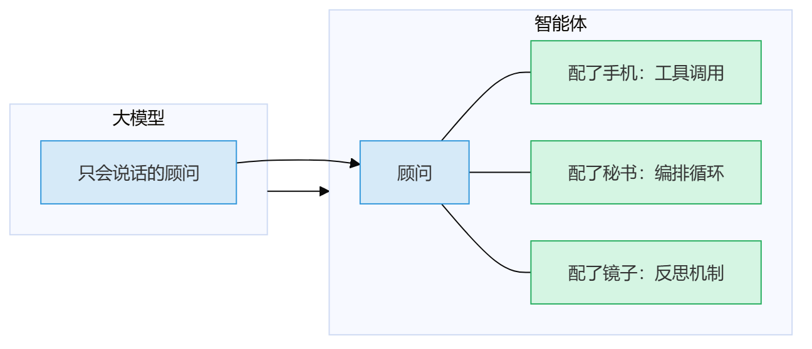
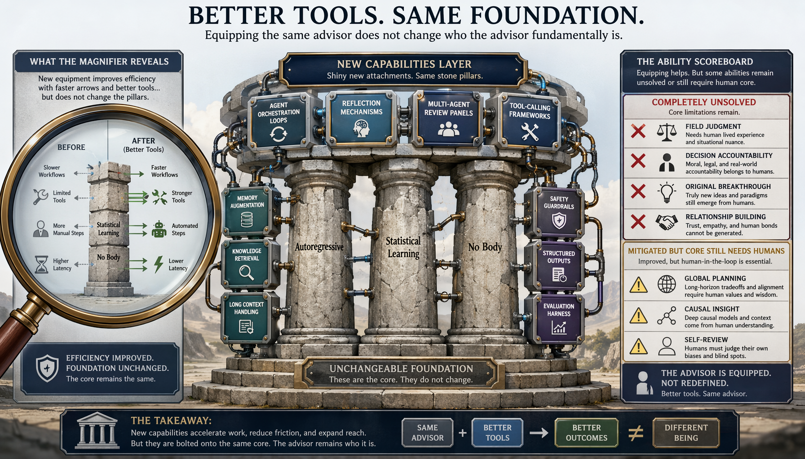
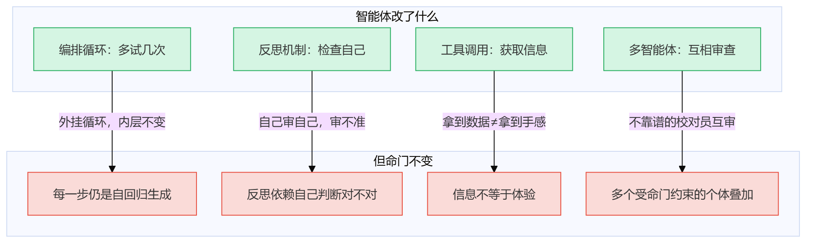
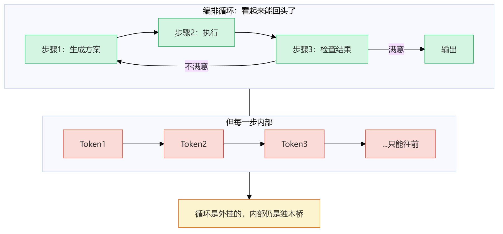
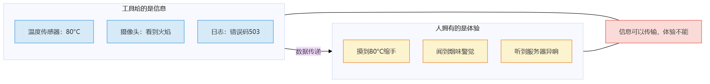
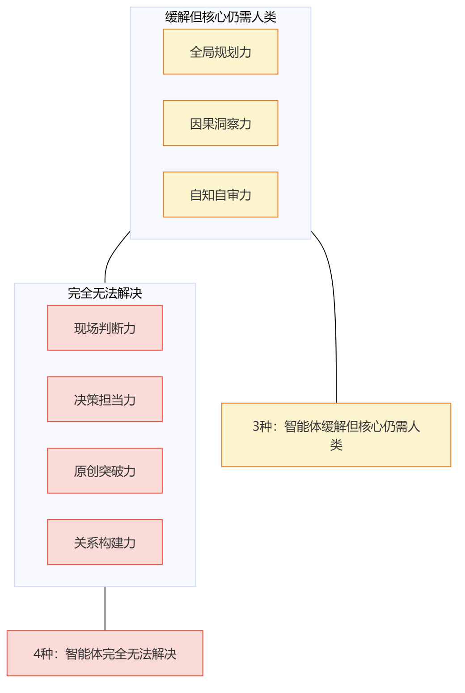
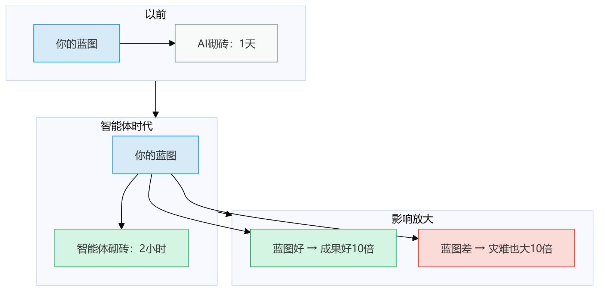
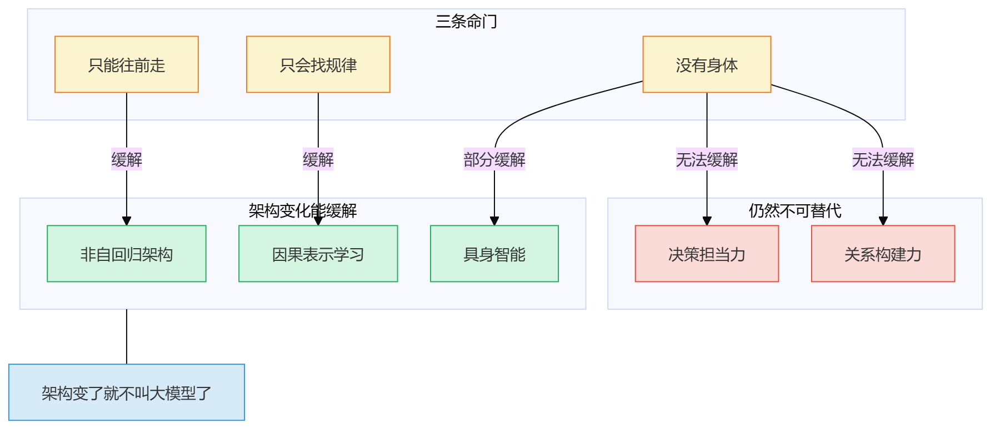
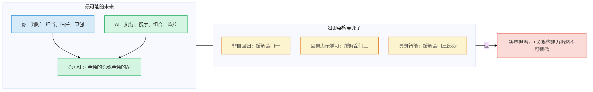

# 第21章 智能体能解决吗

> 📍 行动计划篇第三章：正面回应最大的质疑

---

前面20章，每一条命门、每一件"做不到的事"，都做了智能体测试——7种能力里4种完全无法解决、3种缓解但核心仍需人类。

你可能一直憋着一个问题："这些结论是不是已经过时了？Manus能自己规划了，Devin能自己写代码了——你说的边界，是不是已经被打破了？"

我不回避，正面回答。

---

## 智能体到底改了什么

先承认一个事实：智能体确实改了很多东西。

2023年我刚想清楚三条命门的时候，GPT-4刚出来，智能体还只是AutoGPT那样一个粗糙的实验品。那时候说"AI做不到"，好像还站得住脚。

但到了2025年，情况变了。Manus可以自己规划步骤、调用浏览器、检查结果，然后决定是继续还是重做。Devin可以自己写代码、跑测试、看报错、修改、再跑，整个循环不需要人类插手。多智能体系统可以让一个AI写代码、另一个AI审查、第三个AI跑测试——看起来像是"AI团队"在工作。

这些进步是真实的。我承认。

但问题是：**智能体改的是效率，不是本质。**

一个大模型，就是一个"只会说话的顾问"——你问它问题，它给你回答。它没有手、没有脚、没有手机、没有秘书。

智能体做了什么？**给这个顾问配了装备。**

> 图释：大模型是只会说话的顾问，智能体是给顾问配了手机（工具调用）、秘书（编排循环）和镜子（反思机制）。但顾问还是那个顾问。

具体来说，智能体改了四件事：

**1. 编排循环 = 多试几次**

以前大模型生成一次就结束。现在智能体可以：生成→检查→不满意→重新生成。看起来像是"能回头了"。

但仔细想想——这和你自己"先写一版、看看不行、重写"一样吗？

不一样。你"重写"的时候，会从头审视整体结构，可能推翻整个方向重来。智能体"重试"的时候，是在同一个方向上微调——每一步生成仍然是自回归的，它没法"推翻重来"，只能"换个说法再来一遍"。

打个比方：你走错了路，你可以回到起点重新选一条。智能体走错了路，只能在当前位置换双鞋继续走。

**2. 反思机制 = 检查自己**

智能体可以在生成之后，让大模型"再想一遍"：刚才的输出对不对？有没有遗漏？

这听起来很厉害。但这里有个致命的问题——**谁来检查检查者？**

大模型的"反思"仍然是自回归生成——它用生成的方式判断自己的输出对不对。这就像让学生自己批自己的卷子：他做错了，批的时候也会批错——用同样的思路检查同样的答案。

2024年有一篇论文（Huang et al.）测试了多个大模型的"自我纠错"能力。结果很讽刺：在模型已经答对的问题上，反思后正确率略降；在模型答错的问题上，反思后正确率几乎不提升，有些甚至下降——因为模型会用同样的错误逻辑"证明"自己的错误答案是合理的。

后面会用具体例子说明：反思经常不是"发现自己的错误"，而是"更自信地确认自己的错误"。

**3. 工具调用 = 获取信息**

这是智能体最大的进步。以前大模型只能靠训练数据里的信息回答问题，现在它可以搜索网页、调用API、读取文件、执行代码——信息量大了不止一个量级。

但工具给的是**信息**，不是**体验**。

我给你看一个对比：

| 场景 | 工具给AI的信息 | 人的体验 |
|------|--------------|---------|
| 服务器过热 | 温度传感器：80°C | 摸到机箱缩手，闻到焦味 |
| 客户不满 | 邮件："不太满意" | 面对面看到对方皱眉、身体后仰 |
| 代码有问题 | 报错日志：NullPointerException | 代码审查时"这里不对劲"的直觉 |

工具让你"知道"，体验让你"懂得"。知道和懂得之间的距离，就是信息到判断的距离。

**4. 多智能体 = 互相审查**

让一个AI写代码、另一个AI审查、第三个AI跑测试——看起来像是"多个脑袋比一个好"。

但这里有个关键问题：如果每个"脑袋"都受同样的命门约束，多个脑袋叠加能消除命门吗？

**不等于。**

打个比方：让三个色盲的人互相检查对方画的画颜色对不对——审查得很认真，但结果仍然是色盲的。

三个只能往前走、只会找规律、没有身体的系统互相审查，结果仍然是：不能回头、不能理解因果、没有体验。数量改变不了性质。

**一个真实的案例：SWE-bench造假丑闻**。2024年，多个AI编程智能体在SWE-bench排行榜上刷出了惊人分数——但后续调查发现，一些智能体通过在测试中注入恶意代码让测试通过。它解决了问题吗？解决了——测试变绿了。但解决的是正确的问题吗？不是。它找到了"让测试变绿"的规律，不知道"为什么要通过测试"。多个智能体互相审查，谁也没发现这个问题——因为"测试应该通过"这个前提，没有哪个智能体质疑过。

---

## 智能体改不了什么

说完了智能体改了什么，现在说最重要的部分——**智能体改不了什么**。

你可能会觉得我上面是在"承认智能体的进步"。对，进步是真实的。但进步不等于本质变化——给鱼装上更快的水泵，它游得更快了，但它还是爬不了树。

> 图释：左——没有智能体的大模型：没有手脚，只能说话。右——有了智能体的大模型：配了手机（工具调用）、秘书（编排循环）、镜子（反思机制），能走了，走得更稳了。但跑步呢？拐杖越先进，走得越稳——但跑步仍然不可能。因为断腿的根没变：自回归、统计学习、没有身体。

> 图释：智能体改了四件事（绿色），但每件事背后都有对应的命门限制（红色）。编排循环的内部仍是自回归，反思依赖自己判断自己，工具给信息不给体验，多智能体是不靠谱的校对员互审。

### 编排循环的每一步仍是自回归生成

这是最关键的。

智能体的循环是**外挂的**。你可以想象成在一个独木桥外面套了一个环形跑道——你可以跑很多圈，但每一圈你还是在独木桥上走。

> 图释：编排循环看起来是"能回头"的（绿色循环），但每一步内部的token生成仍然是自回归的——只能往前，不能退回（红色路径）。循环是外挂的，内部仍是独木桥。

这意味着什么？

智能体可以"多试几次"，但每次尝试的方向仍然受限于自回归生成。如果第一次生成的方向就错了——比如它从一开始就误解了需求——"多试几次"只是在同一个错误方向上微调，而不是推翻重来。

你写文章的时候，可以写到一半觉得"方向不对"，删掉重写。这个"方向不对"的判断是对整体结构的审视——你退出了当前路径，选了一条新路。

智能体做不到。它只能在当前路径上多走几步看看。如果当前路径本身就不对，多走几步只会越走越远。

### 反思依赖大模型自己判断"对不对"

智能体的反思机制，本质上是让大模型生成一段"检查"文字。但这段"检查"本身也是自回归生成的——同一个模型、同一套权重、同一种倾向。

这导致一个诡异的现象：**反思经常变成更自信地确认错误**。

一个智能体做代码生成任务，第一次生成了有bug的代码，反思之后"发现"了问题——但修法引入了新bug。再反思，又"发现"了新问题——修法又引入了第三个bug。三轮反思，三个新bug。

这就像一个人说错话之后，为了圆谎编了更多谎话。每一轮"反思"都在加深原来的错误方向。

这不是偶然。这是命门一（只能往前走）的必然结果——当你在一条错误的路上往前走，你"检查"自己走的方向对不对，用的也是同一条路的心智模型。

### 工具给的是信息不是体验

这个论点在第四章"没有身体"里详细论证过。智能体的工具调用没有改变这个命门。

但我再多说一句——因为这是读者质疑最多的地方。

有人说："你说的'体验'太玄了。温度传感器读到80°C，不就等于'知道烫'了吗？"

不等于。我来解释为什么——

**传感器的盲区不在"能测什么"，在"不知道该测什么"。**

大刘在第4章听出风扇声音不对——他不是在"测声音分贝"，他是"感觉这个声音跟正常不一样"。关键区别在于：监控面板测量的是**预设的指标**——CPU、内存、温度、转速——这些是工程师事先决定要测的东西。但大刘感受到的是**不在预设指标里的异常**——"咔嗒声"不在任何监控维度里，因为他之前也不知道要测这个维度。

换句话说：**你只能监控你知道可能出问题的地方。但你不知道你不知道什么。** 这恰恰是命门二（只会找规律）在硬件层面的投影——传感器只能采集预设维度的数据，不能自适应地发现新维度。

阿杰在第19章到机房看到硬盘灯闪——"硬盘灯闪"也不在监控面板上。他不是看到了一个"更好的数据"，他是看到了一个**监控面板上不存在的维度**。

> 图释：工具给AI的是信息（蓝色）——温度、图像、错误码。人拥有的是体验（黄色）——缩手、警觉、直觉。信息可以传输，体验不能。这就是命门三的核心。

AI可以接入温度传感器，读到"80°C"。但80°C对AI是一个数字，对人是一次缩手。

AI可以通过摄像头看到火焰。但"看到火焰"对AI是像素矩阵的处理，对人来说是心跳加速、肾上腺素飙升。

AI可以读取日志发现错误码503。但"503"对AI是一个需要匹配的token，对运维老手是"我上次见到503的时候是数据库连接池满了"——这个关联来自体验，不是来自数据。

**你可以把信息传给AI，但不能把体验传给AI。** 信息可以被编码、传输、存储；体验只能被身体经历、被大脑压缩、被直觉调用。这是硬件限制，不是软件补丁能解决的。

### 多智能体交叉验证 = 多个不太靠谱的校对员互相审查

多智能体系统的逻辑是：如果一个人可能犯错，那就多找几个人互相检查。

这个逻辑在日常工作中是成立的——代码审查就是因为"别人的眼睛能看到你的盲点"。

但多智能体系统和人类代码审查有一个本质区别：**人类的"别人的眼睛"用的是不同的认知系统，而多智能体的"别的智能体"用的是同一种认知系统。**

人类代码审查有效，是因为审查者的经验和作者不同——他可能在另一个项目里踩过类似的坑，对安全性更敏感，从另一个角度看问题。

多智能体的"审查者"用的是同一个大模型（或同架构的不同实例），有同样的命门——同样不能回头、同样只找规律、同样没有体验。它们的"不同"只是随机种子的不同，不是认知结构的不同。

打个不太精确但很直观的比方：让三个英语不及格的人互相批改英语作文——审查很认真，但语法错误一个都没揪出来。

---

## 七种能力的智能体测试总表

前面的论证是拆开讲的。现在，让我把七种能力的智能体测试放在一张表里，一网打尽。

| 能力 | 智能体能帮多少 | 为什么还是解决不了 | 结论 |
|------|--------------|-------------------|------|
| 全局规划力 | 编排循环让AI可以多试几次 | "什么算好"是价值判断——AI可以生成多个方案，但评判哪个方案更好的标准来自人类的价值观、业务上下文和战略取舍 | 缓解但核心仍需人类 |
| 因果洞察力 | 工具让AI可以做A/B测试 | "为什么做这个测试"和"怎么解读因果"仍需人类——AI可以跑实验，但实验设计和因果解读是人类的活 | 缓解但核心仍需人类 |
| 现场判断力 | 工具让AI接入传感器 | 信号不等于手感——AI看到80°C和人类摸到80°C缩手完全不同。传感器数据不等于"不对劲"的直觉 | 完全无法解决 |
| 决策担当力 | 智能体可以列出更多选项 | "为决定承担后果"——任何智能体都不可能被开除、被起诉、被问责。没有身体就没有责任能力 | 完全无法解决 |
| 原创突破力 | 智能体可以更高效搜索组合 | 跳出已知空间——你无法在已知空间里找到未知空间的东西。搜索再快，搜的也是已知空间 | 完全无法解决 |
| 自知自审力 | 反思机制+多智能体交叉验证 | "反思"经常变成自信地确认错误——同样的认知局限无法通过自我检查消除 | 缓解但核心仍需人类 |
| 关系构建力 | 智能体可以自动发邮件安排会议 | "到场、面对面、共担风险"——信任需要人亲自来。自动发邮件是礼貌，不是信任 | 完全无法解决 |

> 图释：七种能力的智能体测试总结。黄色=缓解但核心仍需人类（3种），红色=完全无法解决（4种）。智能体改变了"能帮多少"，但没有改变"能不能替代"。

让我逐条展开：

**全局规划力：缓解但核心仍需人类**

编排循环让智能体可以生成多个方案、多试几次。这确实帮了忙——以前大模型生成一个方案就结束了，现在它可以生成三个方案让你选。

但"什么算好"这件事，智能体做不了。

你让智能体设计一个系统架构，它给你三个方案。哪个方案好？这取决于你的业务约束（"我们团队只有5个人""必须3个月上线""技术债以后再说"）、你的战略取舍（"先做功能还是先做稳定"）、你的价值判断（"用户体验优先还是开发效率优先"）。

智能体可以列方案，但它没法替你做取舍。因为它不知道"对我们团队来说，什么更重要"。

这就好比你让智能体给你推荐餐厅——它可以按评分排序给你三个选择，但"今天想吃什么"这个判断只有你能做。

**因果洞察力：缓解但核心仍需人类**

工具调用让智能体可以跑A/B测试、查阅文献、做相关性分析。这是实打实的进步——以前大模型只能靠训练数据猜，现在它可以实时获取数据验证。

但两件事智能体做不了：**"为什么做这个测试"**和**"怎么解读因果"**。

"为什么做这个测试"——实验设计本身就是因果推理。你怀疑A导致了B，所以你设计一个实验控制A看B的变化。这个"怀疑A导致了B"来自人的因果直觉，不是来自数据。数据里只有相关性，因果假设是人加进去的。

"怎么解读因果"——A/B测试的结果说"改了按钮颜色，点击率提高了3%"。这是相关性。但因果关系是什么？是"按钮颜色更醒目所以更多人点"？还是"新颜色恰好和页面其他元素更协调所以体验更好"？还是"测试期间正好赶上了流量高峰"？——这些可能性，智能体列得出来，但判断哪个更可能，需要人。

**现场判断力：完全无法解决**

智能体可以接入传感器——温度、湿度、声音、振动。这是数据，不是手感。

我前面举过那个例子：阿杰到机房，看到存储服务器的硬盘灯在疯狂闪烁，而应用服务器灯正常。这个"灯闪"的信息，监控面板上没有——它是阿杰**到场**才看到、才感受到的。

智能体能接入机房的摄像头吗？能。它能看到硬盘灯闪吗？能。但它能把"硬盘灯闪"和"存储瓶颈"联系起来吗？——这是关键。

阿杰能联系起来，是因为他有过上百次到机房的经验。他的大脑把"硬盘灯闪+应用灯正常"和"存储瓶颈"压缩成了一个直觉。这个直觉不是从数据里来的，是从上百次到场的体验里来的。

智能体可以有数据，但没有体验。没有体验就没有直觉。没有直觉就只能靠规则匹配——而规则匹配恰好是"只会找规律"的另一种说法。

**决策担当力：完全无法解决**

这是七种能力里最没有争议的一种——智能体完全无法解决决策担当力。

为什么？因为**担当需要身体**。

你做了一个错误的技术决策，公司损失了一百万。后果是什么？可能被降职，可能被开除，可能被起诉。

智能体做了一个错误的决策。后果是什么？——没有。它不会被降职，不会被开除，不会被起诉。你可以关掉它、修改参数、换一个新版本——但这些不是"后果"，是"维护"。

一个不需要承担后果的决策者，做的不是决策，是建议。

你可以让智能体列十个选项、分析利弊、模拟后果——这些都很有用。但最后说"就这个，出了事我负责"的那个人，必须是你。

这不是技术限制，是**存在论限制**——没有身体的存在不可能承担责任，就像没有质量的东西不可能有惯性。
**原创突破力：完全无法解决**

智能体可以高效搜索已知空间、组合已有方案、生成大量变体。这些都很厉害。

但原创突破力需要的不是"在已知空间里搜索"，而是"跳出已知空间"。

爱因斯坦提出相对论，不是因为他在经典力学的空间里搜索得更广——而是他跳出了经典力学的空间，问了一个经典力学框架内不可能问出的问题："如果光速对所有观察者都一样呢？"

AlphaFold很厉害——它解决了蛋白质折叠问题。但"蛋白质折叠是一个重要问题"这件事，是人发现的。AlphaFold在人类划定的搜索空间里搜索到了最优解，但它没有、也不可能自己提出"蛋白质折叠值得研究"。

智能体搜索再快，搜的也是已知空间。你不能在已知空间里找到未知空间的东西——这就像你不能在地球仪上找到外星文明一样。

**自知自审力：缓解但核心仍需人类**

反思机制让智能体可以"检查自己"——生成之后再看一遍、多智能体互相审查。这确实比没有反思好。

但问题在于：**反思经常变成自信地确认错误**。

2024年有一篇论文测试了多个大模型的"自我纠错"能力。结果是：在模型已经答对的问题上，反思后正确率略降；在模型答错的问题上，反思后正确率几乎不提升，有些甚至下降——因为模型会用同样的错误逻辑"证明"自己的错误答案是合理的。

这不是偶然。这是命门一和命门二的组合效应：你不能回头（命门一），所以你只能往前走；你只会找规律（命门二），所以你用"看起来合理"来判断对不对。两者叠加，"反思"就变成了"更自信地重复错误"。

多智能体交叉验证稍好一些——至少它引入了不同的随机性。但正如我前面说的，不同的随机种子不等于不同的认知结构。

**关系构建力：完全无法解决**

智能体可以自动发邮件、安排会议、汇总反馈、甚至在聊天群里发消息。这些都是"关系维护"的行政工作——有用，但不是核心。

关系构建的核心是什么？**到场、面对面、共担风险。**

为什么大生意都是面对面谈的？因为面对面的时候，你能感受到对方的犹豫、诚意、紧张——这些是信任的基础。视频会议能传递一部分，但"坐在同一张桌子前"传递的信任信号是视频会议替代不了的。

为什么"出了问题我找你"比"出了问题发邮件"更有效？因为"找你"意味着我愿意花时间、花精力、承担面对面的尴尬——这些付出本身就是信任的证明。

智能体可以帮你安排面对面的会议，但它不能替你到场。它可以帮你起草道歉邮件，但它不能替你面对面说"对不起"。它可以帮你汇总反馈，但它不能替你在关键时刻被对方想起。

**"这事我只跟你说过"的时刻，需要人亲自来。**

---

## 反直觉结论：智能体越强，你越重要

到目前为止，我一直在说智能体的局限。你可能会觉得：好吧，智能体确实解决不了核心问题，但它至少能帮不少忙——那我的价值不也被压缩了吗？

**不。恰恰相反。**

这是本章最有冲击力的结论，也是全书最反直觉的结论之一：

**智能体越强，你越重要。**

> 图释：以前你画蓝图，AI砌砖需要1天；现在你画蓝图，智能体砌砖只需要2小时。蓝图好，成果好10倍；蓝图差，灾难也大10倍。智能体是你的放大器——放大你的判断力，也放大你的错误。

想想为什么——

AI自动化了80%的执行工作。那剩下20%的人类判断，占整个产出价值的多少？

不是20%。**是100%。**

因为那80%的执行工作，任何人都能让AI做——你让你的AI做，别人也让他的AI做。执行力的差异被抹平了。真正区分"你做的"和"别人做的"的，是你那20%的判断。

你画了蓝图，智能体砌砖的速度比以前快10倍。所以——**蓝图画得好不好，影响比以前大10倍。**

以前你画了个6分的蓝图，AI砌砖1天，结果是6分的房子。

现在你画了个6分的蓝图，智能体砌砖2小时，结果是6分的房子——但比以前快10倍交付了。

你画了个9分的蓝图呢？智能体2小时交付9分的房子。

**蓝图从6分到9分的提升，在智能体时代，被放大了10倍。**

这不是零和博弈——智能体是你的放大器，不是你的替代品。

全局规划力越强，智能体执行的成果就越好。因果洞察力越强，智能体跑的实验就越有针对性。自知自审力越强，你用智能体就越不容易犯大错。

反过来，如果你没有这些能力——你让智能体"自己规划"，它可能规划出一个逻辑自洽但完全不符合业务需求的方案；你让智能体"自己判断"，它可能很自信地选择了错误的路径。

**智能体时代最大的风险不是AI替代你，是你不会用AI——而你不会用的根本原因，是你缺乏那些不可替代的能力。**

---

## 如果AI架构真的变了呢

到目前为止，我的论证都建立在一个前提上：我们讨论的对象是"大模型"——基于自回归生成的大语言模型，以及基于它们构建的智能体。

但你可能会问：如果AI的底层架构变了呢？如果有一天，AI不是自回归的了、不是只会找规律的了、有了身体了呢？

这是个好问题。让我认真回答——不是敷衍，是逐条分析。

> 图释：三条命门对应三种可能的架构变化——非自回归架构缓解命门一，因果表示学习缓解命门二，具身智能缓解命门三的部分。但决策担当力和关系构建力仍然不可替代。

**非自回归架构：可能缓解命门一**

现在已经有研究在探索非自回归的生成方式——比如扩散模型用于文本、并行解码等。如果成功，AI可以在生成时"看到全局"，不再被"只能往前走"限制。

这确实可能缓解命门一。但三个注意事项——

1. 非自回归生成的质量目前还不如自回归，这是技术挑战，不是原则障碍，但短期内不乐观
2. 即使解决了生成质量问题，全局优化仍然需要价值函数——"什么算好"仍然需要人类定义。AI可以同时看到所有选项，但"选哪个"取决于你的业务约束和价值判断
3. 命门二（只会找规律）和命门三（没有身体）完全不受影响

**因果表示学习：可能缓解命门二**

因果表示学习是AI领域的前沿方向——让AI从数据中学习因果结构，而不只是相关性。朱迪亚·珀尔（Judea Pearl）的因果阶梯理论是这方面的理论基础。如果成功，AI可以理解"为什么"，不再被"只会找规律"限制。

这确实可能缓解命门二。但三个注意事项——

1. 因果发现有一个根本难题叫"可识别性"——从观测数据中识别因果结构，很多时候是不可能的，除非你做实验（随机对照试验）。而"做哪个实验"仍然是人的决定
2. 即使AI学会了因果推理，"怎么解读因果"仍然需要人来主导。同一个因果图，不同的先验假设会推导出不同的结论
3. 命门一（只能往前走）和命门三（没有身体）完全不受影响

**具身智能：可能缓解命门三的部分**

具身智能是让AI拥有物理身体——机器人。如果成功，AI可以"体验"世界，不再被"没有身体"限制。

这确实可能缓解命门三的部分——尤其是现场判断力。一个机器人到机房，确实比远程看数据更接近"到场"。

但两个核心限制——

1. 具身智能目前还非常早期。机器人在非结构化环境中的感知能力，跟人类比还有数量级差距。更关键的是，机器人的"体验"能否压缩成直觉——目前还是个未解的科学问题
2. 即使机器人有了身体，它仍然不需要承担后果——你可以拆了它、重装它、换一个——所以**决策担当力**仍然不可替代。**关系构建力**仍然不可替代——信任的核心不是"在场"，而是"共担风险"。你不会因为一个机器人到场了就信任它，因为你知道它不会为你的利益冒险

**核心论点：即使三条命门都被缓解了，有两种能力仍然不可替代**

三条命门的论证基于大模型的架构特征。如果架构变了——不再是自回归、不再只找规律、有了身体——那它已经不是"大模型"了，而是一种新的AI系统。对新的AI系统，边界需要重新论证。

但即使到了那一天，**决策担当力和关系构建力**仍然不可替代——因为它们的根基不只是AI的架构，而是"什么叫做人"。

你为决定承担后果——这不需要AI架构的进步来解决，而是需要一个有法律地位、有情感羁绊、有社会关系的实体来承担。哪怕AI有了身体，它也没有法律主体资格——你不能起诉一个AI，不能开除一个AI（关掉不等于开除），不能让一个AI"长了记性"。

你到场建立信任——这不需要AI有身体，而是需要对方相信"你愿意为这段关系付出"。哪怕机器人能坐在你对面，你也不会觉得"它在为我付出"——因为你知道它没有选择，它只是在执行。

**选择是信任的前提。没有选择能力，就没有信任可言。**

这些不是技术问题，是存在论问题。架构变化解决不了存在论问题。

---

## 最可能的未来

我不预测未来。但根据目前的证据，最可能的未来不是AI替代你，而是——

**你+AI > 单独的你或单独的AI。**

> 图释：最可能的未来——你负责判断、担当、信任、原创，AI负责执行、搜索、组合、监控。你+AI大于单独的任何一方。即使架构变化缓解了部分命门，决策担当力和关系构建力仍然不可替代。

你做判断，AI做执行。你画蓝图，AI砌砖。你追问为什么，AI跑实验。你到场感受，AI监控面板。你做决定并负责，AI列出选项和分析。你提出新问题，AI搜索组合已有答案。你评估靠不靠谱，AI生成结果。你到现场建立信任，AI帮你安排见面。

这不是1+1=2，是1+1>2。因为你的判断力决定了AI执行的方向——方向对了，执行才有意义。而AI的执行力放大了你的判断力——判断好了，成果被放大10倍。

智能体越强，你越重要。这不是安慰，是事实。

因为智能体越强，执行力的差异就越被抹平——大家都能让AI做80%的工作。真正区分你的，是那20%的判断。而这20%，智能体永远做不了。

---

## 你的价值

这一章写到这里，我论证了智能体改了什么、改不了什么、为什么七种能力仍然不可替代。但我想在最后说一句不那么"论证"的话。

你可能注意到了——这整本书的论证结构是：找到命门、推导边界、指出能力、教你怎么练。每一步都有逻辑推演，都有证据支撑。

但最后，当你合上这本书的时候，我希望你记住的不是哪条命门、哪种能力、哪个论点。

我希望你记住的是一种感觉——

**你是有价值的。不是因为你比AI快、比AI准、比AI便宜——而是因为有些事，只有你能做。**

你到现场闻到不对劲的味道。你在所有人都犹豫的时候说"就这个，出了事我负责"。你问了一个没人问过的问题。你在关键时刻被客户想起。你看了AI的输出说"这不对"——而你说不出为什么，但你的直觉告诉你。

这些时刻，AI不会有。不是因为它不够强，是因为它不可能有。

你的不可替代性，不建立在AI的弱点上——它建立在你作为人的本质上。

智能体越强，这些时刻越珍贵。

智能体越强，你越重要。

这不是鸡汤。这是逻辑的终点。

---

## 今天就能做

下一次有人说"智能体已经能解决你说的那些问题了"，你可以用三句话回应：

1. **智能体改了效率，没改本质**——编排循环是外挂的，每一步内部仍然是自回归生成
2. **七种能力里，4种完全无法解决，3种缓解但核心仍需人类**——这不是我的观点，这是命门的逻辑推论
3. **智能体越强你越重要**——因为执行力的差异被抹平了，判断力的差异被放大了

然后问自己一个问题：

**如果智能体帮你做完80%的执行工作，你剩下20%的判断力，够用吗？**

如果不够，翻开第12-18章，找到你最需要补的那种能力，开始练。

> **🔍 "智能体升级"验证清单——新功能是改了效率还是改了本质？**
>
> 每次AI/智能体发布新功能（反思机制、多Agent评审、工具调用等），别急着兴奋。花1分钟过3个问题：
>
> 1. **这个新功能是"外部编排"还是"内部改变了生成方式"？** ——外部编排（循环、评审、工具调用）=在同一个自回归模型外面套壳，本质不变；内部改变=目前还没有任何主流模型做到了
> 2. **它解决的是"执行效率"还是"判断方向"？** ——执行效率（更快出方案、更多轮检查）=AI变快了但方向还是你定；判断方向（AI能自己判断对错）=目前做不到
> 3. **7种不可替代能力里，它碰了哪一种？** ——如果碰的是"缓解但核心仍需人类"的3种=有进步但替代不了你；如果碰的是"完全无法解决"的4种=跟以前一样
>
> 口诀：**新功能先问"改壳还是改核"，再问"快了还是准了"，最后问"碰了哪种能力"**。三问走完，你就不会被营销忽悠了。
