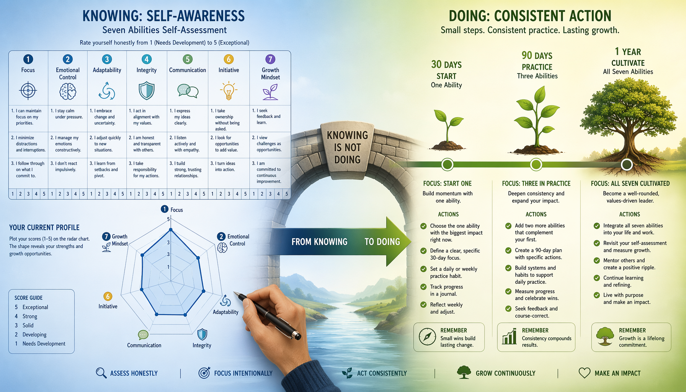
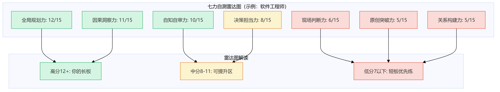
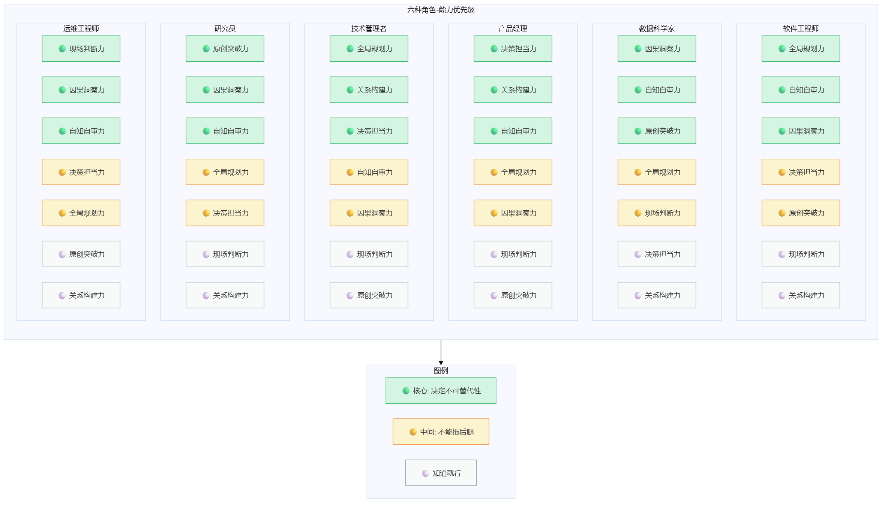
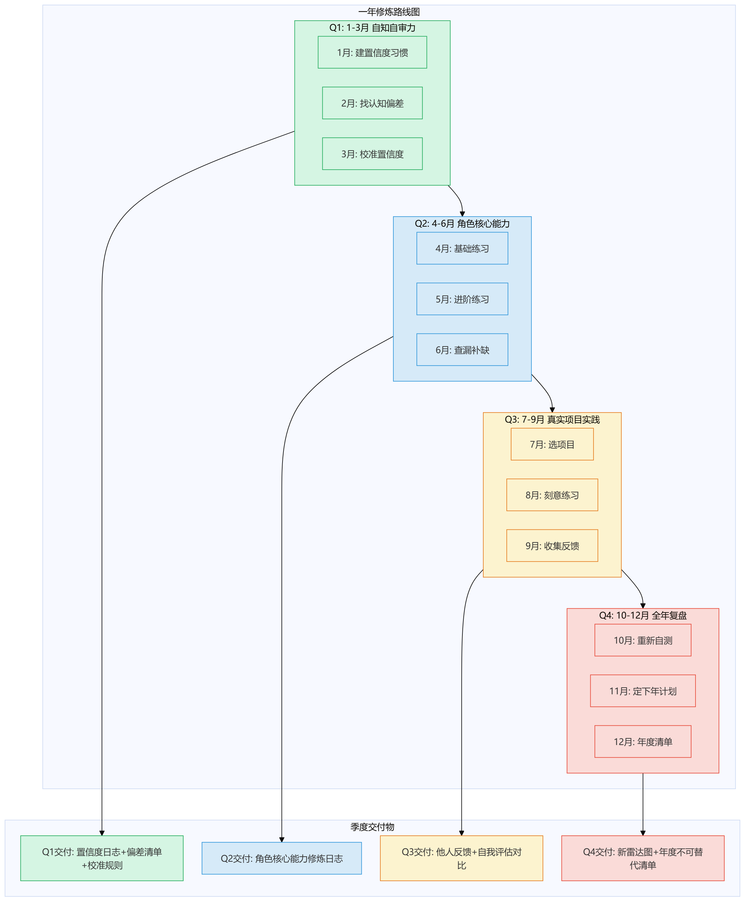
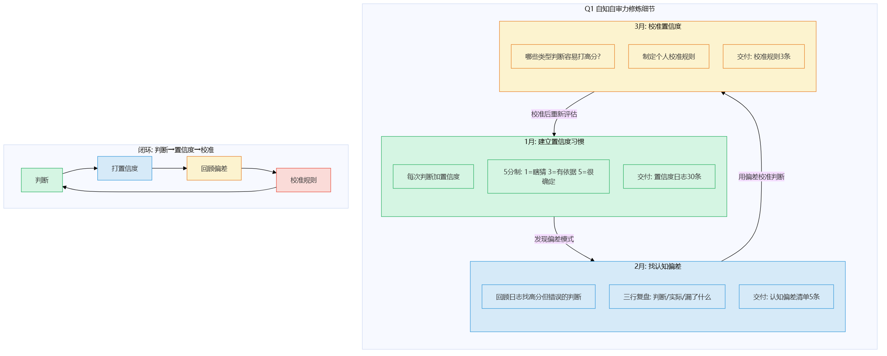
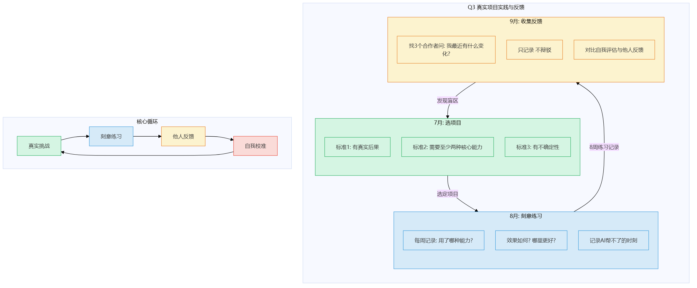
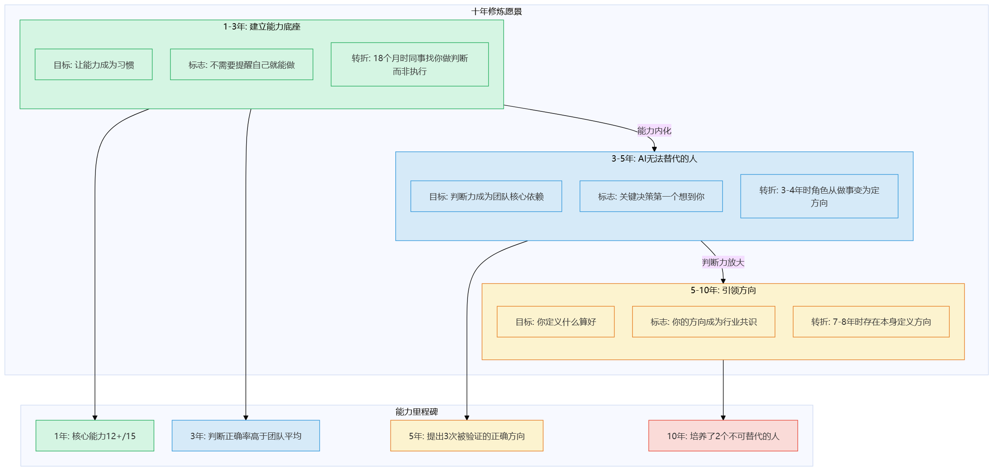
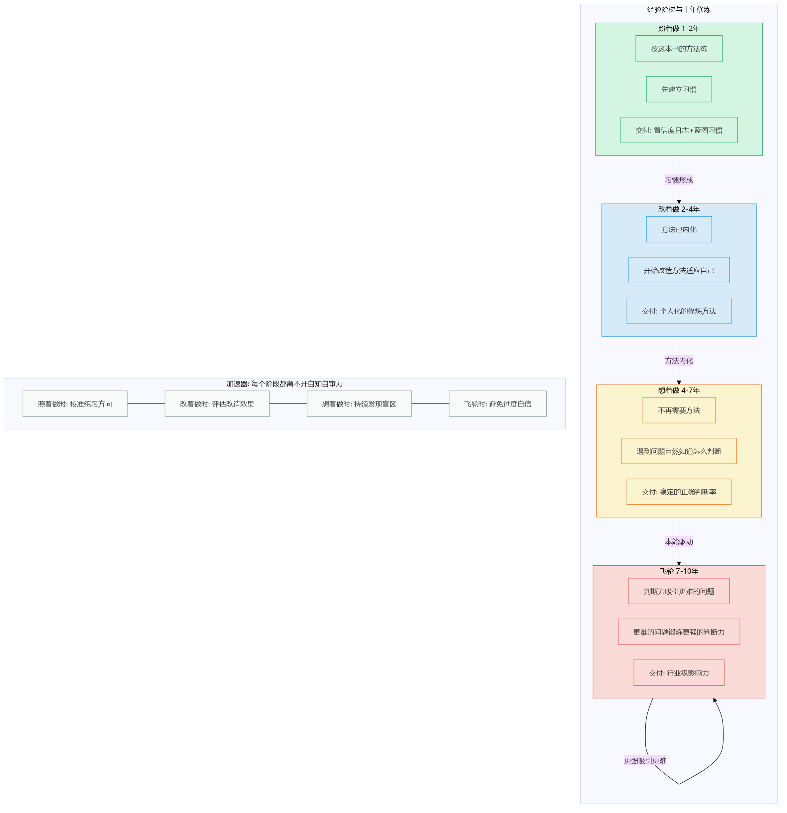
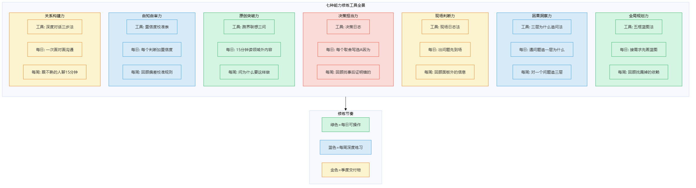
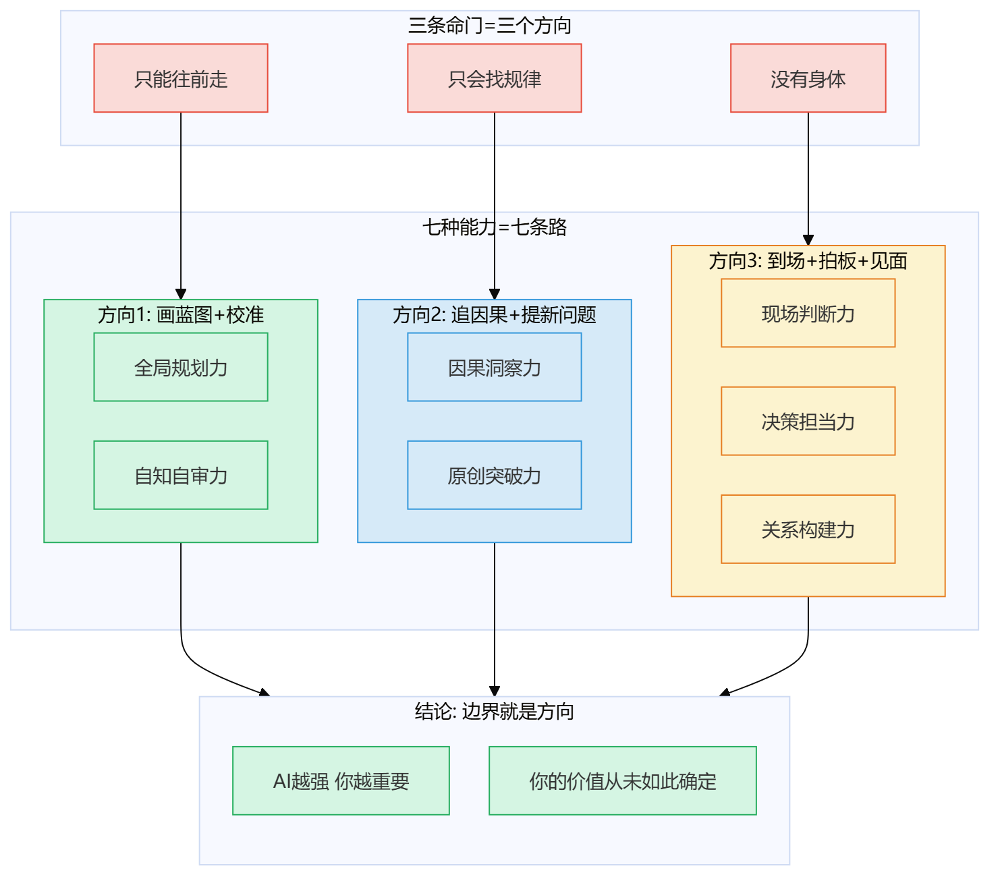

# 第22章 行动计划

> 📍 行动计划篇第四章，全书终章。给你一个从今天开始的修炼路线图。

---

我写这本书，不是让你"知道"七种能力——知道没有用，练了才有用。

但"练"这个词太模糊了。练什么？先练哪个？练多久？怎么知道自己练对了？

这一章，我把前面21章的所有内容，压缩成一份你可以**今天就开始**的行动计划。

不是鸡汤，不是口号——是问卷、是路线图、是每个月做什么。

> 图释：30天——基础建立，选好能力，用模板练第一次。90天——校准起步，模板开始长出自己的习惯，遇到真实场景验证。一年——形成飞轮，能力变成习惯，判断-验证-校准自动循环。每一步都有明确检查点。

---

## 第一步：你站在哪里？

在规划路线之前，先知道自己在哪里。

下面这份问卷，每种能力3个问题，每题1-5分。**不要想太久，凭第一感觉打分。**想太久你会给自己打高分——那是自知自审力还没练好的信号。

### 七种能力自测问卷

**全局规划力**（你画蓝图的能力）

1. 面对一个模糊需求，你能不能在不写代码之前，先画出"哪些模块、谁依赖谁、改一个会牵动几个"？
   - 1分=直接开写，写一步看一步
   - 3分=会画个草图，但经常漏依赖
   - 5分=习惯先画蓝图，能发现80%以上的依赖关系

2. 你的方案被推翻过吗？推翻之后，你能不能在30分钟内画出替代方案的蓝图？
   - 1分=推翻了就慌，不知道从哪改起
   - 3分=能改，但要半天以上
   - 5分=推翻是常态，蓝图工具在手，30分钟出新方案

3. 你做技术选型时，会主动列出"如果选A，哪些事变简单了、哪些事变难了"吗？
   - 1分=只看优点
   - 3分=会想缺点，但想不全
   - 5分=每项选型都列利弊清单，而且利弊清单会影响决策

**因果洞察力**（你追问"为什么"的能力）

4. 遇到bug或故障，你习惯追问几层"为什么"？
   - 1分=修了症状就收工
   - 3分=会问一层"为什么"，但不深追
   - 5分=至少追三层，直到找到结构性原因

5. 你能区分"相关"和"因果"吗？给你一组数据，你能不能判断"A导致B"还是"A和B有共同原因"？
   - 1分=看到相关就当因果
   - 3分=知道有区别，但经常分不清
   - 5分=每次下因果判断前，都会想"有没有第三变量"

6. 你最近一次"追问为什么发现了意外根因"是什么时候？
   - 1分=想不起来
   - 3分=一个月内有
   - 5分=一周内有

**现场判断力**（你到场感受的能力）

7. 出了问题，你第一反应是"看日志/面板"还是"到现场/复现"？
   - 1分=只看面板
   - 3分=会尝试复现，但不一定到场
   - 5分=习惯到场或亲手操作，感受真实状态

8. 你有没有过"面板显示正常但直觉告诉我不对"的经历？
   - 1分=从来没有，面板说好就是好
   - 3分=有过一两次
   - 5分=经常有，而且直觉经常对

9. 你最近一次"到现场发现了面板看不到的信息"是什么时候？
   - 1分=想不起来
   - 3分=半年内有
   - 5分=一个月内有

**决策担当力**（你做决定并负责的能力）

10. 面对两个都不完美的方案，你能不能在信息不完整的情况下拍板？
    - 1分=一直犹豫，等更多信息
    - 3分=能拍板，但心里很不踏实
    - 5分=能拍板，能说清"我选A因为……，我承担的风险是……"

11. 你做过"事后证明是错的"决定吗？你怎么处理的？
    - 1分=没做过（或者做了但归咎于信息不够）
    - 3分=做过，承认了但没复盘
    - 5分=做过，复盘了，而且复盘结论改变了后续决策方式

12. 你的团队遇到争议时，最后是谁拍板？
    - 1分=等领导定
    - 3分=大家投票
    - 5分=我拍板，我负责

**原创突破力**（你跳出框框的能力）

13. 你最近一次"质疑前提"是什么时候？（不是优化现有方案，而是问"为什么要这样做"）
    - 1分=想不起来
    - 3分=半年内有
    - 5分=一个月内有

14. 你有没有从其他领域借过想法来解决本领域的问题？
    - 1分=从来没有
    - 3分=偶尔有，但不系统
    - 5分=经常跨界借鉴，而且有意识地在不同领域之间建立联想

15. 你最近一次"提出一个没人提过的方向"是什么时候？
    - 1分=想不起来
    - 3分=半年内有
    - 5分=一个月内有

**自知自审力**（你评估"自己靠不靠谱"的能力）

16. 你给别人建议时，会主动说"我有多大把握"吗？
    - 1分=不会，说了就是100%确定
    - 3分=偶尔会说"我不太确定"
    - 5分=每次都给置信度，而且置信度经常不是100%

17. 你有没有过"以为自己很懂，后来发现理解有重大偏差"的经历？
    - 1分=没有（或者不愿意承认）
    - 3分=有过，但很久以前了
    - 5分=经常有，而且我主动寻找这种时刻

18. 你最近一次"修改了自己之前的判断"是什么时候？
    - 1分=想不起来
    - 3分=一个月内有
    - 5分=一周内有

**关系构建力**（你建立信任的能力）

19. 你最近一次"面对面解决了一个线上解决不了的问题"是什么时候？
    - 1分=想不起来
    - 3分=三个月内有
    - 5分=一个月内有

20. 别人遇到困难时，第一个找的人是你吗？
    - 1分=不是
    - 3分=偶尔是
    - 5分=经常是

21. 你有没有"为了解决一个问题，主动去见一个不认识的人"？
    - 1分=从来没有
    - 3分=偶尔有
    - 5分=经常有，而且见面效率很高

---

### 怎么算分

每种能力3题，满分15分。七种能力满分105分。

把你的分数填进这张表：

| 能力 | Q1 | Q2 | Q3 | 小计 |
|------|----|----|----|------|
| 全局规划力 | __ | __ | __ | __/15 |
| 因果洞察力 | __ | __ | __ | __/15 |
| 现场判断力 | __ | __ | __ | __/15 |
| 决策担当力 | __ | __ | __ | __/15 |
| 原创突破力 | __ | __ | __ | __/15 |
| 自知自审力 | __ | __ | __ | __/15 |
| 关系构建力 | __ | __ | __ | __/15 |
| **总计** | | | | **__/105** |

> 图释：示例雷达图——一个典型软件工程师的自测结果。全局规划力和因果洞察力较高（10+），但关系构建力和原创突破力偏低（5-6）。这不是"不及格"，而是告诉你"先练哪里"。

---

### 雷达图怎么读

**不要看总分，看形状。**

- **圆形**：七种能力比较均匀——你是通才型，选一个方向深钻
- **扁形**：有两三种能力明显高，其他低——你已经有了方向，补短板
- **尖形**：只有一种能力突出——你很专，但很脆，需要拓宽
- **低平**：都在5分以下——恭喜你，你的自知自审力可能比你想的要好，因为你能诚实打低分

**特别关注自知自审力**：如果它低于6分，其他分数都可能虚高——因为你还没学会"评估自己靠不靠谱"，给自己打的分可能不准。先把自知自审力练起来，再重新自测。

---

## 第二步：你的角色决定你的优先级

七种能力不是平均用力——你的角色决定了哪些能力对你最重要。

> 图释：六种角色的能力优先级——每种角色标出Top 3核心能力（绿色）、中间2种（黄色）、后2种（灰色）。核心能力决定你的不可替代性，中间能力不能拖后腿，后两种能力知道就行。

### 软件工程师

**核心**：全局规划力 > 自知自审力 > 因果洞察力

为什么？因为你最常做的事是"把需求变成架构"——这需要全局规划力。架构靠不靠谱，需要自知自审力来校准。出了bug要追根因，需要因果洞察力。

**中间**：决策担当力、原创突破力

**知道就行**：现场判断力、关系构建力

> 不是说现场判断力和关系构建力不重要——而是如果你的角色是纯写代码，它们不是你的瓶颈。但如果你的团队没有运维、没有项目经理，你得补上。

### 数据科学家

**核心**：因果洞察力 > 自知自审力 > 原创突破力

为什么？因为你的核心工作是"从数据里找因果"——相关不是因果，这个判断只有你能做。模型靠不靠谱，需要自知自审力。"提出新的研究方向"需要原创突破力。

**中间**：全局规划力、现场判断力

**知道就行**：决策担当力、关系构建力

### 产品经理

**核心**：决策担当力 > 关系构建力 > 自知自审力

为什么？因为你每天都在做取舍——做这个不做那个，这是决策担当力。你需要说服各方，这是关系构建力。判断靠不靠谱，需要自知自审力来校准。

**中间**：全局规划力、因果洞察力

**知道就行**：现场判断力、原创突破力

### 技术管理者

**核心**：全局规划力 > 关系构建力 > 决策担当力

为什么？因为你要画团队的技术蓝图——这是全局规划力。你要让团队愿意跟你走——这是关系构建力。技术方向你来定、你来负责——这是决策担当力。

**中间**：自知自审力、因果洞察力

**知道就行**：现场判断力、原创突破力

### 研究员

**核心**：原创突破力 > 因果洞察力 > 自知自审力

为什么？因为研究的本质是"提出没人提过的问题"——这是原创突破力。验证猜想需要因果洞察力。结论有多靠谱，需要自知自审力来校准。

**中间**：全局规划力、决策担当力

**知道就行**：现场判断力、关系构建力

### 运维工程师

**核心**：现场判断力 > 因果洞察力 > 自知自审力

为什么？因为你的工作就是"出问题了到场"——这是现场判断力。到场之后追根因——这是因果洞察力。判断有多大把握——这是自知自审力。

**中间**：决策担当力、全局规划力

**知道就行**：原创突破力、关系构建力

---

### 如果你身兼数职

大多数技术人员不是单一角色。你是"写代码的+带人的"，或者"做数据的+管产品的"。

没关系——把每个角色的核心能力取并集，然后按出现次数排序。

举个例子：软件工程师 + 技术管理者

- 全局规划力：出现2次（两个角色都是核心）
- 自知自审力：出现1次（软件工程师核心）
- 因果洞察力：出现1次（软件工程师核心）
- 关系构建力：出现1次（技术管理者核心）
- 决策担当力：出现1次（技术管理者核心）

排序：全局规划力 > 自知自审力 ≈ 因果洞察力 ≈ 关系构建力 ≈ 决策担当力

全局规划力是绝对核心，其他四种并列第二。

---

## 第三步：一年修炼路线图

知道了自己在哪里、该练什么，接下来就是——**怎么练、什么时候练**。

> 图释：一年修炼路线图——Q1全员练自知自审力，Q2根据角色选核心能力，Q3在真实项目中实践，Q4全年复盘。每个季度有明确的交付物。

### Q1（1-3月）：自知自审力——一切的前提

**为什么Q1练自知自审力？** 不知道自己不知道，其他能力都白练。练全局规划力，但不知道蓝图哪里有漏洞——白练。练因果洞察力，但不知道自己的因果判断只是相关——白练。

**1月：建立置信度习惯**

- 每次给别人建议或做判断时，加一句："我有多大把握——X分"
- 不需要精确，5分制就行：1=瞎猜，3=有依据但不确定，5=非常确定
- **交付物**：一个月后，你有了一份"置信度日志"，至少30条

**2月：寻找"以为自己懂"的时刻**

- 回顾上个月的置信度日志，找"打了高分但后来发现错了"的条目
- 每个错误判断，写三行：我判断了什么 / 实际是什么 / 我漏掉了什么
- **交付物**：一份"认知偏差清单"，至少5条

**3月：校准置信度**

- 用偏差清单校准你的置信度——哪些类型的判断你容易打高分？哪些容易打低分？
- 制定你的"置信度校准规则"：比如"涉及性能的判断，自动降1分"
- **交付物**：一份个人置信度校准规则，至少3条

> 图释：Q1三个月的修炼细节——1月建习惯（每天给判断打置信度），2月找偏差（回顾高分但错误的判断），3月校准（制定个人校准规则）。三个月形成"判断→置信度→校准"的闭环。

---

### Q2（4-6月）：根据角色选核心能力

Q1打好了自知自审力的底子，Q2开始练你的角色核心能力。

**软件工程师：全局规划力**

- **4月**：每次接需求，先画蓝图再写代码。蓝图格式：模块列表 + 依赖关系 + 改一个会牵动几个。用纸笔或白板，不要用工具——工具会让你花时间调格式而不是想问题。
- **5月**：蓝图被推翻时，计时——从推翻到出新蓝图，你用了多久？目标：30分钟以内。
- **6月**：回顾你的蓝图，找"漏了依赖"的案例。每个漏掉的依赖，写"为什么漏了"。

**数据科学家：因果洞察力**

- **4月**：每次分析结论，加一句"这是相关还是因果？如果是因果，排除第三变量的依据是什么？"
- **5月**：对三个历史分析做"三层为什么"追问，看能不能追到结构性原因。
- **6月**：找一例"以为是因果其实是相关"的案例，写复盘。

**产品经理：决策担当力**

- **4月**：每个取舍决定，写"我选A因为……，我不选B因为……，我承担的风险是……"
- **5月**：找一个"信息不完整但必须拍板"的场景，拍板并记录决策逻辑。
- **6月**：回顾所有决策，找"事后证明是错的"，复盘决策过程。

**技术管理者：全局规划力 + 关系构建力**

- **4月**：画团队的技术蓝图——当前架构、半年目标、路径选择。
- **5月**：跟每个团队成员做一次1对1，不是聊任务，是聊"你觉得方向对吗"。
- **6月**：组织一次技术方向讨论，不预设结论，让大家辩论。

**研究员：原创突破力**

- **4月**：每天花15分钟读一个本领域之外的论文或文章，记下"这跟我的研究有什么关系"。
- **5月**：对你的研究方向问"为什么要这样做？有没有完全不同的路径？"
- **6月**：提出一个"没人提过"的假设或方向，不需要对，只需要新。

**运维工程师：现场判断力**

- **4月**：每次出问题，先到场或亲手复现，再看面板。到场后记下"面板没告诉我的信息"。
- **5月**：回顾历史故障，找"面板显示正常但实际有问题"的案例，至少3个。
- **6月**：建立你的"现场检查清单"——到场后先看什么、先摸什么、先问什么。

**交付物**：一份角色核心能力的修炼日志，至少包含3个"练了之后跟之前不一样"的实例。

---

### Q3（7-9月）：在真实项目中实践

前六个月你是在"日常工作中练"——但日常工作的挑战可能不够大。Q3要找真实项目来练。

**7月：选一个项目**

标准：
- 有真实的后果（不是练习项目）
- 需要你用至少两种核心能力
- 有不确定性（不是照着模板做）

**8月：在项目中刻意练习**

- 每周记录一次：这周我用了哪种能力？效果如何？哪里可以更好？
- 特别记录"AI帮不了我的时刻"——那就是你的不可替代能力在发挥作用的时刻

**9月：收集反馈**

- 找3个跟你合作的人，问他们："你觉得我最近有什么变化？"
- 不解释、不辩驳，只记录
- **交付物**：一份他人反馈 + 一份自我评估，对比两者

> 图释：Q3的实践与反馈循环——选真实项目→刻意练习→记录AI帮不了的时刻→收集他人反馈→对比自我评估与他人反馈。反馈是校准自知自审力的最好方式。

---

### Q4（10-12月）：全年复盘

**10月：重新做自测问卷**

用第一章的同一份问卷，重新打分。对比Q1的分数——哪些能力有变化？哪些没变？

**11月：制定下一年计划**

根据新的雷达图和新的角色优先级，制定下一年的修炼计划。注意：
- 不要贪多——一年重点练2-3种能力
- 不要跳过自知自审力——每年Q1都重新校准
- 每个季度都要有交付物——没有交付物的计划是空话

**12月：写一份"年度不可替代清单"**

回答三个问题：
1. 今年我做了哪些"AI做不了"的事？
2. 哪些时刻我觉得"幸好是我，不是AI"？
3. 明年我要让哪些时刻更多？

**交付物**：年度不可替代清单 + 下一年修炼计划

---

### 一年路线图速查

**前30天：建立最小习惯**

不用7种能力全练。前30天只做三件事——

| 天数 | 做什么 | 交付物 |
|------|--------|--------|
| 第1天 | 做自测问卷，画雷达图 | 雷达图 + Top 3能力 |
| 第1周 | 每天给1个判断打置信度 | 7条置信度记录 |
| 第2周 | 用五框蓝图法/三层为什么/决策日志画1次（选你雷达图最高的那个能力） | 1份蓝图/因果图/决策日志 |
| 第3周 | 回顾上周的练习，写1行"我以为X，实际Y" | 1条偏差记录 |
| 第4周 | 重新给同一个判断打置信度，对比第1周 | 校准对比 |

**30天后的检查点**：你的置信度偏差变了吗？你的蓝图/因果图/决策日志比第一次画得好吗？如果回答是"没有变化"，说明你没在反思——回去看修炼篇对应章节的"常见坑"。

---

**90天：核心能力进阶**

30天建立了最小习惯。90天让核心能力上台阶——

| 月份 | 重点 | 交付物 |
|------|------|--------|
| 1月 | 建立置信度习惯 | 置信度日志（30条） |
| 2月 | 找"以为自己懂"的时刻 | 认知偏差清单（5条） |
| 3月 | 校准置信度 | 个人校准规则（3条） |

**90天后的检查点**：重新做自测问卷。如果你的Top 3能力分数涨了2分以上，你在正确的路上。如果没变化——看看你是在"做"还是"做+反思"。只有练习没有反思，等于没练。

---

**一年完整路线**

| 月份 | 重点 | 交付物 |
|------|------|--------|
| 1月 | 建立置信度习惯 | 置信度日志（30条） |
| 2月 | 找"以为自己懂"的时刻 | 认知偏差清单（5条） |
| 3月 | 校准置信度 | 个人校准规则（3条） |
| 4月 | 角色核心能力·基础练习 | 蓝图/因果判断/决策日志 |
| 5月 | 角色核心能力·进阶练习 | 进阶实例记录 |
| 6月 | 角色核心能力·查漏补缺 | 漏洞复盘 |
| 7月 | 选真实项目 | 项目选择记录 |
| 8月 | 刻意练习 | 周修炼日志 |
| 9月 | 收集反馈 | 他人反馈+自我评估对比 |
| 10月 | 重新自测 | 新雷达图 |
| 11月 | 制定下一年计划 | 下一年修炼计划 |
| 12月 | 年度复盘 | 年度不可替代清单 |

---

## 第四步：十年愿景

一年路线图让你"开始练"，但不可替代的能力不是一年能练成的——它需要时间积累。

> 图释：十年修炼愿景——1-3年建立能力底座（绿色），3-5年成为"AI无法替代的人"（蓝色），5-10年从"不可替代"到"引领方向"（金色）。每个阶段有标志性的能力里程碑。

### 1-3年：建立不可替代的能力底座

这个阶段的目标不是"成为高手"，而是"让这些能力成为你的习惯"。

**标志**：你不需要提醒自己"要画蓝图"——它已经是你的第一反应。你不需要提醒自己"要给置信度"——它已经是你的肌肉记忆。

**具体目标**：
- 自知自审力：你的置信度校准误差在1分以内（你说7分，实际靠谱程度在6-8分之间）
- 角色核心能力：你的核心能力在自测中稳定在12分以上（满分15）
- 其他能力：不拖后腿（8分以上）

**关键转折点**：大约在18个月左右，你会发现一件事——同事开始主动找你做判断，而不是找你做执行。这就是你的不可替代能力在发挥作用的信号。

---

### 3-5年：成为团队中"AI无法替代的人"

能力底座建好了，下一步是让这些能力在团队中产生放大效应。

**标志**：团队遇到关键决策时，第一个想到的人是你。不是因为你能写最快的代码，而是因为你的判断最靠谱。

**具体目标**：
- 你的判断被证明正确的比例显著高于团队平均
- 你能在信息不完整的情况下做出"事后看是对的"决策
- 你建立了"出问题找你"的信任网络

**关键转折点**：大约在3-4年左右，你会发现一件事——你的角色在变。你从"做事的人"变成"定方向的人"。这不是职级变化，而是价值变化——你的不可替代能力成了团队的核心依赖。

---

### 5-10年：从"不可替代"到"引领方向"

不可替代是防守——别人替代不了你。引领方向是进攻——你定义了"什么算好"。

**标志**：你提出的技术方向或产品方向，成为团队甚至行业的共识。不是因为你的职级高，而是因为你的判断一再被验证。

**具体目标**：
- 你提出的方向至少有3次被证明是正确的（事后看，你的方向比主流方向好）
- 你培养了至少2个"不可替代的人"——你把修炼方法传下去了
- 你的全局规划力达到了"能画出行业级别的蓝图"

**关键转折点**：大约在7-8年左右，你会发现一件事——你不再需要证明自己不可替代，因为你的存在本身就在定义"什么是好的方向"。这是不可替代能力的最高形态：不是"别人做不了"，而是"方向由你定"。

---

### 十年修炼的底层逻辑

十年的修炼，底层只有一条逻辑：

**经验阶梯：照着做 → 改着做 → 想着做 → 飞轮**

- **照着做**（1-2年）：按这本书的方法练，先建立习惯
- **改着做**（2-4年）：方法已经内化，开始根据你的情况改造方法
- **想着做**（4-7年）：不再需要方法，你遇到问题自然知道该怎么判断
- **飞轮**（7-10年）：你的判断力吸引更难的问题，更难的问题锻炼更强的判断力，循环加速

> 图释：经验阶梯与十年修炼——照着做（按书练）→改着做（改造方法）→想着做（内化为本能）→飞轮（问题找你、你更强）。每个阶段对应的时间区间和标志性转变。

---

## 最常见的三个问题

### "我太忙了，没时间练"

你没有时间"额外练"——但修炼不需要额外时间。

- 全局规划力：你已经在写代码了，只是把"直接写"改成"先画蓝图再写"
- 因果洞察力：你已经在修bug了，只是把"修了就收工"改成"追一层为什么"
- 自知自审力：你已经在做判断了，只是加一句"我有多大把握"

**修炼不是加事，是改习惯。** 每次只多花5分钟，但一年下来你多了200次练习机会。

### "我不知道自己属于哪个角色"

大多数人不是单一角色——你是"写代码的+带人的"，或者"做数据的+管产品的"。

没关系。回到问卷——你的雷达图形状会告诉你答案。全局规划力最高？你偏架构师。因果洞察力最高？你偏研究员。决策担当力最高？你偏产品经理。

**雷达图就是你的角色定位器。**

### "练了一年没感觉怎么办"

如果你练了一年，重新做了问卷，分数没变化——有两种可能：

1. **你练错了**：你在"做"但没有在"反思"。修炼=练习+反思，缺一不可。检查交付物——置信度日志写了没有？偏差清单写了没有？
2. **你练对了但量不够**：有些能力需要更多重复才能内化。特别是关系构建力和原创突破力——它们不是"多想"就能提升的，需要"多做"。如果练了一年全局规划力没变化，大概率是"画了蓝图但没有复盘蓝图哪里漏了"。

---

## 七种能力的修炼工具速查

| 能力 | 核心工具 | 每日练习 | 周练习 |
|------|---------|---------|--------|
| 全局规划力 | 五框蓝图法 | 接需求先画蓝图 | 回顾蓝图找漏掉的依赖 |
| 因果洞察力 | 三层为什么追问法 | 遇到问题追一层为什么 | 对一个问题追三层 |
| 现场判断力 | 现场日志法 | 出问题先到场 | 回顾"面板没告诉我的信息" |
| 决策担当力 | 决策日志 | 每个取舍写"选A因为……" | 回顾决策，找"事后证明是错的" |
| 原创突破力 | 跨界联想三问 | 花15分钟读领域外内容 | 对一个问题问"为什么要这样做" |
| 自知自审力 | 置信度校准表 | 每个判断加置信度 | 回顾偏差，校准规则 |
| 关系构建力 | 深度对话三步法 | 一次面对面沟通 | 跟一个不熟的人聊15分钟 |

> 图释：七种能力的修炼工具全景——每种能力对应一个核心工具、每日练习和周练习。绿色=每日可操作，蓝色=每周深度练习，金色=季度交付物。修炼不是加事，是改习惯。

---

## 边界就是方向

我写这本书，从头到尾在讲一件事：

**大模型有边界。边界不是限制，是方向。**

大模型只能往前走——所以你需要全局规划力，画蓝图、想全貌、发现矛盾。

大模型只会找规律——所以你需要因果洞察力和原创突破力，追问"为什么"和提出"没人想过的问题"。

大模型没有身体——所以你需要现场判断力、决策担当力和关系构建力，到场感受、拍板负责、面对面建立信任。

大模型的命门叠加——所以你需要自知自审力，评估"这个答案靠不靠谱"。

> 图释：边界就是方向——三条命门（只能往前走/只会找规律/没有身体）分别指向三个方向：画蓝图+校准、追因果+提新问题、到场+拍板+见面。所有路径汇向同一个结论：AI越强，你越重要。

七种能力，七件AI永远做不到的事。不是七道选择题——是七把工具，七条路，七个让你不可替代的理由。

你可能觉得这些能力很难练。是的，难——但难恰恰说明它们有价值。容易的事，AI已经替你做了。

你可能觉得一年太短、十年太长。一年确实短——你不会在一年内成为高手。十年确实长——但十年后的你，会感谢今天开始练的你。

---

还记得第1章的小林吗？

那个对AI特别乐观的前端程序员，三次翻车之后来找我，说："我是不是不适合干这行了？"

我后来又见到了他。不是他来找我——是他在公司内部做了一次分享，题目叫"AI做不了的三个决定"。

他在分享里说："以前我觉得AI什么都能做，后来发现它有些事注定做不好——不是我学不会它那些本事，是它学不会我这几种本事。我现在的工作方式变了：AI写代码，我画蓝图；AI列可能原因，我判断根因；AI生成方案，我做决定。不是我在用AI——是我和AI各干各最擅长的事。"

散会后我问他："还焦虑吗？"

他笑了笑："不焦虑了。焦虑是因为不知道往哪使劲。现在我知道了——往AI做不到的方向使劲。"

**你的价值从未如此确定。**

不是因为AI弱——恰恰因为AI强。AI越强，能自动化的事情越多，剩下需要人类判断的事情就越重要。AI替你做了80%的执行，剩下20%的判断——那20%就是你的全部价值所在。

不要怕AI。怕的是你把自己活成了AI——只会执行，不会判断。

从今天开始，做一个判断：

**你的下一步，练什么？**

---

## 今天就能做

1. **花15分钟做自测问卷**——不要想太久，凭第一感觉打分
2. **画你的雷达图**——看形状，不看总分
3. **确定你的角色**——根据角色找到你的Top 3核心能力
4. **今天就开始Q1第一个练习**——给你的下一个判断打置信度

四步，15分钟。从今天开始。

**边界就是方向。你的价值从未如此确定。**

> **🧩 "30/90/365天"里程碑检查清单——你练了吗？练对了吗？**
>
> 行动计划最怕"列了不做"。用这份清单在三个时间节点自检：
>
> | 节点 | 检查项 | 你做到了吗？ |
> |------|--------|-------------|
> | **30天** | 完成了1种能力的"照着做"练习 | |
> | | 在真实工作中用过1次那个能力 | |
> | | 写了至少3条判断记录（置信度/信号/因果追问） | |
> | **90天** | 3种核心能力都进入了"改着做"阶段 | |
> | | 校准曲线开始有形状（不再是空白的） | |
> | | 有1次"我的判断和AI不同，我是对的"经历 | |
> | **365天** | 7种能力都有至少"照着做"的练习记录 | |
> | | 至少2种能力进入"想着做"（不再需要刻意） | |
> | | 团队/客户认可你在某方面的不可替代性 | |
>
> 实操：把这份清单截图存手机。30天时翻出来对一遍。没做到的=你的练习方法要调整，不是你的能力不行。
